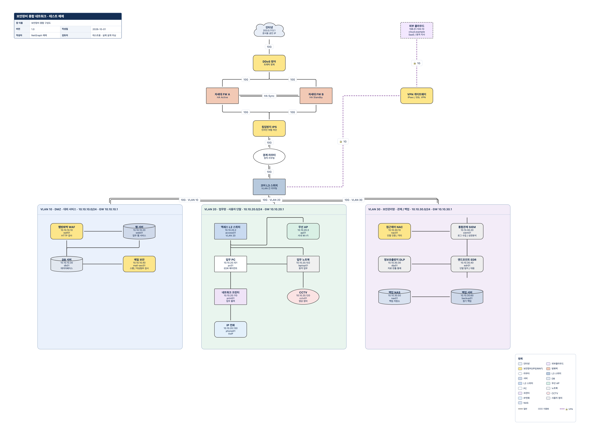

네트워크 구성도를 수정하다 보면 도형보다 먼저 정리해야 할 것이 보입니다. 서버의 소속 대역이 어디인지, VLAN과 CIDR이 맞는지, 링크에 적힌 속도가 무엇인지가 그것입니다. 그림은 보기 좋은데 주소표와 맞지 않거나, 발표용 파일만 남아 다음 변경 때 원본을 다시 만드는 일도 생깁니다.

**NetGraph는 대역을 먼저 정의하고, 그 안에 장비를 배치한 뒤 링크를 연결하는 한국어 네트워크 구성도 편집기**입니다. 브라우저에서 편집하고, 구성도는 PPTX·PNG·SVG·PDF로 내보내며, 다시 편집할 원본은 JSON으로 보관합니다. 장비를 탐색하거나 실제 네트워크에 설정을 적용하는 도구가 아니라, 사람이 알고 있는 구조를 문서로 정리하는 도구입니다.

- **바로 실행:** [NetGraph 브라우저 편집기](https://rebugui.github.io/netgraph/)
- **소스:** [rebugui/netgraph](https://github.com/rebugui/netgraph)
- **따라 보기:** [17종 장비를 담은 합성 JSON 예제](https://github.com/rebugui/netgraph/blob/main/examples/security-all-devices.json)

## 어떤 업무에 맞는가

NetGraph의 출발점은 자유로운 그림판이 아니라 **대역·장비·링크라는 구조화된 데이터**입니다. 사무망과 서버망을 나누고, 각 장비의 주소와 소속을 기록하고, 검토용 문서로 전달하는 작업에 잘 맞습니다. 보안 담당자가 영역별 연결을 설명하거나, 인프라 담당자가 변경 전후 구성을 나란히 관리하거나, 인수인계 자료를 만들 때 활용할 수 있습니다.

반면 스위치에 접속해 설정을 읽거나, 패킷을 수집하거나, SNMP로 자산을 자동 발견하지는 않습니다. 링크의 `10G`는 사람이 입력한 설명이지 측정된 처리량이 아닙니다. 방화벽 도형을 추가한다고 정책 검토가 끝나는 것도 아닙니다. **문서의 입력 일관성을 돕는 기능과 실제 망의 상태 확인은 별개**라는 전제가 중요합니다.

처음에는 실제 사내 자료 대신 아래 합성 예제로 조작 방법을 익히는 편이 안전합니다. 공개 서비스 화면에는 실제 내부 주소 체계, 호스트명, 보안 구성, 계정 정보 같은 기밀을 입력하지 않는 것을 권합니다.

## NetGraph·InfoFlow·PrivacyFlow의 선택 기준

세 앱은 비슷한 편집 화면을 사용하지만, 기록하려는 질문이 다릅니다.

| 앱 | 중심 질문 | 기본 구성 단위 |
|---|---|---|
| NetGraph | 어떤 장비가 어느 대역에 속하고 어떻게 연결되는가? | 대역, 장비, 링크 |
| InfoFlow | 어떤 정보가 어디에서 어디로 이동하는가? | 외부 주체·처리·시스템·저장소, 방향이 있는 정보 흐름 |
| PrivacyFlow | 개인정보를 어느 단계에서 어떤 목적으로 처리하는가? | 수집·이용·보관·제공·위탁·파기 활동과 전달 흐름 |

주문번호가 외부 배송업체로 전달되는 과정을 설명하려면 [InfoFlow의 정보 흐름도 안내](/infoflow-information-flow-editor/)가 더 적합합니다. 개인정보 항목과 처리 목적, 보유기간, 위탁업무를 함께 검토하려면 [PrivacyFlow의 개인정보 처리 흐름도 안내](/privacyflow-personal-data-flow-editor/)를 참고하면 됩니다.

NetGraph의 링크는 네트워크 연결을 표현합니다. InfoFlow처럼 데이터 항목·목적·분류를 가진 방향 흐름으로 해석하면 안 됩니다. 세 앱의 JSON도 서로 바꿔 넣는 공용 문서 형식이 아니며, 별도 저장소와 독립적인 데이터 모델을 사용합니다.

## 대역·장비·링크로 읽는 데이터 모델

**대역(Segment)**에는 이름, VLAN, CIDR, 게이트웨이와 화면상의 위치·크기가 들어갑니다. 대역은 단순한 배경색 상자가 아니라 장비의 소속 대상입니다. VLAN 번호와 IP 대역을 함께 기록할 수 있지만, VLAN이 실제 장비에 생성되어 있는지까지 확인하지는 않습니다.

**장비(Device)**에는 이름, 유형, IP, 호스트명, 모델, 소속 대역, 위치가 들어갑니다. 소속을 지정하지 않은 장비는 `미소속 (코어 계층)`으로 둘 수 있습니다. 인터넷·방화벽·라우터처럼 여러 영역의 위쪽에 놓을 요소와, 특정 대역 안의 서버·단말을 구분하는 방식입니다.

중요한 구현상의 차이는 **대역 내부 장비의 위치가 부모 대역 기준 상대좌표**라는 점입니다. 대역을 이동하면 내부 장비도 함께 이동하고, 장비는 부모 범위 안에서 움직입니다. 소속 대역을 없애는 것과 장비를 지우는 것은 다릅니다. 대역을 삭제하면 소속 장비는 화면상의 위치를 유지하며 미소속으로 전환됩니다.

**링크(Link)**는 양 끝의 ID를 참조하고 속도, VLAN 태그 목록, VPN 여부, 이중화 여부를 기록합니다. 장비끼리만 연결하는 것이 아니라 장비와 대역을 직접 연결할 수도 있습니다. 이름 대신 ID로 연결하므로 장비명을 고쳐도 연결 대상을 다시 지정할 필요가 없습니다.

## 17종 장비와 표현 방식

팔레트에 마련된 유형은 총 17종입니다. 숫자를 강조하기보다는 어떤 표현을 재사용할 수 있는지 살펴보면 좋습니다.

| 구분 | 제공 유형 |
|---|---|
| 외부 연결 | 인터넷, 외부클라우드 |
| 경계·보안 | 방화벽, 보안장비(IPS/WAF) |
| 네트워크 | 라우터, L3 스위치, L2 스위치, 무선 AP |
| 서버·저장 | 서버, DB, NAS |
| 사용자·주변 장치 | PC, 노트북, 프린터, CCTV, IP전화 |
| 기타 | 사용자 정의 |

유형별로 도형과 색이 정해져 있고, 현재 장에 등장한 유형은 범례에 반영됩니다. 서버·DB·NAS는 원통형, 라우터와 CCTV는 타원형처럼 구분되며, 사용자 정의 장비는 색을 지정할 수 있습니다. 같은 장비 사양 정의를 캔버스와 PPTX 출력이 공유합니다.

`보안장비(IPS/WAF)`는 보안 제품 목록을 세분화한 자산 카탈로그가 아닙니다. 합성 예제의 DDoS 방어, IPS, WAF 같은 역할은 장비명과 모델 설명으로 구분합니다. **17종은 유형의 개수이지, 예제에 들어가는 장비 인스턴스의 개수가 아닙니다.** 같은 유형의 방화벽을 A·B 두 개 배치할 수도 있습니다.

## 합성 예제로 따라가는 서브넷 우선 작성



*그림: `security-all-devices.json`을 바탕으로 내보낸 합성 예시입니다. 실제 조직의 인프라가 아니며, 권장 보안 아키텍처나 운영 설정을 의미하지 않습니다.*

위 예제에는 DMZ, 업무망, 보안관리망과 여러 보안 장비가 들어 있습니다. JSON 파일을 내려받아 **JSON 불러오기**로 열 수 있지만, 이 동작은 현재 프로젝트를 교체합니다. 먼저 **JSON 백업 저장**으로 작업을 보관하세요. 예제 JSON 불러오기와 CSV 장비 추가는 동작이 다릅니다.

직접 작성하려면 처음 화면의 **빈 캔버스**를 선택하고 다음 순서로 진행하면 됩니다. 기존 프로젝트가 있다면 백업 후 **새 프로젝트**에서 시작합니다.

### 대역부터 만든다

왼쪽 **대역**의 **새 대역** 폼에서 아래 값을 넣고 **대역 추가**를 누릅니다. 모두 연습용 값입니다.

| 대역 이름 | VLAN | CIDR | 게이트웨이 |
|---|---:|---|---|
| 예제 사무망 | 10 | 192.168.10.0/24 | 192.168.10.1 |
| 예제 서버망 | 20 | 192.168.20.0/24 | 192.168.20.1 |

CIDR을 입력하면 네트워크 주소, 가용 범위, 호스트 수가 표시됩니다. 위 `/24`의 일반 호스트 범위는 `.1`부터 `.254`까지지만, 게이트웨이에 쓸 주소를 서버에도 할당하지 않도록 운영 기준은 별도로 정해야 합니다. 계산기가 보여 주는 가용 범위는 조직의 DHCP 예약이나 장비 할당 현황을 알고 계산한 결과가 아닙니다.

처음부터 간단한 뼈대가 필요하면 **기본 골격**을 선택해도 됩니다. 사무망·서버망 두 대역과 인터넷·방화벽·라우터·L3 스위치 네 장비, 이들을 잇는 다섯 링크로 시작합니다. 이 기본 골격은 앞의 17종 종합 예제와 다른 자료입니다.

### 장비의 속성과 소속을 입력한다

왼쪽 **장비**에서 `예제 업무 PC`를 PC 유형으로 추가하고 IP를 `192.168.10.10`, 소속을 `예제 사무망`으로 지정합니다. 이어 `예제 업무 서버`를 서버 유형, `192.168.20.10`, `예제 서버망`으로 추가합니다. 호스트명은 `demo-pc`, `demo-app`처럼 합성 이름을 사용합니다.

**장비 팔레트 · 캔버스로 드래그**를 펼쳐 도형을 놓는 방법도 있습니다. 다만 처음 익힐 때는 폼의 **소속 대역**을 명시하는 방식이 소속을 이해하기 쉽습니다. 이미 만든 장비는 캔버스나 목록에서 선택한 뒤 오른쪽 **선택 정보**를 수정하고 **변경 적용**을 누릅니다. 입력 중인 초안과 프로젝트에 적용된 값은 구분해야 합니다.

### 연결하고 링크의 의미를 적는다

미소속 L3 스위치를 하나 추가하고 캔버스 연결점을 드래그해 각 대역에 연결합니다. 선을 선택하면 **속도**, **VLAN 태그 (쉼표 구분)**, **VPN 터널**, 이중화 항목을 편집할 수 있습니다. 예를 들어 속도에 `1G`, VLAN 태그에 `10,20`을 넣고 적용합니다.

VPN과 이중화 표시는 연결의 설명입니다. VPN 설정이나 HA 구성이 생성되거나 검증되는 것은 아닙니다. 실제 물리 회선 두 개를 각각 설명해야 하는지, 하나의 논리 링크에 이중화 표시를 할지부터 문서의 관점을 정하는 편이 좋습니다.

### 배치를 다듬고 문서로 남긴다

여러 장비를 선택해 함께 옮길 수 있고, 드래그가 끝나면 위치가 저장됩니다. **자동 배치**는 수동 조정한 위치를 초기화하므로 확인 문구를 읽고 실행합니다. 새 대역은 기존 대역과 미소속 장비를 피해 배치되지만, 이를 모든 선 교차나 라벨 겹침까지 해결하는 자동 도면 설계로 기대해서는 안 됩니다.

마지막으로 문서 정보를 넣고 JSON을 먼저 보관한 뒤 배포용 형식을 선택합니다. “그림을 완성한 뒤 원본은 나중에 저장”하기보다, 구조를 바꾸기 전후마다 JSON을 남기는 습관이 유용합니다.

## IP 계산과 경고를 정확하게 해석하기

오른쪽 **IP 계산기**는 IPv4 네트워크 주소, 브로드캐스트, 마스크, 와일드카드, 가용 호스트 범위와 수, 사설망 여부를 보여 줍니다. **이 대역으로 세그먼트 추가**를 누르면 계산한 네트워크를 대역으로 만들 수 있습니다. `/31`은 호스트 두 개, `/32`는 한 개로 취급합니다.

장 단위 검토에는 다음 규칙이 포함됩니다.

- 대역 CIDR과 장비·게이트웨이 IPv4 형식 오류
- 장비 또는 게이트웨이가 지정 대역 밖에 있는 경우
- 같은 장의 장비 사이 중복 IPv4
- 두 대역의 CIDR 중첩과, 중첩 대역 사이의 동일 게이트웨이
- `/31`보다 큰 주소 공간에서 장비가 네트워크·브로드캐스트 주소를 사용하는 경우
- 일부 말단 장비 유형의 대역 미지정, 링크 양 끝이 같은 셀프 루프

예를 들어 사무망 소속 장비에 `192.168.20.10`을 적으면 대역 밖 IP 검토 대상이 됩니다. 반면 같은 IP가 서로 다른 탭에 있다는 사실까지 프로젝트 전체를 합쳐 비교하는 것은 아닙니다. VRF나 별도 라우팅 도메인도 모델에 없으므로, 의도적인 주소 재사용은 도면의 범위와 문서 설명을 함께 검토해야 합니다.

**IPv6는 계산·검증 대상이 아닙니다.** `2001:db8::10/64`처럼 접미사가 있는 문자열을 원문으로 보관할 수 있지만 지원 안내가 표시되고 IPv4 검증에서 제외됩니다. 저장된다고 IPv6 주소 계산이나 중복 검사가 지원된다는 뜻은 아닙니다. 또한 경고가 없다고 망 설계, 접근통제, 가용성 또는 보안 적합성이 보장되지는 않습니다.

## 엑셀 목록은 CSV·TSV와 붙여넣기로 가져오기

상단 **CSV 가져오기**는 장비 목록을 현재 장에 추가하는 기능입니다. **입력 양식 내려받기**로 열 이름을 확인하고, CSV·TSV 파일을 선택하거나 엑셀 셀 범위를 복사해 **장비 목록 붙여넣기**에 넣습니다. **`.xlsx` 통합문서 업로드 기능은 아닙니다.** 셀의 값으로 된 표를 넘기는 방식이며 수식·서식·여러 시트를 해석하지 않습니다.

아래는 그대로 붙여 넣어 볼 수 있는 합성 CSV입니다.

```csv
장비명,유형,IP,서브넷마스크,CIDR,호스트명,모델,세그먼트명,VLAN,게이트웨이
예제 웹서버,서버,192.168.20.10,255.255.255.0,,demo-web,Demo Server,예제 서버망,20,192.168.20.1
예제 DB,DB,192.168.20.20/24,,,demo-db,Demo DB,예제 서버망,20,192.168.20.1
```

IP의 `/24` 접미사와 `255.255.255.0` 같은 점선 마스크를 지원합니다. 둘을 함께 넣었다면 일치해야 합니다. 미리보기에서 **반영 가능**과 **제외**, 기존·신규 대역 여부를 확인한 다음 **반영**을 누릅니다. 잘못된 행은 제외되고, 인식하지 못한 장비 유형은 사용자 정의로 처리되므로 미리보기를 건너뛰지 않는 것이 좋습니다.

대역명은 특히 중요합니다. 이름이 있으면 이름으로 기존 대역을 찾고, 이름이 없으면 CIDR로 묶습니다. **새 대역명을 명시하면 기존 대역과 CIDR이 같아도 별도 대역이 생성**될 수 있습니다. `서버망`과 `서버 망`처럼 표기가 달라 의도치 않게 분리되지 않도록 가져오기 전에 이름을 맞추세요.

CSV 반영은 기존 장비를 이름으로 찾아 갱신하는 동기화가 아니라 장비 추가입니다. 같은 표를 두 번 반영하면 중복 장비가 생길 수 있습니다. 링크도 자동 생성하지 않으며, 반영 후에는 자동 배치가 적용됩니다. 수동 위치를 세밀하게 잡기 전에 목록을 가져오고, 중복 IP 같은 장 단위 경고는 반영 후 별도로 확인하는 순서가 낫습니다.

## 문서 정보, 여러 장, 실행 취소는 서로 다른 이력이다

**문서 정보**에서 문서명, 버전, 작성일, 작성자, 검토자를 입력합니다. **이력 추가**로 버전·일자·작성자·변경 내용을 기록하고 **문서 정보 적용**을 누르면 됩니다. 이것은 사람이 작성하는 문서 변경이력이며, 모든 편집을 자동 기록하는 감사 로그가 아닙니다.

상단 탭의 **＋**는 장을 추가합니다. 더블클릭으로 장 이름과 **물리·논리·기타** 구분을 바꾸고, 우클릭 메뉴의 **구성도 복제**로 비교용 장을 만들 수 있습니다. 예를 들어 현재 구성과 개선안을 별도 장으로 관리하면 한 그림에 두 상태를 섞지 않아도 됩니다. 이 구분은 문서의 관점을 표시하는 것이지 물리망과 논리망을 자동 변환하는 기능은 아닙니다.

자동으로 붙는 장 이름과 복사 이름은 충돌을 피하지만, 수동 이름은 중복을 허용합니다. 마지막 한 장은 삭제할 수 없습니다. 장비는 Delete/Backspace 또는 **선택 항목 삭제**로 삭제할 수 있으므로, 속성을 고치는 것과 개체를 지우는 것을 구분해 조작하세요.

실행 취소는 또 다른 기능입니다. `Ctrl/Cmd+Z`로 최근 100개 편집을 되돌리고, `Ctrl/Cmd+Y` 또는 `Ctrl/Cmd+Shift+Z`로 다시 실행합니다. 여러 장비를 한 번에 드래그한 작업은 한 번에 되돌릴 수 있습니다. 자동 배치, CSV 반영, 문서 정보 변경, 탭 편집과 프로젝트 복원도 대상이며 단순 탭 전환은 이력에 쌓이지 않습니다.

되돌린 결과도 자동 저장됩니다. 하지만 **새로고침하면 실행 취소 이력은 사라지고**, 실행 취소 후 새 편집을 하면 다시 실행 이력이 지워집니다. 입력칸에서는 브라우저의 텍스트 실행 취소가 작동하고, 대화상자가 열려 있을 때는 프로젝트 단축키를 처리하지 않습니다. 장기 보관은 실행 취소가 아니라 JSON 백업과 문서 변경이력으로 관리해야 합니다.

## PPTX는 편집용 도면, JSON은 편집 원본

내보내기 형식은 파일 확장자보다 “받는 사람이 무엇을 해야 하는가”를 기준으로 고르는 것이 좋습니다.

| 형식 | 범위·구현 | 적합한 용도와 주의점 |
|---|---|---|
| JSON 백업 | 메타데이터, 변경이력, 전체 장, 대역·장비·링크·위치 | NetGraph에서 다시 편집할 원본. 가장 먼저 보관 |
| PPTX | 현재 장 또는 전체 장, 네이티브 도형·텍스트·선 | PowerPoint에서 도면을 수정하고 발표 자료에 편집·배치 |
| PNG | 현재 장 전체, 흰 배경, 2배 픽셀 해상도 | 문서·게시물 삽입. 개별 장비 속성은 편집할 수 없음 |
| SVG | 현재 장 전체, `foreignObject` 포함 | 지원 브라우저·뷰어에서 표시. 순수 SVG 도형만 있는 형식은 아님 |
| PDF | 전체 장, A3 가로, 장당 도면 한 페이지 | 고정 배포·인쇄. 내부 도면은 이미지 기반 |

PPTX는 구성도 한 장을 이미지로 붙이는 방식이 아닙니다. 대역과 장비는 도형, 라벨은 텍스트, 연결은 선으로 만들어집니다. 문서 정보와 범례, 마지막 변경이력 표도 포함되고 긴 이력은 다음 슬라이드로 이어집니다.

그러나 **NetGraph의 PPTX에는 InfoFlow·PrivacyFlow 방식의 전체 노드·흐름 속성표가 없습니다.** 편집 가능한 발표 자료라는 것과 데이터 모델 전체를 다시 불러올 수 있는 원본이라는 것은 다릅니다. PPTX를 NetGraph로 재가져오는 기능도 없으므로 PowerPoint에서 수정한 결과가 JSON에 역으로 반영되지는 않습니다.

화면의 연결선은 부드럽게 꺾인 경로를 사용하지만 PPTX는 양 끝 연결점을 잇는 네이티브 직선으로 내보냅니다. 화면과 픽셀 단위로 같은 선 배치를 기대하기보다, 출력 후 교차와 라벨 겹침을 검토해야 합니다. 폰트와 특수문자의 표현도 운영체제·PowerPoint 환경에 따라 달라질 수 있습니다.

PNG·SVG·PDF는 화면 밖에 별도 장면을 렌더링하므로 현재 확대율이나 화면 이동 위치에 맞춰 잘라 찍는 방식이 아닙니다. 타이틀 블록과 범례를 포함하도록 구성되고 활성 탭을 바꾸지 않습니다. 다만 매우 큰 도면을 한 페이지에 축소하면 글자가 작아집니다. 출력 가독성 때문에라도 업무 단위로 장을 나누는 편이 좋습니다.

## 로컬 자동 저장의 편리함과 보안 경계

편집 데이터는 브라우저 localStorage의 `netgraph-project-v1` 키에 자동 저장됩니다. 편집 내용을 GitHub에 커밋하거나 외부 API·AI 서비스에 전송하는 구조는 아닙니다. 다만 최초 접속과 앱 자산 다운로드에는 네트워크가 필요하며, 서비스 워커로 오프라인 실행을 보장하는 PWA라고 소개할 수는 없습니다.

여기서 “로컬”은 “암호화된 개인 금고”를 뜻하지 않습니다. **localStorage와 JSON 파일은 평문**이고 앱에는 로그인, 권한 관리, 서버 동기화, 공동 편집, 암호화 저장이 없습니다. 같은 브라우저 프로필을 쓰는 사람이나 같은 origin에서 실행되는 스크립트가 데이터에 접근할 가능성을 고려해야 합니다. 같은 `rebugui.github.io` 아래 앱들의 저장 키를 다르게 쓰는 것은 충돌 방지일 뿐 접근통제 장치가 아닙니다.

브라우저·프로필·origin이 달라지면 저장 공간도 달라집니다. 로컬 실행 주소와 공개 배포 주소 사이를 옮길 때는 JSON 백업과 불러오기를 사용하세요. 사이트 데이터 삭제로 프로젝트가 지워질 수 있고, 저장 용량 제한이나 브라우저 정책에도 영향을 받습니다. NetGraph에는 손상된 로컬 데이터를 차단하고 원문을 내려받게 하는 전용 복구 화면을 전제로 한 보장이 없습니다.

따라서 실제 업무에서는 다음 원칙이 현실적입니다.

1. 공개 origin에서는 합성 자료로 기능을 익힙니다.
2. 기밀 자료를 다뤄야 한다면 조직의 정책을 먼저 확인하고 통제된 실행·보관 환경을 정합니다.
3. 큰 변경 전, 다른 JSON을 불러오기 전, 작업 종료 전에 JSON을 별도 보관합니다.
4. 백업 파일도 민감 문서로 취급하고 공유 대상과 저장 위치를 관리합니다.

로컬에서 실행하더라도 백업 파일과 브라우저 프로필에 대한 보안 책임이 없어지지는 않습니다.

## 구현 구조와 직접 실행하는 방법

화면은 React 19와 React Flow 12, 프로젝트 상태는 Zustand 5, 빌드 환경은 Vite 8과 TypeScript 6을 사용합니다. PPTX는 PptxGenJS 4, 이미지·SVG 캡처는 html-to-image 1, PDF 생성은 jsPDF 3이 담당합니다. 별도 애플리케이션 서버나 데이터베이스 없이 정적 웹 앱으로 동작합니다.

소스를 읽을 때는 `src/types.ts`에서 모델을 확인한 다음, `deviceTypes.ts`의 장비 사양, `ip.ts`의 IPv4 계산, `validate.ts`의 장 단위 검토, `csvImport.ts`의 입력 매핑, `useProjectStore.ts`의 저장·복제 동작 순으로 보면 흐름이 잡힙니다. 기본 골격도 별도 템플릿 파일이 아니라 프로젝트 스토어에 정의되어 있습니다.

로컬에서 시작하려면 Node.js 20.19 이상 또는 22.12 이상이라는 README 요구사항을 확인합니다. 새 환경에서는 지원되는 Node 22.12 이상 계열을 준비한 뒤 다음 명령을 실행하면 됩니다.

```sh
git clone https://github.com/rebugui/netgraph.git
cd netgraph
npm ci
npm run dev
```

터미널에 표시된 로컬 주소를 브라우저로 엽니다. 배포용 파일을 만들고 로컬에서 확인하려면 다음 명령을 사용합니다.

```sh
npm run build
npm run preview
```

산출물은 `dist/`이며 정적 웹 서버로 제공해야 합니다. HTML 파일을 더블클릭하는 `file://` 실행 방식이 아닙니다. 개발 서버와 미리보기 서버의 포트가 다르면 origin도 달라지므로, 같은 브라우저라고 프로젝트가 자동으로 옮겨 보이지 않을 수 있습니다. 이때도 JSON으로 이동합니다. 소스가 공개되어 있다는 사실만으로 특정 라이선스나 무제한 재사용 권한을 가정하지 말고, 재배포 전 저장소의 라이선스 조건을 별도로 확인하세요.

## 도입 전에 확인할 질문

**IPAM이나 자산 관리 시스템을 대체할 수 있나요?**  
아닙니다. 주소 할당 승인, 변경 요청, 실제 장비 상태, 다중 사용자 권한 같은 운영 절차를 제공하지 않습니다. 구성도와 최소한의 주소 검토를 돕는 편집기로 보는 것이 정확합니다.

**대역 안에 장비를 넣으면 방화벽 정책이나 라우팅도 맞춰지나요?**  
아닙니다. 대역 소속과 링크는 문서의 표현입니다. 정책, 라우팅 테이블, NAT, 통신 허용 여부를 시뮬레이션하지 않습니다. 보안 장비가 여러 개 등장하는 합성 예제도 완성된 보안 설계가 아닙니다.

**한 장에 많은 장비를 넣어도 자동으로 읽기 좋게 정리되나요?**  
계층 배치와 대역 배치는 지원하지만 모든 선 교차·겹침을 전역 최적화하는 기능은 아닙니다. 특히 캔버스와 PPTX의 선 표현 차이를 고려해 최종 배포 파일을 직접 검토해야 합니다. 모바일에 최적화된 편집기라는 보장도 하지 않습니다.

**왜 JSON과 PPTX를 둘 다 남겨야 하나요?**  
JSON은 다음 편집의 기준 데이터, PPTX는 사람에게 전달하고 수정할 도면입니다. 서로의 역할을 바꾸면 나중에 원본 구조를 복원하기 어렵습니다. `JSON 원본 + 검토된 배포본`을 한 쌍으로 관리하는 것이 이 도구의 가장 단순한 운영 방식입니다.

## 소스와 다음 읽을거리

이 글의 기능 설명은 공개된 README와 아래 구현을 기준으로 정리했습니다. 네트워크 설계의 적합성이나 모든 실행 환경의 동작을 보증하는 자료는 아니며, 기능 변경 시에는 최신 소스를 함께 확인하는 것이 좋습니다.

- [NetGraph README와 사용 순서](https://github.com/rebugui/netgraph/blob/main/README.md)
- [대역·장비·링크 데이터 모델](https://github.com/rebugui/netgraph/blob/main/src/types.ts)
- [17종 장비의 공통 도형 사양](https://github.com/rebugui/netgraph/blob/main/src/lib/deviceTypes.ts)
- [IPv4·대역 검토 규칙](https://github.com/rebugui/netgraph/blob/main/src/lib/validate.ts)
- [CSV·TSV 파싱과 장비 추가](https://github.com/rebugui/netgraph/blob/main/src/lib/csvImport.ts)
- [네이티브 PPTX 내보내기 구현](https://github.com/rebugui/netgraph/blob/main/src/lib/export/pptx.ts)
- [프로젝트 저장과 JSON 검증](https://github.com/rebugui/netgraph/blob/main/src/store/useProjectStore.ts)

NetGraph로 먼저 장비와 대역의 관계를 정리한 뒤, 같은 업무를 정보 이동 관점에서 보고 싶다면 [InfoFlow](/infoflow-information-flow-editor/), 개인정보 처리 단계와 검토 항목까지 기록하려면 [PrivacyFlow](/privacyflow-personal-data-flow-editor/)로 관점을 옮길 수 있습니다. 세 그림을 하나의 복잡한 도면으로 합치기보다, 서로 다른 질문에 답하는 문서로 나눠 관리하는 접근입니다.
