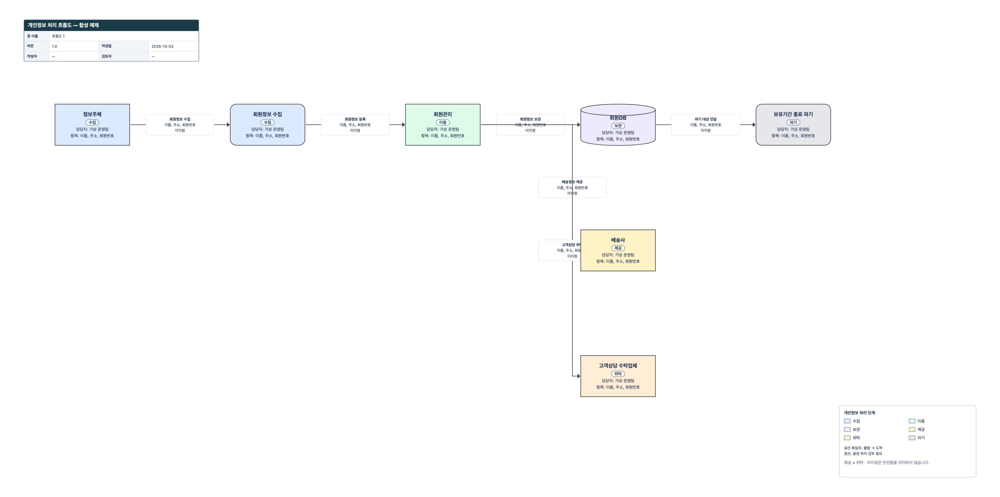

개인정보 처리 현황을 설명할 때 시스템 이름만 나열하면 중요한 질문이 남는다. 어떤 항목을 수집하는가? 어디에서 이용하고 얼마나 보관하는가? 외부 기관으로 넘어가는 흐름은 무엇인가? 보유기간이 끝난 뒤 어떤 활동으로 이어지는가?

**PrivacyFlow는 이런 질문을 처리 활동과 방향 있는 전달 흐름으로 정리하는 브라우저 편집기다.** 수집·이용·보관·제공·위탁·파기를 나누고, 각 활동의 목적·담당자·항목·법적 근거 등을 기록한다. 도면뿐 아니라 상세 속성도 함께 관리한다는 점이 단순한 상자와 화살표 그리기와 다르다.

다만 실제 시스템을 조사하거나 개인정보를 탐지하는 도구는 아니다. 사용자가 입력한 내용을 시각화하며, 제공·위탁의 법적 성격이나 보유기간의 적정성을 판정하지 않는다. 공개 앱에서는 실제 개인정보 값이나 조직의 비밀 정보를 넣지 말고, **합성 항목명과 가상 처리 활동**으로 기능을 살펴보자.

- [PrivacyFlow 실행하기](https://rebugui.github.io/privacyflow/)
- [PrivacyFlow 소스 저장소](https://github.com/rebugui/privacyflow)
- [합성 예제 JSON 보기](https://github.com/rebugui/privacyflow/blob/main/examples/privacy-processing-demo.json)

## 어떤 업무에 맞는 편집기인가

PrivacyFlow는 개인정보 처리 현황을 인터뷰하거나 문서화하는 과정에 적합하다. 개발팀의 회원관리 기능, 운영팀의 보관 위치, 담당자가 확인한 외부 전달 관계를 한 장에서 연결하고, 현황 초안과 검토안을 별도 장으로 관리할 수 있다.

함께 공개한 세 편집기는 질문의 중심이 다르다.

| 도구 | 중심 질문 | 문서화 대상 |
| --- | --- | --- |
| NetGraph | 어떤 장비가 어떤 구간에서 연결되는가? | 네트워크 구간·장비·링크 |
| InfoFlow | 어떤 정보가 어디로, 어떤 방식으로 이동하는가? | 외부 주체·처리·시스템·저장소와 정보 흐름 |
| PrivacyFlow | 개인정보가 어떤 단계에서 어떤 목적으로 처리되는가? | 처리 단계·활동별 속성·전달 관계 |

장비와 네트워크 구성이 먼저라면 [NetGraph 소개](/netgraph-network-diagram-editor/)를, 개인정보에 한정하지 않은 업무 정보의 이동과 분류·보호조치를 정리하려면 [InfoFlow 소개](/infoflow-information-flow-editor/)를 참고하면 된다. 세 앱은 독립 프로젝트이며, 서로의 JSON을 변환해 주거나 편집 상태를 연동하지 않는다.

## 다섯 가지 종류와 여섯 가지 단계는 다른 축이다

노드의 **종류**는 “무엇을 표현하는가”, **처리 단계**는 “이 위치에서 어떤 처리를 표현하는가”에 해당한다. 두 속성은 독립적으로 선택한다.

| 노드 종류 | 내부 값 | 용도와 도형 |
| --- | --- | --- |
| 정보주체 | `subject` | 개인정보 처리의 대상이 되는 주체를 표현하는 사각형 |
| 처리 활동 | `activity` | 수집·파기 같은 활동을 표현하는 둥근 사각형 |
| 시스템 | `system` | 처리에 사용하는 시스템을 표현하는 사각형 |
| 저장소 | `store` | 보관 대상을 표현하는 원통형 |
| 상대 기관 | `recipient` | 제공·위탁 관계의 상대를 표현하는 사각형 |

처리 단계는 `collect` 수집, `use` 이용, `store` 보관, `provide` 제공, `delegate` 위탁, `destroy` 파기의 여섯 가지다. 노드의 색은 단계에 따라 달라지고 단계 이름도 함께 표시한다. 도형과 색만 보고 법적 의미를 추측할 필요가 없도록 텍스트가 병행된다.

종류가 상대 기관이라고 해서 자동으로 제공이 되는 것은 아니다. 같은 종류에 제공 또는 위탁 단계를 **사용자가 명시적으로 선택**한다. 기관 이름에 “배송”, “상담”, “수탁”이 포함되는지를 분석해 단계를 추정하지 않는다. 단계의 선택 자체도 법적 판정은 아니다. 실제 처리 목적과 관계를 조직이 검토한 뒤 그 결과를 기록해야 한다.

또한 한 시스템이 여러 단계에 등장할 수 있다. 같은 회원관리 시스템이 이용과 보관에 관여한다면 노드를 각각 만들고 `시스템명`에 같은 이름을 적을 수 있다. 이 노드들은 서로 다른 ID를 가진 독립 항목이다. 하나의 자산 레코드를 여러 화면에서 공유하는 모델이 아니므로, 한쪽의 속성을 바꿔도 다른 노드가 함께 수정되지는 않는다.

## 노드 속성: 공통 정보와 단계별 정보

노드의 필수 항목은 이름·종류·처리 단계다. 나머지는 미완성 상태로 저장하고 검토 목록에서 보완할 수 있다. 근거를 임의로 채우기보다 미확인 상태를 남기는 구조다.

공통 속성은 주체 유형, 개인정보 항목명, 담당자, 시스템명, 처리 목적, 법적 근거, 민감정보·고유식별정보 포함 여부, 보호조치, 메모다. 주체 유형과 항목명은 줄바꿈 또는 쉼표로 나누며 앞뒤 공백과 빈 항목은 정리된다.

항목명에는 `이름`, `주소`, `회원번호`처럼 필드 이름만 적는다. 캔버스에는 이름·단계·담당자와 항목명 앞 세 개가 표시되며, 전체 항목은 선택 속성에 보존된다.

| 처리 단계 | 추가로 표시하는 속성 |
| --- | --- |
| 보관 | 보유기간, 보관위치 |
| 제공 | 상대 기관, 목적지 국가 |
| 위탁 | 상대 기관, 목적지 국가, 위탁업무 |
| 파기 | 파기방법 |

`법적 근거`와 `보유기간`은 자유 텍스트다. 법 조항 검색, 법정기간 추천, 동의 필요 여부 계산은 하지 않는다. 목적지 국가를 쓴다고 국외 이전 요건이 충족되는 것도 아니다. 해당 조직과 처리 상황에 맞는 별도 검토가 필요하다.

민감정보와 고유식별정보는 `미지정 / 예 / 아니오`의 세 상태다. 내부적으로 `unknown / yes / no`를 사용한다. **미지정은 아니오가 아니다.** 확인하지 못한 항목을 자동으로 “포함하지 않음”으로 바꾸지 않는다는 뜻이다. 이 선택 역시 입력된 항목명을 분석한 자동 분류 결과가 아니라 작성자의 기록이다.

## 단계가 바뀌어도 이전 입력값은 남는다

보관으로 작성한 노드를 이용으로 바꾸면 보유기간과 보관위치는 현재 단계의 주요 입력 영역에서 빠진다. 하지만 값까지 지우지는 않는다. 값이 있는 비적용 필드는 접힌 **이전 단계의 보존 값** 영역에 남고, 필요하면 펼쳐 확인하거나 편집할 수 있다.

이 동작은 검토 도중 단계를 잘못 바꾸거나 모델링 방식을 수정했을 때 입력을 잃지 않도록 한다. 보관으로 되돌리면 기존 보유기간과 보관위치를 다시 사용할 수 있다. JSON에도 남고, PPTX에서는 **현재 단계 비적용 — 보존 값**이라는 표시 아래 구분된다. 비적용 필드가 비어 있다는 이유로 현재 단계의 경고를 추가하지는 않는다.

단계를 바꾼 뒤에는 보존 영역도 확인하자. 노드를 다른 활동으로 재사용했다면 불필요한 이전 값을 직접 정리해야 한다. 숨겨짐은 삭제가 아니다.

## 기본 합성 예제: 일곱 노드와 여섯 흐름

첫 화면의 **합성 예제**를 선택하면 문서명은 `개인정보 처리 흐름도 — 합성 예제`, 장 이름은 `흐름도 1`로 시작한다. 기본 구성은 다음 일곱 노드다.

| 이름 | 종류 | 단계 |
| --- | --- | --- |
| 정보주체 | 정보주체 | 수집 |
| 회원정보 수집 | 처리 활동 | 수집 |
| 회원관리 | 시스템 | 이용 |
| 회원DB | 저장소 | 보관 |
| 보유기간 종료 파기 | 처리 활동 | 파기 |
| 배송사 | 상대 기관 | 제공 |
| 고객상담 수탁업체 | 상대 기관 | 위탁 |

주 경로는 **정보주체 → 회원정보 수집 → 회원관리 → 회원DB → 보유기간 종료 파기**다. 여기에 회원관리에서 배송사로, 회원관리에서 고객상담 수탁업체로 향하는 두 분기가 추가된다. 흐름명도 아래와 같이 정해져 있다.

1. 정보주체 → 회원정보 수집: `회원정보 수집`
2. 회원정보 수집 → 회원관리: `회원정보 등록`
3. 회원관리 → 회원DB: `회원정보 보관`
4. 회원DB → 보유기간 종료 파기: `파기 대상 전달`
5. 회원관리 → 배송사: `배송정보 제공`
6. 회원관리 → 고객상담 수탁업체: `고객상담 위탁`



*기본 합성 예제의 일곱 노드·여섯 흐름과 속성·연결 관계는 유지하고, 가독성을 위해 위치만 수동 조정한 도면이다. 기본 자동 배치 결과가 아니며, 실제 조직의 처리 현황이나 법적 관계를 나타내지 않는다.*

예제의 주체 유형은 `회원`, 항목명은 `이름`, `주소`, `회원번호`, 담당자는 `가상 운영팀`이다. 상대 기관에는 `가상 배송사`, `가상 고객상담사`를 사용한다. 노드와 흐름의 메모에는 `합성 예시 — 실제 운영 설정이 아닙니다`가 기록된다.

법적 근거와 보관 단계의 보유기간은 `예시 — 조직별 검토 필요`다. 보관위치와 파기방법 역시 조직별 검토가 필요한 예시다. 특정 기간이나 근거를 권장하지 않는다. 특히 예제에서 배송사를 제공, 상담업체를 위탁으로 표현한 것은 **두 분기를 보여 주기 위한 합성 설정**이다. 실제 배송·상담 업무가 항상 그 구분에 해당한다는 설명으로 읽으면 안 된다.

각 흐름의 전송 보호조치는 미지정에서 시작한다. 화면을 깔끔하게 만들려고 TLS를 자동으로 채우지 않으므로 합성 예제에도 전송 보호조치 검토 안내가 나타날 수 있다.

## 합성 예제로 따라 하는 편집 순서

기본 예제를 복제한 장에서 실제 운영 정보 없이 연습해 보자.

1. **합성 예제**를 연 뒤 상단의 **문서 정보**에서 문서명을 `가상 회원서비스 처리 검토`로 바꾼다. 작성자·검토자에는 가상 역할명을 쓰고 **문서 정보 적용**을 누른다.
2. **현재 장 복제**를 누르고 **이름 변경**으로 복제한 장을 `합성 검토안`이라고 정한다. 복제본의 노드와 흐름은 새 ID를 받으므로 원본 장의 항목과 독립적으로 편집된다.
3. `회원DB`를 선택한다. 우측 **선택 속성**에서 보유기간과 보관위치를 읽고 조직별 확인이 필요하다는 메모를 보완한 뒤 **변경 적용**을 누른다. 입력 중인 초안과 적용된 값은 구분된다.
4. `고객상담 수탁업체`를 선택해 처리 단계가 위탁인지, 상대 기관과 위탁업무가 무엇인지 확인한다. 연습으로 위탁업무를 비우고 적용하면 관련 검토 안내를 볼 수 있다. 다시 `가상 회원 문의 상담`을 적어 적용한다.
5. 좌측 **전달 흐름**에서 `고객상담 위탁`을 선택한다. 출발·도착, 항목명, 전달 방식·주기, 전송 보호조치를 기록한다. 예를 들어 전달 방식에 `합성 API 예시`, 보호조치에 기타를 선택했다면 **보호조치 설명**에도 합성 설정이라는 설명을 남긴다. 입력은 구현된 보안 기능의 증명이 아니다.
6. 새로운 활동이 필요하면 좌측 **처리 활동**의 **팔레트 처리 단계**부터 선택한다. 이후 종류 버튼을 누르거나 캔버스로 끌어 놓는다. 아래 **새 처리 활동** 폼에서는 이름·종류·처리 단계를 지정해 추가할 수도 있다.
7. 마지막으로 **검토 필요사항**에서 항목을 눌러 해당 노드나 흐름을 확인하고, **JSON 백업 저장**으로 편집 원본을 내려받는다.

## 전달 흐름과 배치의 의미

전달 흐름에는 출발·도착 노드, 흐름명, 개인정보 항목명, 전달 방식, 전달 주기, 전송 보호조치와 설명, 메모가 있다. 폼으로 만들 때는 출발·도착·흐름명이 필요하다. 캔버스의 연결점을 드래그하면 이름 없는 초안 흐름이 만들어지므로, 이후 속성을 보완해야 한다.

화살표는 언제나 출발에서 도착으로 향한다. 반대 방향도 필요하다면 별도의 흐름을 추가한다. 같은 두 노드 사이의 여러 흐름, 역방향 흐름, 자기 자신으로 돌아오는 흐름도 표현할 수 있다. 한 화살표에 서로 다른 목적의 전달을 모두 몰아넣기보다 의미가 다르면 나누어 적는 편이 낫다.

**자동 배치**는 수집·이용·보관·제공·위탁·파기를 여섯 열로 정렬한다. 실행 전 수동 위치가 바뀐다는 확인을 받는다. 이 열 순서는 문서 정리 규칙이지, 모든 데이터가 제공을 거쳐 위탁으로 가야 한다는 뜻이 아니다. 기본 예제의 두 외부 전달도 서로 연결된 순서가 아니라 독립 분기다. 새 노드 하나를 추가했다고 기존 노드 전체를 다시 배치하지는 않는다.

경로 계산은 연결 양 끝 노드를 중심으로 선을 우회한다. 다른 노드·제목·라벨까지 모두 장애물로 처리하거나 전체 선 교차를 최소화하지는 않는다. 복잡한 장에서는 수동으로 간격을 조정해야 한다. 끝점이 겹치는 등 정상 경로를 만들기 어려우면 연결을 삭제하지 않고 점선과 **끝점 노드 위치를 분리하세요** 안내를 표시한다.

## 검토 목록은 체크리스트이지 준법 판정이 아니다

우측 **검토 필요사항**은 입력 누락과 일부 조합을 확인한다. 기본 규칙을 알아두면 경고를 정확하게 읽을 수 있다.

| 대상 | 확인하는 내용 |
| --- | --- |
| 모든 노드 | 이름 누락 |
| 정보주체·상대 기관을 제외한 노드 | 담당자, 처리목적, 개인정보 항목, 법적근거 누락 |
| 보관 단계 | 보유기간, 보관위치 누락 |
| 제공·위탁 단계 | 상대기관 누락 |
| 위탁 단계 | 위탁업무 누락 |
| 파기 단계 | 파기방법 누락 |
| 민감정보 또는 고유식별정보가 예인 노드 | 보호조치 미기재 |
| 모든 전달 흐름 | 흐름명, 개인정보 항목 누락 |
| 항목이 있는 전달 흐름 | 전송 보호조치가 없음 또는 미지정 |
| 보호조치가 기타인 흐름 | 보호조치 설명 누락 |

경고는 저장을 막지 않는다. 조사 중인 초안을 계속 보관하면서 빠진 정보를 찾아갈 수 있다. 반대로 아무 문장이나 채웠다고 그 내용의 타당성을 검증해 주지는 않는다. 법적 근거에 부정확한 설명을 적거나 실제 적용되지 않은 보호조치를 선택해도 앱은 외부 자료나 시스템 설정과 대조하지 않는다.

경고가 없을 때의 문구도 **설정된 검토 규칙에서 누락을 찾지 못했습니다**다. 법적 적합성, 인증 충족, 안전성 확보를 선언하는 문구가 아니다. 개인정보 스캐너, DLP, 동의 관리 시스템, 법률 자문을 대신하지 않으며, 목적지 국가나 보유기간의 적정성을 평가하는 규칙 엔진도 아니다.

## 장, 문서 변경이력, 실행 취소는 구분해서 사용하기

장으로 서비스별·업무별 또는 현행·변경안을 나눌 수 있다. **현재 장 복제**는 노드·흐름과 연결 참조를 새 ID로 복제하며 이름 중복을 피한다. 마지막 한 장은 삭제할 수 없다.

**문서 정보**에서는 문서명, 버전, 작성일, 작성자, 검토자를 관리한다. **이력 추가**로 변경 내용도 남길 수 있다. 이것은 사용자가 작성하는 문서 변경이력이며 모든 클릭을 자동으로 기록하는 감사 로그가 아니다. 이름을 적었다고 검토자의 승인이나 전자서명이 성립하는 것도 아니다.

**실행 취소 / 다시 실행**은 최근 100개까지 관리한다. Ctrl/Cmd+Z로 취소하고 Ctrl/Cmd+Y 또는 Ctrl/Cmd+Shift+Z로 다시 실행한다. 이력은 현재 세션 전용이므로 새로고침하면 초기화된다. 입력창에서는 텍스트 실행 취소가 우선하고, 모달에서는 프로젝트 단축키가 차단된다.

노드 삭제 시 연결된 흐름도 함께 제거된다. 실수는 즉시 실행 취소하고, 큰 변경 전에는 JSON을 저장하자. 실행 취소는 장기 백업이 아니다.

## 출력 형식: 도면과 상세 원본을 나누어 선택하기

PrivacyFlow의 출력에서 가장 중요한 구분은 **화면에 보이는 도면**과 **노드·흐름의 전체 속성**이다.

| 형식 | 범위 | 용도와 주의점 |
| --- | --- | --- |
| PPTX | 현재 장 또는 전체 장 | 편집 가능한 네이티브 도형·텍스트·화살표, 노드·흐름 속성표, 문서 변경이력 |
| PNG | 현재 장 | 흰 배경 2배 해상도 도면 이미지 |
| SVG | 현재 장 | `foreignObject` 기반 도면, 사용하는 뷰어의 지원 여부 확인 필요 |
| PDF | 전체 장 | A3 가로, 장당 도면 한 페이지인 이미지 기반 문서 |
| JSON | 전체 프로젝트 | 상세 속성·좌표·장·문서 정보·변경이력을 포함하는 재편집용 백업 |

PPTX는 각 장의 도면 뒤에 전체 노드·흐름 속성표를 붙인다. `N001`, `F001` 같은 참조와 별도 행의 전체 ID를 사용하고, 긴 값은 행·페이지로 나눈다. 이전 단계 보존 값도 구분한다. 현재 장만 출력해도 프로젝트 변경이력은 포함된다.

PNG·SVG·PDF는 전체 속성 보존본이 아니다. 도면에서 생략된 항목은 포함하지 않는다. PPTX 재가져오기도 지원하지 않으므로 **상세 보고용 PPTX와 복원용 JSON은 서로 대체재가 아니다.**

## 자동 저장, JSON 복원, 손상 데이터 복구

프로젝트는 `localStorage`의 `privacyflow-project-v1` 키에 자동 저장된다. 다른 브라우저나 기기로 동기화되지 않으며 브라우저 데이터 삭제나 저장 제한으로 사라질 수 있다.

**JSON 불러오기**는 파일을 읽은 뒤 앱 식별자, 스키마, 필수 구조, ID 충돌, 좌표와 연결 참조 등을 검사한다. PrivacyFlow의 백업이 아니면 `이 앱에서 만든 백업 파일이 아닙니다`로 거절한다. 유효한 파일도 현재 프로젝트를 바꾼다는 확인을 받은 뒤 교체한다. 취소나 검증 실패는 현재 프로젝트를 교체하지 않으며, 성공한 복원은 현재 세션에서 실행 취소로 이전 상태로 돌아갈 수 있다.

자동 저장 데이터가 손상되었거나 읽을 수 없는 버전이면 복구 화면으로 들어간다. 원문을 곧바로 덮어쓰지 않고 **원본 문자열 다운로드**를 제공한다. **새 프로젝트로 시작**은 기존 데이터를 버리겠다는 확인 후 진행된다. 여기서 받은 파일은 손상 원문을 보존하는 자료이지 자동으로 수리된 JSON 백업이 아니다.

저장 접근이 거부되거나 용량 문제로 쓰기에 실패하면 **자동 저장 실패 — JSON 백업을 저장하세요** 배너가 나타난다. 편집 상태는 메모리에 남아 있으므로 창을 닫기 전에 JSON을 내려받아야 한다. 자동 저장, 손상 원문 보존, 별도 JSON 백업은 각각 다른 안전장치다.

## 평문 저장의 경계와 로컬 실행

편집 데이터를 외부 API나 AI 서비스에 보내지 않는 것과 데이터가 암호화되어 안전하게 격리되는 것은 다른 이야기다. **localStorage와 JSON은 평문**이며 로그인·암호화 저장·서버 동기화·실시간 협업을 제공하지 않는다. 최초 웹 페이지와 자산을 받으려면 네트워크도 필요하다. 설치형 PWA나 오프라인 캐시를 보장하는 앱으로 소개할 수는 없다.

`rebugui.github.io`의 앱들은 경로가 달라도 같은 origin이다. 저장 키 분리는 충돌 방지일 뿐 같은 브라우저 프로필·origin의 다른 스크립트를 막는 접근통제가 아니다. 공개 앱에는 실제 개인정보나 기밀 현황을 넣지 말고, 내려받은 JSON·PPTX·복구 원문도 안전하게 보관하자.

자체 환경에서 코드를 살펴보려면 Node.js 22.12 이상 환경을 준비하고 다음과 같이 실행할 수 있다. 저장소를 둘 디렉터리에서 시작한다.

```bash
git clone https://github.com/rebugui/privacyflow.git
cd privacyflow
npm ci
npm run dev -- --host 127.0.0.1
```

터미널에 출력되는 로컬 주소를 연다. 특정 포트가 비어 있다고 가정하지 않고 실제 출력 주소를 사용하면 된다. 로컬 실행이 필요하더라도 조직의 단말·백업·소프트웨어 사용 정책을 함께 확인해야 하며, 로컬 실행만으로 JSON이 암호화되는 것은 아니다.

구현은 React 19, React Flow 12, Zustand 5, Vite 8, TypeScript 6 기반이다. React Flow는 캔버스, Zustand는 상태·영속화를 맡는다. PptxGenJS 4는 도형·속성표, html-to-image는 도면 캡처, jsPDF 3은 PDF를 담당한다. 세 앱은 독립 실행되며 공유 런타임이 없다.

## 도입 전에 확인할 한계와 구현 참고자료

**엑셀 목록을 그대로 가져올 수 있을까?** 현재 PrivacyFlow는 CSV·TSV·엑셀 붙여넣기나 `.xlsx` 통합문서 업로드를 지원하지 않는다. 가져오기는 해당 앱의 JSON 형식이다. NetGraph·InfoFlow의 JSON이나 기존 별도 HTML 도구의 백업을 자동 변환하지도 않는다.

**도면을 완성하면 개인정보 처리방침이나 법정 문서가 완성될까?** 아니다. 처리방침·계약·동의문·법적 근거의 타당성은 별도로 검토해야 한다. 도면의 제공·위탁 단계는 작성자가 기록한 분류이며, 시스템이 승인한 법적 결론이 아니다.

**복잡한 조직 전체를 한 장에 넣어도 자동으로 읽기 좋게 정리될까?** 단계별 배치는 가능하지만 모든 교차와 라벨 겹침을 해결하지 않는다. 업무 단위로 장을 나누고 수동으로 조정하는 접근이 현실적이다. 모바일 최적화나 무제한 규모의 편집 성능도 전제로 삼지 않는 편이 좋다.

소스 공개는 자유로운 재배포·수정 권한과 같은 뜻이 아니다. 별도 사용·배포 전 저장소의 라이선스 제공 여부와 조건을 확인해야 한다.

다음은 법률 해석이 아니라 앱의 저장·검토·출력 동작을 확인할 구현 자료다.

- [데이터 타입](https://github.com/rebugui/privacyflow/blob/main/src/types.ts) · [합성 템플릿](https://github.com/rebugui/privacyflow/blob/main/src/lib/templates.ts)
- [속성 폼과 보존 값](https://github.com/rebugui/privacyflow/blob/main/src/components/Forms.tsx) · [검토 규칙](https://github.com/rebugui/privacyflow/blob/main/src/lib/validate.ts)
- [JSON 검증](https://github.com/rebugui/privacyflow/blob/main/src/lib/projectValidation.ts) · [저장 경계](https://github.com/rebugui/privacyflow/blob/main/src/lib/projectStorage.ts)
- [프로젝트 상태](https://github.com/rebugui/privacyflow/blob/main/src/store/useProjectStore.ts) · [실행 취소](https://github.com/rebugui/privacyflow/blob/main/src/store/projectHistory.ts)
- [PPTX 상세 출력](https://github.com/rebugui/privacyflow/blob/main/src/lib/export/pptx.ts) · [PDF 도면 출력](https://github.com/rebugui/privacyflow/blob/main/src/lib/export/pdf.ts)

목표는 경고 숫자 0이 아니라 **항목이 어떤 활동에서 어떻게 이어지는지 설명하고, 미확인 부분을 다음 검토 과제로 남기는 것**이다. 합성 예제로 익힌 뒤 조직이 승인한 환경과 자료 관리 방식 안에서 문서화 절차를 설계하자.
