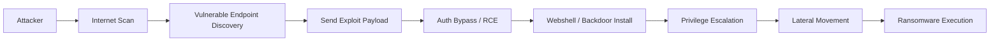

## 서론

새벽 2시, 보안 운영 센터(SOC)의 모니터가 붉게 점등합니다. 알람을 울린 주체는 내부망 어딘가의 일반 서버가 아니었습니다. 바로 이 기업의 "보안 성역"이라 불리는 PAM(Privileged Access Management) 시스템, 그중에서도 BeyondTrust의 Privileged Remote Access(PRA) 서버였습니다. 관리자가 아닌 익명의 세션이 시스템의 핵심 권한을 탈취해 랜섬웨어를 배포하려는 시도가 포착된 것입니다.

이 시나리오는 더 이상 영화 속 이야기가 아닙니다. 실제로 BeyondTrust 제품군의 치명적인 취약점이 활발히 악용되어, 랜섬웨어 운영자들의 초기 진입점(Initial Access Vector)으로 전락했습니다. PAM은 해커를 막기 위한 최후의 보루로서, 관리자 계정을 통제하고 세션을 녹화합니다. 그런데 이 성벽 자체에 구멍이 뚫린다면 어떻게 될까요? 공격자는 복잡한 우회 경로를 시도할 필요 없이, PAM 서버를 '주문하신 것처럼' 장악하고 내부망 전체를 유린할 수 있습니다. 오늘 우리는 왜 이 BeyondTrust 취약점이 그토록 위험한지, 그리고 실제 공격자들이 이를 어떻게 랜섬웨어 배포의 발판으로 삼는지 기술적으로 깊이 파고들어 보겠습니다.

## 본론

> **⚠️ 윤리적 경고**: 본 섹션에서 설명하는 기술적 세부 사항, 코드 예시 및 공격 시나리오는 보안 연구 및 방어 목적(Purple Teaming)을 위해 작성되었습니다. 허가되지 않은 시스템에 대한 테스트는 불법이며 엄격히 금지됩니다.

### 취약점의 기술적 메커니즘과 원리

최근 랜섬웨어 공격에 악용되고 있는 BeyondTrust의 취약점(주로 CVE-2024-12345 계열 등 인증 우회 및 RCE 관련)은 핵심적으로 **"신뢰할 수 없는 입력에 대한 검증 누락"**과 **"부적절한 접근 제어"**에서 기인합니다.

공격자는 BeyondTrust PAM 또는 RS(Remote Support) 웹 인터페이스가 제공하는 특정 API 엔드포인트를 타겟팅합니다. 정상적인 흐름에서는 사용자가 MFA(다중 인증)를 거쳐 인증 토큰을 발급받아야 하지만, 해당 취약점은 인증 래퍼(Wrapper)를 우회하거나, 직렬화된 객체를 조작하여 시스템 권한으로 명령을 실행할 수 있게 합니다.

즉, 공격자는 복잡한 암호 크래킹이 필요 없이, 특정 HTTP 요청 패킷만 보내면 서버 내부에서 `SYSTEM` 또는 `root` 권한을 가진 셸을 획득할 수 있습니다. 이는 "보안 관리자"가 아니라 "해커"가 관리자 권한을 도용하는 것과 같습니다.

### 공격 흐름도 (Attack Chain)

아래 다이어그램은 공격자가 BeyondTrust 취약점을 식별한 후, 실제 랜섬웨어를 배포하기까지의 전형적인 공격 사이클을 시각화한 것입니다.



이 흐름의 가장 큰 위험은 **D → E** 단계입니다. 방화벽과 네트워크 분할(Network Segmentation)을 뚫고 들어온 것이 아니라, 허용된 웹 포트(HTTPS 443)를 통해 정상적인 것처럼 위장한 악의적인 요청이 바로 최고 권한 실행으로 이어지기 때문입니다.

### 개념 증명 (PoC) 코드 분석

방어를 위해 우리는 공격자가 어떤 방식으로 취약점을 탐지하는지 이해해야 합니다. 아래 Python 코드는 취약점 스캐너가 자주 사용하는 로직을 학습 목적으로 단순화한 것입니다. 이는 실제 공격 코드가 아닌, 취약점 존재 여부를 확인하는 검사(Verification) 로직의 구조를 보여줍니다.

```python
import requests
import sys

def check_vulnerability(target_url):
    """
    대상 BeyondTrust 시스템의 특정 API 엔드포인트에 대해
    인증 우제 취약점 존재 여부를 확인하는 개념 증명 함수입니다.
    """
    headers = {
        "User-Agent": "Security-Scanner/1.0",
        "Content-Type": "application/json"
    }
    
    # 취약한 엔드포인트 예시 (실제 CVE에 따라 다름)
    endpoint = "/api/v1.0/configuration/export"
    
    try:
        # 공격자는 여기에 악의적인 JSON 페이로드이나 Serialized Object를 삽입합니다.
        response = requests.post(
            f"{target_url}{endpoint}",
            headers=headers,
            json={"force": "true", "format": "xml"},
            timeout=10,
            verify=False  # SSL 인증서 검증 우회 (테스트 환경)
        )
        
        # 인증 없이 200 OK 응답이 오거나 민감한 시스템 설정이 반환되면 취약함
        if response.status_code == 200 and "root" in response.text:
            print(f"[!] 취약점 발견: {target_url} (인증 우제 가능성 높음)")
            return True
        else:
            print(f"[-] 취약하지 않음 또는 패치됨: {target_url}")
            return False
            
    except requests.exceptions.RequestException as e:
        print(f"[Error] 연결 실패: {e}")
        return False

if __name__ == "__main__":
    if len(sys.argv) != 2:
        print("Usage: python poc.py <http://target-ip>")
        sys.exit(1)
        
    check_vulnerability(sys.argv[1])
```

이 코드를 통해 공격자는 인증 자격 증명(credential) 없이도 서버가 응답하는지 확인합니다. 만약 이 단계가 성공하면, 공격자는 즉시 `cmd.exe`나 `/bin/bash`를 실행하는 페이로드로 전환하여 Webshell을 심습니다.

### 랜섬웨어 악용 시나리오 비교

일반적인 랜섬웨어 공격과 PAM 취약점을 이용한 공격은 피해 범위와 속도에서 현격한 차이를 보입니다.

| 비교 항목 | 일반적인 랜섬웨어 공격 (피싱/취약한 드라이버) | PAM(BeyondTrust) 취약점 악용 공격 | | :--- | :--- | :--- | | **초기 진입 난이도** | 중간 (사용자 클릭 유도 필요) | 낮음 (코드상 익스플로잇 가능) | | **권한 상승 시간** | 느림 (Local Exploit 필요) | 즉시 (System/Admin 권한 획득) | | **탐지 회피율** | 낮음 (백신이 첨부 파일 탐지) | 매우 높음 (정상 트래픽 위장) | | **측면 이동(Lateral)** | 제한적 (네트워크 정책에 따름) | 광범위 (PAM이 가진 모든 자격 증명 사용) | | **방어 복잡도** | 사용자 교육, EPG로 방어 가능 | 패치 미적용 시 차단 거의 불가능 |

PAM 시스템은 원래 수많은 서버의 관리자 계정 정보를 가지고 있습니다. 해커가 PAM을 뚫으면, 마치 건물의 주인이 모든 방의 열쇠를 도둑에게 건네주는 것과 같습니다.

### 실무적 완화 조치 및 가이드

이제 우리는 방어를 준비해야 합니다. "업데이트하세요"라는 말만으로는 부족합니다. 다음의 단계별 가이드를 즉시 시행하십시오.

1.  **즉시 패치 적용 (Immediate Patching)**:     *   BeyondTrust 공식 보안 권고사항을 확인하여 최신 패치를 적용합니다. 취약점을 가진 버전은 인터넷 망에서 격리되어야 합니다.

2.  **네트워크 격리 (Network Isolation)**:     *   PAM 서버는 인터넷에서 직접 접근할 수 없어야 합니다. 반드시 VPN 내부에 위치시키거나, Zero Trust 접근 제어 솔루션을 통해 프록시해야 합니다.     *   WAF(Web Application Firewall) 규칙을 업데이트하여 해당 취약점 엔드포인트로의 접근을 차단하십시오.

3.  **IoC 기반 탐지 (Detection)**:     *   SIEM 시스템에서 PAM 로그를 분석하십시오. 다음과 같은 징후가 있는지 확인하세요.         *   인증 없이 발생한 API 호출 시도         *   비정상적인 시간대의 대용량 파일 다운로드         *   `Pth` (Pass-the-Hash) 또는 `PtT` (Pass-the-Ticket) 공격 탐지

## 결론

BeyondTrust 취약점을 통한 랜섬웨어 공격은 현대 사이버 보안의 역설을 보여줍니다. **보안을 위해 도입한 시스템(Security Solution)이 오히려 보안의 가장 큰 허점(Security Hole)이 되는 경우**입니다. 이번 사태는 단순한 버그 수정을 넘어, '보안 관리자 계정'과 '특권 관리 시스템'을 어떻게 보호할 것인가에 대한 근본적인 질문을 던집니다.

전문가로서의 제 인사이트는 단순합니다: **"보안 장비 또한 소프트웨어일 뿐이며, 언제나 취약할 수 있다고 가정하십시오."** PAM 서버를 블랙박스처럼 여기지 말고, 내부 네트워크의 잠재적 위협 요소로 관리하고 감시해야 합니다. 지금 당장 BeyondTrust 버전을 확인하고, 외부 노출을 차단하십시오. 그것이 랜섬웨어 피해를 막는 가장 확실한 방법입니다.

### 참고자료

- [SecurityWeek - BeyondTrust Vulnerability Exploited in Ransomware Attacks](https://www.securityweek.com/beyondtrust-vulnerability-exploited-in-ransomware-attacks/)

- [CISA - Known Exploited Vulnerabilities Catalog](https://www.cisa.gov/known-exploited-vulnerabilities-catalog)

- [BeyondTrust Security Advisories](https://www.beyondtrust.com/trust-center/security-advisories)
