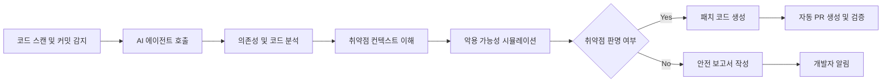

## 서론

새벽 2시, 당신의 휴대폰이 무겁게 울립니다. 오픈 소스 라이브러리에서 긴급 보안 패치가 발표되었고, 해당 라이브러리를 사용하는 수십 개의 마이크로서비스 전체를 즉시 감사해야 하는 상황입니다. 과거의 방식대로라면 코드 라인 하나하나를 눈으로 검색하고, 수동으로 익스플로잇(Exploit)을 시도하며, 며칠 밤을 새워야 했을 것입니다. 이것이 단순한 시나리오가 아닙니다. 현대의 보안 엔지니어와 레드팀(Red Team)들이 매일 마주하는 '패치 피로감(Patch Fatigue)'의 현실입니다.

우리는 지금 전환점에 서 있습니다. 많은 이가 "AI가 보안 업무를 대체할 것인가?"라는 불안감을 가지고 있지만, 본질적인 질문은 다른 곳에 있습니다. 과연 우리는 이 거대한 공격 표면을 인간의 속도로만 방어할 수 있는가? Claude Code와 같은 AI 에이전트의 등장은 보안 직업의 종말이 아니라, 인간이 할 수 없는 규모와 속도로 취약점을 식별하고 수정하는 '초자동화(Super Automation)' 시대의 개막을 알립니다. 이 글에서는 AI 에이전트가 실제 보안 워크플로우에 어떻게 통합되는지, 그리고 우리가 어떻게 이 변화를 무기로 삼을지 기술적으로 심층 분석합니다.

*(참고: 본 문서에 포함된 모든 기술적 내용과 코드는 방어 목적의 교육 및 윤리적 해킹 연구를 위해 작성되었습니다.)*

## 본론

### AI 기반 보안 자동화의 메커니즘

전통적인 정적 분석 도구(SAST)는 규칙 기반으로 작동합니다. 예를 들어 "eval() 함수를 사용하면 안 된다"는 식의 하드코딩된 룰을 적용하지만, 이는 오탐(False Positive)의 늪에 빠지기 쉽습니다. 반면, Claude Code와 같은 최신 AI 에이전트는 코드의 의미(Semantics)와 맥락(Context)을 이해합니다. 단순히 함수 콜을 찾는 것이 아니라, 사용자 입력이 어떻게 흘러가어 sanitize 과정이 없는지를 추적합니다.

이 과정에서 AI는 단순한 채팅봇이 아니라 터미널과 파일 시스템에 접근하여 자율적으로 작업을 수행하는 '에이전트' 역할을 합니다.



이 흐름도에서 볼 수 있듯이, 핵심은 '이해'에서 '시뮬레이션', 그리고 '생성'으로 이어지는闭环(Closed loop)입니다. 특히 보안 컨텍스트에서 AI가 가장 강력한 힘을 발휘하는 순간은 바로 '논리적 취약점'을 찾아낼 때입니다.

### PoC: AI 기반 취약점 식별 및 수정 시나리오

구체적인 예를 통해 살펴보겠습니다. 다음은 Python으로 작성된 간단한 웹 애플리케이션 코드로, 사용자 입력을 통해 시스템 명령어를 실행하는 기능을 포함하고 있습니다.

**[취약점이 포함된 원본 코드]**

```python
import subprocess

def run_system_command(request):
    # 방어적 코딩 미흡: 사용자 입력이 그대로 명령어에 포함됨
    user_input = request.args.get('cmd')
    try:
        # OS Command Injection 취약점 존재
        output = subprocess.check_output(f"ls -l {user_input}", shell=True)
        return output.decode('utf-8')
    except Exception as e:
        return f"Error: {str(e)}"
```

전통적인 도구는 `subprocess`와 `shell=True`의 조합을 경고할 수 있지만, 이 코드가 실제로 공격받을 경로가 있는지, 그리고 어떻게 고쳐야 애플리케이션 로직이 깨지지 않는지는 알지 못합니다. AI 에이전트는 다음과 같은 단계로 개입합니다.

1.  **공격 시뮬레이션**: 공격자가 `; rm -rf /` 또는 `&& cat /etc/passwd`를 입력할 경우 발생하는 결과를 예측합니다. 2.  **패치 제안**: 단순히 입력을 필터링하는 것을 넘어, `shlex.quote`를 사용하거나 리스트 형태로 인자를 전달하는 구조적 수정을 제안합니다.

**[AI가 제안하는 수정된 코드]**

```python
import subprocess
import shlex

def run_system_command(request):
    user_input = request.args.get('cmd')
    
    # 화이트리스트 기반 입력 검증 추가
    allowed_commands = ['status', 'list', 'info']
    if not user_input or user_input not in allowed_commands:
        return "Error: Invalid command"

    try:
        # 1. shell=True 제거 (쉘 인터프리터 사용 방지)
        # 2. 인자를 리스트로 분리하여 전달
        output = subprocess.check_output(['ls', '-l', user_input])
        return output.decode('utf-8')
    except subprocess.CalledProcessError as e:
        return f"Command failed: {str(e)}"
```

이러한 수정은 단순한 문법 교정이 아닙니다. AI는 보안 원칙(최소 권한 원칙, 입력 검증)을 코드 레벨에서 구현한 것입니다.

### 기존 워크플로우 vs AI 자동화 워크플로우

AI 에이전트의 도입이 실제 현장에서 어떤 차이를 만드는지 비교해 보겠습니다.

| 비교 항목 | 기존 수동/자동화 툴 (SAST/DAST) | AI 에이전트 기반 워크플로우 (Claude Code) | | :--- | :--- | :--- | | **분석 깊이** | 패턴 매칭에 의존 (문법적 오류 위주) | 코드 의미 및 비즈니스 로직 맥락 이해 | | **오탐(False Positive) 처리** | 개발자가 수동으로 필터링 필요 | AI가 스스로 문맥을 파악하여 오탐 제거 | | **수정 방식** | 경고 로그만 전달 (수정은 개발자 몫) | 실행 가능한 패치 코드 자동 생성 | | **공격 시나리오 검증** | 별도의 테스트 케이스 작성 필요 | 즉석에서 PoC(개념 증명) 코드 생성 및 검증 | | **대응 속도** | 수시간 ~ 수일 | 수분 ~ 수십 분 |

### 단계별 구현 가이드: 보안 팀을 위한 적용 전략

그렇다면 실제로 보안 팀은 이 도구를 어떻게 도입해야 할까요? 단순히 도구를 설치하는 것으로 끝나지 않습니다. 다음은 Claude Code와 같은 도구를 침투 테스트 및 코드 감사 프로세스에 통합하는 단계별 가이드입니다.

1.  **사전 설정 및 범위 정의 (Scoping)**     AI에게 모든 코드 접근 권한을 주는 것은 위험합니다. 먼저 감사 대상인 레포지토리를 격리된 환경(Docker container)에 클로닝합니다.

    ```bash     # 감사 환경 구성     mkdir audit_workspace     cd audit_workspace     git clone https://github.com/target-project/app.git     docker run -it -v $(pwd):/workspace python:3.9-slim /bin/bash     ```

2.  **컨텍스트 로딩 및 분석 지시**     AI 에이전트에게 프로젝트 구조와 보안 목표를 명확히 지시해야 합니다.

    *   **Prompt 예시**: "현재 `/workspace`에 있는 프로젝트는 웹 쇼핑몰 백엔드입니다. OWASP Top 10 기준으로 SQL Injection, XSS, 그리고 불안전한 직렬화 취약점을 찾아주세요. 각 취약점에 대해 CVSS 점수를 산정하고, PoC 코드와 함께 보고서를 작성합니다."

3.  **상호작용 및 심층 분석**     AI가 의심스러운 코드를 발견하면, 보안 엔지니어는 즉시 "이 코드 라인이 왜 위험한지 구체적인 공격 벡터를 설명해"라고 요청하여 검증합니다. 이때 AI는 트래픷 캡처와 같은 시뮬레이션 데이터를 기반으로 설명합니다.

4.  **패치 검증 및 적용 (Verification)**     AI가 제안한 패치 코드를 테스트 환경에 적용한 후, 동일한 공격 시나리오를 재실행하여 취약점이 해소되었는지 확인합니다.

```python
# 검증 스크립트 예시 (단순화)
import requests

# 패치 전 공격 시도
payload = "1; DROP TABLE users--"
response = requests.get(f"http://target/api/item?id={payload}")
if "Error" in response.text or "users" not in response.text:
    print("V Patched: Injection blocked.")
else:
    print("FAIL: Vulnerability still exists.")
```

## 결론

Claude Code와 같은 AI 기술의 등장은 사이버 보안의 패러다임을 '탐지'에서 '예측 및 자동 치유'로 전환하고 있습니다. 우리가 살펴본 것처럼, AI는 단순한 코드 작성 도구를 넘어, 공격자의 관점에서 취약점을 찾아내고 이를 방어자의 언어로 패치를 제안하는 강력한 듀얼 에이전트(Dual Agent)로 진화했습니다.

보안 전문가로서의 핵심 역량이 "취약점을 찾는 능력"에서 "AI를 제어하고 최적의 방어 전략을 수립하는 능력"으로 이동하고 있습니다. 결국 기술은 인간을 대체하는 것이 아니라, 인간의 능력을 확장하는 도구가 됩니다. AI가 런너로서 스크립트를 실행하게 두고, 우리는 그 결과를 해석하고 전략을 짜는 아키텍트(Architect)가 되어야 합니다. 이것이 보안의 미래이며, 우리가 준비해야 할 다음 단계입니다.

### 참고자료

- [OWASP Top 10 Web Application Security Risks](https://owasp.org/www-project-top-ten/)

- [Claude Code Documentation](https://docs.anthropic.com/)

- [NIST National Vulnerability Database](https://nvd.nist.gov/)
