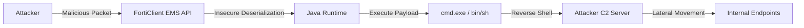

## 서론

새벽 2시, 보안 운영 센터(SOC)의 모니터를 밝히는 경보음. 단순한 엔드포인트의 바이러스 감염이 아닙니다. 관리자가 자신 있게 배포했던 보안 솔루션, 그 중심에 있는 관리 서버가 외부의 명령을 받아 악성 코드를 실행하고 있습니다. 이것은 영화 속 시나리오가 아니며, 최근 보안 업계를 뒤흔든 **FortiClient EMS(Electronic Medical System 혹은 Endpoint Management System)**의 원격 코드 실행(RCE) 취약점 현실입니다.

우리는 종종 "보안 제품은 보안적이다"라는 맹목적인 신념에 빠집니다. 하지만 공격자들에게 있어 보안 관리 서버는 금고가 아니라, 금고의 열쇠를 모두 가지고 있는 관리인을 노리는 가장 매력적인 타겟입니다. 이 글은 단순한 취약점 공지를 넘어, 공격자가 어떻게 방어선의 심장부를 뚫고 시스템을 장악하는지, 그 기술적 메커니즘과 피해 최소화를 위한 실질적인 대응 전략을 심층적으로 분석합니다.

## 본론

### 취약점의 기술적 원리: 직렬화 데이터의 위험함

FortiClient EMS는 수천 대의 엔드포인트를 중앙에서 제어합니다. 이를 위해 에이전트와 서버 간에는 지속적인 데이터 통신이 오가며, 이 과정에서 객체(Object) 형태의 데이터를 주고받는 경우가 많습니다. 문제는 이 데이터를 **안전하지 않은 방식으로 역직렬화(Deserialization)** 할 때 발생합니다.

공격자는 EMS 서버의 특정 API(일반적으로 Telemetry 또는 로그 수집 관련 포트)에 조작된 패킷을 전송합니다. 서버는 이 데이터를 신뢰하고 처리하는 과정에서, 악성 코드가 담긴 객체를 메모리에 로드하게 되고, 결과적으로 공격자가 원하는 임의의 시스템 명령어를 실행하게 됩니다. 가장 치명적인 점은 이 과정이 **별도의 인증(Credential) 없이 수행된다**는 것입니다.

> **⚠️ 윤리적 경고**: 본 섹션에 포함된 모든 기술적 분석과 코드는 취약점의 원리 이해와 방어 목적을 위한 PoC(Proof of Concept)입니다. 승인되지 않은 시스템에서 테스트하는 것은 불법입니다.

### 공격 시나리오 및 흐름도

공격자는 방화벽 외부에서 EMS 서버로 접근을 시도합니다. EMS는 엔드포인트와 통신해야 하므로 특정 포트(예: 8013, TCP 443 등)가 인터넷 노출되어 있거나, 내부망에서 피벗(Pivot) 후 접근 가능한 상황을 가정합니다.



위 다이어그램과 같이, 공격의 핵심은 `B`에서 `C`로 넘어가는 순간입니다. 겉보기에는 정상적인 트래픽처럼 보이는 패킷이 내부적으로는 악의적인 명령어 실행 요청으로 변환됩니다.

### 공격 메커니즘 상세 분석 (PoC)

이 취약점은 주로 Java 기반의 웹 서버에서 발생하는 **역직렬화 취약점**과 유사한 패턴을 보입니다. 공격자는 `ysoserial`과 같은 툴을 사용하여 악의적인 Java 객체를 생성하고, 이를 HTTP 요청에 삽입합니다.

아래는 학습 목적으로 작성된, 취약점의 존재 여부를 확인하는 개념적 검증 스크립트(Python)입니다.

```python
import requests
import socket
import struct

# 이 스크립트는 취약점 분석 및 방어 연구 목적으로만 사용하세요.
# 대상 시스템에 승인 없이 실행하면 불법 접근으로 간주됩니다.

TARGET_IP = "192.168.1.100"
TARGET_PORT = 8013  # FortiClient EMS 서비스 포트 (예시)

def check_vulnerability():
    """
    대상 서버의 특정 엔드포인트에 비정상적인 트래픽을 전송하여
    응답의 지연이나 에러 패턴을 통해 취약점 존재 여부를 추론합니다.
    """
    url = f"http://{TARGET_IP}:{TARGET_PORT}/EndpointTelemetry/SubmitTelemetryData"
    
    # 악의적인 페이로드 생성 (개념적 표현)
    # 실제 공격에서는 여기에 역직렬화 가젯(Gadget) 체인이 포함된 바이너리 데이터가 들어갑니다.
    payload = b'\xac\xed\x00\x05sr\x00...' 

    headers = {
        "Content-Type": "application/octet-stream",
        "User-Agent": "FortiClientEMS-Agent"
    }

    try:
        print(f"[*] Targeting {TARGET_IP}...")
        response = requests.post(url, data=payload, headers=headers, timeout=5)
        
        if response.status_code == 200 or response.status_code == 500:
            print(f"[+] Server responded with status: {response.status_code}")
            print("[!] Potential vulnerability detected. Further investigation required.")
        else:
            print(f"[-] Server responded with status: {response.status_code}")

    except requests.exceptions.Timeout:
        print("[!] Request timed out. This might indicate a crash or successful payload execution leading to a hang.")
    except Exception as e:
        print(f"[-] Error occurred: {e}")

if __name__ == "__main__":
    check_vulnerability()
```

이 코드가 실제로 악성 코드를 실행하지는 않지만(단순 `header` 조작임), 실제 공격자는 `payload` 부분에 **CommonsCollections**나 **CommonsBeanutils** 같은 체인을 이용해 `Runtime.getRuntime().exec()`를 호출하는 바이트코드를 주입합니다.

### 취약점 영향도 비교

일반적인 웹 해킹과 비교했을 때, EMS 관리 서버의 RCE는 파급력이 압도적으로 큽니다.

| 비교 항목 | 일반 웹 서버 RCE | FortiClient EMS RCE
|:--- | :--- | :---
|**직접적 영향** | 해당 웹사이트 서비스 중단, 데이터 유출 | **보안 관제 시스템 장악**
|**후속 공격 가능성** | 내부망 진입 필요 (Lateral Movement) | **즉시 내부 전체 엔드포인트 제어 가능**
|**공격 난이도** | 중간 (인증 우회 필요 등) | **낮음 (Pre-auth, 인증 불필요)**
|**탐지 난이도** | WAF 로그 등에 남음 | **정상 텔레트리 트래픽으로 위장 가능**
|**피해 규모** | 개별 서버 | **전사적 차원의 장악 (God-mode)** |

### 단계별 완화 및 방어 가이드

이 취약점에 대응하기 위해서는 소프트웨어 패치뿐만 아니라 네트워크 아키텍처 측면의 접근이 필수입니다.

#### 1. 즉시 조치 (Emergency Response)

- **패치 적용**: Fortinet의 최신 어드바이저리를 확인하여 즉시 패치를 적용하세요. 보통 FortiClient EMS 7.x 및 6.x 시리즈의 특정 버전이 영향을 받습니다.

- **네트워크 차단 (가장 중요)**:

    - EMS 서버의 관리 포트(기본 8013, 10443 등)를 인터넷에서 직접 접근할 수 없도록 차단하세요.     - VPN이나 bastion host를 통해서만 관리자가 접근할 수 있도록 설정해야 합니다.

#### 2. 탐지 로직 강화 보안 장비(SIEM, EDR)에서 다음과 같은 이상 징후를 모니터링해야 합니다.

- `java.exe` 또는 EMS 서비스 프로세스가 `cmd.exe`, `powershell.exe`, `bash`를 자식 프로세스로 호출하는 시도

- 비정상적인 포트(예: 4444, 8080)로의 아웃바운드 연결 시도 (Reverse Shell)

#### 3. 장기 대책 (Architecture Hardening) EMS 서버를 관리 네트워크(Management Zone)에 격리하고, 엔드포인트와의 통신만 허용하는 세분화된 방화벽 정책을 적용하세요.

## 결론

FortiClient EMS RCE 취약점은 "보안 도구의 보안"이 얼마나 중요한지를 극명하게 보여주는 사례입니다. 공격자는 가장 강한 성벽을 뚫는 대신, 성문을 여는 열쇠를 가진 관리자(EMS)를 공격합니다. 이번 취약점은 인증 절차 없이 원격에서 코드를 실행할 수 있어, 랜섬웨어 공격자들이 가장 선호하는 경로 중 하나입니다.

필자의 경험상 많은 기업들이 내부망이라는 안일한 생각로 관리 서버의 포트를 개방해 두거나, 패치 적용을 미루다가 큰 피해를 입습니다. 보안의 기본은 "최신화"와 "최소 권한 원칙"입니다. 오늘 설명한 공격 시나리오가 여러분의 조직에서 재현되지 않도록, 지금 즉시 EMS 서버의 로그를 확인하고 외부 노출 여부를 점검하시기를 강력히 권장합니다.

**참고자료**:

- [Fortinet Security Advisory](https://www.fortiguard.com/psirt)

- [CWE-502: Deserialization of Untrusted Data](https://cwe.mitre.org/data/definitions/502.html)

- [OWASP Top 10 - A03:2021 – Injection](https://owasp.org/Top10/A03_2021-Injection/)
