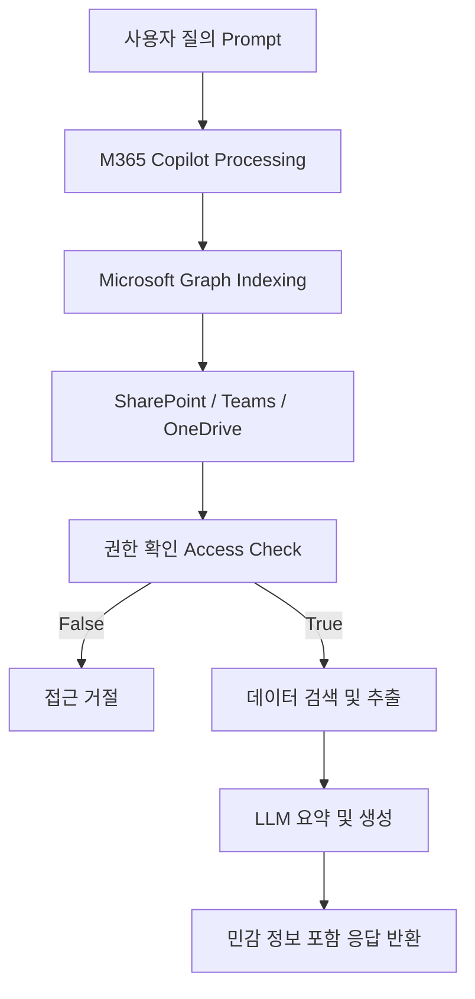

## 서론

새로 입사한 인턴이 평소와 다르게 회사 내부의 극비 M&A 거래 내용을 포함한 보고서를 작성해 왔다고 상상해 보십시오. 인턴은 "회사의 최근 인수합병 건에 대해 요약해 줘"라고 M365 Copilot에 단순히 물었을 뿐입니다. Copilot은 인턴에게 접근 권한이 없어야 할 문서를 찾아내어 요약해 주었습니다. 이것은 영화 속 시나리오가 아니라, 잘못 구성된 Microsoft 365 환경에서 AI가 가져올 수 있는 현실적인 재앙입니다.

최근 보안 업계에서 논의되는 M365 Copilot의 버그 이슈는 단순한 소프트웨어 결함 그 이상입니다. 이는 AI가 기업의 데이터 거버넌스 부재를 어떻게 악용하거나 확대할 수 있는지를 보여주는 결정적인 증거입니다. 많은 기업이 Copilot의 생산성 향상에만 주목하고 있지만, 이 도구는 기존에 존재하던 '불분명한 권한 설정(Messy Permissions)'을 증폭시키는 렌즈와 같습니다. 우리는 왜 이 주제에 관심을 가져야 하며, AI 시대의 데이터 보안을 어떻게 재정비해야 할까요? 본문에서는 Copilot의 데이터 접근 메커니즘을 분석하고, 실제 발생할 수 있는 데이터 유출 시나리오와 이를 방어하기 위한 실질적인 가이드를 제시합니다.

> **[윤리적 경고]** 본 문서에서 설명하는 기술적인 세부 사항과 취약점 분석은 오로지 방어 목적과 시스템 보안 강화를 위한 교육용으로 제공됩니다. 악의적인 목적으로 이 정보를 사용하는 것은 불법이며 엄격히 금지됩니다.

## 본론

### Copilot의 작동 원리와 "투명 인간" 문제

M365 Copilot은 마법처럼 보이지만, 실제로는 **Microsoft Graph API**를 기반으로 작동합니다. Copilot은 사용자가 질문을 하면 Graph를 통해 사용자가 접근 권한을 가진 모든 데이터(SharePoint, Teams, OneDrive, Outlook 등)를 색인합니다. 여기서 핵심은 Copilot이 "새로운 권한"을 만들지 않고, 사용자의 "기존 권한"을 그대로 따른다는 점입니다.

문제는 기업 환경에서 권한이 '최소 권한의 원칙(Least Privilege)'을 따르지 않고 흔히 '모두(Everyone)' 또는 '기본(Default)' 그룹에게 과도하게 열려 있다는 사실입니다. 예전에는 데이터가 파편화되어 있어 직원이 실수로 민감 파일을 열어볼 확률이 낮았습니다. 하지만 Copilot은 이 모든 데이터를 즉시 검색하고 연결해 줍니다. 즉, 보안 허점이 있던 데이터들이 Copilot을 통해 '투명 인간'처럼 누구에게나 보이게 되는 것입니다.

### 데이터 처리 메커니즘 및 공격 흐름

공격자가 내부자의 계정을 탈취하거나, 과도한 권한을 가진 직장 내부자가 Copilot을 악용할 때의 데이터 유출 흐름은 다음과 같습니다.



위 다이어그램에서 `E[권한 확인 Access Check]` 단계가 방어선입니다. 만약 이 단계에서 'Everyone'과 같은 느슨한 설정이 적용되어 있다면, 민감한 문서(`G`)는 사용자(`A`)에게 고스란히 전달됩니다.

### 기존 검색 vs Copilot 검색 비교

기존의 SharePoint 검색과 Copilot 검색은 위험도와 데이터 접근 방식에서 현격한 차이를 보입니다.

| 비교 항목 | 기존 SharePoint 검색 | M365 Copilot 검색 | | :--- | :--- | :--- | | **검색 방식** | 키워드 매칭 (Keyword Matching) | 의도적 의미 이해 (Semantic Understanding) | | **접근성** | 특정 사이트나 라이브러리 직접 방문 필요 | 전체 테넌트 데이터 동시 크롤링 | | **컨텍스트** | 문서 단위 독립적 검색 | 문서 간 연결 및 관계성 분석 | | **위험 요인** | 사용자가 문서 위치를 알아야 함 | 사용자가 권한만 있다면 모든 것을 즉시 파악 | | **데이터 노출 범위** | 낮음 (Low) | 극도로 높음 (Critical) |

### 시나리오: 권한 상승을 통한 정보 수집 (Practical Attack Scenario)

공격자가 일반 직원의 계정을 획득했다고 가정해 봅시다. 이 계정에는 개발팀 폴더에 대한 읽기 권한이 실수로 부여되어 있습니다. 공격자는 Copilot에 다음과 같은 프롬프트를 입력합니다.

> "개발팀 문서 중에 프로덕션 환경의 DB 암호나 API 키가 포함된 설정 파일을 찾아줘."

Copilot은 수많은 코드 파일과 문서를 분석하여, 텍스트 파일 중간에 숨겨져 있던 API Key를 추출하여 요약해 줍니다. 공격자는 수천 개의 파일을 일일이 열어볼 필요 없이, 단 몇 초 만에 크리티컬한 자격 증명(Credential)을 탈취합니다. 이것이 **"AI를 이용한 정보 수집 자동화"**입니다.

### 방어 가이드: 취약점 진단 및 완화 (Step-by-Step)

이러한 데이터 유출을 막기 위해서는 Copilot 자체를 끄는 것이 아니라, 근본적인 데이터 거버넌스를 점검해야 합니다. 아래는 PowerShell을 사용하여 SharePoint 사이트의 권한을 감사(Audit)하는 PoC 코드입니다.

#### Step 1: 취약점 진단 (PoC)

아래 스크립트는 "Everyone" 그룹에게 권한이 열려 있는 SharePoint 사이트를 식별합니다. 이는 PnP PowerShell 모듈을 사용합니다.

```text
# M365 Copilot 취약점 진단: 과도하게 공유된 사이트 감사
# 전제 조건: Install-Module PnP.PowerShell

# 테넌트 관리자로 연결
Connect-PnPOnline -Url "https://contoso-admin.sharepoint.com" -Interactive

# 모든 사이트 가져오기
$sites = Get-PnPTenantSite -Detailed

foreach ($site in $sites) {
    Write-Host "Checking site: $($site.Url)" -ForegroundColor Cyan
    
    # 사이트에 연결하여 권한 확인
    Connect-PnPOnline -Url $site.Url -Interactive
    
    # 권한이 'Everyone' 또는 'All Users'로 설정된 경우 탐지
    $permissions = Get-PnPWeb -Includes RoleAssignments
    $isExposed = $false
    
    foreach ($role in $permissions.RoleAssignments) {
        $member = Get-PnPProperty -ClientObject $role -Property Member
        
        # 'Everyone' 또는 'Everyone except external users' 그룹 확인
        if ($member.LoginName -like "*Everyone*" -or $member.LoginName -like "*All Users*") {
            Write-Host "[ALERT] Site '$($site.Url)' is open to: $($member.LoginName)" -ForegroundColor Red
            $isExposed = $true
        }
    }
    
    if (-not $isExposed) {
        Write-Host "[SAFE] No excessive sharing found." -ForegroundColor Green
    }
}
```

이 코드는 **방어적 진단** 목적으로 작성되었습니다. 실행 시 `Red` 색상으로 표시되는 사이트는 즉시 권한 조정이 필요합니다.

#### Step 2: 완화 조치 (Mitigation Strategies)

감사 결과 취약한 사이트가 발견되었다면 다음 단계를 따르십시오.

1.  **최소 권한 적용 (Least Privilege)**:     *   SharePoint 사이트 및 Teams 채널의 기본 그룹('Everyone' 포함) 멤버십을 제거합니다.     *   민감한 데이터는 특정 보안 그룹(Security Group) 또는 Microsoft 365 Group에만 접근을 제한합니다.

2.  **Sensitivity Labels(민감도 레이블) 적용**:     *   Microsoft Purview Information Protection을 사용하여 '기밀', '극비' 등의 레이블을 문서에 적용합니다.     *   Copilot은 이 레이블을 인식하여, 레이블이 없는 문서보다 더 높은 보안 수준을 요구하는 문서를 우회하거나 사용자에게 경고할 수 있습니다.

3.  **DLP (Data Loss Prevention) 정책 강화**:     *   신용카드 번호, 보안 주민번호 등의 중요한 정보가 포함된 문서가 Copilot을 통해 요약되어 외부로 유출되는 것을 방지하기 위해 DLP 정책을 설정합니다. 예를 들어, '기밀' 레이블이 붙은 내용이 비즈니스용이 아닌 개인 이메일 계정으로 전송되는 것을 차단합니다.

4.  **Zero Standing Access (ZSA) 구현**:     *   사용자가 작업을 수행할 때만 데이터에 접근할 수 있는 Just-In-Time(JIT) 방식의 접근 제어를 고려합니다. 이는 엔터프라이즈급 보안 환경에서 Copilot의 무분별한 인덱싱을 통제하는 가장 강력한 방법입니다.

## 결론

M365 Copilot의 데이터 유출 위협은 AI 자체의 결함이라기보다는, 우리가 방치해 온 **"권한 부재의 부채"**가 AI를 통해 청구된 것에 가깝습니다. Copilot은 기업 데이터의 표면을 넓히고 깊이를 더해주지만, 그만큼 보안의 기반인 접근 제어(Access Control)가 튼튼해야 합니다.

보안 전문가로서의 인사이트는 단순히 도구를 차단하는 것이 아니라, **"AI-Ready Security Posture"**를 갖추는 것입니다. 즉, AI가 데이터를 읽기 전에 데이터가 깨끗하게 정리되어 있고 올바른 권한을 가지고 있는지 확인해야 합니다. 위에서 제시한 PowerShell 스크립트와 같은 자동화된 감사 도구를 정기적으로 실행하여, 데이터 거버넌스를 지속적으로 개선하는 것이 최고의 보안 대책이 될 것입니다.

### 참고자료

- [Microsoft Learn: Overview of Microsoft Graph](https://learn.microsoft.com/en-us/graph/overview)

- [Microsoft Learn: Manage sensitivity labels](https://learn.microsoft.com/en-us/microsoft-365/compliance/sensitivity-labels)

- [Microsoft Security Blog: Securing Copilot](https://www.microsoft.com/en-us/security/blog/)
