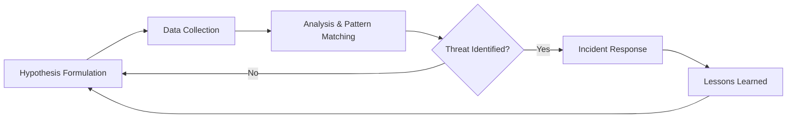

## 서론

새벽 2시, SOC 대시보드는 평온합니다. 방화벽에는 이상 징후가 없고, 백신 소프트웨어는 '위협 없음'을 노래하고 있습니다. 하지만 이 완벽한 고요함은 거짓일 수 있습니다. 국가 지원을 받는 APT(지속적 위협) 그룹들은 'Low and Slow' 전략을 사용합니다. 네트워크 경계에서 쨍그랑 소리가 나지 않도록 기어코 들어와서는, 몇 달, 혹은 몇 년간 조용히 정보를 훔쳐 나갑니다.

전통적인 보안 체계는 알려진 '서명(Signature)'에 의존하기 때문에, 변형된 툴이나 내부 네트워크에서의 정상적인 프로토콜 악용(Living off the Land)을 포착하지 못합니다. 바로 이 지점에서 NSA(미국 국가안보국)와 ACSC(호주 사이버보안센터)가 공동으로 발표한 'Hunt Guide'의 중요성이 부각됩니다. 이 가이드는 단순한 경고가 아닙니다. 그들은 이미 실무에서 검증된 공격자의 지문(IoC)과 행동 패턴(TTP)을 공개하며, "이렇게 찾아내라"라고 구체적인 로드맵을 던져주었습니다. 이 글에서는 왜 우리가 수동적인 방어에서 벗어나 능동적인 위협 헌팅(Threat Hunting)으로 나아가야 하는지, 그리고 실제 현장에서 NSA 가이드를 어떻게 적용할 수 있는지 기술적으로 심도 있게 다루겠습니다.

## 본론

### 위협 헌팅의 핵심: IoC를 넘어선 TTP 분석

과거의 보안은 해시(Hash) 값이나 특정 IP 주소 같은 IoC(Indicator of Compromise)를 막는 데 집중했습니다. 하지만 현대의 APT는 쉘코드를 암호화하고, C2(Command & Control) 서버를 합법적인 클라우드 서비스로 위장합니다. 따라서 NSA 헌트 가이드가 강조하는 것은 "무엇이(What)" 감염되었는지보다 "어떻게(How)" 침투했는지에 대한 TTPs(Tactics, Techniques, and Procedures) 분석입니다. 예를 들어, `powershell.exe`가 자체 실행되는 것은 비정상적이지만, 단순히 `powershell` 프로세스만 봐서는 알 수 없습니다. 어떤 인자(Argument)가 함께 실렸는지, 어떤 부모 프로세스(Parent Process)에서 실행되었는지의 문맥(Context)이 핵심입니다.

### 위협 헌팅 라이프사이클

성공적인 위협 헌팅은 단발성 검사가 아닌 순환적인 프로세스입니다. NSA 가이드를 기반으로 한 헌팅 프로세스는 다음과 같은 흐름을 가집니다.



위 다이어그램은 헌팅이 가설(Hypothesis)에서 시작됨을 보여줍니다. "공격자가 WMI(Windows Management Instrumentation)를 이용해 지속성을 확보할 것이다"라는 가설을 세우고, 이를 검증할 데이터를 수집한 뒤 패턴을 매칭하는 것입니다. 결과가 나오지 않으면 가설을 수정하고, 위협이 발견되면 즉시 대응(IR)한 뒤 그 경험을 다음 헌팅의 밑거름으로 삼습니다.

### 분석 접근법 비교: 반응형 모니터링 vs. 위협 헌팅

NSA 가이드를 도입하기 전에 우리의 현재 접근 방식이 어디에 있는지 점검해야 합니다.

| 비교 항목 | 반응형 모니터링 (Reactive Monitoring) | 위협 헌팅 (Threat Hunting) | | :--- | :--- | :--- | | **시작점** | 알림(Alert) 발생 시 | 가설(Hypothesis) 기반의 의심 | | **데이터 대상** | 로그의 일부 or 경계 네트워크 | 전체 엔드포인트, 원격(Remote) 레지스트리 등 | | **탐지 대상** | 알려진 위협 (Known Threats) | 알려지지 않은 위협 (Unknown/Zero-day) | | **목표** | 발생한 사고의 처리 | 숨겨진 침해의 사전 발견 | | **핵심 도구** | SIEM, IPS/AV | EDR, AI/ML 분석, 스크립트 |

### 실무 가이드: PowerShell 악용 탐지 (Step-by-Step)

NSA와 ACSC는 최근 보고서에서 PowerShell을 이용한 공격이 급증하고 있음을 경고했습니다. 관리자 도구인 PowerShell은 악성코드 다운로드, 실행, 흔적 소멸에 악용됩니다. 다음은 가이드를 바탕으로 내부 네트워크에서 악성 PowerShell 활동을 헌팅하는 절차입니다.

**1. 가설 수립** "공격자는 `Invoke-Expression` 또는 `IEX`를 사용하여 인코딩된 명령을 실행하려 시도한다."

**2. 데이터 수집** Sysmon이나 EDR 솔루션을 통해 PowerShell 로그를 수집합니다. 특히 스크립트 블록 로깅(Script Block Logging)이 활성화되어 있어야 합니다.

**3. 분석 및 탐지** 아래는 Python으로 작성한 간단한 PoC(Proof of Concept) 코드로, 수집된 로그 파일(CSV 형식 가정)에서 특정 의심스러운 패턴을 검색합니다. (※ 이 코드는 방어적 목적의 학습용입니다.)

```python
import re
import csv

# 방어 목적의 위협 탐지 스크립트
def hunt_malicious_powershell(log_file):
    suspicious_keywords = [
        r'Invoke-Expression',
        r'IEX',
        r'FromBase64String',
        r'DownloadString',
        r'Net\.WebClient'
    ]
    
    findings = []

    try:
        with open(log_file, mode='r', encoding='utf-8') as f:
            reader = csv.DictReader(f)
            for row in reader:
                command_line = row.get('CommandLine', '')
                host = row.get('Hostname', 'Unknown')
                
                # 각 키워드 스캔
                for keyword in suspicious_keywords:
                    # 대소문자 구분 없이 정규식 검색
                    if re.search(keyword, command_line, re.IGNORECASE):
                        findings.append({
                            'Host': host,
                            'Keyword': keyword,
                            'Command': command_line[:100] + '...' # 로깅을 위해 길이 제한
                        })
                        break # 하나라도 걸리면 의심으로 간주하고 루프 탈출
    except FileNotFoundError:
        print("Log file not found.")
        return

    # 결과 리포트
    if findings:
        print(f"[!] {len(findings)} potential threats found.")
        for finding in findings:
            print(f"Host: {finding['Host']}, Keyword: {finding['Keyword']}")
            print(f"Cmd: {finding['Command']}
")
    else:
        print("[+] No suspicious PowerShell activity detected.")

# 예제 실행 (가상의 로그 파일 경로)
# hunt_malicious_powershell('powershell_logs.csv')
```

이 코드는 단순히 키워드 매칭을 하지만, 실제 환경에서는 인코딩된 문자열을 디코딩하여 내용을 검사하거나, 부모 프로세스가 `winword.exe`나 `excel.exe` 같은 비정상적인 프로세스인지 검증하는 로직을 추가해야 합니다.

**4. 완화 조치 (Mitigation)** 탐지 후 즉시 적용해야 할 조치입니다.

- **제약 모드(Constrained Mode):** PowerShell 언어 모드를 제한하여 불필요한 .NET API 호출을 차단합니다.

- **AMSI(Antimalware Scan Interface) 활성화:** 메모리 내에서 실행되는 스크립트를 백신이 실시간으로 스캔할 수 있도록 설정합니다.

- **Just Enough Administration (JEA):** 관리자 권한을 최소화하여, 공격자가 PowerShell을 탈취하더라도 피해를 줄입니다.

## 결론

NSA와 ACSC의 헌트 가이드는 단순한 기술 문서가 아닌, 생존을 위한 전략 보고서입니다. APT 공격은 이미 내부에 있을 가능성이 높으며, 우리는 그들의 존재를 모른 채 데이터를 유출하고 있을지도 모릅니다.

이 글에서 다룬 PowerShell 헌팅 예시는 빙산의 일각입니다. 중요한 것은 완벽한 도구를 갖추는 것이 아니라, "우리 네트워크에 이미 침투자가 있다"는 가정하에 끊임없이 질문하고 검증하는 '헌팅 마인드셋'을 구축하는 것입니다. EDR 도구를 도입했다면, 단순히 알림만 기다리지 말고 위에서 언급한 KQL 쿼리나 스크립트를 직접 작성하여 데이터를 뒤져보십시오. 그 숨겨진 패턴 하나가 기업의 운명을 바꿀 수 있습니다.

**참고자료:**

- [NSA Cybersecurity Alert](https://www.nsa.gov/)

- [ACSC Threat Hunting Guides](https://www.cyber.gov.au/)

- [MITRE ATT&CK Framework](https://attack.mitre.org/)
