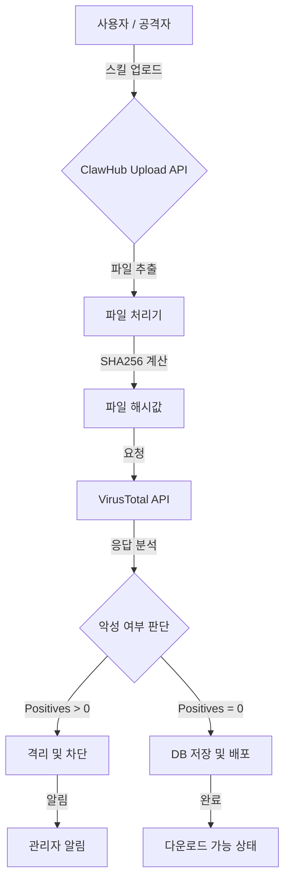

## 서론

새벽 2시, 보안 운영 센터(SOC)의 모니터에 붉은색 경고灯이 깜빡이고 있습니다. 평소와 다름없는 자동화 배포 파이프라인이었지만, 이번에는 달랐습니다. 인기 있는 ClawHub 저장소에서 "시스템 최적화"라는 이름으로 업로드된 간단한 파이썬 스크립트가 실행되자마자 내부망의 민감한 데이터가 외부로 유출되기 시작한 것입니다. 개발자는 신뢰할 수 있는 커뮤니티라고 생각하여 코드 검증 없이 스크립트를 배포했습니다. 이것이 바로 현대적인 **공급망 공급망 공격(Supply Chain Attack)**의 현실입니다.

오픈 소스와 커뮤니티 기반의 생태계가 활성화될수록, 공격자들은 직접 타겟을 공격하기보다 사용자들이 널리 사용하는 라이브러리나 스크립트에 악성 코드를 심는 방식을 선호합니다. ClawHub와 같은 보안 자동화 스킬 마켓플레이스는 해커들에게는 아주 매력적인 타겟입니다. 이러한 위협을 방어하기 위해 OpenClaw는 단순한 커뮤니티 신뢰도에 의존하는 것을 넘어, 업계 표준인 **VirusTotal**과의 연동을 통해 스킬(Skills)에 대한 정적 분석과 악성 코드 탐지 기능을 플랫폼 차원에서 강화했습니다. 이 글에서는 이러한 통합이 기술적으로 어떻게 구현되었는지, 그리고 실제 공격 시나리오에서 어떻게 위협을 차단하는지 심도 있게 다룹니다.

## 본론

### 공급망 공격의 위험성과 탐지 원리

보안 자동화 플랫폼인 OpenClaw에서 사용되는 '스킬(Skill)'은 사실상 실행 가능한 코드입니다. 공격자가 정상적인 기능을 하는 스크립트 내에 백도어나 코인마이너, 그리고 데이터 탈취 스크립트를 삽입하여 업로드하면, 이를 다운로드하여 사용하는 무수한 사용자들이 감염될 수 있습니다. 이를 방어하기 위해 가장 효과적인 방법은 코드가 실행되기 전, 즉 업로드 및 다운로드 시점에 파일의 무결성과 악성 여부를 검사하는 것입니다.

OpenClaw는 VirusTotal API를 활용하여 스킬 파일의 해시(Hash)를 검증하고, 70개 이상의 백신 엔진을 통해 분석된 결과를 기반으로 위험 여부를 판단합니다. 이 과정은 사용자에게 투명하게 진행되며, 악성으로 판명될 경우 즉시 격리됩니다.

### VirusTotal 연동 아키텍처

이 시스템의 핵심은 파일 업로드 흐름 사이에 VirusTotal 스캐닝 프로세스를 삽입하는 것입니다. 아래 다이어그램은 사용자가 스킬을 업로드할 때부터 검사가 완료되기까지의 보안 검증 흐름을 도식화한 것입니다.



위 흐름도에서 볼 수 있듯이, **VTCheck(VirusTotal API)**와 **Decision(악성 여부 판단)** 단계가 핵심입니다. 만약 악성 코드가 탐지되면 시스템은 즉시 해당 파일을 **Quarantine(격리)** 처리하여 유포를 차단합니다.

### 기술적 구현: PoC 코드 (Python)

이 개념을 실제로 어떻게 구현할 수 있을까요? 아래는 VirusTotal API v3를 사용하여 업로드된 파일을 스캔하는 Python 예제 코드입니다. (※ 학습 및 방어 목적으로 작성되었습니다.)

```python
import requests
import hashlib
import time

# 설정: VirusTotal API Key (실제 사용 시 환경 변수로 관리 권장)
API_KEY = 'YOUR_VIRUSTOTAL_API_KEY'
BASE_URL = 'https://www.virustotal.com/api/v3'
HEADERS = {'x-apikey': API_KEY}

def scan_file(file_path):
    """
    파일을 VirusTotal에 업로드하고 스캔 결과를 확인하는 함수
    """
    with open(file_path, 'rb') as f:
        file_content = f.read()
    
    # 1. 파일 해시 계산 (중복 스캔 방지)
    file_hash = hashlib.sha256(file_content).hexdigest()
    
    # 2. 해시로 먼저 검색 요청 (이미 분석된 파일인지 확인)
    print(f"[+] Checking hash: {file_hash}")
    response = requests.get(f"{BASE_URL}/files/{file_hash}", headers=HEADERS)
    
    if response.status_code == 200:
        print("[*] File already analyzed. Retrieving report...")
        return response.json()
    elif response.status_code == 404:
        print("[*] File not found in VT. Uploading for analysis...")
        
        # 3. 새로운 파일 업로드
        upload_url = f"{BASE_URL}/files"
        files = {"file": (file_path, file_content)}
        upload_response = requests.post(upload_url, headers=HEADERS, files=files)
        
        if upload_response.status_code == 200:
            analysis_id = upload_response.json().get('data', {}).get('id')
            print(f"[+] Upload successful. Analysis ID: {analysis_id}")
            
            # 4. 분석 완료 대기 (Polling)
            while True:
                report_response = requests.get(f"{BASE_URL}/analyses/{analysis_id}", headers=HEADERS)
                if report_response.status_code == 200:
                    report = report_response.json()
                    status = report.get('data', {}).get('attributes', {}).get('status')
                    if status == 'completed':
                        return report
                    print("[*] Scanning in progress... Waiting 5 seconds.")
                    time.sleep(5)
        else:
            print(f"[-] Upload failed: {upload_response.text}")
            return None
    else:
        print(f"[-] Error checking hash:
```

```python
 {response.text}")
        return None

def parse_report(report_json):
    """
    스캔 리포트를 파싱하여 위험도를 판단
    """
    if not report_json:
        return "UNKNOWN"
    
    attributes = report_json.get('data', {}).get('attributes', {})
    stats = attributes.get('last_analysis_stats', {})
    
    malicious_count = stats.get('malicious', 0)
    suspicious_count = stats.get('suspicious', 0)
    
    print(f"
--- Scan Result ---")
    print(f"Malicious: {malicious_count}")
    print(f"Suspicious: {suspicious_count}")
    
    if malicious_count > 0:
        return "MALICIOUS"
    elif suspicious_count > 0:
        return "SUSPICIOUS"
    else:
        return "CLEAN"

# 실행 예시 (방어 목적의 시뮬레이션)
# result = scan_file("example_skill.py")
# verdict = parse_report(result)
# print(f"
Final Verdict: {verdict}")
```

이 코드는 파일의 해시를 먼저 조회하여 불필요한 업로드를 줄이고, 필요한 경우 파일을 전송한 뒤 분석이 완료될 때까지 폴링(Polling)하는 과정을 거칩니다. 실제 OpenClaw 플랫폼에서는 이 로직이 웹훅(Webhook)이나 메시지 큐(RabbitMQ, Kafka 등)를 통해 비동기적으로 처리되어 사용자 경험을 저해하지 않습니다.

### 전/후 비교 및 방어 효과

VirusTotal 연동 전과 후의 보안 태세 변화는 다음과 같습니다.

| 구분 | 연동 전 (Before) | 연동 후 (After) | --- | --- | --- 
| **검증 방식** | 사용자 리뷰 및 기본적인 형식 검사 | 70개 이상의 백신 엔진 기반 정적 분석 | **대응 속도** | 사고 발생 후 사후 대응 (Reactive) | 업로드 시점 실시간 차단 (Proactive) 
| **악성코드 탐지율** | 낮음 (알려진 시그니처만 탐지 가능 시스템 없음) | 높음 (다중 엔진 및 휴리스틱 분석) | **공급망 위협** | 악의적인 스킬 배포 가능성 높음 | 악의적인 스킬 배포 초기 단계에서 차단 
| **오탐(False Positive)** | 없음 | 발생 가능하나, 화이트리스트로 관리 |

### 실무 적용 가이드 및 완화 조치

OpenClaw의 이러한 기능을 효과적으로 활용하고 보안을 더욱 강화하기 위해서는 다음과 같은 단계가 필요합니다.

1.  **API 키 관리 및 Rate Limiting**     VirusTotal API는 무료 플랜의 경우 요청 횟수 제한이 있습니다. 대규모 트래픽이 발생할 경우를 대비해 요청을 큐에 넣어 처리하거나, 유료 플랜을 고려해야 합니다. API Key는 절대 코드에 하드코딩하지 말고 안전한 비밀 관리 시스템(Vault 등)에 저장해야 합니다.

2.  **화이트리스트(Whitelisting) 관리**     잘 알려진 오픈 소스 라이브러리나 신뢰할 수 있는 개발자의 스크립트가 오탐(False Positive)으로 인해 차단될 수 있습니다. 이를 위해 신뢰할 수 있는 해시값이나 개발자 서명을 포함한 화이트리스트를 별도로 관리하여 검사를 우회하거나 즉시 승인할 수 있는 프로세스가 필요합니다.

3.  **Sandboxing (샌드박싱)과의 병행**     VirusTotal은 주로 정적 분석에 강합니다. 난독화(Obfuscation)되었거나 특정 조건에서만 동작하는 악성 스크립트를 탐지하기 위해서는 Cuckoo Sandbox 같은 동적 분석 환경에서 실제로 코드를 실행해보는 샌드박싱 기술을 병행하면 더 강력한 방어선을 구축할 수 있습니다.

4.  **사용자 알림 시스템**     만약 사용자가 업로드하려던 스킬이 악성 코드로 판명되어 차단되었다면, 사용자에게 구체적인 이유(예: "Trojan.W32이 탐지되었습니다")를 알려주어 재감염을 방지하고 보안 인식을 높여야 합니다.

## 결론

OpenClaw가 VirusTotal 연동을 통해 ClawHub 스킬에 대한 실시간 탐지 기능을 도입한 것은 단순한 기능 추가가 아닌, 보안 자동화 생태계의 신뢰성을 담보하는 중요한 조치입니다. 악의적인 스크립트가 유포되는 것을 원천 차단함으로써, 사용자는 더 이상 '알 수 없는 스크립트'를 실행할 때의 불안감을 느끼지 않아도 되게 되었습니다.

하지만 모든 보안 솔루션이 그렇듯, 이것만으로 완벽할 수는 없습니다. 공격자들은 필연적으로 탐지를 피하기 위한 우회 기법(Obfuscation, Living off the Land 등)을 개발할 것입니다. 따라서 이러한 자동화된 도구와 더불어, 사용자 개개인의 보안 상식과 최소한의 코드 리뷰 문화, 그리고 다층적인 방어 전략(Defense in Depth)이 결합될 때 진정한 보안이 달성될 수 있습니다.

안전한 자동화를 위한 OpenClaw의 이번 발걸음은 보안 자동화 산업의 새로운 표준을 제시한다는 점에서 매우 긍정적으로 평가할 수 있습니다.

### 참고자료

- [VirusTotal API Documentation](https://developers.virustotal.com/reference)

- [OpenClaw Official Blog](https://openclaw.io/blog)

- [Supply Chain Attack Best Practices (CISA)](https://www.cisa.gov/news-events/news/securing-software-supply-chain-recommendations)
