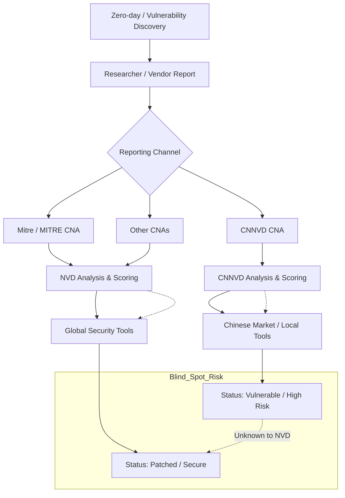

## 서론

방금 전, 주요 보안 벤더의 스캐너를 통해 전사적인 취약점 진단을 마쳤다고 가정해 봅시다. NVD(National Vulnerability Database) 기준으로 "Critical" 등급의 취약점은 0건, "High" 등급도 얼마 없어서 보안 팀은 한시름 놓은 상태입니다. 하지만 며칠 뒤, 실제 운영 중인 중국산 방화벽 솔루션의 특정 버전이 익스플로잇되어 데이터 유출 사고가 발생합니다. 당황해서 다시 CVE ID를 검색해보니, 이 취약점은 NVD에는 등록되지 않았거나 등록되더라도 심각도가 낮게 평가된 반면, 중국의 국가 취약점 데이터베이스인 CNNVD에서는 이미 '치명적' 등급으로 분류되어 있었습니다.

이것이 바로 우리가 직면한 **"Red Vulns"**의 현실입니다. 보안의 세계에서 데이터는 생명이지만, 모든 데이터가 동일한 기준으로 생성되고流通되는 것은 아닙니다. 최근 Bitsight의 보고서에 따르면, CNNVD와 같은 지역 기반 취약점 데이터베이스의 독자적인 운영은 글로벌 기업에게 보안의 사각지대를 만들고 있습니다. 왜냐하면 MITRE나 NVD를 신뢰하는 기존의 Vuln Management(취약점 관리) 프로세스만으로는 이러한 지역 특화적 위협을 포착할 수 없기 때문입니다. 오늘은 중국의 CNNVD가 어떻게 작동하며, 이것이 우리의 보안 전략에 어떤 구멍을 뚫고 있는지, 그리고 어떻게 대응해야 하는지 현장 감각 있게 분석해 보겠습니다.

## 본론

### Red Vulns의 기술적 기원: CNNVD의 독자적인 생태계

'Red Vulns'란 단순히 중국에서 발견된 취약점을 의미하는 것이 아닙니다. 이는 CNNVD(China National Vulnerability Database)가 독자적으로 할당한 CVE ID, 혹은 NVD와는 별개로 등록 및 관리되는 취약정보를 지칭합니다. 핵심은 CNNVD가 MITRE의 CNAs(CVE Numbering Authorities)와 독립적인 할당 권한을 행사한다는 점입니다.

CNNVD는 중국 내 정보보안 산업 육성을 목표로 하며, 때로는 NVD보다 빠르게 취약점을 공개하거나, NVD에서는 중요하지 않게 여기는 취약점에 높은 점수를 매깁니다. 이로 인해 글로벌 스캐너(NVD 기반)는 "안전"하다고 판단한 자산이, CNNVD 기반으로 보면 "취약"한 상태가 되는 **데이터 괴리(Data Gap)** 현상이 발생합니다. 이는 특히 중국에서 개발된 솔루션이나, 중국 시장에 주로 판매되는 글로벌 벤더의 제품에서 두드러지게 나타납니다.

### NVD vs CNNVD: 운영 메커니즘 비교

이해를 돕기 위해 가장 대표적인 두 데이터베이스의 운영 방식을 비교해 보겠습니다.

| 비교 항목 | NVD (미국) | CNNVD (중국) | | :--- | :--- | :--- | | **운영 주체** | NIST (미국 국립표준기술연구소) | CNITSEC (중국 정보보안 평가센터) | | **CVE 할당 권한** | MITRE 및 산하 CNA 위주 | 독자적인 CNA 역할 및 할당 | | **주요 목적** | 미국 연방 시스템 및 민간 인프라 보호 | 중국 사이버 보안 주도권 확보 및 산업 보호 | | **심각도 평가 기준** | CVSS v3/v4 표준 주도 | CNNVD 자체 평가 기준 (CVSS 변형 적용 시 있음) | | **데이터 공개 속도** | 검증 과정으로 인해 상대적 지연 발생 | 국내 제품에 대해 신속한 공제 경향 | | **주요 특이사항** | 글로벌 표준 (De facto standard) | 지정 정부 프로젝트 입찰 시 CNNVD 인증 필수 |

### 취약점 데이터의 흐름과 분기점

아래 다이어그램은 취약점이 발견되었을 때, NVD와 CNNVD로 어떻게 분기되어 "Red Vulns"이 발생하는지를 보여줍니다.



위 흐름도에서 볼 수 있듯이, 연구자가 CNNVD에만 보고하거나 CNNVD가 독자적으로 취약점 ID를 생성할 경우, NVD 기반의 글로벌 스캐너(노드 H)는 이를 인지하지 못합니다. 반면, 중국 내부 위협 인텔리전스(노드 J)는 이를 이미 고위험으로 판단하고 있게 됩니다. 이 사이에 있는 기업의 보안 관제자는 자신이 방어하고 있다고 믿지만 사실은 무방비 상태로 노출됩니다.

### PoC: 교차 검증을 통한 Red Vulns 탐지 시뮬레이션

방어 목적(Defensive Purpose)으로, 실제 환경에서 자사의 자산이 Red Vulns의 영향을 받는지 확인하는 자동화 스크립트를 작성해 보겠습니다. 이 코드는 가상의 NVD 데이터셋과 CNNVD 데이터셋을 비교하여, NVD에는 없지만 CNNVD에 존재하는 "누락된 취약점"을 식별하는 로직을 포함합니다.

```python
import json
from datetime import datetime

# [Ethical Hacking Note] 이 코드는 보안 관제자가 시스템의 노출 여부를 사전에 점검하기 위한 목적으로만 사용됩니다.

def load_vulnerabilities(file_path):
    """JSON 형식의 취약점 데이터 로드"""
    try:
        with open(file_path, 'r', encoding='utf-8') as f:
            return json.load(f)
    except FileNotFoundError:
        return []

def find_red_vulns(nvd_data, cnnvd_data):
    """
    NVD 데이터에는 없지만 CNNVD 데이터에 있는 취약점(Red Vulns)을 식별합니다.
    동일한 CVE ID 혹은 특정 소프트웨어/CPE 기준으로 비교합니다.
    """
    nvd_cve_set = {item['cve_id'] for item in nvd_data}
    red_vulns = []

    for cnnvd_item in cnnvd_data:
        cve_id = cnnvd_item['cve_id']
        
        # NVD에는 없지만 CNNVD에는 있는 경우 (Red Vulns 후보)
        if cve_id not in nvd_cve_set:
            # 심각도 필터링: CNNVD 점수가 7.0 이상인 경우만 우선 고려
            if cnnvd_item.get('score', 0) >= 7.0:
                red_vulns.append({
                    'cve_id': cve_id,
                    'cnnvd_score': cnnvd_item.get('score'),
                    'description': cnnvd_item.get('desc'),
                    'affected_product': cnnvd_item.get('product')
                })
    
    return red_vulns

def main():
    # 시뮬레이션 데이터 (실제 운영 시는 API를 통해 수집)
    mock_nvd = [
        {"cve_id": "CVE-2023-1001", "score": 5.5, "product": "WebServer-X"},
        {"cve_id": "CVE-2023-1002", "score": 9.8, "product": "DB-Connector"}
    ]
    
    mock_cnnvd = [
        # NVD와 중복됨
        {"cve_id": "CVE-2023-1001", "score": 6.5, "product": "WebServer-X"},
        # Red Vulns (NVD 미등록 혹은 지연)
        {"cve_id": "CNNVD-202310-001", "score": 9.9, "product": "WebServer-X", "desc": "Remote Code Execution in Admin Panel"},
        {"cve_id": "CVE-2023-1003", "score": 7.5, "product": "WebServer-X", "desc": "Authentication Bypass"}
    ]

    print(f"[{datetime.now()}] Starting Vulnerability Correlation Check...")
    
    red_vulns = find_red_vulns(mock_nvd, mock_cnnvd)


```

```python
    if red_vulns:
        print(f"
!!! ALERT: {len(red_vulns)} Potential Red Vulns Found !!!")
        for vuln in red_vulns:
            print(f"ID: {vuln['cve_id']} | Product: {vuln['affected_product']}")
            print(f"Risk: HIGH (Score: {vuln['cnnvd_score']})")
            print(f"Reason: {vuln['description']}")
            print("-" * 40)
    else:
        print("
[+] No critical Red Vulns detected.")

if __name__ == "__main__":
    main()
```

이 코드는 매우 단순화된 예시이지만, 실제 현장에서는 NVD API뿐만 아니라 CNNVD가 제공하는 RSS 혹은 엑셀 데이터를 크롤링하여 자사의 자산 관리 데이터베이스(CMDB)와 조인(Join)하는 방식으로 운영됩니다.

### 실무 적용 가이드: 다층적 취약점 관리 전략

Red Vulns의 위협을 완화하기 위해 보안 관리자는 다음과 같은 3단계 프로세스를 도입해야 합니다.

**Step 1: 인텔리전스 소스 다각화 (Diversify Sources)** NVD에만 의존하는 단일 소스 구조를 탈피해야 합니다. CNNVD뿐만 아니라 JVN(일본), CERT-KR(한국) 등의 국가 데이터베이스를 주기적으로 모니터링해야 합니다. 특히 중국 벤더의 장비를 사용하는 경우, 해당 벤더가 CNNVD에 게시하는 보안 공지(Security Advisory)를 RSS로 구독하여 실시간으로 수신하는 시스템을 구축하세요.

**Step 2: 데이터 표준화 및 상관 분석 (Normalization & Correlation)** 각 데이터베이스는 사용하는 식별자나 점수 체계가 다를 수 있습니다. 예를 들어 CNNVD는 고유의 `CNNVD-YYYY-NNNN` 형식을 사용할 때도 있습니다. 이를 내부 시스템의 표준 포맷(예: CVE 기반)으로 변환하고, 중복을 제거하는 ETL(Extract, Transform, Load) 파이프라인이 필요합니다.

**Step 3: 지역별 위협 모델링 (Regional Threat Modeling)** 모든 취약점을 동일하게 처리할 수는 없습니다. 해당 자산이 중국 내부망에 위치한지, 글로벌 트래픽을 처리하는지에 따라 우선순위를 다르게 적용해야 합니다. 만약 중국 시장을 타겟으로 한 서비스라면, CNNVD 등급을 NVD 등급보다 상위에 두어 패치 결정을 내려야 합니다.

## 결론

"보이지 않는 것이 존재하지 않는 것은 아니다."라는 명제는 사이버 보안, 특히 취약점 관리 분야에서 가장 위험한 함정입니다. Bitsight이 지적한 'Red Vulns'의 급증은 단순히 통계 수치의 변화가 아닌, 취약점 생태계가 글로벌 표준(NVD) 중심에서 지역별 파편화로 나아가고 있음을 시사합니다.

기업의 보안 팀은 이제 단순히 스캐너를 돌리고 결과 리포트를 확인하는 수동적인 자세에서 벗어나야 합니다. CNNVD와 같은 지역 데이터베이스가 어떤 정치적, 기술적 배경을 가지고 운영되는지 이해하고, 이를 자사의 Threat Intelligence에 통합하는 능동적인 접근이 필요합니다. NVD에 없는 취약점이 나의 시스템을 공격할 수 있다는 가능성을 열어두고, 보안 인텔리전스의 시야를 넓히는 것만이이 치열한 사이버 전쟁에서 살아남는 길입니다.

### 📚 참고자료

- [Bitsight Report: Red Vulns Rising](https://www.bitsight.com/)

- [CNNVD Official Portal](http://www.cnnvd.org.cn/)

- [NIST National Vulnerability Database](https://nvd.nist.gov/)
