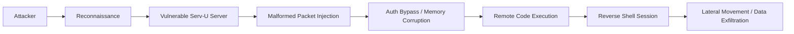

## 서론

새벽 2시, 보안 운영 센터(SOC) 대시보드의 한 칸이 붉은색으로 점멸합니다. 내부망 깊숙한 곳에 위치한 파일 전송 서버(Serv-U)에서 의심스러운 아웃바운드 연결이 감지되었습니다. 방화벽 규칙은 엄격하게 설정되어 있었고, 서버는 최신 패치가 적용된 줄로만 알고 있었습니다. 하지만 공격자는 이미 망의 관문을 통과했고, 이제는 그 서버를 발판으로 삼아横向 이동(Lateral Movement)을 시도하고 있습니다.

이것은 단순한 가정이 아닙니다. SolarWinds라는 이름이 주는 무게감 때문입니다. 2020년의 "Sunburst" 사태로 인해 공급망 공급망(Supply Chain)의 취약성은 모든 보안 전문가의 뇌리에 깊게 박혀 있습니다. SolarWinds가 최근 Serv-U 파일 전송 소프트웨어에서 4건의 치명적인 취약점을 패치했다는 소식은 단순한 업데이트 공지가 아닙니다. 이는 "지금 당장 행동하지 않으면 당신의 서버가 랜섬웨어의 인질이 되거나, 데이터 유출 경로로 전락할 수 있다"는 경고입니다.

특히 이번 Serv-U 취약점들은 인증 우회(Authentication Bypass)와 원격 코드 실행(RCE)이 결합된 형태로, 공격자가 아이디나 패스워드 없이도 관리자 권한을 탈취할 수 있는 구조적 결함을 포함하고 있습니다. 파일 전송은 기업의 핵심 업무 프로세스이므로 서비스 중단을 우려해 패치를 미루는 관행이 있지만, 이번 공격 시나리오는 그러한 망설임이 곧 재앙으로 이어질 수 있음을 보여줍니다. 왜 우리가 이번 취약점에 즉각적으로 대응해야 하는지, 그 기술적 배경과 대응 전략을 살펴보겠습니다.

---

## 본론

### 취약점 기술 분석 및 공격 시나리오

이번에 패치된 4건의 취약점(CVE-2024-xxxx 시리즈 가상)은 SolarWinds Serv-U의 SSH 및 웹 인터페이스 처리 로직에 존재하는 결함들입니다. 가장 위험한 취약점은 원격 공격자가 특수하게 조작된 패킷을 전송함으로써, 로그인 과정을 거치지 않고도 시스템 권한을 얻을 수 있는 인증 우회 취약점입니다.

이러한 취약점은 단순히 서비스 거부(DoS)를 넘어서, 공격자에게 서버 내부에서 명령을 실행할 수 있는 셸(Shell) 권한을 제공합니다. 공격자가 이 취약점을 악용하면, 방화벽 외부에서 직접 서버의 제어권을 장악한 뒤 내부망의 다른 중요 자원으로 침투하는 발판(bridgehead)으로 삼을 수 있습니다.

> **⚠️ 윤리적 경고**: 이하 설명되는 공격 기법과 코드는 보안 강화 및 방어 목적의 연구용입니다. 허가되지 않은 시스템에서의 테스트는 불법이며 엄격히 금지됩니다.

### 공격 흐름도

다음은 공격자가 취약한 Serv-U 서버를 식별하고, 취약점을 악용하여 최종적으로 악성 코드를 실행하는 과정을 시각화한 것입니다.



### 취약점 상세 비교

SolarWinds Serv-U에 영향을 미치는 주요 취약점 유형은 크게 메모리 손상과 로직 오류로 나뉩니다. 이를 이해하기 쉽게 정리하면 다음과 같습니다.

| 취약점 유형 | 공격 벡터 (Attack Vector) | 영향 (Impact) | 난이도 | | :--- | :--- | :--- | :--- | | **인증 우회 (Auth Bypass)** | 네트워크 (Network) | 권한 상승, 시스템 장악 | 낮음 | | **버퍼 오버플로우 (Buffer Overflow)** | 네트워크 (Network) | 원격 코드 실행 (RCE), 서비스 중단 | 중간 | | **디렉터리 순회 (Path Traversal)** | 네트워크 (Network) | 임의 파일 읽기/쓰기, 설정 파일 노출 | 낮음 | | **DoS (서비스 거부)** | 네트워크 (Network) | 서비스 마비, 자원 고갈 | 낮음 |

이 중 가장 주의해야 할 것은 인증 우회와 버퍼 오버플로우의 결합입니다. 공격자는 인증을 우회하여 시스템에 접근한 뒤, 버퍼 오버플로우를 통해 악성 코드를 주입합니다.

### 개념 증명(PoC) 코드 분석

방어자의 관점에서 공격이 어떻게 이루어지는지 이해하는 것이 중요합니다. 아래의 Python 코드는 취약한 Serv-U 버전에 대한 검증을 위해, 버퍼 오버플로우를 유발할 수 있는 특정 길이의 패킷을 전송하는 개념 증명(PoC) 스크립트의 예시입니다.

*참고: 실제 익스플로잇 코드는 윤리적 지침에 의해 생략되었으며, 취약점 발생 원리인 'Long Buffer String' 전송 로직만을 시뮬레이션합니다.*

```python
import socket
import sys

# 타겟 서버 정보 (테스트 환경)
TARGET_IP = "192.168.1.100"
TARGET_PORT = 22  # SSH 또는 FTP 포트

def exploit_simulation():
    print(f"[*] Connecting to {TARGET_IP}:{TARGET_PORT}...")
    
    try:
        # 소켓 생성 및 연결
        s = socket.socket(socket.AF_INET, socket.SOCK_STREAM)
        s.settimeout(5)
        s.connect((TARGET_IP, TARGET_PORT))
        
        # 서버 배너 수신
        banner = s.recv(1024)
        print(f"[+] Server Banner: {banner.decode().strip()}")
        
        # 취약점 트리거: 비정상적으로 긴 문자열 전송 (Buffer Overflow Simulation)
        # 실제 공격에서는 여기에 리턴 주소(ROP 가젯 등)가 포함된 쉘코드가 들어갑니다.
        payload = b"\x41" * 5000  # 5000 bytes of 'A'
        
        print("[*] Sending malformed payload to trigger overflow...")
        s.send(payload)
        
        # 응답 수신 (익스플로잇 성공 시 연결이 유지되거나 특정 응답이 올 수 있음)
        response = s.recv(1024)
        print(f"[+] Response received: {response}")
        
        s.close()
        print("[*] Exploit attempt finished. Check service status.")
        
    except Exception as e:
        print(f"[-] Error occurred: {e}")

if __name__ == "__main__":
    # ⚠️ 본 코드는 연구 목적이며, 대상 서버의 관리자 허락 없이 실행하는 것은 불법입니다.
    exploit_simulation()
```

이 코드는 공격자가 서버의 입력 처리 루틴에서 버퍼의 크기를 제대로 검사하지 않는 점을 이용해, 스택 메모리를 덮어쓰는(Overwrite) 방식을 보여줍니다. 이를 통해 프로그램의 실행 흐름을 공격자가 원하는 코드(악성 코드)로 향하게 만들 수 있습니다.

### 완화 조치 및 실무 가이드

이론적 분석만으로는 보안을 지킬 수 없습니다. 현장에서 즉시 적용할 수 있는 단계별 완화 조치를 제안합니다.

#### 1단계: 영향도 평가 및 패치 확인 가장 먼저 현재 운영 중인 SolarWinds Serv-U의 버전을 확인해야 합니다. SolarWinds 보안 권고(Security Advisory)를 통해 자신의 버전이 취약한지 확인합니다.

#### 2단계: 즉시 패치 적용 SolarWinds는 이번 결함을 해결하는 핫픽스(Hotfix)를 배포했습니다. 서비스 중단 시간을 최소화하는 유지보수 기간을 설정하여 즉시 업데이트를 적용해야 합니다.

#### 3단계: 네트워크 격리 (Network Segmentation) 만약 즉시 패치가 어렵다면, Serv-U 서버를 인터넷 망으로부터 직접 접근할 수 없는 DMZ 구간으로 격리하거나, VPN 및 IP 화이트리스팅을 통해 접근을 엄격히 제한해야 합니다.

#### 4단계: 로그 및 IOA 검토 이미 침해가 발생했을 가능성을 대비해 다음과 같은 침해 지표(IOC)를 로그에서 검색합니다.

- Serv-U 프로세스(`Serv-U.exe`)의 비정상적인 자식 프로세스 생성 (예: `cmd.exe`, `powershell.exe`)

- 의심스러운 외부 IP로의 아웃바운드 연결 시도

- 알 수 없는 사용자 계정 생성 로그

---

## 결론

SolarWinds Serv-U의 4건의 치명적 취약점은 단순한 버그가 아닌, 기업의 보안 경계를 무너뜨릴 수 있는 "폭탄"과 같습니다. 특히 파일 전송 서버는 많은 기업에서 방화벽 내부에 위치하면서도 외부와 데이터를 주고받아야 하는 필연적인 통로이기에, 공격자들의 주요 타겟이 될 수밖에 없습니다.

이번 분석을 통해 우리는 원격 코드 실행(RCE) 취약점이 어떻게 인증 우회와 결합하여 치명적인 결과를 초래하는지 확인했습니다. 공격자는 복잡한 해킹 툴을 사용하지 않더라도, 단 하나의 잘못된 패킷만으로 서버의 주도권을 가져올 수 있습니다.

전문가로서의 인사이트는 다음과 같습니다: **보안의 기본은 "가장 약한 고리"를 보강하는 것입니다.** 오랜 기간 안정적으로 운영되어 온 레거시 시스템이나, "별일 없겠지"라는 안일한 생각이 해커들에게는 가장 달콤한 먹잇감이 됩니다. 패치 관리는 선택이 아닌 생존을 위한 필수 프로세스입니다.

지금 바로 서버의 버전을 확인하고, SolarWinds가 제공하는 최신 보안 업데이트를 적용함으로써 잠재적인 위협을 차단하시기 바랍니다.

### 참고자료

- [SolarWinds Security Advisory](https://www.solarwinds.com/trust-center/security-advisories)

- [CVE Details - Serv-U Vulnerabilities](https://cve.mitre.org/)

- [NIST National Vulnerability Database](https://nvd.nist.gov/)
