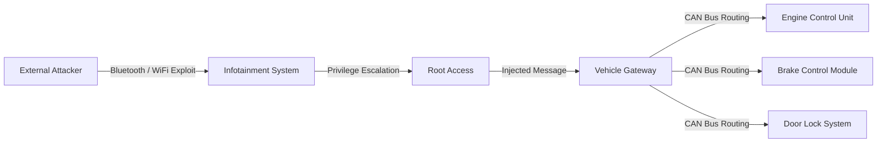

## 서론

고속도로를 시속 100km로 달리는 중입니다. 갑자기 운전대가 저절로 돌아가거나, 브레이크 페달이 발에 맞지 않게 밀린다면 어떨까요? 영화 속 장면처럼 느껴질지 모르지만, 최근 테슬라(Tesla) Model 3와 사이버트럭(Cybertruck)에서 발견된 취약점들은 이러한 시나리오가 결코 공상이 아님을 증명했습니다. 이는 단순히 편의 기능의 오작동을 넘어, 생명과 직결된 차량 제어권을 탈취할 수 있는 심각한 보안 구멍입니다.

우리는 이제 '주행하는 컴퓨터'를 운전하고 있습니다. 테슬라와 같은 커넥티드 카(Connected Car)는 수많은 센서와 통신 모듈을 통해 실시간으로 데이터를 주고받습니다. 하지만 차량의 보안 체계가 이러한 복잡한 연결성을 따라가지 못한다면, 해커에게는 넓은 공격면이 열리게 됩니다. 이 글에서는 최근 연구 결과를 바탕으로 외부 공격이 내부 차량 네트워크로 침투하는 기술적 메커니즘을 분석하고, 실제 방어 전략을 모색해 보고자 합니다. 이는 보안 전문가로서 현장에서 마주해야 할 자동차 보안의 현실을 직시하는 첫걸음입니다.

*(⚠️ **윤리적 경고**: 본문에 포함된 모든 기술적 분석과 코드 예시는 보안 취약점의 심각성을 이해하고 방어 체계를 구축하기 위한 학습 및 방어 목적으로만 제공됩니다.)*

## 본론

### 1. 공격 벡터: 정보 시스템(IVI)에서 제어 시스템(CAN)으로

현대 전기차의 보안 위협은 크게 두 가지 영역으로 나뉩니다. 하나는 우리가 상호작용하는 '인포테인먼트 시스템(IVI)'이고, 다른 하나는 엔진, 브레이크, 조향을 제어하는 '제어 네트워크(CAN Bus)'입니다. 문제는 이 두 영역 사이의 격리(Isolation)가 제대로 이루어지지 않았을 때 발생합니다.

테슬라 Model 3 및 Cybertruck 연구에서 주목된 지점은 외부 공격자(예: 블루투스나 와이파이 해킹)가 IVI에 침투한 후, 이를 발판으로 내부 통신 프로토콜인 CAN(Controller Area Network) 버스로 악성 패킷을 주입하는 시나리오입니다. 공격자는 IVI의 취약한 서비스나 웹 브라우저 엔진을 이용해 코드 실행 권한을 얻고, 게이트웨이(Gateway)를 우회하거나 속여 제어 명령을 전달합니다.

이 과정을 시각화하면 다음과 같습니다.



### 2. CAN Bus 통신과 패킷 인젝션 원리

CAN Bus는 자동차 내부의 각 ECU(Electronic Control Unit)들이 통신하는 데 사용되는 표준 프로토콜입니다. 기본적으로 브로드캐스트 방식을 사용하며, 암호화나 인증 절차가 없는 '신뢰 기반' 모델로 설계되었습니다. 즉, 브레이크를 누르라는 신호를 보내는 노드가 진짜 브레이크 페달인지, 해커의 악성 코드인지 확인할 수 없다는 구조적 취약점이 있습니다.

연구원들은 이 특성을 악용하여, 정상적인 CAN 패킷을 녹음(Replay Attack)하거나, 특정 ID를 가진 패킷을 전송하여 차량을 제어했습니다.

#### [PoC] 개념 증명: CAN 패킷 생성 시뮬레이션

다음은 Python을 사용하여 CAN 버스에 도어 언락 명령을 시뮬레이션하는 예제 코드입니다. 실제 환경에서는 소프트웨어-defined CAN 인터페이스(예: SocketCAN)가 필요합니다.

```python
import can
import time

def send_can_packet(interface, can_id, data):
    """
    CAN 버스에 패킷을 전송하는 함수 (PoC)
    주의: 실제 차량에서 무단 실행 시 차량 시스템에 영향을 줄 수 있습니다.
    """
    try:
        # 버스 설정 (SocketCAN 인터페이스 사용 가정)
        bus = can.interface.Bus(channel=interface, bustype='socketcan')
        
        # CAN 메시지 생성 (ID와 데이터 페이로드)
        msg = can.Message(
            arbitration_id=can_id,  # 예: 0x123 (도어 락 제어 ID)
            data=data,              # 예: [0x01, 0x00, 0x00, 0x00...]
            is_extended_id=False
        )
        
        print(f"[+] Sending Packet to ID: {hex(can_id)} | Data: {data}")
        bus.send(msg)
        
    except can.CanError as e:
        print(f"[!] Error sending packet: {e}")

# 시뮬레이션 실행 (실제 차량에서는 ID와 데이터를 분석하여 맵핑해야 함)
# 공격자는 IVI 쉘에서 이 스크립트를 실행하여 내부 네트워크에 직접 접근 시도
if __name__ == "__main__":
    # 가상의 CAN ID와 데이터 (이는 분석을 통해 도출된 값임)
    TARGET_ID = 0x1A0  
    UNLOCK_PAYLOAD = [0x02, 0x3B, 0x01] 
    
    print("Attempting to inject CAN packet...")
    # send_can_packet("vcan0", TARGET_ID, UNLOCK_PAYLOAD)
    print("PoC execution blocked for safety reasons.")
```

### 3. 취약점 분석: 전통적 자동차 vs. 커넥티드 카

이번 사례를 통해 전통적인 자동차와 테슬라와 같은 소프트웨어 정의 자동차(SDV)의 보안 리스크 차이를 명확히 알 수 있습니다. 테슬라는 강력한 OTA(Over-The-Air) 업데이트 능력을 갖추고 있지만, 그만큼 코드의 복잡도와 외부 노출면이 증가했습니다.

| 구분 | 전통적 자동차 (Conventional) | 커넥티드 카 (Tesla Model 3/Cybertruck) | | :--- | :--- | :--- | | **주요 공격면** | 물리적 포트(OBD-II)에 국한됨 | 블루투스, WiFi, LTE, 모바일 앱, 웹 브라우저 등 다양 | | **진입 장벽** | 높음 (차량에 직접 접근 필요) | 낮음 (원격 접근 가능) | | **업데이트 주기** | 매우 느림 (딜러 방문 필요) | 빠름 (OTA를 통한 즉시 패치 가능) | | **보안 패러다임** | Security by Obscurity (모호성에 의한 보안) | Zero Trust 및 형상 검증 필요 | | **주요 취약점** | 키 인증 미비 등 물리적 보안 | IVI OS 취약점, 게이트웨이 필터링 우회 |

### 4. 단계별 침투 테스트 및 방어 가이드

보안 전문가의 관점에서 이러한 취약점을 진단하고 완화하는 절차는 다음과 같습니다.

**Step 1: 정찰(Reconnaissance) & 취약점 스캔**

- 공격자는 차량의 Bluetooth MAC 주소를 식별하거나, WiFi 네트워크의 SSID를 스캔합니다.

- 내부 네트워크의 경우, IVI의 OS(리눅스 기반 등)에서 열려 있는 포트를 확인합니다 (`nmap`, `netstat` 등 활용).

**Step 2: 익스플로잇(Exploitation) 및 접근**

- 특정 서비스의 버퍼 오버플로우나 인증 우회 취약점을 이용해 셸(Shell) 접근 권한을 획득합니다.

- 이 단계에서 공격자는 일반 사용자 권한이 아닌 루트(Root) 권한을 탈취하려 시도합니다.

**Step 3: 사이드 이동(Lateral Movement)**

- IVI에서 CAN 게이트웨이로의 통신 경로를 확인합니다. 보통 IPC(Inter-Process Communication) 소켓이나 특정 데몬을 통해 CAN 드라이버와 통신합니다.

- 공격자는 이 경로를 통해 제어 패킷을 주입하려 시도합니다.

**Step 4: 완화(Mitigation) 조치 적용**

- **게이트웨이 필터링 강화**: 게이트웨이 수준에서 IVI에서 CAN으로 넘어오는 패킷의 ID와 데이터 패턴을 화이트리스트(White-list) 방식으로 엄격히 필터링해야 합니다.

- **메시지 인증(Message Authentication)**: CAN 프로토콜 자체에 암호화를 적용하기 어렵다면, CAN-FD나 이더넷 기반의 새로운 차량 통신 프로토콜(예: SOME/IP)로 전환하여 메시지 무결성을 검증해야 합니다.

- **OS 강화**: IVI의 커널 및 사용자 공간 격리(Containerization, Sandboxing)를 강화하여, 브라우저나 블루투스 스택이 탈취당하더라도 CAN 드라이버에 접근할 수 없도록 막아야 합니다.

## 결론

테슬라 Model 3와 Cybertruck에서 발견된 취약점은 현대 자동차 산업이 직면한 '디지털화의 그림자'를 보여줍니다. 자동차가 이동 수단을 넘어 IT 플랫폼으로 진화하면서, 보안은 선택이 아닌 생존의 문제가 되었습니다.

핵심은 '외부와의 단절'이 아니라 '통제된 연결'입니다. 우리는 CAN 버스의 낮은 수준의 인증 메커니즘을 극복하고, IVI와 같은 스마트 기기와 차량 핵심 제어부 사이에 강력하고 검증 가능한 보안 경계(Security Boundary)를 구축해야 합니다. 이를 위해서는 개발 단계에서의 보안 코딩, 지속적인 펜트레이션 테스트, 그리고 자동차 전용 보안 표준(ISO 21434)의 준수가 필수적입니다.

보안 전문가로서, 그리고 소비자로서 우리가 요구해야 할 것은 단순히 빠른 속도나 화려한 스마트 기능이 아닙니다. 해커의 침입으로부터 운전자와 보행자의 안전을 지켜낼 수 있는 '검증된 안전성'이어야 합니다. 이번 연구가 자동차 보안의 기준을 한 단계 더 높이는 계기가 되기를 기대합니다.

### 참고자료

- [Tech Xplore - Security vulnerabilities in Tesla's Model 3 and Cybertruck](https://tech.xplore.com/news/2024-04-vulnerabilities-tesla-cybertruck-reveal-cars.html)

- ISO/SAE 21434 (Road vehicles — Cybersecurity engineering)

- SAE J3061 (Cybersecurity Guidebook for Cyber-Physical Vehicle Systems)
