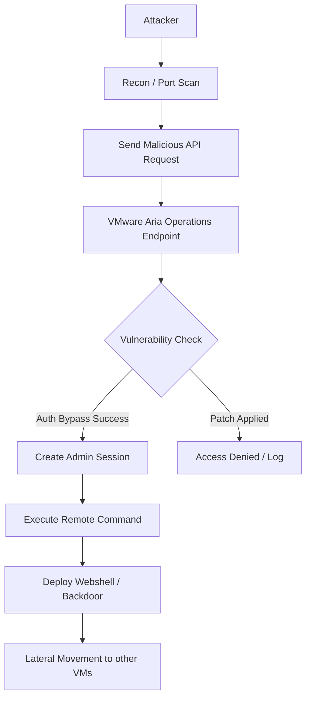

## 서론

새벽 3시, 보안 운영 센터(SOC)의 모니터를 비추는 붉은 경보등. 담당자가 확인해본 원인은 인프라 관리의 핵심인 VMware Aria Operations에서 발생한 이상 징후였습니다. 관리자 권한으로 승인되지 않은 원격 접속이 시도되었고, 민감한 설정 파일이 외부로 유출되었습니다. 이것은 단순한 시스템 오류가 아닙니다. CISA(미국 사이버 보안 및 인프라 보안국)가 "Known Exploited Vulnerabilities Catalog"에 등록하며 경고의 수준을 높인 VMware Aria Operations의 취약점은 현재 전 세계적으로 랜섬웨어 공격 그룹들의 주요 타겟이 되고 있습니다.

가상화된 데이터 센터의 '두뇌'와도 같은 Aria Operations가 장악당하면, 위험은 단일 서버의 컴프로미즈를 넘어 전체 인프라의 붕괴로 이어질 수 있습니다. 왜냐하면 이 솔루션은 모든 가상 머신, 스토리지, 네트워크 리소스를 통합 관리하는 God-view(전지적 시점) 권한을 가지고 있기 때문입니다. 오늘 우리는 이 치명적인 취약점의 기술적 원리와 실제 공격 시나리오, 그리고 무엇보다 중요한 즉각적인 대응 전략에 대해 심도 있게 다루고자 합니다. 이 글은 방어 목적을 위한 기술적 분석임을 밝힙니다.

## 본론

### 취약점의 기술적 배경과 공격 원리

최근 CISA의 경고 대상이 된 VMware Aria Operations의 취약점(주로 CVE-2023-34039로 알려진 유형 및 관련 인증 우회 결함)은 핵심적으로 **인증 및 권한 제어 메커니즘의 결함**을 야용합니다. 공격자는 복잡한 패스워드 크래킹 과정 없이, 특정 API 엔드포인트에 조작된 요청을 보냄으로써 관리자 세션을 탈취하거나 원격 코드 실행(RCE)을 유발할 수 있습니다.

일반적으로 Aria Operations는 수집기(Collector)와 마스터 노드 간의 통신, 그리고 웹 콘솔 접근을 위해 세션 토큰과 인증서를 사용합니다. 취약점이 존재하는 버전에서는 특정 직렬화(Serialization) 과정이나 요청 헤더 검증 로직이 불완전하여, 공격자가 악의적인 객체를 주입할 경우 시스템이 이를 무비판적으로 실행하게 됩니다.

**⚠️ 윤리적 경고**: 아래의 시나리오와 코드는 보안 강화 및 취약점 이해를 위한 학습 목적으로만 제공됩니다. 승인되지 않은 시스템에서의 테스트는 불법입니다.

### 공격 시나리오 시각화

공격자가 외부에서 인증 우회 취약점을 이용해 시스템 내부로 침투하고, 최종적으로 제어권을 장악하는 과정은 다음과 같습니다.



위 다이어그램에서 볼 수 있듯이, 공격의 핵심은 'D'에서 'E'로 가는 과정입니다. 시스템이 취약하다면 공격자는 F단계에서 즉시 관리자 권한을 획득하며, 이후 J단계에서 내부 네트워크 전체를 위협하는 횡적 이동(Lateral Movement)을 시도합니다.

### 취약점 분석 및 코드 예시

해당 취약점은 주로 REST API 호출 시 특정 파라미터의 검증을 우회하는 방식으로 동작합니다. 예를 들어, 사용자 권한을 확인하는 `casp` 또는 유사한 API 엔드포인트에 조작된 JSON 데이터를 전송하여 세션 쿠키를 조작하는 시나리오가 보고되었습니다.

다음은 연구 목적으로 작성된, 시스템이 해당 취약점에 대해 취약한 상태인지 확인하는 개념 증명(PoC) 스크립트의 예시입니다. 이 코드는 실제 익스플로잇을 수행하지 않고, 응답의 헤더나 상태 코드를 분석하여 패치 여부를 추론합니다.

```python
import requests
import sys

# 방어 목적의 취약점 진단 스크립트
def check_vulnerability(target_url):
    """
    VMware Aria Operations의 인증 우회 취약점 진단 함수
    """
    headers = {
        'User-Agent': 'SecurityScanner/1.0',
        'Content-Type': 'application/json'
    }
    
    # 취약한 엔드포인트로 의심되는 경로 (예시)
    # 실제 공격에서는 payload에 악의적인 객체가 포함될 수 있음
    endpoint = f"{target_url}/casp/api/v1/aaa/login"
    
    # 진단을 위한 더미 페이로드 (실제 공격 코드 아님)
    payload = {
        "username": "admin",
        "password": "test",
        "bypassLogic": "true" 
    }
    
    try:
        print(f"[*] Target: {target_url}")
        response = requests.post(endpoint, json=payload, headers=headers, verify=False, timeout=10)
        
        # 취약한 경우 일반적으로는 인증 실패(401/403)가 아닌
        # 서버 오류(500)나 비정상적인 200 OK 응답, 혹은 리다이렉트를 반환할 수 있음
        if response.status_code == 200 and "session_id" in response.text:
            print("[!] WARNING: System might be vulnerable or misconfigured!")
            print(f"    Response Status: {response.status_code}")
        else:
            print(f"[+] System appears patched (Status: {response.status_code})")
            
    except requests.exceptions.RequestException as e:
        print(f"[-] Connection Error: {e}")

# 주의: 테스트 시 반드시 자신의 환경에서만 실행하세요
# if __name__ == "__main__":
#     check_vulnerability("https://target-vrops-server.com")
```

이 코드는 단순한 예시이지만, 실제 공격자들은 이러한 로직을 발전시켜 `ysoserial` 같은 툴로 생성된 역직렬화 페이로드를 전송하여 OS 레벨의 명령어를 실행합니다.

### 영향 받는 버전 및 완화 조치 가이드

CISA는 연방 기관에 대해 특정 기한 내 패치 적용을 명령했습니다. 기업 보안 팀 역시 즉시 조치를 취해야 합니다. 아래는 주요 영향 버전과 대응 방안을 비교한 표입니다.

| 비교 항목 | 영향 받는 버전 (취약) | 권장 패치 버전 (안전) | 주요 대응 조치 | | :--- | :--- | :--- | :--- | | VMware Aria Operations | 8.x < 8.12 | 8.12 이상 | 최신 패치 적용 (VMSA-2023-002x 참조) | | VMware Aria Operations | 8.10, 8.6 등 특정 LTS | 8.10.2, 8.6.3 이상 | 취약점 해결된 누적 패치 설치 | | 네트워크 설정 | 외부 인터넷 노출 (DMZ) | 내부망 격리 / VPN 필수 | 관리 콘솔 인터넷 직접 접속 차단 | | 인증 방식 | 기본 패스워드 / 단일 요인 | MFA(다중 인증) 강제 | 관리자 계정 M 활성화 |

### 실무 적용을 위한 Step-by-Step 완화 가이드

패치 적용 전, 공격자의 침투 경로를 차단하기 위해 다음 단계들을 즉시 수행해야 합니다.

1.  **네트워크 분리 및 접근 제어**:     *   Aria Operations 웹 콘솔(기본 포트 443)이 인터넷에서 직접 접근되지 않도록 방화벽 룰을 수정하십시오.     *   특정 관리자 IP 대역만 허용하는 IP 화이트리스팅 정책을 적용합니다.

2.  **로그 및 IOCs 확인**:     *   ` /var/log/vmware/vcops/log/` 경로의 로그 파일을 분석하여 의심스러운 API 호출(`casp`, `suite-api`) 패턴을 찾으십시오.     *   알려 있는 무작위 사용자 생성 시도나 비정상적인 관리자 로그인 성공 기록이 있는지 점검합니다.

3.  **패치 적용 및 롤링 업데이트**:     *   VMware 포털에서 해당 VMSA(VMware Security Advisory)와 관련된 패치 파일을 다운로드합니다.     *   테스트 환경에서 패치 검증 후, 프로덕션 환경의 마스터 노드에 먼저 적용하고 데이터 노드 및 리모트 컬렉터 순으로 업데이트를 진행합니다.

4.  **자격 증명 순환**:     *   취약점이 노출되었던 기간 동안 시스템이 공격받았을 가능성을 대비해, 모든 관리자 및 DB 계정의 비밀번호를 변경하고 API 키를 재발급받으십시오.

## 결론

VMware Aria Operations의 이번 취약점 사태는 단순한 소프트웨어 버그 수정을 넘어선 '인프라 보안의 근본적인 재검토'를 요구합니다. 관리형 플랫폼은 편리함을 제공하지만, 동시에 해커들에게 있어 '사냥감의 가치'가 가장 높은 단일 실패 지점(Single Point of Failure)이 됩니다. CISA의 경고는 단순히 권고 사항이 아니라, 현재 진행형인 공격에 대한 경고음입니다.

전문가로서의 제언은 이렇습니다. 패치는 필수지만, 패치만으로는 부족할 수 있습니다. 관리자 계정의 강력한 MFA 도입, 관리 플랫폼의 네트워크 격리, 그리고 정기적인 제3자 보안 감사(Pentest)가 결합되었을 때 비로소 우리의 가화된 인프라는 안전해질 수 있습니다. 지금 당장 귀하의 Aria Operations 로그를 확인하고, 방화벽 설정이 온전한지 점검하시기 바랍니다.

### 참고자료

- [CISA Known Exploited Vulnerabilities Catalog](https://www.cisa.gov/known-exploited-vulnerabilities-catalog)

- [VMware Security Advisory (VMSA)](https://www.vmware.com/security/advisories.html)

- [NVD - National Vulnerability Database](https://nvd.nist.gov/)
