## 서론

새벽 3시, 모니터링 센터의 정적을 깨고 경보 알람이 울려 퍼집니다. 단순한 서버 다운이 아니라, 인프라 관리의 심장부인 VMware Aria Operations(旧 vRealize Operations)에서 발생한 이상 징후입니다. 관리자 콘솔을 장악한 공격자가 마치 자신의 데스크탑인 것처럼 명령어를 입력하고, 전체 클러스터의 리소스를 악성 스크립트 실행을 위해 독점하기 시작한 상황입니다.

이것은 단순한 가정이 아닙니다. 최근 VMware Aria 제품군에서 발견된 다중 취약점은 공격자가 별도의 인증 과정 없이도 시스템 내부로 침투하여 원격 코드 실행(RCE)을 할 수 있는 치명적인 경로를 제공합니다. 클라우드 환경에서 '관리 평면(Management Plane)'이 타격을 입으면, 그 피해는 가상 머신의 일부 마비에 그치지 않고 전체 비즈니스 연속성이 붕괴되는 재난으로 이어질 수 있습니다. 이 글에서는 이러한 VMware Aria의 취약점 체인이 어떻게 작동하는지 기술적으로 분석하고, 여러분의 인프라를 악몽에서 구원할 실질적인 대응 전략을 제시합니다.

> **⚠️ 윤리적 경고**: 본 문서에 포함된 기술적 내용과 코드는 보안 연구 및 방어 목적(Defensive Security)으로만 제공됩니다. 승인 없는 시스템 접근이나 공격 시도는 불법이며 엄격히 금지됩니다.

---

## 본론

### 공격 체인 분석: 인증 우회에서 RCE까지

VMware Aria의 최근 취약점들은 단일 결함이 아닌, 여러 취약점이 사슬처럼 연결되어(Chained Exploits) 악용된다는 특징이 있습니다. 공격자는 주로 특정 엔드포인트의 인증 논리를 우회하는 취약점을 이용해 시스템에 진입한 뒤, 역직렬화(Deserialization) 취약점을 트리거하여 권한 상승 및 코드 실행을 이끌어냅니다.

이 공격 흐름을 시각화하면 다음과 같습니다.

```mermaid
graph LR
    Attacker[External Attacker] --> HTTP[Malicious HTTP Request]
    HTTP --> Gateway[Aria Gateway / Log Collector]
    Gateway --> AuthBypass[Authentication Bypass Vulnerability]
    AuthBypass --> Logic[Business Logic Layer Access]
    Logic --> Deserialize[Unsafe Deserialization Vulnerability]
    Deserialize --> Payload[Malicious Gadget Chain]
    Payload --> RCE[Remote Code Execution]
    RCE --> Shell[Reverse Shell / System Compromise]
```



이 다이어그램에서 볼 수 있듯, **Auth Bypass(인증 우회)**는 문을 여는 열쇠 역할을 하며, **Unsafe Deserialization(안전하지 않은 역직렬화)**은 실제 폭탄을 터뜨리는 도화선 역할을 합니다. 공격자는 복잡한 자격 증명 크래킹 과정 없이, 잘 조작된 패킷 하나로 이 모든 과정을 수행할 수 있습니다.

### 취약점 상세 비교

VMware Aria에 영향을 미치는 주요 취약점들은 CVE 식별자에 따라 그 성격과 영향도가 다릅니다. 하지만 공격자의 관점에서 이들은 서로 보완적인 관계에 있습니다.

| 취약점 유형 | 주요 원인 | 공격 벡터 | 영향도 | | :--- | :--- | :--- | :--- | | **인증 우회 (Authentication Bypass)** | 잘못된 구현된 세션 관리 또는 JWT 검증 로직 | 네트워크 인접 (Adjacent Network) | 높음 (High) - 시스템 진입 가능 | | **역직렬화 취약점 (Deserialization)** | 신뢰할 수 없는 데이터의 Java 객체 역직렬화 허용 | 로컬 또는 인증된 상태 | 매우 높음 (Critical) - 코드 실행 가능 | | **경로 조작 (Path Traversal)** | 사용자 입력값의 필터링 미흡 | 네트워크 인접 | 중간 (Medium) - 정보 노출 |

### 기술적 원리 및 PoC 분석

이번 취약점의 핵심은 Java 환경에서 흔히 발생하는 **역직렬화(Deserialization)** 취약점입니다. 애플리케이션이 사용자로부터 전달받은 직렬화된 데이터(바이트 스트림)를 복구하는 과정에서, 공격자가 악의적인 객체(Gadget Chain)를 주입하면, 이 객체가 역직렬화되는 순간 `readObject()` 메서드가 트리거되어 악성 코드가 실행되는 원리입니다.

다음은 공격자가 타겟 서버의 취약점을 점검하기 위해 사용할 수 있는 개념 증명(PoC) 코드의 예시입니다. (실제 익스플로잇 페이로드는 생략되었으며, 요청 구조를 이해하는 데 초점을 둡니다.)

```python
import requests
import base64

# ⚠️ 주의: 이 코드는 연구 목적이며, 승인되지 않은 시스템에서 실행하는 것은 불법입니다.
TARGET_URL = "https://vcenter-aria.example.com/suite-api/api/auth/token"

# 예시용 악성 시리얼라이즈드 데이터 (실제 공격에서는 ysoserial 등으로 생성된 바이트 배열 사용)
# 일반적인 Java 역직렬화 공격은 특정 라이브러리 의존성을 활용하는 Gadget Chain을 사용합니다.
# 여기서는 설명을 위해 더미 문자열을 base64로 인코딩한 형태를 보여줍니다.
dummy_payload = "rO0ABXNyAB... (생략) ...SrAA=="

headers = {
    "User-Agent": "Mozilla/5.0 (Compatible; SecurityScanner)",
    "Content-Type": "application/octet-stream"
}

try:
    # 취약한 엔드포인트에 POST 요청 전송
    response = requests.post(TARGET_URL, data=dummy_payload, headers=headers, verify=False, timeout=10)
    
    if response.status_code == 200:
        print("[+] 서버가 요청을 수신했습니다. 취약점이 존재할 수 있습니다.")
        print(f"[+] 응답 헤더: {response.headers}")
    else:
        print(f"[-] 요청이 거부되었습니다. 상태 코드: {response.status_code}")

except requests.exceptions.RequestException as e:
    print(f"[!] 네트워크 오류 발생: {e}")
```

위 코드는 매우 단순화된 예시이지만, 실제 공격에서는 공격자가 **ysoserial**과 같은 도구를 사용하여 Apache Commons Collections 또는 기타 VMware Aria가 의존하는 라이브러리의 Gadget Chain을 생성한 뒤, 이를 HTTP 요청 바디에 삽입하여 전송합니다.

### 단계별 완화 및 대응 가이드

이론적인 분석만으로는 보안을 지킬 수 없습니다. 다음은 현장에서 즉시 적용 가능한 단계별 대응 프로세스입니다.

1.  **취약점 진단 및 버전 확인**     *   VMware Aria Operations, Aria Operations for Logs, Aria Automation 등의 제품 버전을 확인합니다. 영향을 받는 버전(VMware Security Advisory VMSA-XXXX-XXXX 참조)인지 즉시 확인해야 합니다.

2.  **네트워크 격리 (Containment)**     *   패치 적용 전까지 관리 콘솔(Aria)에 대한 외부 접근을 차단합니다. 내부 네트워크에서도 접근 IP를 제한하는 화이트리스트 방식을 적용합니다.

3.  **긴급 패치 적용 (Patching)**     *   VMware에서 제공하는 최신 패치(Update 또는 Patch)를 다운로드하여 적용합니다. 패치 적용 시에는 반드시 스냅샷(Snapshot)을 찍어 롤백 계획을 마련해야 합니다.

4.  **자격 증명 순환 (Credential Rotation)**     *   취약점이 노출되었던 기간 동안 시스템이 이미 탈취되었을 가능성을 배제할 수 없습니다. 패치 후에는 Aria에 연동된 모든 관리자 계정의 비밀번호를 변경하고, API 키를 재발급받아야 합니다.

5.  **로그 분석 및 포렌식 (Forensics)**     *   시스템 로인 `/var/log/vmware/` 경로 등에서 의심스러운 로그인 시도나 `java.io.ObjectInputStream` 관련 예외 로그가 없는지 면밀히 분석합니다.

---

## 결론

VMware Aria 제품군의 다중 취약점은 단순한 소프트웨어 버그가 아닌, 현대의 클라우드 인프라 관리 체계가 얼마나 민감한지를 보여주는 결정적인 사례입니다. 공격자는 복잡한 무력이 아닌, 잘못 구성된 인증 논리와 신뢰할 수 없는 데이터 처리 방식이라는 '틈'을 노려 전체 시스템을 장악합니다.

이번 사태를 통해 얻을 수 있는 전문가의 인사이트는 단 하나입니다. **"관리 평면은 가장 강력하게 방어되어야 하는 곳이지만, 동시에 가장 간과되기 쉬운 표적이다."** 관리자 도구라고 해서 내부망에 방치하지 마십시오. 이러한 솔루션은 마치 "은행의 금고"와 같습니다. 금고 문이 잠겨 있다고 해서 보안이 끝난 것이 아니라, 금고 문을 부수려는 시도를 실시간으로 감시하고, 금고 자체를 최신 상태로 유지하는 것이 진정한 보안입니다.

지금 당장 귀하의 VMware Aria 버전을 확인하고, 업데이트가 대기 중인지 확인하십시오. 인프라의 안전은 당신의 키보드 입력 몇 번에 달려 있습니다.

### 참고자료

- [VMware Security Advisories](https://www.vmware.com/security/advisories.html)

- [NVD - National Vulnerability Database](https://nvd.nist.gov/)

- [OWASP Deserialization Cheat Sheet](https://cheatsheetseries.owasp.org/cheatsheets/Deserialization_Cheat_Sheet.html)
