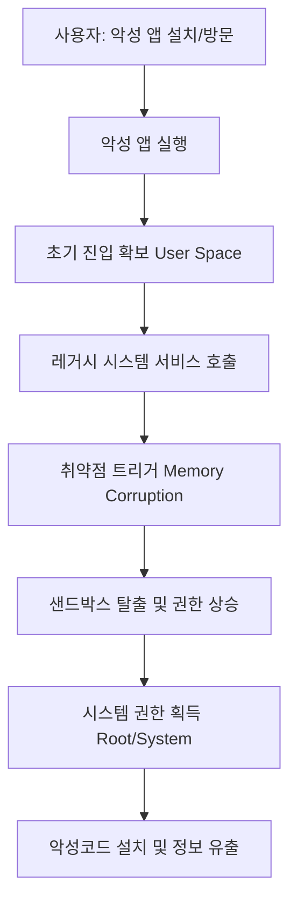

## 서론

2007년, 스티브 잡스가 첫 아이폰을 발표했을 때의 기억이 나십니까? 당시 iOS는 그저 '전화를 걸고 음악을 듣는' 혁신적인 OS였습니다. 하지만 그 시절의 코드 조각들이 17년이 지난 지금까지 현대적인 아이폰 내부에 살아 숨 쉬고 있다는 사실을 아십니까?

최근 Apple은 거의 20년 동안 iOS의 핵심 시스템 깊은 곳에 잠복해 있던 제로데이(Zero-Day) 취약점을 패치했습니다. 이 소식은 보안 전문가들에게 큰 충격을 주었습니다. 20년이라는 시간은 IT 업계에서 거의 '지질학적 시대'와도 같습니다. 그 사이 수많은 보안 메커니즘이 추가되었고, 32비트 아키텍처에서 64비트 아키텍처로 완전히 교체되었음에도 불구하고, 이 취약점은 살아남았습니다.

우리가 이 취약점에 주목해야 하는 이유는 단순히 오래되었다는 점이 아닙니다. 이는 **"보안의 기술적 부채(Technical Debt)"**가 얼마나 치명적인지를 적나라하게 보여주는 사례입니다. 공격자가 이러한 레거시 코드를 악용한다면, 최신의 방어 기술(Sandbox, Code Signing 등)을 뚫고 시스템의 최고 권한(Root)을 탈취할 수 있습니다. 오늘 우리는 이 고대급 취약점의 기술적 원리와 실제 공격 시나리오를 분석하며, 방어 전략을 수립해 보겠습니다.

> **⚠️ 윤리적 경고**: 본문에 포함된 모든 기술적 분석 및 코드 예시는 오직 방어 목적과 보안 연구를 위해 제공됩니다. 이를 악용하여 타인의 시스템을 공격하는 행위는 불법이며 엄중히 처벌될 수 있습니다.

## 본론

### 취약점의 기술적 배경: 레거시 코드의 저주

해당 취약점은 iOS의 초기 버전(혹은 그 모태인 macOS)부터 존재해 온 핵심 시스템 서비스, 특히 **권한 부여(Policy)나 인터페이스 통신(XPC) 처리** 로직 내의 논리적 오류(Logic Flaw)에서 기인한 것으로 추정됩니다.

현대의 iOS는 강력한 샌드박스(Sandbox)로 애플리케이션을 격리합니다. 하지만 시스템 서비스 간의 통신이나, 사용자 공간(User Space)에서 커널 공간(Kernel Space)으로 데이터가 전달되는 경로에는 레거시 호환성을 위해 남겨진 예전 코드들이 존재하기 마련입니다. 공격자는 이러한 구식 API를 호출하거나, 특정 형식의 데이터를 전송하여 20년 전 설계된 예외 처리 루틴을 트리거할 수 있습니다.

이 취약점의 핵심 메커니즘은 **"TOCTOU (Time-of-Check to Time-of-Use)"** 혹은 **"Type Confusion"**과 유사한 패턴일 가능성이 높습니다. 시스템이 객체의 권한을 검사하는 시점과 실제로 그 객체를 사용하는 시점 사이의 간격을 노리거나, 서로 다른 데이터 타입을 커널이 잘못 해석하도록 유도하여 메모리 손상을 야기하는 것입니다.

### 공격 시나리오 및 흐름도

공격자가 이 취약점을 악용하여 시스템 권한을 탈취하는 과정은 일반적으로 다음과 같이 진행됩니다. 먼저 사용자가 악성 앱을 설치하거나 피싱 링크를 클릭하여 초기 진입(FOGO - First Ob/Gyn, 첫 발판)을 확보합니다. 이후 샌드박스 탈출을 위해 레거시 취약점을 트리거합니다.

다음은 이러한 공격 흐름을 단순화한 다이어그램입니다.



이 흐름에서 가장 중요한 단계는 `D`와 `E`입니다. 현대의 보안 장비는 최신 공격 기법을 잘 탐지하지만, 20년 전의 정상적인 것처럼 보이는 시스템 호출은 의심하지 않는 경우가 많습니다.

### 개념 증명(PoC) 코드 분석

방어 목적으로, 해당 취약점이 어떻게 트리거될 수 있는지 보여주는 개념적 코드를 작성해 보겠습니다. (실제 CVE 코드와 구체적인 메모리 주소는 보안상 생략하며, 메커니즘만 설명합니다.)

가령, 시스템 내부의 특정 포트(Port)에 잘못된 메시지 형식을 전송하여 커널 패닉이나 임의 코드 실행을 유도하는 시나리오를 가정해 봅시다.

```c
// vulnerable_legacy_service.c
// 학습 및 방어 목적의 개념 증명 코드입니다.

#include <mach/mach.h>
#include <stdio.h>

// 레거시 커널 확장과 통신하기 위한 구조체 (20년 전 정의)
struct legacy_params {
    int magic_number;   // 0x1337 (검증용)
    void* data_ptr;     // 전달할 데이터 주소
    size_t data_size;   // 데이터 크기
};

// 취약한 함수 호출 시뮬레이션
void exploit_legacy_logic() {
    struct legacy_params params;
    
    // 1. 매직 넘버 설정 (검증 통과용)
    params.magic_number = 0x1337;
    
    // 2. 악의적인 데이터 주소 설정
    // 공격자는 커널 메모리 영역 내의 특정 주소를 가리키도록 조작할 수 있음
    // 여기서는 예시로 NULL 포인터 가까운 주소를 가정
    params.data_ptr = (void*)0xdeadbeef; 
    params.data_size = 1024;

    // 3. 시스템 호출 (Trap)
    // 내부적으로 권한 검사(Check)와 데이터 사용(Use) 사이에 경쟁 조건이 있거나,
    // Type Confusion이 발생하여 data_size가 잘못 해석됨.
    kern_return_t kr = io_connect_method(
        connection_port, 
        0x100, // 레거시 메서드 셀렉터
        (uint64_t*)&params, 
        sizeof(params) / sizeof(uint64_t),
        NULL, 
        0
    );

    if (kr == KERN_SUCCESS) {
        printf("공격 성공: 권한 상승 가능성
");
    } else {
        printf("공격 실패: 오류 코드 %d
", kr);
    }
}
```

이 코드는 매우 단순화되었지만, **"검증 로직은 우회하거나 통과한 뒤, 잘못된 파라미터를 커널에 주입하여 메모리 구조를 망가뜨린다"**는 핵심 아이디어를 보여줍니다.

### 방어 기법 비교: 과거 vs 현재

이 취약점이 20년 동안 살아남을 수 있었던 이유는 무엇일까요? 당시의 보안 환경과 지금의 환경을 비교해 보면 그 이유를 명확히 알 수 있습니다.

| 보안 기법 | 2000년대 중반 (취약점 탄생 시점) | 2020년대 (현재) | | :--- | :--- | :--- | | **메모리 보호** | NX Bit, DEP 등 초기 단계만 존재 | 하드웨어 강제 PAC(Pointer Authentication Codes), KASLR | | **Sandbox** | 거의 없거나 매우 느슨한 격리 | 강력한 프로필 기반 샌드박스 (모든 앱 격리) | | **코드 서명** | 없음 (자유로운 코드 실행 가능) | 강력한 코드 서명 (서명되지 않은 코드 실행 불가) | | **커널 보호** | 단순한 권한 레벨 분리 (User/Kernel) | KTRR (Kernel Text Read-Only), 커널 쓰기 방지 |

비록 표의 오른쪽과 같이 현대의 iOS는 철옹성 같지만, **"호환성(Compatibility)"**이라는 이름의 뒷문은 종종 열려 있습니다. 20년 전에 작성된 코드는 위의 '현대' 기법들이 적용되기 이전의 논리를 따를 수 있으며, 이를 현대적인 래퍼(Wrapper)로 감싸는 것만으로는 근본적인 결함을 없앨 수 없습니다.

### 실무적 대응 가이드

보안 관리자 및 사용자는 다음 단계를 즉시 수행해야 합니다.

1.  **즉시 업데이트 수행**: Apple이 배포한 최신 보안 패치(iOS 17.x 혹은 해당 버전 이상)로 즉시 업데이트해야 합니다. 이 취약점은 이미 Zero-Day로 확인되었으므로, 실제 공격이 발생했을 가능성이 높습니다. 2.  **애플리케이션 허용 목록 검토**: 만약 기업 내에서 탈옥(Jailbreak) 기기나 구형 iOS를 사용하는 기기가 있다면 즉시 네트워크에서 격리해야 합니다. 3.  **엔드포인트 탐지 로그 확인**: 최신 EDR(Endpoint Detection and Response) 솔루션이 있다면, 최근 발생한 비정상적인 시스템 호출 혹은 `kernel_task`의 비정상적인 메모리 접근 시도를 검토하십시오.

## 결론

20년간 잠복해 있던 이 iOS Zero-Day 취약점은 우리에게 중요한 교훈을 남깁니다. **"새로운 기술을 도입하는 것도 중요하지만, 레거시 코드를 청소하는 '기술적 위생'이 그에 못지않게 중요하다"**는 것입니다.

Apple의 빠른 패치는 긍정적이지만, 앞으로도 유사한 고대 취약점들이 터져 나올 가능성은 충분합니다. iOS는 이제 맥OS와의 공통 코드베이스(Apple Silicon)를 공유하게 되면서, 더 많은 레거시 코드가 서로 영향을 주고받게 되었습니다. 보안 전문가로서, 우리는 단순히 패치를 적용하는 것을 넘어, 시스템의 깊은 곳에 묻혀있는 코드의 뿌리를 계속해서 들여다보는 경계심을 가져야 합니다.

결국 가장 강력한 보안은 최신의 기술이 아니라, **"오래된 것을 의심하는 태도"**에서 나옵니다. 지금 바로 기기의 업데이트를 확인하십시오.

### 참고자료

- [Apple Security Updates](https://support.apple.com/ko-kr/HT201222)

- [CPO Magazine - Original Article](https://www.cpomagazine.com/)

- [OWASP Top 10 - Legacy System Security](https://owasp.org/)
