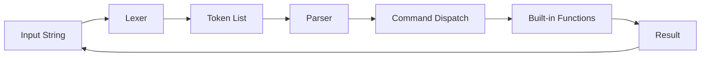
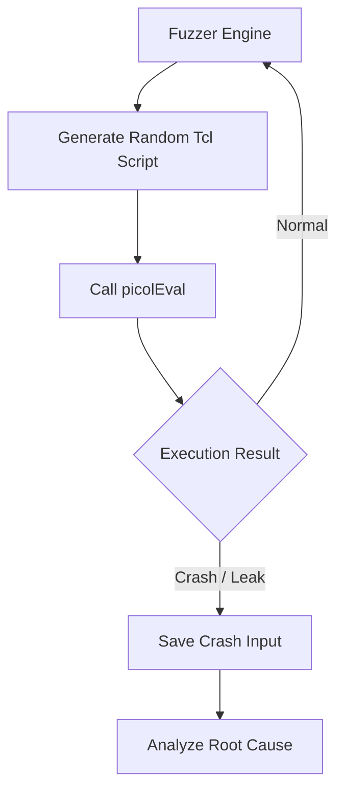

## 서론

임베디드 장비나 특수 목적의 IoT 기기에서 펌웨어 분석을 진행할 때, 우리는 종거 거대하고 복잡한 코드 베이스 앞에서 무력감을 느낍니다. 특히 런타임 환경에서 스크립트 엔진이 내장되어 있는 경우, 그 복잡도는 기하급수적으로 늘어납니다. 수만 줄의 파서와 수천 개의 내장 함수로 뒤덮인 인터프리터의 동작을 완벽하게 이해하고 취약점을 찾아내는 것은 난공불락의 요새를 공격하는 것과 같습니다.

바로 이 지점에서 **'picol'**이 등장합니다. Redis의 창시자인 Salvatore Sanfilippo(antirez)가 발표한 이 프로젝트는 단 **500줄의 C 코드**로 Tcl(Tool Command Language) 인터프리터의 핵심 기능을 구현했습니다. 보안 전문가 입장에서 picol은 단순한 장난감이 아닙니다. 이것은 인터프리터의 가장 원초적인 형태, 즉 문자열을 입력받아 토큰으로 분리하고, 파싱하여 명령을 실행하는 메커니즘을 가장 단순한 형태로 관찰할 수 있는 '완벽한 실험체'입니다. 복잡한 오픈소스를 감사하기 전에, picol을 통해 언어 처리 엔진의 기본 동작 원리를 이해하는 것은 보안 감사 역량을 강화하는 훌륭한 전략입니다. 이 글에서는 picol의 내부 구조를 해부하고, 이 초경량 인터프리터가 어떻게 동작하는지, 그리고 보안적으로 어떤 시사점을 주는지 분석하겠습니다.

---

## 본론

### 인터프리터의 핵심: 파싱과 실행의 루프

모든 인터프리터 언어의 공통점은 **"모든 것은 문자열이다"**라는 철학에서 시작됩니다(특히 Tcl의 경우). 사용자가 입력한 코드는 인터프리터 입장에서 그저 긴 문자열일 뿐입니다. picol은 이 문자열을 공백(Space)을 기준으로 잘게 쪼개(Lexer/Tokenizing), 리스트(List) 형태로 구조화한 뒤, 첫 번째 토큰을 '명령어(Command)'로 인식하여 실행(Evaluation)합니다.

이 과정을 시각화하면 다음과 같습니다. 복잡한 최적화나 JIT 컴파일 과정 없이, 직관적인 텍스트 처리 흐름을 볼 수 있습니다.



보안 관점에서 가장 중요한 단계는 **A에서 C로 가는 과정(토큰화)**과 **E(명령어 디스패치)**입니다. 입력값이 적절히 검증되지 않으면 공격자는 의도하지 않은 토큰을 주입하여 흐름을 조작할 수 있습니다. picol의 코드는 이 흐름이 `picolParse()` 함수라는 단일 진입점을 통해 어떻게 처리되는지 명확히 보여줍니다.

### 코드 분석: 파싱 로직의 작동 원리

picol의 소스 코드(`picol.c`) 중 핵심적인 파싱 로직을 간소화하여 살펴보겠습니다. 아래 코드는 C 언어로 작성된 picol의 메인 루프 중 일부를 발췌한 것입니다.

```c
// picol의 간단한 파싱 및 실행 로직 개념도
int picolEval(picolInterp *i, char *txt) {
    // 1. 토큰화: 공백을 기준으로 문자열을 쪼갬
    while (*txt) {
        // 공백 건너뛰기
        while (isspace(*txt)) txt++;
        if (*txt == '\0') break;
        
        // 토큰 추출
        char *start = txt;
        while (*txt && !isspace(*txt)) txt++;
        int len = txt - start;
        
        // 리스트에 토큰 추가
        picolSetVar(i, "argv", start, len); 
        
        // 2. 실행: 첫 번째 토큰을 명령어로 찾음
        if (argc == 0) {
            cmd = picolGetCommand(i, start);
            if (!cmd) return ERR_NOT_FOUND;
            argc++;
        } else {
            // 인자 처리
            argv[argc++] = start;
        }
    }
    
    // 3. 명령어 실행 함수 호출
    return cmd->proc(i, argc, argv);
}
```

이 코드는 보안 감사 시 집중해야 할 포인트를 명확히 보여줍니다. 1.  **버퍼 오버플로우(Buffer Overflow) 위험성**: `txt` 포인터를 증가시키며 문자열을 순회하는데, 문자열의 끝(`\0`)을 제대로 확인하지 않거나 길이 체크가 없다면 힙이나 스택 메모리를 침범할 수 있습니다. 2.  **인자 검증(Arg Validation)**: `proc` 함수로 넘어가기 전에 인자의 개수나 타입을 엄격하게 검사하지 않으면, `set` 명령어와 같은 내장 함수에서 메모리 손상이 발생할 수 있습니다.

### 공격 시나리오: 간단한 인터프리터에서의 잠재적 취약점

> **⚠️ 보안 경고**: 다음 내용은 보안 연구 및 방어 목적으로 작성되었습니다. 악의적인 목적으로 사용하는 것은 엄격히 금지됩니다.

초경량 인터프리터인 picol조차, 형식 검사(Form Validation)가 부족하다면 쉽게 무너질 수 있습니다. 예를 들어, picol의 `set` 명령어(변수 할당)를 구현할 때 값을 복사하는 로직이 다음과 같다고 가정해 봅시다.

```c
// 취약한 변수 할당 함수 (PoC)
int picolCmdSet(picolInterp *i, int argc, char **argv) {
    char *varname = argv[1];
    char *value = argv[2];
    
    // 버퍼 사이즈 검증 없이 복사 -> Stack Buffer Overflow 유발 가능성
    strcpy(i->result, value); 
    return PICOL_OK;
}
```

만약 공격자가 다음과 같은 입력을 인터프리터에 전달한다면 어떻게 될까요?

```text
set target "AAAA...AAAA(1000개)" ;# 버퍼 크기보다 훨씬 긴 문자열
```

`strcpy`는 null 터미네이터를 만날 때까지 복사하므로, `i->result` 버퍼를 넘처서 리턴 주소(Return Address)를 덮어쓸 수 있습니다. 이는 **RCE(Remote Code Execution)**로 이어질 수 있는 가장 전형적인 스택 오버플로우 취약점입니다. 실제 상용 인터프리터(Lua, Python 등)도 이러한 기본적인 파싱 및 데이터 처리 단계에서 힙 오버플로우나 Use-After-Free 같은 취약점이 종종 발견됩니다.

### 복잡도 비교: 왜 Minimalism이 보안에 중요한가?

대규모 프로젝트에서 보안 감사를 수행할 때 코드의 양은 적대적 요소입니다. picol과 같은 최소한의 구현체를 분석하는 것은, 거대한 코드베이스의 공격 표면을 이해하는 데 도움을 줍니다.

| 비교 항목 | picol (Tcl 구현체) | 표준 Tcl (Tcl/Tk 8.6) | Python 3.11 | | :--- | :--- | :--- | :--- | | 코드 라인 수 (LOC) | 약 500줄 (C) | 약 150,000줄 (C) | 약 350,000줄 (C) | | 핵심 기능 | 파싱, 기본 명령어 실행 | 파싱, 고급 I/O, GUI, 네트워킹 | 파싱, GC, 풍부한 표준 라이브러리 | | 공격 표면 (Attack Surface) | 낮음 (제한된 명령어 세트) | 높음 (다양한 서브시스템 상호작용) | 매우 높음 (복잡한 내부 오브젝트 모델) | | 보안 감사 난이도 | 단순 (단일 파일 분석 가능) | 어려움 (다중 모듈 간 상호 의존성) | 매우 어려움 (VM, JIT, GC 로직 이해 필요) |

위 표처럼, picol은 언어 인터프리터가 가져야 할 **'꼭 필요한 뼈대'**만 보여줍니다. 보안 연구원이나 개발자는 이 꼭대기 수준의 코드를 통해, 복잡한 최신 언어 엔진 내부에서 발생하는 취약점의 근본적인 원인(문자열 처리, 메모리 관리, 재귀 호출 등)을 파악할 수 있습니다.

### 실무 적용 가이드: Fuzzing을 통한 취약점 탐지

picol을 사용하여 인터프리터 퍼저(Fuzzer)를 작성하고 테스트하는 방법은 다음과 같습니다. 이는 보안 진단 도구 개발에 대한 아이디어를 제공합니다.

1.  **타겟 래핑(Wrapping)**: picol의 `picolEval` 함수를 라이브러리화하여 외부에서 입력을 받을 수 있도록 만듭니다. 2.  **랜덤 입력 생성**: AFL(American Fuzzy Lop)이나 LibFuzzer와 같은 도구를 사용하여 무작위의 Tcl 스크립트 문자열을 생성합니다. 3.  **예외 처리 후킹**: `picolEval` 내부의 메모리 할당/해제 함수를 후킹하여, 크래시(Crash)나 메모리 누수(Memory Leak)가 발생하는 지점을 감지합니다.

**Step-by-step 퍼징 시나리오:**



이 과정을 통해 우리는 "정상적인 문법"뿐만 아니라 "문법을 위반하는 엉뚱한 입력"을 주입했을 때 인터프리터가 어떻게 반응하는지 테스트할 수 있습니다. picol은 코드가 짧기 때문에 크래시가 발생했을 때 원인 분석이 매우 용이합니다.

---

## 결론

Redis 창시자가 공개한 `picol`은 단순히 "작은 프로그램"을 넘어선 **교육용이자 보안 분석용 훌륭한 레퍼런스**입니다. 500줄이라는 압도적으로 적은 코드 안에는 현대의 모든 인터프리터가 가진 핵심적인 딜레마와 메커니즘이 고스란히 담겨 있습니다.

보안 전문가로서 picol을 분석하면서 얻은 핵심 인사이트는 **"단순함(Simplicity)은 보안의 가장 강력한 무기 중 하나"**라는 것입니다. 코드가 짧아진다는 것은 검증해야 할 로직이 줄어든다는 뜻이며, 이는 잠재적 버그와 취약점이 숨을 수 있는 공간이 줄어든다는 것을 의미합니다. 하지만 동시에, 아주 작은 코드 내의 단 하나의 `strcpy`나 `malloc` 실수가 치명적인 시스템 장애로 이어질 수 있다는 경각심도 심어줍니다.

임베디드 환경이나 제한된 리소스 환경에서 런타임 엔진을 구축해야 한다면, 과도한 기능 추가보다는 picol처럼 **필수적인 기능만 완벽하게 구현하고 그 견고함을 입증하는 방식**을 고려해야 합니다. 이것이 "코드 500줄"이 우리에게 주는 진정한 교훈입니다.

**참고자료**:

- [picol GitHub Repository](https://github.com/antirez/picol)

- [Tcl Language Specification](https://www.tcl.tk/man/tcl8.6/TclCmd/contents.htm)

- [Secure Coding in C and C++ (Robert Seacord)](https://www.pearson.com/en-us/subject-catalog/p/secure-coding-in-c-and-c/P200000003350/9780321822130)
