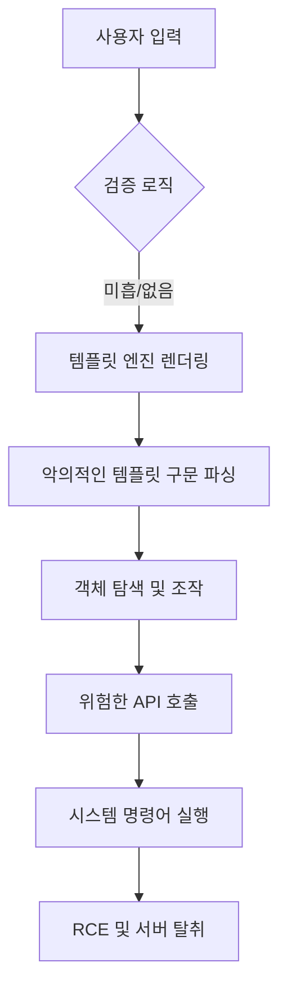

# SSTI 공격 기법과 완화 전략

Server-Side Template Injection(SSTI)는 최근 웹 애플리케이션에서 가장 위험한 취약점 중 하나로 부상하고 있습니다. 본 글에서는 템플릿 엔진의 작동 원리와 사용자 입력이 필터링되지 않을 때 발생하는 취약점의 메커니즘을 심층적으로 분석합니다. 또한, 실제 공격 시나리오와 PoC 코드를 통해 단순한 주입이 원격 코드 실행(RCE)으로 이어지는 과정을 단계별로 설명합니다. 마지막으로, 개발자와 보안 담당자가 즉시 적용할 수 있는 구체적인 완화 조치와 모범 사례를 제시하여 시스템의 안전성을 확보하는 방안을 제시합니다.

## 개요 (Introduction)

현대의 웹 개발은 동적인 콘텐츠 생성을 위해 Jinja2, Twig, FreeMarker와 같은 서버 사이드 템플릿 엔진을 필수적으로 사용합니다. 이러한 엔진은 비즈니스 로직과 프레젠테이션 계층을 효과적으로 분리하여 개발 생산성을 높이는 역할을 하지만, 잘못된 사용법은 치명적인 보안 허점이 될 수 있습니다. SSTI(Server-Side Template Injection)는 공격자가 템플릿 구문을 악용하여 서버 측에서 임의의 코드를 실행할 수 있는 취약점입니다. 이는 단순한 XSS(Cross-Site Scripting)와 달리 서버의 시스템 권한을 탈취할 수 있어 그 파급력이 매우 큽니다. 본문에서는 이러한 취약점이 발생하는 배경과 이를 악용한 공격의 기술적 원리를 상세히 다루고자 합니다.

## 기술적 분석 (Technical Analysis)

SSTI 취약점의 핵심은 템플릿 엔진이 '데이터(Data)'와 '코드(Code)'를 명확히 구분하지 못하는 지점에서 발생합니다. 일반적으로 템플릿 엔진은 `{{ variable }}` 또는 `${ variable }`과 같은 특정 구문을 통해 변수를 해석합니다. 만약 개발자가 사용자의 입력 값을 검증 없이 템플릿 렌더링 함수로 전달한다면, 공격자는 악의적인 템플릿 구문을 주입하여 엔진의 내부 객체나 함수에 접근할 수 있습니다.

특히, 파이썬 기반의 Jinja2나 Java 기반의 Velocity 같은 엔진에서는 객체 지향 언어의 특성을 이용해 상위 클래스(Superclass)나 내장 함수(Built-ins)에 접근하는 '샌드박스 이스케이프(Sandbox Escape)' 기법이 주로 사용됩니다. 공격자는 템플릿 문맥(Context) 내에서 `__class__`, `__mro__`, `__subclasses__`와 같은 매직 메서드를 사용하여 런타임 환경의 제약을 우회하고, 결국 `os` 모듈이나 `subprocess` 모듈을 통해 시스템 명령어를 실행하는 경로를 탐색합니다.

아래 다이어그램은 사용자 입력이 검증 없이 템플릿 엔진으로 전달되어 원격 코드 실행으로 이어지는 공격 흐름을 시각화한 것입니다.



## 실제 공격 예시 (Attack Example)

구체적인 시나리오를 살펴보기 위해 Flask 프레임워크와 Jinja2 템플릿 엔진을 사용하는 환경을 가정해 보겠습니다. 애플리케이션에 `render_template_string` 함수를 통해 사용자의 입력을 그대로 화면에 출력하는 기능이 존재한다고 가정합니다.

공격자는 가장 먼저 취약점 존재 여부를 확인하기 위해 수학적 연산을 포함한 페이로드를 전송합니다.

```python
# 테스트 페이로드
GET /search?name={{7*7}}
```

서버가 응답으로 `49`를 반환한다면, 사용자의 입력이 템플릿 엔진에 의해 해석되었음을 의미하며 SSTI 취약점이 확인됩니다. 이제 공격자는 파이썬 객체의 체인을 타고 올라가 시스템 명령어를 실행하는 페이로드를 작성합니다.

```python
# 공격 페이로드 (PoC)
{{ ''.__class__.__mro__[1].__subclasses__()[104].__init__.__globals__['sys'].modules['os'].popen('ls -la').read() }}
```

이 코드의 작동 원리는 다음과 같습니다:
1.  `''.__class__`: 빈 문자열 객체의 클래스를 가져옵니다.
2.  `__mro__[1]`: Method Resolution Order(MRO)를 통해 상위 클래스인 `object`에 접근합니다.
3.  `__subclasses__()`: `object` 클래스를 상속받은 모든 자식 클래스 리스트를 반환합니다.
4.  `[104]`: 해당 리스트에서 `warnings.catch_warnings` 또는 파일 입출력과 관련된 클래스 인덱스를 찾습니다(환경에 따라 인덱스는 상이할 수 있음).
5.  `__init__.__globals__`: 클래스의 전역 변수 네임스페이스에 접근하여 `sys` 모듈과 `os` 모듈을 로드합니다.
6.  `popen('ls -la').read()`: 리눅스 서버의 파일 목록을 읽어와 웹 페이지에 출력합니다.

이러한 공격은 성공 시 공격자에게 서버의 셸 접근 권한을 제공하여 데이터 유출, 랜섬웨어 설치, 내부 네트워크 침킹 등 심각한 피해를 야기할 수 있습니다.

## 완화 조치 (Mitigation)

SSTI 취약점을 방어하기 위해서는 다층적인 보안 접근이 필요합니다. 가장 효과적인 즉시 적용 가능한 조치는 사용자 입력을 템플릿 엔진으로 전달하기 전에 철저히 검증하고, 불필요한 기능을 비활성화하는 것입니다.

1.  **입력 검증과 샌티제이션(Sanitization)**: 사용자 입력 값에 템플릿 구문으로 사용되는 특수문자(`{}`, `%`, `$`, `#` 등)가 포함되어 있는지 엄격하게 필터링해야 합니다. 화이트리스트(White-list) 방식을 통해 허용된 문자만 통과시키는 것이 블랙리스트보다 안전합니다.
2.  **사용자 입력을 템플릿으로 전달 지양**: 렌더링 과정에서 사용자 입력을 템플릿 코드가 아닌 단순 문자열 데이터로 전달해야 합니다. 예를 들어, Jinja2의 `render_template_string` 대신 사용자 입력을 컨텍스트 변수로 전달하는 `render_template`을 안전하게 사용해야 합니다.
3.  **샌드박싱(Sandboxing) 강화**: 템플릿 엔진의 샌드박스 모드를 활성화하고, 위험한 내장 함수나 속성(`__class__`, `__import__` 등)에 대한 접근을 명시적으로 차단해야 합니다. Python의 `jinja2.SandboxedEnvironment`와 같은 안전한 래퍼를 사용하는 것이 좋습니다.
4.  **최소 권한 원칙**: 웹 서버 프로세스가 시스템의 다른 부분에 접근할 수 없도록 컨테이너화(Docker, K8s)하거나, chroot jail 등을 사용하여 격리된 환경에서 실행되도록 구성해야 합니다.

## 보안 시사점 (Security Implications)

SSTI 공격의 등장은 개발자들이 편의성을 위해 도입한 다양한 라이브러리와 프레임워크가 내재하고 있는 보안 리스크를 상기시킵니다. 많은 경우 XSS 방어를 위해 HTML 엔티티 인코딩만 수행하지만, 이는 템플릿 엔진 레벨의 공격을 막지 못합니다. 보안 전문가로서 최신 공격 기법인 '서버 사이드 템플릿 주입'에 대한 인식을 제고하고, 정적 분석 도구(SAST)와 동적 분석 도구(DAST)를 통해 코드 레벨에서의 취약점을 조기에 발견하는 것이 중요합니다. 또한, 단순한 공격 징후 탐지를 넘어, 템플릿 구문이 포함된 비정상적인 트래픽을 탐지할 수 있는 웹 방화벽(WAF) 룰셋 업데이트가 지속적으로 요청됩니다.

## 참고자료

- [Server-Side Template Injection - PortSwigger](https://portswigger.net/research/server-side-template-injection)
- [Jinja2 Template Designer Documentation](https://jinja.palletsprojects.com/en/3.1.x/templates/)
- [OWASP Top 10: A03:2021 – Injection](https://owasp.org/Top10/A03_2021-Injection/)

---
