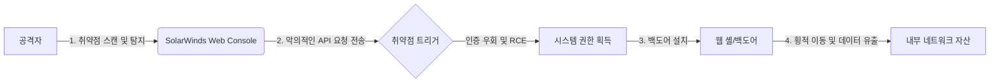

# SolarWinds 신흥 취약점, 실제 공격 발생

SolarWinds 제품군에서 식별되지 않은 새로운 취약점이 현재 활발히 악용되고 있는 것으로 보고되었습니다. 공격자는 해당 취약점을 이용해 인증 절차를 우회하고 원격 코드 실행을 시도하며, 주로 방화벽이나 보안 장치 뒤에 숨어 있는 고가치 자산을 타깃으로 삼고 있습니다. 이번 공격은 과거 거대 규모의 공급망 해킹을 떠올리게 하며, 패치 적용 전 잠재적인 피해를 최소화하기 위한 즉각적인 대응이 시급합니다. 전문가들은 인터넷 노출된 관리 인터페이스에 대한 접근 제어 강화를 권고하고 있습니다.

## 개요 (Introduction)

2020년 'Sunburst' 사태로 전 세계 사이버 보안 업계를 강타했던 SolarWinds가 다시금 도마 위에 올랐습니다. 2026년 2월 4일자 SecurityWeek 보도에 따르면, SolarWinds의 핵심 제품군에서 발견된 새로운 취약점(아직 CVE 식별자가 배정되지 않았거나 최근 배정됨)이 실제 공격에 악용되고 있습니다.

SolarWinds Orion 플랫폼과 같은 네트워크 모니터링 도구는 IT 인프라의 심장부와 같습니다. 이러한 솔루션은 서버, 네트워크 장치, 애플리케이션의 전반적인 상태를 감시하기 위해 높은 권한으로 운영되는 경우가 많습니다. 따라서 이러한 도구의 취약점은 공격자에게 '내부자'와 같은 권한을 부여하는 지름길이 됩니다. 최신 공격 흐름은 공격자들이 이러한 관리 도구의 취약점을 찾아내어, 방화벽 외부에서 내부 네트워크로 횡적 이동(Lateral Movement)을 시도하고 있음을 보여줍니다.

## 기술적 분석 (Technical Analysis)

이번에 악용된 것으로 추정되는 취약점은 SolarWinds Web 기반 콘솔의 특정 API 엔드포인트에서 발생하는 **신뢰할 수 있는 역직렬화(Insecure Deserialization)** 혹은 **인증 우회(Authentication Bypass)** 결함일 가능성이 높습니다. 공격자는 사용자의 인증 세션을 검증하지 않거나, 쿠키 및 헤더 값을 조작하여 시스템의 관리자 권한을 탈취합니다.

특히 웹 콘솔은 원격 관리를 위해 인터넷 망에 노출되는 경우가 많아, 공격의 진입 지점으로서 매우 매력적인 표적입니다. 공격자는 특수하게 조작된 HTTP 요청을 취약한 엔드포인트로 전송하여, 서버 내에서 악의적인 명령어를 실행하거나 웹 셸(Web Shell)을 업로드합니다.

아래는 공격자가 SolarWinds 취약점을 이용해 내부 네트워크로 침투하는 과정을 시각화한 다이어그램입니다.



## 실제 공격 예시 (Attack Example)

공격자는 대개 SolarWinds 설치를 탐지하는 도구(예: Shodan)를 사용하여 인터넷에 노출된 취약한 시스템을 먼저 찾아냅니다. 이후 해당 취약점에 대응하는 PoC(Proof of Concept) 코드를 활용하여 공격을 자동화합니다.

다음은 가상의 시나리오를 바탕으로 한 공격 코드의 개념적 예시입니다. (※ 실제 공격 코드는 교육 목적이 아닌 한 공유하지 않으며, 여기서는 방어를 위한 이해를 돕기 위해 구조만 설명합니다.)

```python
import requests

target_url = "https://[target-solarwinds-host]:17778/SolarWinds/InformationService/v3/Json/Query"

# 악의적인 JSON 페이로드 (역직렬화 공격 유발)
payload = {
    "query": "SELECT Payload FROM EXEC('cmd.exe /c whoami')"
}

headers = {
    "User-Agent": "Mozilla/5.0",
    "Content-Type": "application/json"
}

try:
    # 인증 우회 취약점이 있다고 가정
    response = requests.post(target_url, json=payload, headers=headers, verify=False, timeout=10)

    if response.status_code == 200:
        print("[+] 공격 성공: 시스템 응답 확인")
        print("[+] 응답 데이터:", response.text)
    else:
        print("[-] 공격 실패 또는 패치됨")

except Exception as e:
    print(f"[!] 오류 발생: {e}")
```

위 예시처럼 공격자는 복잡한 인증 과정 없이 특정 API 쿼리를 통해 시스템 명령어를 삽입할 수 있습니다. 실제 공격에서는 `whoami` 대신 `powershell`을 이용해 맬웨어를 다운로드하거나 방화벽 규칙을 해제하는 등 지속적인 액세스를 위한 백도어를 구축합니다.

## 완화 조치 (Mitigation)

SolarWinds 취약점으로 인한 피해를 방지하기 위해선 즉각적인 네트워크 통제와 소프트웨어 업데이트가 필수적입니다.

1.  **즉시 적용 가능한 조치**:
    *   **인터넷 노출 차단**: SolarWinds Web 콘솔이나 API 서비스는 기본적으로 인터넷 망에 직접 노출되지 않도록 설정해야 합니다. VPN이나 Zero Trust 접근 제어 솔루션을 경유하도록 구성하십시오.
    *   **패치 적용**: SolarWinds에서 최신 보안 업데이트(Patch) 또는 핫픽스(Hotfix)를 배포하는 즉시 이를 적용해야 합니다. 특히 이번 공격과 관련된 CVE 번호가 확인되면 우선순위를 두어 패치하십시오.

2.  **장기적 보안 전략**:
    *   **최소 권한 원칙 (PoLP)**: SolarWinds 서비스가 도메인 관리자와 같은 과도한 권한으로 실행되지 않도록 서비스 계정 권한을 제한하십시오.
    *   **네트워크 분할 (Segmentation)**: 관리 도구가 운영되는 네트워크를 일반 사용자 네트워크와 분리하여, 공격자가 침투하더라도 횡적 이동을 제한하십시오.
    *   **모니터링 강화**: SolarWinds API 엔드포인트에 대한 비정상적인 요청 patterns을 탐지하는 SIEM 규칙을 배포하십시오.

## 보안 시사점 (Security Implications)

SolarWinds 사건은 단일 제품의 취약점을 넘어, 전체 공급망 보안의 취약성을 상기시킵니다. 2020년 Sunburst 공격이 정상적인 업데이트 배포 과정을 악용했다면, 이번 공격은 인터넷에 노출된 관리 인터페이스의 취약점을 직접 공격하고 있습니다. 이는 관리자 계정의 보안과 네트워크 경계 보안의 중요성을 재확인합니다.

보안 전문가로서 우리는 모든 관리 도구를 인터넷 망에서 격리하고, 다중 요소 인증(MFA)과 제로 트러스트 접근 제어를 도입해야 합니다. 또한, 제로데이 취약점에 대비하여 방어적 프로그래밍(Defensive Programming)과 침투 탐지 시스템(IPS)의 상시 점검이 필요합니다.

## 참고자료

- [New SolarWinds vulnerability under active attack - SecurityWeek](https://www.securityweek.com/new-solarwinds-vulnerability-under-active-attack/)
- [CISA Emergency Directives for SolarWinds Orion](https://www.cisa.gov/news-events/news/solarwinds-orion-related-security-requirements)
- [OWASP Insecure Deserialization](https://owasp.org/www-community/vulnerabilities/Insecure_Deserialization)

---
