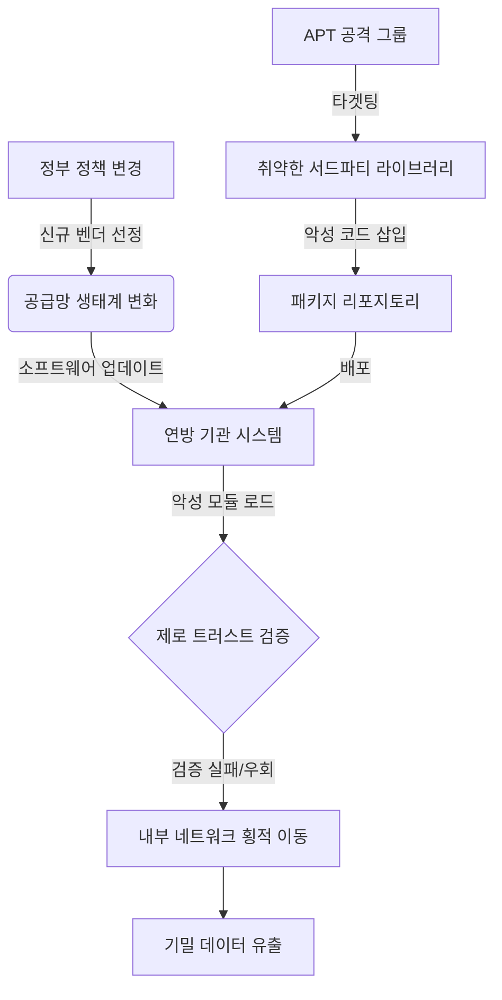

# 트럼프 행정부 보안 의제와 기술적 위협

2026년 트럼프 행정부가 발표한 새로운 사이버 보안 의제는 연방 기관의 효율성 강화와 공급망 보안 재정비에 초점을 맞추고 있습니다. 이러한 정책적 변화는 민간 기업과 연방 기관의 기술적 보안 태세를 근본적으로 재설계해야 하는 중요한 계기가 됩니다. 본 글에서는 정책 업데이트에 따른 공급망 공격의 위험성 증대와 이를 방어하기 위한 제로 트러스트 아키텍처의 적용을 중심으로 기술적 분석을 제공합니다. 또한, 구체적인 공격 시나리오와 완화 조치를 통해 전문가가 즉시 적용할 수 있는 인사이트를 공유합니다.

## 개요 (Introduction)

2026년 2월, 트럼프 행정부가 들어서며 사이버 보안 지형에는 중대한 변화가 감지되고 있습니다. Federal News Network의 보도에 따르면, 행정부는 CISA(사이버 보안 및 인프라 보안국)의 역할 재정립, 연방 네트워크 현대화, 그리고 민관 협력 모델의 변경 등 다섯 가지 주요 안건을 추진 중입니다. 이는 단순한 행정적 변화를 넘어, 사이버 전쟁의 규칙을 다시 쓰는 시도로 해석됩니다.
특히, '행정 효율성'을 강조하는 새로운 정책 기조는 과거의 레거시 시스템과 현대화된 보안 요구 사항 사이의 간극을 벌어지게 만들 가능성이 큽니다. 보안 전문가로서 우리는 정부의 정책 변화가 어떻게 해커들의 공격 동기(Motivation)와 기법(TTPs)의 변화로 이어지는지 예의주시해야 합니다. 이 글에서는 이러한 거시적 변화가 미시적인 기술적 공격 벡터에 미치는 영향을 심층적으로 분석하겠습니다.

## 기술적 분석 (Technical Analysis)

행정부의 보안 의제 중 가장 기술적으로 민감한 부분은 **공급망(Supply Chain) 보안**과 **신원 관리**의 재정비입니다. 연방 기관의 IT 예산 증액과 현대화 계획은 새로운 벤더들의 유입을 의미하며, 이는 공격 표면(Attack Surface)을 넓히는 결과를 초래할 수 있습니다. 해커들은 정부가 의존하는 소프트웨어 공급망을 타겟으로 삼아, 상위 레벨의 권한을 탈취하는 'Upselling' 공격을 시도할 것입니다.
또한, '능동적 사이버 방어(Active Cyber Defense)' 개념의 도입은 공격자와 방어자의 경계를 모호하게 만듭니다. 기술적으로 볼 때, 이는 정부 지원의 APT(지속적 위협) 그룹들이 더욱 공격적으로 전술을 변경할 수 있음을 시사합니다. 특히, 연방 기관의 네트워크 분리(Network Segmentation) 정책이 변경되는 과도기에 발생할 수 있는 **데이터 유출(Data Exfiltration)** 시나리오와 **의존성 혼동(Dependency Confusion)** 취약점에 집중할 필요가 있습니다.
다음은 공급망 취약점을 이용한 위협 흐름을 시각화한 다이어그램입니다.


## 실제 공격 예시 (Attack Example)

최근 정부 계약사로 선정된 가상의 업체 'GovTech Corp'를 타겟으로 한 **Dependency Confusion(의존성 혼동)** 공격 시나리오를 상상해 봅시다. 이 회사는 연방 기관용 포털을 개발 중이며, 내부적으로 사용하는 패키지와 동일한 이름의 공용 패키지가 없다고 가정합니다.
공격자는 내부 패키지 이름(예: `gov-internal-util`)으로 공용 PyPI 레지스트리에 악성 패키지를 업로드합니다. 개발자가 `requirements.txt` 설정이 잘못되거나, VPN 연결이 끊어지는 순간 빌드 서버가 공용 레지스트리를 참조하게 되면 악성 코드가 다운로드됩니다.
**PoC (Proof of Concept) - 악성 setup.py**:
```python
from setuptools import setup
import os
import requests
