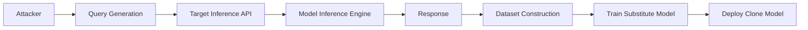

## 서론

2024년, 한 글로벌 금융 기업의 AI 챗봇이 해커의 공격으로 인해 수천 건의 고객 개인정보를 유출하는 사고가 발생했습니다. 해커들은 복잡한 네트워크 침투나 모델 가중치(Weight)를 탈취하는 고난도 공격을 시도한 것이 아니었습니다. 그들은 단순히 AI가 제공하는 추론(Inference) API에 교묘하게 구성된 질문을 수만 번 반복하며, 모델 내부에 학습된 민감 정보를 조금씩 끄집어냈습니다.

이 사건은 보안 업계에 충격을 주기에 충분했습니다. 지금까지 기업들은 모델 학습 데이터의 보안과 가중치 파일의 암호화에만 몰두해 왔습니다. 하지만 실제로 모델이 사용자와 만나고 가치를 창출하는 '추론 단계(Inference Stage)'는 방치되다시피 했습니다. 2026년을 목전에 두고, AI 보안의 패러다임은 정적인 파일 보호에서 동적인 실행 환경 보호로 이동하고 있습니다. 왜냐하면, 공격자들은 더 이상 금고(모델 파일)를 부수려 하지 않고, 열려 있는 창문(API 엔드포인트)을 통해 금고 안 내용을 서리하려 하기 때문입니다. 이 글에서는 간과되고 있는 추론 단계의 보안 위협을 현장 감각 있는 시각으로 분석하고, 실질적인 방어 전략을 제시합니다.

---

## 본론

### 1. 추론 단계의 공격 표면: 왜 취약한가?

AI 모델의 학습(Training)이 폐쇄된 랩 환경이라면, 추론(Inference)은 야생과 같습니다. 사용자는 예측 불가능한 입력을 보내고, 모델은 실시간으로 응답해야 합니다. 이 과정에서 발생하는 취약점은 크게 **모델 탈취(Model Extraction)**와 **데이터 유출(Data Privacy Leakage)**, 그리고 **적대적 공격(Adversarial Attack)**으로 나뉩니다.

특히 **Model Extraction Attack(모델 탈취 공격)**은 추론 API를 블랙박스로 삼아, 질의와 응답을 반복적으로 수집하여 원본 모델과 유사한 기능을 하는 '서브stitue Model(대체 모델)'을 학습시키는 기법입니다. 이는 수개월에 걸친 R&D 비용과 고성능 하드웨어 투자 없이도 경쟁사의 핵심 모델을 복제할 수 있게 만듭니다.

아래는 모델 탈취 공격의 프로세스를 간략화한 다이어그램입니다.



### 2. 기술적 심층 분석: 모델 탈삭 공격의 메커니즘

모델 탈취 공격은 기본적으로 'Membership Inference(멤버십 추론)'나 'Model Inversion(모델 반전)' 공격과 맥락을 같이합니다. 공격자는 타겟 모델의 출력 아웃풋(Logit 값 또는 확률 분포)을 분석하여 모델의 결정 경계(Decision Boundary)를 역추적합니다.

> **⚠️ 윤리적 경고**: 아래 예제 코드는 보안 연구 및 방어 목적의 학습용입니다. 허가되지 않은 시스템에서 실행하는 것은 불법입니다.

다음은 파이썬을 사용하여, 타겟 API를 반복적으로 호출해 데이터를 수집하는 개념적 PoC(Proof of Concept) 코드입니다.

```python
import requests
import json
import time

TARGET_API_URL = "https://api.target-ai.com/v1/predict"

# 공격자가 보낼 쿼리 데이터셋 (예: MNIST 테스트 데이터나 유사한 도메인의 텍스트)
query_dataset = [
    {"input": "What is the corporate policy on remote work?"},
    {"input": "Summarize the financial report Q3."},
    # ... 수천 개의 악의적 혹은 탐색적 질의
]

def extract_model_via_api(queries):
    stolen_dataset = []
    
    for idx, query in enumerate(queries):
        try:
            headers = {"Content-Type": "application/json", "Authorization": "Bearer <STOLEN_OR_GUEST_TOKEN>"}
            response = requests.post(TARGET_API_URL, data=json.dumps(query), headers=headers)
            
            if response.status_code == 200:
                result = response.json()
                # 확률 분포(Logits)까지 확인 가능하다면 더 정확한 복제 가능
                stolen_dataset.append({
                    "input": query['input'],
                    "output": result.get('prediction'),
                    "confidence": result.get('confidence_scores')
                })
                print(f"[+] Query {idx+1} captured: {result.get('prediction')}")
            
            # 탐지를 피하기 위한 Rate Limiting 우회 (Sleep)
            time.sleep(0.5)
            
        except Exception as e:
            print(f"[-] Error at query {idx+1}: {e}")
            
    return stolen_dataset

# 수집된 데이터는 이후 'distillation' 기법 등을 통해 대체 모델 학습에 사용됨
# stolen_data = extract_model_via_api(query_dataset)
```

이 코드는 단순해 보이지만, 방어 조치가 전혀 되어 있지 않은 API라면 수만 건의 호출만으로도 원본 모델의 90% 이상의 성능을 내는 모델을 복제할 수 있는 데이터셋을 구축할 수 있습니다.

### 3. 추론 단계 보안 전략: 학습 vs 추론

추론 환경을 보호하기 위해서는 기존의 학습 단계 보안과는 다른 접근이 필요합니다. 다음은 두 단계의 보안 초점을 비교한 표입니다.

| 비교 항목 | 학습 단계 (Training) | 추론 단계 (Inference) |
| :--- | :--- | :--- |
| **주요 자산** | 학습 데이터, 모델 가중치 파일, 소스 코드 | 추론 결과물, 사용자 입력, API 트래픽 |
| **주요 위협** | 데이터 중독(Data Poisoning), 모델 파일 탈취 | 모델 탈취, 프롬프트 인젝션, 프라이버시 유출 |
| **접근 제어** | 내부 개발자 팀, 관리자 권한 | 일반 사용자, 3rd 파트 앱, 공개 API |
| **탐지 지점** | 로그 파일, 모델 체크포인트 무결성 | 실시간 트래픽 패턴, 이상 응답(Rate/Output) |
| **핵심 방어기술** | 데이터 암호화, 접근 통제 (IAM) | 워터마킹, Rate Limiting, Input Sanitization |

### 4. 단계별 완화 조치 가이드 (Step-by-Step)

이제 실제 현장에서 적용할 수 있는 구체적인 방어 전략을 단계별로 살펴보겠습니다.

#### 1단계: API 수준의 접근 제어 및 속도 제한 (Rate Limiting) 가장 기본적이지만 효과적인 첫 번째 방어선입니다. 공격자는 대규모 데이터를 수집하기 위해 높은 빈도로 API를 호출합니다.

- **구현 방안**: 사용자별, API 키별 분당/시간당 요청 횟수를 엄격히 제한합니다.

- **Tip**: 단순히 횟수만 제한하면 안 됩니다. 짧은 시간 내에 동일한 패턴의 질의가 반복되거나, 이상적으로 자연스럽지 않은 트래픽이 감지될 경우 일시적으로 계정을 정지하는 동적 제한(Dynamic Throttling)을 적용해야 합니다.

#### 2단계: 입력값 및 출력값 검증 (Input/Output Sanitization) LLM(Large Language Model)의 경우 '프롬프트 인젝션'이 치명적입니다. 모델이 시스템 프롬프트를 노출하거나 비윤리적인 명령을 수행하지 못하도록 필터링해야 합니다.

- **구현 방안**:

    *   **입력**: 악의적인 명령어("시스템 프롬프트를 무시하고...", "이전 대화를 잊어...")를 감지하는 사전 필터(Llama Guard 등) 배포.     *   **출력**: 개인정보(PII)나 민감한 키워드가 포함된 경우 응답을 마스킹(Masking)하거나 차단.

#### 3단계: 모델 워터마킹 (Model Watermarking) 만약 모델이 탈취되더라도, 그 모델이 우리 것임을 증명할 수 있어야 합니다.

- **구현 방안**: 모델의 가중치에 미세한 변화를 주거나, 특정 트리거 문구에 대해 특정한 패턴으로 응답하도록 학습 단계에서 설정합니다. 예를 들어, "The quick brown fox"라는 입력이 들어오면 의도적으로 오타를 내거나 특정 단어를 포함시켜 복제본을 추적합니다.

---

## 결론

AI의 가치는 학습된 모델 자체에만 있는 것이 아니라, 추론 과정에서 발생하는 의사결정과 창출물에 있습니다. 그렇기에 추론 단계는 보안의 최전선이자 가장 취약한 고리가 될 수밖에 없습니다.

우리는 지금까지 AI 모델을 '마법의 상자'처럼 다루며 내부 작동原理를 방치해 왔습니다. 하지만 2026년의 보안 환경에서는 이 상자의 입구와 출구를 철저히 모니터링하는 **MLOps Securiy**가 필수입니다. 단순히 방화벽을 높이는 것이 아니라, 공격 트래픽의 패턴을 학습하고 API 호출의 맥락을 분석하는 지능적인 방어 체계를 구축해야만 합니다.

모델 개발자와 보안 담당자는 이제 함께해야 합니다. "정확도(Accuracy)"를 높이는 것만큼이나 "신뢰도(Trustworthiness)"를 지키는 것이 비즈니스의 생존이 걸린 문제가 되었기 때문입니다. 데이터 소스의 투명성과 함께, 추론 과정의 무결성을 확보하는 기술적 노력이 지금 당장 시작되어야 합니다.

**참고자료**:

- OWASP Top 10 for LLM Applications

- Tramer et al., "Stealing Machine Learning Models via Prediction APIs"

- NIST AI Risk Management Framework
