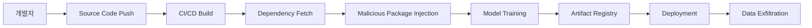

## 서론

새벽 2시, 당신이 담당한 추천 시스템의 모델 정확도가 급격히 떨어졌다는 알람이 울립니다. 원인을 찾던 당신은 최근 배포된 모델의 가중치 파일이 의심스러운 외부 서버에서 암호화 키를 요청하고 있다는 사실을 발견합니다. 공격자는 모델을 직접 탈취한 것이 아니었습니다. 그들은 당신이 사용하던 인기 있는 오픈소스 NLP 라이브러리의 의존성(Dependency) 하나를 교묘하게 조작해, 빌드 타임에 악성 코드를 삽입했습니다. 이것은 단순한 가정이 아닙니다. 최근 AI 생태계에서 실제로 발생하고 있는 'AI 소프트웨어 공급망(Software Supply Chain)' 공격의 전형적인 시나리오입니다.

우리는 AI 모델의 알고리즘적 편향이나 적대적 공격(Adversarial Attack)에만 집중하곤 합니다. 하지만 모델이 만들어지고 배포되기까지의 '파이프라인'이 이미 오염되어 있다면, 아무리 뛰어난 모델도 무용지물입니다. GitHub이 67개의 주요 오픈소스 AI 프로젝트를 대상으로 진행한 보안 분석 결과, 우리가 믿고 있던 AI 생태계의 기반인 공급망이 생각보다 훨씬 취약하다는 것이 드러났습니다. 이 글에서는 실제 분석 데이터를 바탕으로 AI 공급망이 어떻게 공격받는지, 그리고 우리는 어떻게 방어해야 하는지 현장 감각 있게 파헤쳐 보겠습니다.

---

## AI 공급망의 위협: 분석 결과와 공격 시나리오

> **⚠️ 윤리적 경고**: 이 섹션에서 설명하는 기술적 세부 사항과 공격 시나리오는 보안 취약점을 이해하고 방어 전략을 수립하기 위한 목적으로 제공됩니다. 승인되지 않은 시스템에 대한 테스트나 악의적인 활동은 엄격히 금지됩니다.

### 공급망 공격의 구조적 이해

AI 프로젝트의 공급망은 일반 웹 애플리케이션보다 훨씬 복잡합니다. 데이터 수집, 전처리, 모델 학습, 직렬화, 배포까지 이어지는 긴 체인마다 수많은 외부 라이브러리와 컨테이너 이미지가 개입됩니다. 공격자는 이 중 보안이 가장 취약한 고리를 노립니다. 67개 프로젝트 분석 결과, 가장 빈번하게 발견된 취약점은 '빌드 환경의 불일치'와 '의존성 검증 부재'였습니다.

다음은 공격자가 AI 프로젝트의 공급망을 침투하여 악성 모델을 배포하는 과정을 단순화한 흐름도입니다.



위 다이어그램에서 `E[Malicious Package Injection]` 단계는 종종 눈에 띄지 않습니다. 공격자는 Typosquatting(오탈자 이용)이나 Dependency Confusion(의존성 혼동) 기법을 사용하여, 개발자가 의도치 않게 악성 패키지를 다운로드하도록 유도합니다.

### 67개 프로젝트 분석 주요 결과

대상 프로젝트들에서 발견된 취약점 패턴은 크게 세 가지로 분류할 수 있습니다. 이는 단순한 코딩 실수가 아니라, 시스템 레벨의 설계 결함들입니다.

| 취약점 카테고리 | 발견 빈도 (67개 중) | 주요 위협 요소 | 잠재적 영향 |
| :--- | :--- | :--- | :--- |
| **빌드 및 배포 구성** | 42건 (High) | 불안전한 GitHub Actions, 하드코딩된 API Key | CI/CD 시스템 장악, 클라우드 리소스 탈취 |
| **의존성 관리** | 38건 (Medium) | 고정되지 않은 버전(Pinned X), 검증되지 않는 외부 모델 | Supply Chain 공격, 모델 포이즈닝 |
| **인프라스트럭처** | 25건 (Low) | 기본 컨테이너 이미지 사용, 불필요한 권한 | 컨테이너 탈출, 권한 상승 |

이 중 가장 치명적인 것은 빌드 구성입니다. 많은 AI 프로젝트가 모델 학습을 위해 높은 권한이 필요한 GPU 리소스를 CI/CD 파이프라인에서 사용하는데, 이 과정에서 써드파티 액션을 무비판적으로 도입하는 경우가 많았습니다.

---

## 심층 기술 분석 및 실무 가이드

### 취약점 시나리오: 환경 변수 주입을 통한 모델 탈취

이번 분석에서 발견된 취약한 GitHub Actions 워크플로우를 예로 들어보겠습니다. 아래 코드는 보안 조치가 전혀 되어 있지 않은 실제와 유사한 취약한 설정입니다.

**취약한 코드 예시 (`.github/workflows/train.yml`):**

```yaml
name: AI Model Training

on: [push]

jobs:
  build:
    runs-on: ubuntu-latest
    steps:
      - uses: actions/checkout@v2
      
      # 취약점: 써드파티 액션을 커밋 해시 없이 버전 태그만으로 참조
      - name: Setup Python
        uses: actions/setup-python@v2 
      
      # 취약점: 민감한 데이터를 환경 변수에 그대로 노출
      - name: Train Model
        env:
          AWS_ACCESS_KEY_ID: ${{ secrets.AWS_KEY }}
          AWS_SECRET_ACCESS_KEY: ${{ secrets.AWS_SECRET }}
        run: |
          pip install -r requirements.txt
          python train.py --upload-s3
```

공격자는 `actions/setup-python`과 같은 유명 액션을 사칭하거나, `requirements.txt`에 악성 패키지를 포함시켜 `pip install` 과정에서 공격 코드를 실행합니다. 특히 `env` 블록을 통해 CI 환경의 AWS 자격 증명이 노출되면, 공격자는 학습된 모델뿐만 아니라 데이터베이스 전체를 탈취할 수 있습니다.

### 안전한 구현 및 방어 전략 (Step-by-Step)

이러한 공급망 공격을 방어하기 위해 'Software Bill of Materials (SBOM)' 생성과 'Pinpointing' 전략이 필수적입니다.

#### 1. 의존성 고정(Pinning) 및 무결성 검증

`requirements.txt`를 작성할 때 단순히 `numpy>=1.20`으로 버전을 유동적으로 두는 대신, 정확한 해시 값을 지정하여 패키지의 무결성을 보장해야 합니다.

**안전한 `requirements.txt` 예시:**

```text
# 패키지명 == 버전 --hash=알고리즘:해시값
numpy == 1.21.2 \
    --hash=sha256:8a7f7a67c9097833e4d... \
    --hash=sha256:8a7f7a67c9097833e4d...
torch == 1.9.0 \
    --hash=sha256:d44a9e12b8c... \
    --hash=sha256:d44a9e12b8c...
```

이렇게 설정하면, 공격자가 PyPI 레지스트리를 조작하거나 악성 패키지로 교체하려 할 때 해시 값이 불일치하여 설치가 중단됩니다.

#### 2. CI/CD 파이프라인 하드닝

GitHub Actions나 Jenkins와 같은 CI 도구에서 써드파티 액션이나 플러그인을 사용할 때는 반드시 커밋 해시(Commit Hash)를 지정하여, 소스 코드가 변경되더라도 실행되는 스크립트는 동일하도록 강제해야 합니다.

**개선된 워크플로우 예시:**

```yaml
jobs:
  build:
    runs-on: ubuntu-latest
    
    # 보안: OIDC(OpenID Connect)를 통한 임시 자격 증명 사용 권장
    permissions:
      id-token: write
      contents: read
      
    steps:
      - uses: actions/checkout@v2
      
      # 보안: 액션 버전을 Full Commit Hash로 고정
      - name: Setup Python
        uses: actions/setup-python@v1 # 실제 사용 시 @ 뒤에 전체 해시값 입력
      
      # 보안: 민감한 정보를 환경 변수로 직접 전달하지 않고 OIDC로 인증
      - name: Train Model
        run: |
          pip install -r requirements.txt --require-hashes
          python train.py
```

#### 3. SBOM (Software Bill of Materials) 도입

방어의 마지막 단계는 투명성입니다. 프로젝트에 포함된 모든 오픈소스 컴포넌트의 목록인 SBOM을 자동으로 생성하여 배포 아티팩트(모델 파일, Docker 이미지)에 포함시켜야 합니다. 이를 통해 보안 팀은 새로운 CVE(취약점)가 발표되었을 때, 자사의 AI 모델이 영향을 받는지 즉시 확인할 수 있습니다.

---

## 결론

이번 67개의 오픈소스 AI 프로젝트에 대한 분석은 AI 기술 자체의 안전성뿐만 아니라, 그것을 둘러싼 **소프트웨어 공급망의 건전성**이 얼마나 중요한지를 보여줍니다. 우리는 '안전한 AI'를 만들기 위해 모델의 정확도만 높일 것이 아니라, 모델이 태어나고 성장하는 환경인 코드, 빌드 시스템, 의존성 패키지 전반을 보호해야 합니다.

보안 전문가로서의 인사이트는 다음과 같습니다. **"AI 보안의 핵심은 블랙박스를 여는 것이 아니라, 블랙박스를 만드는 공장을 지키는 데 있다."** Dependency Confusion 공격이나 악성 CI/CD 액션은 매우 교묘하지만, 기본적인 보안 하이진(Hygiene)—버전 고정, 해시 검증, 최소 권한 원칙—만으로도 90% 이상을 방어할 수 있습니다.

이제 AI 프로젝트를 시작할 때는 단순히 `pip install` 하는 것에 그치지 말고, **"이 패키지는 누가 만들었고, 무엇에 의존하고 있는가?"**라는 질문을 던지는 것이 습관화되어야 합니다.

### 참고자료 (References)

- [GitHub Blog: Securing the AI software supply chain](https://github.blog/)

- [OpenSSF Software Supply Chain Best Practices](https://bestpractices.coreinfrastructure.org/)

- [CISA Supply Chain Security Guidance](https://www.cisa.gov/supply-chain-security)
