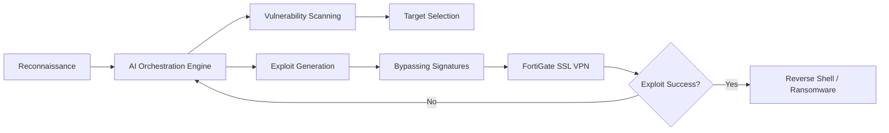

## 서론: 사이버 전쟁의 패러다임 변화, AI의 등장

보안 운영 센터(SOC)의 모니터링 화면에 갑자기 수만 개의 비정상적인 접속 시도가 빨간불으로 깜빡이기 시작합니다. 과거의 스트리밍 DDoS나 단순한 무차별 대입(Brute-force) 공격과는 다릅니다. 트래픽 패턴은 매우 자연스러워 보이고, 공격 소스는 전 세계에 흩어진 수천 개의 양호한 IP 주소입니다. 하지만 이들의 공극(空隙)은 0에 가깝고, 특정 보안 장비의 취약점을 노리는 정교함은 마치 한 명의 천재 해커가 동시에 여러 곳에서 작업하는 것과 같습니다.

AWS의 최신 위협 인텔리전스 리포트에 따르면, 바로 이러한 시나리오가 현실이 되었습니다. AI(인공지능)를 보조 수단으로 활용하는 위협 행위자(Threat Actor)가 전 세계에 분포한 FortiGate 방화벽 장비를 대규모로 탈취하려 시도했다는 것입니다. 이는 단순한 해킹 사건을 넘어, 사이버 공격의 생태계가 '자동화'와 '지능화' 단계로 진입했음을 알리는 결정적인 신호입니다. 더 이상 키보드를 두드리는 개별 해커가 주적이 아닙니다. 이제 우리는 공격의 범위와 속도를 비약적으로 증폭시키는 AI라는 비가시적인 적과 맞서야 합니다. 이 글에서는 FortiGate 장비를 겨냥한 이번 공격의 기술적 메커니즘을 분석하고, AI가 공격 프로세스를 어떻게 최적화했는지 심층적으로 다룹니다.

## 본론: FortiGate 취약점과 AI의 결합

### CVE-2024-21762와 SSL VPN의 위험성

이번 공격의 핵심 타겟은 Fortinet의 FortiOS SSL VPN 기능입니다. AWS가 분석한 대규모 공격은 주로 **CVE-2024-21762**라는 심각한 취약점을 악용했습니다. 이는 아웃오브바운드 쓰기(Out-of-bounds Write) 취약점으로, 인증되지 않은 공격자가 특수하게 조작된 HTTP 요청을 전송함으로써 시스템의 메모리 관리를 교란시키고 원격 코드 실행(RCE) 권한을 획득할 수 있습니다.

전통적인 공격자는 이러한 Exploit(익스플로잇) 코드를 개발하고 테스트하는 데 상당한 시간을 할애해야 했습니다. 하지만 AI를 활용한 위협 행위자는 LLM(대규모 언어 모델)의 코드 생성 및 최적화 기능을 통해, 취약점을 타격하기 위한 페이로드(Payload) 변이를 순식간에 대량으로 생성할 수 있습니다. 이는 방화벽 내부의 커널 레벨 권한까지 위협하는 매우 위험한 시나리오입니다.

### AI 증강 공격의 메커니즘 (AI-Augmented Attack Kill Chain)

AI가 도입됨으로써 사이버 공격의 킬체인(Kill Chain)은 획기적으로 단축되었습니다. 아래 다이어그램은 인간 중심의 전통적 공격과 AI 증강 공격의 프로세스 차이를 개념적으로 보여줍니다.



위 과정에서 가장 중요한 차별점은 **'피드백 루프(Feedback Loop)'**입니다. 공격이 실패하면 AI는 즉시 패턴을 학습하여 페이로드를 변형(Mutation)시키고 재시도합니다. 이는 방화벽의 침입 탐지 시스템(IPS)이나 웹 애플리케이션 방화벽(WAF)이 가진 시그니처 기반 탐지를 무력화시키는 주된 원인이 됩니다. 즉, AI는 공격 트래픽이 '악성코드'로 보이지 않도록 끊임없이 위장하는 것입니다.

### 실무 적용: AI 기반 이상 탐지 시뮬레이션

방어자의 관점에서도 AI는 필수적입니다. 전통적인 시그니처 기반 보안은 변형되는 AI 공격을 막기 어렵습니다. 따라서 머신러닝 기반의 비지도 학습(Unsupervised Learning)을 사용하여 정상 트래픽과 다른 이상치를 탐지하는 접근법이 필요합니다.

다음은 Python의 `scikit-learn` 라이브러리를 사용하여, FortiGate 로그 데이터에서 AI에 의해 생성된 것으로 추정되는 비정상적인 접속 패턴을 탐지하는 간단한 코드 예시입니다. `IsolationForest` 알고리즘은 고차원 데이터에서 이상치를 효과적으로 분리해냅니다.

```python
import numpy as np
import pandas as pd
from sklearn.ensemble import IsolationForest
import matplotlib.pyplot as plt

# 가상의 FortiGate 접속 로그 데이터 생성
# Feature 1: Request Length (요청 길이)
# Feature 2: Request Interval (요청 간격 초 단위)
# Feature 3: Payload Entropy (페이로드의 무작위성 정도)
np.random.seed(42)
normal_traffic = np.random.normal(loc=[100, 5.0, 2.5], scale=[20, 1.5, 0.5], size=(1000, 3))
ai_attack_traffic = np.concatenate([
    np.random.normal(loc=[500, 0.1, 7.8], scale=[50, 0.05, 0.2], size=(50, 3)),  # Exploit attempts
    np.random.normal(loc=[150, 10.0, 4.0], scale=[30, 2.0, 1.0], size=(50, 3))  # Fuzzing
])

X = np.concatenate([normal_traffic, ai_attack_traffic])
df = pd.DataFrame(X, columns=['Req_Length', 'Req_Interval', 'Payload_Entropy'])

# Isolation Forest 모델 학습 (Contamination: 이상치의 예상 비율)
model = IsolationForest(n_estimators=100, contamination=0.1, random_state=42)
df['Anomaly_Score'] = model.fit_predict(X)

# 결과 확인 (-1: 이상치, 1: 정상)
anomalies = df[df['Anomaly_Score'] == -1]
print(f"탐지된 총 공격 횟수: {len(anomalies)}")
print(anomalies.head())

# 시각화 (선택적, 실제 서버 환경에서는 로그 저장)
# plt.scatter(df['Req_Length'], df['Payload_Entropy'], c=df['Anomaly_Score'])
# plt.show()
```

이 코드는 고정된 규칙이 아닌, 데이터의 분포(Distribution)를 학습하여 급격히 변하는 요청 길이나 비정상적인 페이로드 엔트로피(무작위성)를 보이는 트래픽을 자동으로 감지합니다.

### 전통적 공격 vs AI 증강 공격 비교

AI가 공격에 도입됨에 따라 보안 팀이 직면한 위협의 질이 어떻게 달라졌는지 비교해 보는 것이 중요합니다.

| 비교 항목 | 전통적 스크립트 키디/해커 | AI 증강 위협 행위자 (AI-Augmented Actor) | | :--- | :--- | :--- | | **공격 속도** | 인간의 개입이 필요하여 느림 | 자동화된 스크립트와 AI가 초당 수천 건의 변이 생성 | | **탐지 회피(Evasion)** | 고정된 패턴 사용, 쉽게 차단됨 | 시그니처 매칭을 회피하기 위한 폴리모픽(Polymorphic) 코드 생성 | | **타겟팅 정밀도** | 무차별 대입 또는 알려진 공개 Exploit 사용 | LLM을 활용한 문맥 인지형 취약점 분석 및 맞춤형 Exploit 제작 | | **피드백 루프** | 실패 시 수동으로 재시도 필요 | 공격 결과를 즉시 분석하여 다음 페이로드를 실시간 최적화 | | **주요 기술** | Python 스크립트, Metasploit 프레임워크 | LLMs (GPT-4, Claude 등), Reinforcement Learning, Generative AI |

### 방어 가이드: FortiGate 및 MLOps 관점에서의 대응

이러한 AI 기반 공격에 대응하기 위해서는 다층적 방어 전략이 필요합니다.

1.  **즉시 패치 적용 (Patch Management)**:     가장 기본적이지만 강력한 대응입니다. CVE-2024-21762에 대한 보안 패치가 즉시 배포되었습니다. FortiGate 장비의 FortIOS 버전을 최신 버전으로 업그레이드하여 원격 코드 실행 취약점을 원천 차단해야 합니다.

2.  **SSL VPN 접근 제한**:     불가피하게 SSL VPN을 사용해야 한다면, 접근을 허용할 IP 주소를 geo-blocking이나 화이트리스트로 엄격히 제한해야 합니다. 전 세계를 대상으로 한 AI 스캐닝 공격을 차단하는 가장 효율적인 물리적 방벽입니다.

3.  **AI 기반 이상 탐지 도입**:     위에서 시연한 코드와 같이, 네트워크 트래픽과 로그 데이터를 실시간으로 학습하는 ML 모델을 도입해야 합니다. 정상적인 사용자의 행동 패턴(Baseline)을 학습시켜, AI가 생성한 비정상적인 페이로드를 탐지하는 'AI로 막는 AI' 전략이 필수적입니다.

4.  **MLOps 관점의 보안 강화**:     보안 모델 자체도 적대적 공격(Adversarial Attack)에 취약할 수 있습니다. 모델의 드리프트(Drift)를 모니터링하고 지속적으로 재학습시키는 파이프라인을 구축하여, 새로운 변종 공격에 대응할 수 있도록 MLOps 시스템을 보안 로직에 통합해야 합니다.

## 결론

FortiGate를 대상으로 한 이번 AI 증강 공격 사례는 사이버 보안의 새로운 장을 열었습니다. 공격자들은 이제 AI를 단순한 도구가 아닌, 전술적인 파트너로 활용하여 공격의 속도와 정교함을 극대화하고 있습니다. 특히 CVE-2024-21762와 같은 익스플로잇이 AI의 자동화된 타겟팅과 결합될 때, 그 피해 규모는 기하급수적으로 확대될 수 있습니다.

핵심은 **'속도'의 싸움**입니다. 공격자가 AI를 통해 Exploit을 개발하는 속도보다, 방어자가 패치를 적용하고 AI 기반 탐지 로직을 배포하는 속도가 빨라야 합니다. 이를 위해서는 단순한 방화벽 설정을 넘어, 보안 데이터를 기반으로 학습하는 머신러닝 파이프라인의 도입이 선택이 아닌 필수가 되었습니다. AWS의 이번 보고서는 우리에게 경종을 울립니다. AI 시대의 보안은 장비를 넘어, 데이터와 알고리즘의 싸움으로 이동하고 있음을 명심해야 합니다.

## 참고자료

- [AWS Security Blog: AI-augmented threat actor accesses FortiGate devices at scale](https://aws.amazon.com/blogs/security/)

- Fortinet PSA Advisory: CVE-2024-21762

- "Large Language Models for Cybersecurity: A Survey", arXiv:2302.03241
