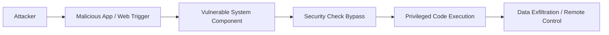

## 서론

새벽 3시, 당신의 스마트폰이 알림 없이 깨어납니다. 화면은 켜지지 않았지만, 내부 프로세서는 미지의 코드를 열심히 실행하고 있습니다. 배터리가 급격히 줄어들고 데이터 사용량이 비정상적으로 치솟지만, 사용자는 이를 인지하지 못합니다. 이것은 영화 속 장면이 아니며, Google이 최근 긴급 보안 권고를 발표하며 확인한 **Android 0-Day Exploit**의 현실적인 시나리오입니다.

Google은 Android 플랫폼의 핵심 구성 요소에서 현재 활발히 악용(In-the-Wild)되고 있는 취약점을 확인했습니다. 이 공격은 별도의 사용자 개입 없이도, 혹은 사소한 클릭 하나로 기기의 권한을 탈취할 수 있는 "보안 우회(Security Bypass)" 기반입니다. 왜 우리가 이 문제에 즉각 주목해야 할까요? 단순히 기기 하나가 해킹당하는 문제를 넘어, 이 스마트폰이 우리의 금융 정보, 위치 정보, 그리고 연결된 모든 사물인터넷(IoT) 생태계의 열쇠이기 때문입니다. 이 글에서는 막연한 불안감을 떠치고, 실제 공격이 어떻게 수행되는지 기술적으로 분석하고, 보안 전문가로서의 관점에서 구체적인 살생부를 작성해 보겠습니다.

## 본론

### 취약점 기술 분석 및 공격 메커니즘

이번에 발견된 0-Day 취약점은 주로 Android 프레임워크 계층의 권한 검증 로직(Logical Flaw)을 우회하는 형태를 띱니다. 공격자는 이를 통해 샌드박스 격리 정책을 무력화하고, 일반 앱 권한으로 시스템 권한을 가진 명령어를 실행할 수 있습니다.

> **⚠️ 윤리적 경고**: 아래 내용은 보안 취약점의 원리를 이해하고 방어 전략을 수립하기 위한 학습 목적입니다. 악의적인 목적으로 이 기술을 사용하는 것은 범죄 행위이며 엄격히 금지됩니다.

공격의 핵심은 **"권한 승격(Privilege Escalation)"**과 **"의도(Intent) 리디렉션"**입니다. 공격자는 악의적인 앱을 배포하거나, 웹페이지를 통해 특수하게 조작된 데이터를 전송합니다. 이 데이터는 Android 시스템의 특정 서비스가 예상치 못한 형태의 파라미터를 받아 처리하는 과정에서 발생하는 논리적 오류를 트리거합니다.

아래 다이어그램은 공격자가 0-Day 취약점을 이용해 일반 앱에서 시스템 권한을 탈취하는 흐름을 간소화하여 도식화한 것입니다.



이 흐름에서 가장 중요한 단계는 **`Security Check Bypass`**입니다. 정상적인 상황이라면 시스템 컴포넌트는 요청자의 UID(User ID)와 권한을 확인한 뒤 요청을 거부해야 합니다. 그러나 이번 취약점은 이 확인 과정에서 특정 조건을 만족할 경우 검증 루틴을 건너뛰게 만듭니다.

#### 공격 시나리오 및 비교 분석

이 공격이 기존의 일반 앱 공격과 어떻게 다른지 비교해 보겠습니다.

| 비교 항목 | 일반 악성코드 (General Malware) | 0-Day 보안 우회 공격 (This Exploit) |
| :--- | :--- | :--- |
| **진입 경로** | 사용자가 직접 APK 설치 및 권한 허용 필요 | 드라이브-바이-다운로드 또는 피싱 링크 클릭만으로 가능 |
| **필요 권한** | 연락처, SMS 등 위험 권한 요청 (사용자 인지) | 별도의 위험 권한 요청 없이 시스템 권한 탈취 가능 |
| **탐지 난이도** | 백신 소프트웨어에서 패턴 기반 탐지 용이 | 행위 패턴이 정상 프로세스와 유사하여 탐지가 매우 어려움 |
| **피해 규모** | 해당 앱의 허용된 범위 내로 제한 | 기기 전체의 제어권 장악 및 다른 앱 데이터 침해 가능 |

### 실무적 대응: PoC 및 점검 코드

보안 전문가로서 우리는 이론에만 머물러서는 안 됩니다. 실제 환경에서 기기가 이러한 위협에 노출되었는지, 그리고 패치가 적용되었는지 확인하는 절차가 필요합니다.

아래는 Python을 사용하여 안드로이드 기기의 보안 패치 수준을 확인하는 **PoC(Proof of Concept) 스크립트**입니다. ADB(Android Debug Bridge)가 활성화된 환경에서 실행 가능하며, 해당 0-Day가 패치된 날짜 이후의 빌드인지 검증합니다.

```python
import subprocess
import re
from datetime import datetime

def check_security_patch_level():
    """
    ADB를 통해 Android 기기의 보안 패치 수준을 확인합니다.
    이 취약점은 2023년 10월 이전의 빌드에 영향을 미치는 것으로 가정합니다.
    (실제 패치 날짜는 Google Security Bulletin을 참조하여 업데이트해야 합니다.)
    """
    try:
        # ADB 명령어 실행: 보안 패치 날짜 가져오기
        result = subprocess.run(['adb', 'shell', 'getprop', 'ro.build.version.security_patch'],
                                capture_output=True, text=True, check=True)
        
        patch_date_str = result.stdout.strip()
        print(f"[+] 현재 기기의 보안 패치 날짜: {patch_date_str}")
        
        # 날짜 파싱 (YYYY-MM-DD)
        patch_date = datetime.strptime(patch_date_str, "%Y-%m-%d")
        
        # 취약점이 패치된 기준 날짜 설정 (예: 2023-10-01)
        # 실제 시나리오에서는 해당 CVE에 대한 구체적인 패치 날짜를 입력해야 합니다.
        safe_date = datetime(2023, 10, 1)
        
        if patch_date < safe_date:
            print("[!] 경고: 기기가 0-Day 취약점에 취약한 상태입니다. 즉시 보안 업데이트를 진행하세요.")
            return False
        else:
            print("[OK] 안전: 기기가 해당 취약점에 대한 패치가 적용되었습니다.")
            return True
            
    except subprocess.CalledProcessError:
        print("[-] 오류: ADB 연결을 확인하거나 USB 디버깅이 활성화되어 있는지 확인하세요.")
    except ValueError:
        print("[-] 오류: 날짜 형식을 읽을 수 없습니다.")
    except Exception as e:
        print(f"[-] 알 수 없는 오류 발생: {e}")

if __name__ == "__main__":
    print("=== Android 0-Day Vulnerability Checker ===")
    check_security_patch_level()
```

이 코드는 단순히 날짜를 확인하는 것이지만, 실제 침해 사고 조사(Incident Response) 시나리오에서는 로그(Logcat) 분석, 특정 시스템 바이너리의 해시값 검증 등으로 확장될 수 있습니다.

### 단계별 완화 조치 (Mitigation Strategy)

기술적인 원리를 파악했다면, 이제 방어를 해야 합니다. "업데이트를 하세요"라는 말은 맞지만, 현장에서는 실행 가능한 구체적인 행동 지침이 필요합니다.

**Step 1: 즉시 보안 패치 적용** 설정 > 휴대전화 정보 > 소프트웨어 정보 > 시스템 업데이트로 이동하여 최신 패치가 설치되어 있는지 확인합니다. Google은 이번 취약점에 대해 **2023년 10월 보안 패치** 이상을 강력히 권장하고 있습니다.

**Step 2: '알 수 없는 출처' 설치 차단** 공격자는 주로 탈옥이나 루팅된 기기, 혹은 보안 설정이 허술한 기기를 노립니다. 다음 설정을 반드시 `OFF`로 유지해야 합니다.

- 경로: 설정 > 보안 > 알 수 없는 출처(또는 설치 허용)

**Step 3: Google Play Protect 강제 실행** 기본적으로 활성화되어 있지만, 공격자가 비활성화했을 가능성을 배제할 수 없습니다.

```bash
# ADB를 통해 Google Play Protect 활성화 상태 확인 및 강제 스캔 트리거 예시
adb shell pm enable com.google.android.gms/.update.SystemUpdateActivity
```

(주의: 위 명령어는 개발자 옵션 및 기기에 따라 동작하지 않을 수 있으며, Play Protect 앱 내에서 수동으로 '스캔' 버튼을 누르는 것이 가장 확실합니다.)

## 결론

이번 Android 0-Day Exploit 사태는 모바일 보안의 판도를 바꾸는 결정적인 사건이 될 수 있습니다. 공격자는 더 이상 사용자의 민첩함(클릭 실수)만 노리는 것이 아니라, 시스템의 깊숙한 로직 결함을 노려 무인 약탈을 자행하고 있습니다.

핵심 요약하자면, 이번 공격은 **권한 검증 우회**를 통해 시스템 권한을 탈취하는 고도로 정교한 기법입니다. 개발사와 사용자 모두에게 주는 전문가의 인사이트는 이것입니다: **"보안은 완성된 결과물이 아니라 지속적인 프로세스입니다."**

단순히 백신 앱을 설치하는 것만으로는 부족합니다. 기기의 빌드 버전을 확인하고, 최신 보안 패치를 적용하는 이 '지루한' 작업이 사이버 공격으로부터 당신의 디지털 자산을 지키는 최후의 보루입니다. 혹시 주변에 보안 업데이트를 미루고 있는 기기가 있다면 지금 당장 확인해 주시기 바랍니다.

**참고자료:**

- [Android Security Bulletins](https://source.android.com/security/bulletin)

- [CVE Details - Vulnerability Database](https://www.cvedetails.com/)
