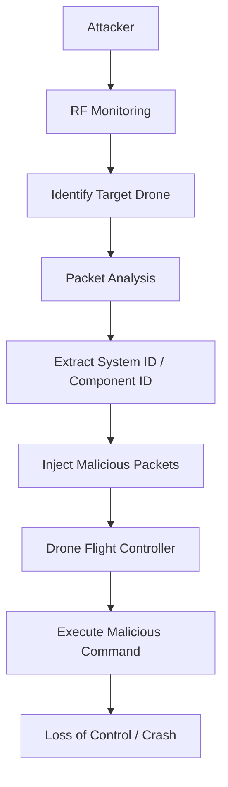

## 서론

상공 150미터, 정밀한 경로를 따라 이동하던 물류 배송 드론이 갑자기 제멋대로 회전하며 건물 쪽으로 급강하하기 시작합니다. 운영자는 패닉에 빠져 조종기를 향해 긴급 명령을 보내지만, 드론은 이미 아무런 반응을 보이지 않습니다. 이는 영화 속 장면이 아니라, 최근 연구진들이 실제로 입증한 자율 주행 드론(Autonomous Drone) 시스템의 취약점 시나리오입니다.

우리는 흔히 드론 해킹이라 하면 GPS 스푸핑(Spoofing)이나 재밍(Jamming)을 떠올립니다. 하지만 자율 비행 시스템이 고도화되면서 공격자의 타겟은 단순한 위치 정보 교란을 넘어, 드론의 '두뇌'인 비행 제어 컴퓨터와 통신 프로토콜 자체로 이동했습니다. 만약 공격자가 드론과 운영 서버 사이의 통신 신뢰성을 깨고 악의적인 명령을 주입한다면, 해당 드론은 살아있는 무기가 되거나 중요한 정보를 탈취당하는 블랙박스로 전락할 것입니다. 이 글에서는 방어적 관점에서 이러한 치명적인 취약점이 어떻게 발생하며, 실제 공격 시나리오는 어떻게 전개되는지 기술적으로 심층 분석합니다.

## 본론

### 기술적 배경: 드론 통신 프로토콜의 신뢰성 문제

자율 주행 드론은 보통 MAVLink(Micro Air Vehicle Link)와 같은 경량 프로토콜을 사용하여 지상 통제소(GCS)와 통신합니다. 문제는 많은 상용 드론 시스템이 데이터 전송의 효율성을 위해 암호화나 인증 절차를 생략하거나 취약한 기본 설정(Default Settings)을 그대로 사용한다는 점입니다.

대부분의 드론 시스템은 "신뢰할 수 있는 통신 링크"를 가정합니다. 즉, 패킷을 보낸 주체가 누구인지 확인(인증)하지 않고, 패킷 내용이 변조되지 않았는지 확인(무결성)하지 않은 채 수신된 명령을 즉시 실행합니다. 공격자는 이러한 맹목적인 신뢰를 악용하여 시스템의 권한을 탈취할 수 있습니다. 특히 자율 비행 모드에서는 드론이 스스로 센서 값을 판단하지만, 외부에서 주입되는 "Waypoint(경유점)"나 "Home Position(귀환 위치)" 명령은 최우선 순위로 처리되는 경우가 많아 위험합니다.

### 공격 시나리오 및 흐름도

다음은 공격자가 드론의 통신 채널을 감청하고 악의적인 명령을 주입하여 제어권을 탈취하는 과정을 시각화한 흐름도입니다.



이 과정에서 공격자는 별도의 물리적 접촉 없이 무선 주파수(RF) 범위 내만 있다면 드론의 비행 경로를 변경하거나 급강하시킬 수 있습니다.

### PoC (Concept of Proof) 코드 분석

**⚠️ 윤리적 경고**: 아래 코드는 보안 취약점의 원리를 이해하고 방어책을 마련하기 위한 학습 목적으로 작성되었습니다. 승인되지 않은 시스템에서의 실행은 불법이며 엄격히 금지됩니다.

Python의 `pymavlink` 라이브러리를 사용하여 공격자가 특정 좌표로 강제 이동시키는 명령 패킷을 생성하는 시나리오입니다. 실제 공격에서는 이 패킷을 무선으로 전송하지만, 여기서는 패킷 생성 로직에 집중합니다.

```python
from pymavlink import mavutil

# attacker: 드론 시스템을 흉내 내어 악의적인 메시지 생성
def create_malicious_waypoint_packet(target_system, target_component, lat, lon, alt):
    # MAVLink 메시지 마스터 생성
    mav = mavutil.mavlink.MAVLink(...)
    
    # SET_POSITION_TARGET_LOCAL_NED 메시지 생성 (국부 좌표계 기반 강제 이동)
    # 실제 공격에서는 GLOBAL_POSITION_INT 등을 사용하여 절대 좌표를 덮어씌울 수 있음
    msg = mav.set_position_target_local_ned_encode(
        0,       # time_boot_ms (타임스탬프)
        target_system,    # 타겟 시스템 ID (드론의 ID)
        target_component, # 타겟 컴포넌트 ID (예: 오토파일럿)
        mavutil.mavlink.MAV_FRAME_GLOBAL_RELATIVE_ALT, # 좌표계
        0b0000111111111000, # 타입 마스크 (X, Y, Z 위치만 강제 적용)
        0, 0, 0, # x, y, z 속도 (무시)
        0, 0, 0, # x, y, z 가속도 (무시)
        0, 0     # yaw, yaw_rate (무시)
    )
    
    # 참고: 실제 공격 시나리오에서는 위도/경도를 직접 설정하여 
    # 드론이 인식하는 현재 위치를 순간적으로 이동시키는 'GPS 스푸핑'과 유사한 효과를 내는 
    # 명령어를 주입하기도 합니다.
    return msg

# 예시: 시스템 ID 1인 드론을 공격한다고 가정
try:
    packet = create_malicious_waypoint_packet(1, 1, 35.6895, 139.6917, 10)
    print(f"Malicious packet generated: {packet}")
    print("실제 환경에서는 이 패킷을 무선 주파수를 통해 드론에게 브로드캐스팅합니다.")
except Exception as e:
    print(f"Packet generation failed: {e}")
```

이 코드는 드론이 "이동하라"는 명령을 신뢰하고 실행한다는 가정하에 작동합니다. 만약 드론이 디지털 서명(Digital Signature)을 검증하도록 설계되었다면, 이 패킷은 폐기되었을 것입니다.

### 취약점 비교 분석

안전하지 않은 드론 시스템과 보안이 강화된 시스템의 차이는 다음과 같습니다.

| 보안 요소 | 취약한 시스템 (Vulnerable) | 보안 강화 시스템 (Secured) |
| :--- | :--- | :--- |
| **인증 (Authentication)** | 없음. 누구든 패킷 전송 가능 | 양방향 인증 및 디지털 서명 검증 |
| **암호화 (Encryption)** | 평문(Plain text) 통신 | AES-256 등 강력한 통신 암호화 |
| **링크 상태 감지** | 명령 신호만 수신 | 신호 대 잡음비(SNR) 및 지리적 펜싱(Geofencing) 위반 시 차단 |
| **펌웨어 무결성** | 부트로더 접근 제한 없음 | Secure Boot 및 체이닝 로드 확인 |

### 완화 조치 및 방어 전략

이러한 공격을 방어하기 위해서는 단순한 소프트웨어 업데이트를 넘어 설계 철학의 변화가 필요합니다.

1.  **MAVLink 2.0 서명 적용**: MAVLink 2.0 프로토콜은 패킷 서명(Packet Signing) 기능을 지원합니다. 256비트 키를 사용하여 모든 패킷에 서명함으로써, 인증되지 않은 송신자(공격자)의 명령이 시스템에 진입하는 것을 원천 차단해야 합니다.

2.  **이상 행위 탐지(Anomaly Detection)**: 드론의 센서 퓨전(Sensor Fusion) 알고리즘을 강화하여, 외부 명령과 자체 센서(IMU, GPS, 바로미터) 값 간의 모순을 감지해야 합니다. 예를 들어, GPS가 "정지 중"이라고 보고하는데 갑자기 "최대 속도" 명령이 들어오면 시스템이 이를 거부하고 안전 모드(RTL/Failsafe)로 진입해야 합니다.

3.  **링크 키(Link Key) 관리**: 출하 시 기본 키(Default Key)를 사용하지 말고, 배치 시마다 고유한 암호화 키를 주입하는 절차를 의무화해야 합니다.

## 결론

자율 주행 드론의 보안 취약점은 단순히 기기가 고장 나는 것을 넘어 물리적 세계로의 사이버 공격 경로를 제공한다는 점에서 매우 위험합니다. 우리가 분석한 시나리오는 통신 프로토콜의 '신뢰'를 악용한 것으로, 모든 드론 제조사와 운영자는 "기본적으로 신뢰하지 말고 검증하(Zero Trust)"는 원칙을 적용해야 합니다.

보안 전문가로서의 인사이트는 다음과 같습니다. 드론 보안의 핵심은 "통신의 기밀성"보다 "명령의 무결성과 인증"에 있습니다. 아무리 통신 내용을 암호화하더라도, 공격자가 암호화된 채널을 뚫고 들어오거나 리플레이 공격(Replay Attack)을 감행한다면, 수신부는 이 명령이 유효한 사용자의 것인지 반드시 확인해야 합니다. 앞으로는 드론 개발 단계에서 Secure Coding과 Threat Modeling이 선택이 아닌 필수가 될 것입니다.

### 참고자료

- [MAVLink 2.0 Packet Signing](https://mavlink.io/en/guide/signed_packets.html)

- [OWASP Internet of Things Top 10](https://owasp.org/www-project-internet-of-things/)

- [Researchers expose critical security vulnerability in autonomous drones (Tech Xplore)](https://news.google.com/rss/articles/CBMikgFBVV95cUxPWFE1Y1FjSWFPQXY4NFBoN2dtMjR1MGRvVmVlZWRkYkhsWjkwVDhPX19iODVpWFBXS2JnV29aY0FhQmJSTTdmeVFNNFVFaldTc2NLcWhkYmI5cGNlNWswM0dwX000eHgyazU2cG1vZmtsNG1BNnd6VU93ZUdOQldQQVhmQ2tLTzQ2SnVBTy11c0laUQ)
