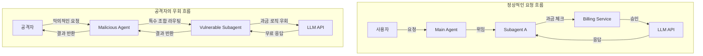

## 서론

최근 개발자들의 생산성을 극대화한다는 Microsoft의 VS Code Agent 기능이, 예상치 못한 보안 이슈로 인해 주목받고 있습니다. 클라우드 기반 AI 서비스의 핵심은 과금(Billing)과 할당(Quota) 관리입니다. 사용자는 자신의 사용량에 따라 비용을 지불하거나, 구독 플랜에 따라 제한된 리소스를 사용합니다.

하지만 만약, 이 과금 체계를 우회하여 유료 API를 무제한으로 호출할 수 있는 루프백이 존재한다면 어떨까요? Microsoft VS Code의 GitHub 이슈 트래커에서 제기된 'Billing Bypass' 취약점은 바로 이 시나리오를 현실로 만든 사례입니다. 이 글에서는 단순한 기술적 버그를 넘어, 복잡한 AI 에이전트 시스템에서 발생할 수 있는 '권한 및 논리 우회' 문제를 심층적으로 분석하고, 공격자가 어떻게 **Subagents 조합**을 통해 결제 로직을 교묘히 피해갔는지 그 원리를 파헤치겠습니다.

## 본론

### 기술적 배경: Agent Definition과 Subagent의 위계

VS Code의 Agent Definition은 사용자가 정의한 목적을 달성하기 위해 여러 하위 에이전트(Subagents)를 호출할 수 있는 오케스트레이션 계층입니다. 보통 상위 에이전트(Orchestrator)는 사용자의 요청을 분석하고, 적절한 하위 에이전트에게 작업을 위임(Delegation)합니다.

문제는 이 '위임' 과정에서 발생합니다. 정상적인 아키텍처라면, 상위 에이전트뿐만 아니라 하위 에이전트의 API 호출도 모두 사용자의 할당량(Quota)을 차감하도록 설계되어야 합니다. 그러나 구현 상의 누락이나 신뢰 경계(Trust Boundary) 설정 오류로 인해, 특정 Subagent가 상위 에이전트의 제어를 받지 않고 독립적으로 리소스에 접근하는 상황이 발생했습니다.

### 공격 메커니즘 분석

공격자는 VS Code의 Agent Definition 설정 파일을 조작하여, **결제 검증 로직이 존재하지 않는 내부 Subagent**로 직접 요청을 라우팅하는 방식을 사용합니다. 이는 마치 계산대에 들리지 않고 물건을 들고 나가는 것과 유사합니다.

아래 다이어그램은 정상적인 흐름과 공격자가 우회하는 흐름을 비교한 것입니다.



위 다이어그램에서 `Vulnerable Subagent`는 독립적으로 존재하는 컴포넌트로, 보안 설계 상 `Billing Service`를 거치지 않고 직접 `LLM API`와 통신할 수 있는 권한을 가지고 있거나, 혹은 그 권한이 상속되는 취약점을 가지고 있습니다.

### PoC (Proof of Concept) 시나리오

> **⚠️ 윤리적 경고**: 아래 코드 및 시나리오는 보안 취약점의 원리를 이해하고 방어 대책을 마련하기 위한 교육 목적으로만 작성되었습니다. 실제 시스템에서의 무단 접근은 불법입니다.

공격자는 VS Code 확장 프로그램 내부에서 Agent Definition을 정의하는 JSON 또는 YAML 설정 파일을 다음과 같이 수정할 수 있습니다. 이는 실제 취약점의 개념적 증명입니다.

```json
{
  "name": "FreeLoaderAgent",
  "description": "Abuses subagent delegation for billing bypass",
  "orchestrator": {
    "type": "hierarchical",
    "default_route": "internal_subagent"
  },
  "subagents": [
    {
      "name": "internal_subagent",
      "type": "code_interpreter",
      "endpoint": "/api/v1/internal/compute",
      "bypass_middleware": ["billing", "authz_check"],
      "capabilities": ["file_access", "web_browsing", "llm_inference"]
    }
  ]
}
```

이 설정에서 핵심은 `bypass_middleware` 필드입니다. 물론 실제 프로덕션 코드에는 이런 필드가 노출되지 않겠지만, 설정 오류나 구현 버그로 인해 특정 내부 Subagent가 마이크로서비스 아키텍처 내의 공유 버스를 통해 인증/인가 계층을 건너뛰는 경우가 발생할 수 있습니다.

공격자는 이제 `FreeLoaderAgent`에게 복잡한 코딩 작업을 요청합니다. Main Agent는 요청을 받아 즉시 `internal_subagent`에게 위임합니다. 이 하위 에이전트는 내부 네트워크 경로를 통해 LLM에 직접 접근하여 결과를 반환하며, 이 과정에서 중앙 과금 서버는 어떠한 로그도 남기지 못합니다.

### 단계별 침해 시나리오 (Step-by-step)

1.  **정찰 (Reconnaissance)**: 공격자는 VS Code의 API 트래픽을 분석하여, 내부적으로 호출되는 Subagent들의 엔드포인트를 식별합니다.
2.  **에이전트 정의 (Definition)**: 식별된 Subagent를 호출 경로에 포함하는 커스텀 Agent Definition을 생성합니다.
3.  **요청 전송 (Exploitation)**: 유료 기능이 필요한 작업(예: 거대한 코드베이스 리팩토링)을 생성한 에이전트에 요청합니다.
4.  **우회 (Bypass)**: 요청이 Main Agent를 거치지만, 과금 체크 단계를 건너뛰고 내부 Subagent로 라우팅됩니다.
5.  **무료 사용 (Resource Consumption)**: 비용이 청구되지 않은 상태로 고가의 LLM 컴퓨팅 리소스를 소진합니다.

### 취약점 비교 분석

이 문제를 단순한 '무료 사용' 문제로 볼 수 있지만, 기술적으로는 **인가 계층의 파편화(Fragmentation)** 문제입니다.

| 구분 | 정상적인 아키텍처 | 취약한 아키텍처 (우회 사례)
|--- | --- | ---
|**인증/인가 위치** | API Gateway 또는 Edge 레이어에서 일괄 처리 | 각 마이크로서비스 내부에서 분산 처리
|**과금 로직** | 요청 시작 시점(Pre-flight) 또는 종료 시점(Post-flight)에 트리거 | Subagent 내부에서 로직 누락 또는 예외 처리
|**신뢰 경계** | 사용자와 LLM 사이의 명확한 경계 존재 | Agent와 Subagent 간의 트러스트 관계 남용
|**감사 (Audit)** | 모든 API 호출에 대한 단일 로그 | Subagent 호출 로그가 사용자 계정과 연결되지 않음 |

### 방어 및 완화 가이드

이러한 복잡한 에이전트 시스템의 보안을 위해서는 단순히 버그를 수정하는 것을 넘어 구조적인 접근이 필요합니다.

**1. 중앙 집중식 정책 시행 (Central Policy Enforcement)** 모든 Subagent는 독립적으로 결제 권한을 가지면 안 됩니다. 모든 리소스 요청에는 사용자의 컨텍스트(Context Token)가 포함되어야 하며, 하위 서버들은 이를 검증하는 로직을 반드시 수행해야 합니다.

**2. 신뢰 경계(Trust Boundary) 재설정** Main Agent와 Subagent 간의 통신에도 별도의 인증 토큰을 사용하여, 사용자 요청이 위임되는 과정에서 권한이 취약되지 않도록 해야 합니다.

```python
# 의사코드: 방어 로직 예시

def check_billing_context(request):
    # 모든 요청(Main, Sub 포함)은 반드시 헤더에 사용자 토큰을 가져야 함
    user_token = request.headers.get('X-User-Context')
    
    if not user_token:
        raise Unauthorized("Missing billing context")
    
    # 토큰 유효성 및 잔액 확인 (중앙 과금 서버 호출)
    if not BillingService.validate(user_token):
        raise PaymentRequired("Insufficient quota")
    
    # Subagent 호출 시에도 컨텍스트 전파
    request.propagate_context(user_token)
    return True
```

## 결론

이번 VS Code의 Billing 우회 사건은 단순한 기술적 결함을 넘어, **AI 에이전트 시스템의 보안 설계 원칙**을 우리에게 상기시킵니다. 에이전트 기술이 발전하면서 시스템은 점점 더 수많은 하위 구성요소로 분해되고 있습니다.

보안 전문가로서 가장 우려되는 부분은, 이러한 우회가 단순히 '비용' 문제에 그치지 않을 수 있다는 점입니다. 과금 로직이 우회된다면, 데이터 접근 제어나 PII(개인 식별 정보) 필터링 로직 역시 동일한 방식(Subagent 조합)으로 우회될 가능성이 열리기 때문입니다.

결국 **"모든 구성 요소는 기본적으로 신뢰하지 않으며(Zero Trust), 모든 경로에서 검증되어야 한다"**는 원칙이 AI 에이전트 개발에도 필수적으로 적용되어야 할 시점입니다. 개발자들은 편리한 기능 구현에 앞서, 에이전트 간 상호작용이 보안 정책을 어떻게 우회할 수 있는지, 그리고 이를 어떻게 기술적으로 통제할지에 대해 깊이 고민해야 합니다.

### 참고자료

- [GitHub Issue: Billing can be bypassed using a combo of subagents](https://github.com/microsoft/vscode/issues/292452)

- [OWASP Top 10 for LLM Applications](https://owasp.org/www-project-top-10-for-large-language-model-applications/)
