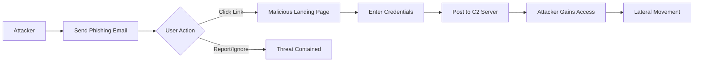

## 서론

스위스 제네바 지하 깊은 곳에서 입자를 가속해 우주의 기원을 탐구하는 유럽 입자 물리 연구소(CERN). 우리는 보통 이곳을 세계 최고 수준의 첨단 과학 기술과 뛰어난 두뇌들이 모인 곳으로 생각합니다. 그곳의 연구원들은 퀀텀 역학을 다루고, 거대한 데이터를 처리하는 전문가들입니다. 하지만 이들의 지능과 상관없이, 보안의 가장 취약한 고리는 언제나 '사람'이라는 사실을 뼈저리게 증명한 사건이 발생했습니다.

최근 CERN의 컴퓨터 보안 팀(CERN Computer Security)이 직원들을 대상으로 경종을 울린 '피싱(Phishing)' 사건은 보안 업계에 중요한 교훈을 남겼습니다. 공격자는 고도화된 기술적 스킬보다는, 당연한 상식과 심리적 허점을 파고드는 사회공학(Social Engineering) 기법을 사용했습니다. "과학자들이 클릭하지 않을 이메일은 없다"는 오만함은 무참히 깨졌고, 방화벽과 EDR(Endpoint Detection and Response)이 있어도 막을 수 없는 공격의 메커니즘이 다시 한번 조명되었습니다.

왜 우리는 여전히 피싱 공격에 당하는가? 그리고 CERN 사건을 통해 우리 조직은 어떤 교훈을 얻을 수 있는가? 이 글에서는 실제 발생했던 고도화된 피싱 시나리오를 기술적으로 분석하고, 전문가 관점에서의 실질적인 방어 전략을 제시합니다.

## 본론

### 공격 시나리오 분석: 신뢰를 위장한 기술

CERN을 겨냥한 공격자들은 단순한 "비밀번호 갱신" 이메일을 보내지 않았습니다. 그들은 연구원들이 매일 접하는 협업 도구나 내부 공지사항을 위장했습니다. 이 공격의 핵심은 **'Contextual Context'**입니다. 피해자의 업무 환경과 상황에 맞는 맥락을 제공함으로써, 이메일을 열람하고 링크를 클릭할 확률을 극대화한 것입니다.

**⚠️ 윤리적 경고**: 아래에 설명되는 공격 기법과 코드는 오직 방어 목적의 이해와 시뮬레이션을 위해 제공됩니다. 승인되지 않은 시스템에서의 테스트는 불법입니다.

공격자는 흔히 사용되는 HTML 스푸핑(Spoofing) 기법을 넘어, URL 자체를 교묘하게 조작했습니다. 예를 들어, 정상적인 CERN 포털 주소인 `web.cern.ch`와 유사한 `web-cern.ch`나 `cern.ch.web-login.com`과 같은 도메인을 사용하거나, Unicode 문자를 활용한 동형 이의어(Homograph) 공격을 감행할 수 있습니다.

아래는 이러한 피싱 공격이 사용자의 클릭부터 시스템 침투까지 이어지는 과정을 시각화한 것입니다.



이 다이어그램에서 가장 중요한 지점은 `C`와 `D` 사이입니다. 사용자가 링크를 클릭하는 순간, 기술적 방어선(IPS, WAF 등)을 우회하여 악성 서버와 직접 통신하게 됩니다.

### 악성 URL의 기술적 해부와 분석

보안 전문가로서 우리는 단순히 "클릭하지 마라"고 말하는 대신, 의심스러운 URL을 분석하는 도구를 제공해야 합니다. 공격자들은 사용자가 URL을 제대로 확인하지 않는다는 점을 악용합니다. 다음은 Python을 사용하여 URL의 구조를 분석하고, 피싱 시도를 감지할 수 있는 간단한 개념 증명(PoC) 코드입니다.

```python
# PoC: Basic Phishing URL Analyzer (Educational Purpose)
from urllib.parse import urlparse
import socket

def analyze_suspicious_url(url):
    print(f"Analyzing URL: {url}")
    parsed = urlparse(url)
    
    # 1. Netloc (Domain) 추출
    domain = parsed.netloc
    print(f"[*] Domain: {domain}")
    
    # 2. IP 주소 직접 연결 여부 체크 (피싱의 흔징적 특징)
    try:
        ip = socket.gethostbyname(domain)
        print(f"[*] Resolved IP: {ip}")
        
        # 도메인에 IP가 그대로 들어있는지 확인 (http://192.168.x.x 등)
        if domain.replace('.', '').isdigit():
            print("[!] WARNING: URL contains a raw IP address. Highly suspicious.")
            
        # 3. 자주 쓰이는 포트가 아닌 경우 체크
        if parsed.port and parsed.port not in [80, 443]:
            print(f"[!] WARNING: Unusual port detected: {parsed.port}")
            
    except socket.gaierror:
        print("[!] ERROR: Could not resolve domain (Possible typo or offline).")

    # 4. 시각적 피싱(Visual Spoofing) 유추를 위한 단순 분석
    suspicious_keywords = ['login', 'verify', 'account', 'update', 'secure']
    if any(keyword in url.lower() for keyword in suspicious_keywords):
        print("[!] NOTICE: URL contains common phishing keywords.")

# Example usage (Simulated suspicious URL)
# 실제 공격에서는 web.cern.ch를 위장한 도메인이 사용될 수 있음
example_url = "http://cern-login-verify.com/account/update"
analyze_suspicious_url(example_url)
```

이 코드는 URL 파싱을 통해 도메인과 IP를 추출하고, 기본적인 의심 징후를 찾아냅니다. 실제 환경에서는 이 로직을 확장하여 잘 알려진 피싱 도메인 리스트(PhishTank 등)와 대조하거나, TLS 인증서의 유효성을 검사하는 로직을 추가하여 자동화된 필터링 시스템을 구축할 수 있습니다.

### 정상 이메일 vs 피싱 이메일 상세 비교

공격을 방어하기 위해서는 정상적인 커뮤니케이션과 공격 시도를 명확히 구분할 수 있는 눈이 필요합니다. CERN 사건과 같은 고도화된 공격에서도 여전히 유효한 핵심 차이점은 다음과 같습니다.

| 비교 항목 | 정상적인 내부 공지/이메일 | 피싱 공격 이메일 (Spear Phishing) |
| :--- | :--- | :--- |
| **발신자 주소** | `department@cern.ch` (조직 도메인) | `support@cern-security-alert.com` (외부 도메인 위장) |
| **긴급성(Urgency)** | 업무적인 일정에 따른 안내 | "즉시 변경하지 않으면 계정이 차단됩니다" (심리적 압박) |
| **링크 대상** | `https://home.cern/` (공식 홈페이지) | `https://cern-secure-login.xyz/auth` (의심스러운 외부 링크) |
| **첨부파일** | 일반적인 문서(.pdf, .docx) | 악성 매크로가 포함된 문서나 .scr, .exe 파일 |
| **수신자** | 특정 부서 전체 또는 관련자 전체 | 무작위 대량 발송 또는 특정 인물 개인(정보 유출 시) |

### 방어 전략: 기술적 통제와 인식 제고

CERN의 사고 대응 팀이 사후 분석에서 강조했듯, 기술적 방어만으로는 부족합니다. 하지만 기술적 통제가 완벽히 갖춰지지 않으면 인식 프로그램의 효과는 떨어집니다. 다음은 계층별 방어 전략입니다.

**1. 기술적 레이어 (Hardening)**

- **DMARC/DKIM/SPF 강화**: 이메일 스푸핑을 차단하는 핵심 기술입니다. 도메인 기반 메시지 인증, 보고 및 적합성(DMARC) 정책을 `p=reject`로 설정하여 위장 이메일이 수신될 원천을 봉쇄해야 합니다.

- **Safe Browsing 및 URL 필터링**: 프록시 서버나 보안 게이트웨이에서 악성 URL 데이터베이스를 실시간으로 참조하여 접속을 차단합니다.

**2. 사용자 레이어 (Human Firewall)** 단순히 조심하라는 교육이 아니라, **'의심을 확인하는 절차(SOP)'**를 만들어야 합니다. 이메일 내의 링크를 바로 클릭하는 대신 다음 스텝을 따르도록 강제해야 합니다.

**Step-by-Step 이메일 검증 가이드:**
1.  **발신자 확인**: 'Display Name'(예: IT Admin)이 아닌 실제 'Email Address'를 더블 클릭하여 확인하십시오.
2.  **호버 효과 활용**: 마우스 커서를 링크 위에 올렸을 때, 브라우저 하단에 표시되는 실제 URL이 텍스트와 일치하는지 확인하십시오.
3.  **외부로 이동 시 로그인 금지**: 이메일을 통해 클릭한 페이지에서 바로 로그인 정보를 입력하지 말고, 브라우저에 직접 공식 사이트 주소를 입력해 로그인하십시오.
4.  **2단계 인증(MFA) 필수 사용**: 피싱으로 인해 비밀번호가 노출되더라도, MFA는 추가적인 인증 단계를 요구하므로 침해를 방지할 수 있습니다. CERN 사건에서도 MFA를 활성화한 계정은 대부분 안전했습니다.

## 결론

CERN에서 발생한 피싱 사건은 물리학자들이든 회계사든, 누구나 사회공학의 표적이 될 수 있음을 보여줍니다. 공격의 기법은 날로 정교해지고 있지만, 그 본질은 여전히 인간의 심리적 약점을 노리는 데 있습니다.

보안 전문가로서의 제 인사이트는 다음과 같습니다. 방화벽과 최신 백신 소프트웨어는 "성(Castle)"의 벽을 쌓는 것이지만, 피싱 방어는 성문을 지키는 병사를 훈련시키는 일과 같습니다. 기술적 통제(MFA, Email Filtering)가 병사의 갑옷과 무기라면, 보안 인식 교육은 전술 훈련입니다. 이 두 가지가 결합될 때 비로소 견고한 방어가 가능합니다.

CERN의 사례를 우리의 경험 삼아, 단순한 클릭 하나가 가져올 파급력을 인지하고, "의심의 버튼"을 누르는 습관을 기술적, 제도적으로 체화해야 합니다. 보안은 완성이 아니라 지속적인 과정입니다.

### 참고자료

- CERN Computer Security Team - "Phished" Incident Report

- NIST Special Publication 800-53: Security and Privacy Controls

- Anti-Phishing Working Group (APWG) - Global Phishing Trends Report
