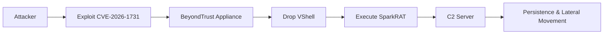

## 서론

새벽 2시, 보안 운영 센터(SOC) 대시보드의 빨간 경고등이 깜빡입니다. 내부망의 핵심인 특권 관리 액세스(PAM) 서버가 외부로 의심스러운 트래픽을 쏘고 있습니다. 방화벽规则은 정상적으로 설정되어 있었고, 서버는 최신 상태라고 생각했습니다. 하지만 공격자는 이미 그 믿음의 사각지대를 파고들어, 관리자의 권한을 탈취해 시스템 전체를 '좀비'로 만들 준비를 마쳤습니다.

이것은 단순한 시나리오가 아닙니다. 최근 Unit 42에서 보고된 바와 같이, BeyondTrust의 중요 취약점인 **CVE-2026-1731**이 실제 공격에 악용되고 있습니다. 이 취약점은 단순한 서비스 거부(DoS)를 넘어, 원격 코드 실행(RCE)이 가능하여 공격자가 서버의 장악권을 넘겨받을 수 있는 치명적인 결함입니다. 특히 이번 공격에서 주목해야 할 점은 단순히 취약점을 이용해 침투하는 것에 그치지 않고, **VShell**과 **SparkRAT**이라는 정교한 악성 도구를 결합해 지속적인 원격 제어 환경을 구축했다는 사실입니다. PAM 솔루션과 같은 신뢰할 수 있는 시스템이 공격의 발판이 될 때, 방어자가 취해야 할 다음 단계는 무엇일까요?

## 본론

### 공격 체인 분석: CVE-2026-1731부터 악성 도구 배포까지

CVE-2026-1731은 BeyondTrust 제품(주로 Remote Support나 Privileged Remote Access 관련 컴포넌트)의 특정 인터페이스에서 발생하는 입력 검증 누락 문제입니다. 공격자는 이 취약점을 통해 인증 과정을 우회하거나, 권한 상승을 유도하여 악성 스크립트를 서버에 주입합니다.

이번 공격 캠페인의 핵심은 취약점을 이용한 초기 침투 이후의 **후속 행동(Post-Exploitation)**에 있습니다. 공격자는 시스템 내부에 뿌리를 내리기 위해 두 가지 주요 도구를 사용했습니다. 첫 번째는 **VShell**입니다. 이는 웹 셸(Web Shell)의 일종으로, 공격자가 브라우저를 통해 서버 내에서 명령어를 직접 실행할 수 있는 백도어 역할을 합니다. 두 번째는 **SparkRAT**으로, Go언어로 작성된 고도화된 원격 접속 트로이목마(RAT)입니다. SparkRAT은 크로스 플랫폼 기능을 제공하며, 흔적을 최소화하면서 공격자에게 지속적인 관리자 권한을 제공합니다.

다음은 이 공격의 전체적인 흐름을 간소화하여 나타낸 것입니다.



### 악성 도구 심층 분석: VShell과 SparkRAT

이 공격에서 사용된 악성 도구들은 각각의 역할이 분명합니다. VShell은 비교적 가벼운 웹 기반 인터페이스를 통해 즉각적인 명령 실행을 담당하고, SparkRAT은 더 복잡하고 지속적인 통신을 담당합니다. 특히 SparkRAT은 일반적인 RAT와 달리 트래픽을 정상 웹 트래픽으로 위장하거나, 특정 포트를 사용하여 탐지를 회피하는 기능을 포함하고 있는 경우가 많아 분석가들의 주의가 필요합니다.

다음 표는 이번 공격에서 확인된 일반적인 웹 셸과 SparkRAT의 주요 차이점을 비교한 것입니다.

| 비교 항목 | 일반적 Web Shell (VShell 포함) | SparkRAT |
| :--- | :--- | :--- |
| **주요 언어** | PHP, ASP, JSP 등 (웹 스크립트) | Go (Golang) |
| **지속성** | 웹 서버 프로세스에 의존 | 독립 실행형 (서비스/프로세스 등록) |
| **탐지 난이도** | 중간 (파일 시그니처 기반 탐지 가능) | 높음 (트래픽 암호화 및 패킹) |
| **기능** | 파일 관리, 명령어 실행 | 터미널 접속, 프록시, 키로깅, 파일 전송 |
| **통신 방식** | HTTP/HTTPS 요청/응답 | TCP/UDP 소켓 통신 (C2 프로토콜 사용) |

### 방어를 위한 탐지 및 대응 가이드

이러한 공격으로부터 시스템을 보호하기 위해서는 취약점 패치뿐만 아니라, 악성 행위를 조기에 포착하는 탐지 로직이 필수적입니다. 특히 SparkRAT과 같은 Go 기반 악성코드는 시스템 내에서 비정상적인 네트워크 연결을 시도한다는 점에 주목해야 합니다.

> **⚠️ 윤리적 경고**: 아래 제공되는 코드는 보안 연구 및 방어 목적의 학습용 예시입니다. 허가받지 않은 시스템에서 실행하는 것은 불법이며, 반드시 통제된 테스트 환경(격리된 랩 등)에서만 사용하십시오.

다음은 Python을 사용하여 시스템 내에서 비정상적인 연결을 시도하는 의심스러운 프로세스(특히 알려진 RAT의 특성을 보이는 프로세스)를 식별하는 간단한 스크립트 예시입니다.

```python
import psutil
import socket

def check_suspicious_processes():
    """
    비정상적인 네트워크 연결을 가진 프로세스를 탐지하는 예제 스크립트.
    실제 환경에서는 더 정교한 로직(예: 화이트리스트 매칭, 행태 분석)이 필요합니다.
    """
    suspicious_ports = [4444, 8080, 9999] # 공격자가 자주 사용하는 포트 예시
    found_threats = []

    print("[*] System Process Scan Started...")
    
    for conn in psutil.net_connections(kind='inet'):
        if conn.status == 'ESTABLISHED':
            try:
                process = psutil.Process(conn.pid)
                # 원격 IP가 내부망이 아닌 외부이면서 의심스러운 포트인 경우
                if conn.raddr and conn.raddr.port in suspicious_ports:
                    threat_info = {
                        "pid": conn.pid,
                        "name": process.name(),
                        "remote_addr": f"{conn.raddr.ip}:{conn.raddr.port}",
                        "cmdline": process.cmdline()
                    }
                    found_threats.append(threat_info)
            except (psutil.NoSuchProcess, psutil.AccessDenied, psutil.ZombieProcess):
                continue

    if found_threats:
        print("
[!] Potential Threat Detected:")
        for threat in found_threats:
            print(f"PID: {threat['pid']} | Name: {threat['name']}")
            print(f"Remote: {threat['remote_addr']}")
            print(f"Command: {threat['cmdline']}")
            print("-" * 30)
    else:
        print("[+] No obvious threats found on known ports.")

if __name__ == "__main__":
    check_suspicious_processes()
```

### 단계별 완화 조치 (Step-by-Step Mitigation)

실제 현장에서 적용해야 할 구체적인 완화 조치는 다음과 같습니다.

1.  **긴급 패치 적용 (Emergency Patching)**     *   BeyondTrust 공식 보안 권고를 확인하여 CVE-2026-1731에 대한 패치를 즉시 적용합니다. 패치 불가능한 경우, 영구적 해결책이 나올 때까지 해당 서비스를 외부 인터넷으로부터 격리합니다.

2.  **네트워크 세분화 (Network Segmentation)**     *   BeyondTrust 서버가 관리하는 대상 시스템과 인터넷 사이에 방화벽을 설치합니다. PAM 서버가 악용되더라도 내부 핵심 데이터베이스나 도메인 컨트롤러로 직접 침투할 수 없도록 접근 제어 리스트(ACL)를 강화합니다.

3.  **IOC(침해 지표) 기반 탐지**     *   VShell과 관련된 알려진 파일 해시(URL, 파일 경로 등)를 SIEM(Security Information and Event Management) 시스템에 등록하여 실시간 모니터링을 수행합니다.     *   비정상적인 프로세스 생성(예: 웹 서비스 계정에서 PowerShell 또는 Bash가 실행되는 등)에 대한 경고를 설정합니다.

4.  **계정 권한 검토**     *   침투가 의심되는 경우 BeyondTrust 관리자 계정 및 연결된 시스템 계정의 자격 증명을 폐기하고 재발급합니다. Pass-the-Hash 공격 등을 방지하기 위함입니다.

## 결론

CVE-2026-1731을 활용한 BeyondTrust 공격 캠페인은 현대 사이버 위협의 특징을 명확히 보여줍니다. 공격자는 단순히 시스템을 뚫고 들어오는 것을 넘어, VShell과 SparkRAT이라는 도구를 통해 환경에 맞춰 침투 경로를 최적화하고 지속성을 확보합니다. 특히 관리자가 가장 신뢰하는 PAM 솔루션을 공격의 발판으로 삼는다는 점이 이번 공격의 가장 큰 위협입니다.

보안 전문가로서의 제언은 다음과 같습니다. "방어는 벽을 높이 쌓는 것이 아니라, 벽 안에서 무슨 일이 벌어지는지 끊임없이 감시하는 것입니다." 외부의 침입을 100% 막는 것은 불가능에 가깝습니다. 따라서 취약점을 신속하게 패치하는 동시에, 정상적인 관리 트래픽과 위협 트래픽을 구분할 수 있는 심층 방어(Defense in Depth) 전략을 필수적으로 수립해야 합니다.

### 참고자료

- [Unit 42 Blog: VShell and SparkRAT Observed in Exploitation of BeyondTrust Critical Vulnerability](https://news.google.com/rss/articles/CBMib0FVX3lxTE9wMkFaUkdHdGZtYXFFTEcxVlM1a002eUcteHhrMGd6X2d3UElHd1lfZHVHeWU3TmhzNGlzcEpVSE5TTVliRmNOT2p5eUJxZUJrT3hVRFBSdmNXZ0lJY3ZnVF9pVHlsZmJUUGlwT0gtUQ?oc=5)

- [BeyondTrust Security Advisories](https://www.beyondtrust.com/trust-center/security-advisories)

- MITRE ATT&CK Framework: Remote Access Software
