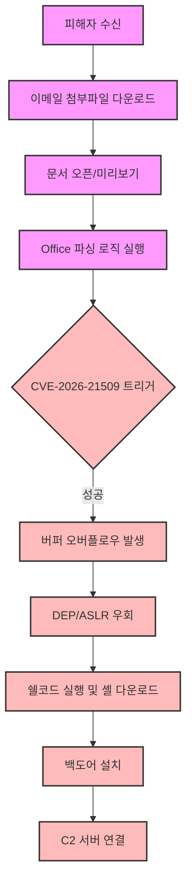

## 서론

 월요일 아침, 평소와 다름없이 출근한 재무팀 직원 A씨의 메일함에 정부 기관에서 발송한 것처럼 보이는 '납부 고지서'가 도착했습니다. 발신인이 신뢰할 수 있는 도메인처럼 위장되어 있었고, 제목 역시 긴급함을 자아내고 있었습니다. A씨는 아무런 의심 없이 첨부된 `.docx` 파일을 더블 클릭했습니다. 파일이 열리는 순간, 화면에는 아무런 이상 징후가 보이지 않았습니다. 하지만 배경에서는 눈에 보이지 않는 코드가 실행되었고, 불과 수 초 만에 내부망의 관리자 권한을 탈취하는 공격 코드가 침투했습니다.

이것은 영화 속 장면이 아니며, CVE-2026-21509로 명명된 이번 Microsoft Office 제로데이(Zero-Day) 취약점이 야기할 수 있는 현실적인 시나리오입니다. 현재 이 취약점은 완화 조치(Mitigation)가 완벽히 배포되기도 전에, 이미 실제 공격자들에 의해 악용되고 있는 'In-the-Wild' 상태입니다. 보안 업계에서 제로데이가 제로데이답게 무서운 이유는 바로 이 '시차' 때문입니다. 방어자는 패치가 배포되는 순간까지 속수무책으로 노출될 수 있습니다. 본 분석에서는 CVE-2026-21509의 기술적 작동 원리를 파헤치고, 공격자들이 이를 어떻게 무기화하는지 시각화하며, 여러분의 시스템을 지키기 위한 실전 가이드를 제시합니다.

> **⚠️ 윤리적 경고**: 본문에 포함된 기술적 내용과 코드는 방어 목적과 교육적 취지를 위해 작성되었습니다. 허가되지 않은 시스템에서의 테스트나 악용은 엄격히 금지됩니다.

## 본론

### 기술적 심층 분석: CVE-2026-21509의 메커니즘

CVE-2026-21509는 Microsoft Office 제품군(주로 Word 및 Outlook)의 특정 파일 파싱 로직(Parsing Logic)에서 발생하는 원격 코드 실행(RCE) 취약점으로 분류됩니다. Microsoft는 정확한 내부 메커니즘을 공개적으로 상세히 설명하지는 않았으나, 현재 분석된 바에 따르면 악성적으로 조작된 OLE(Object Linking and Embedding) 객체를 처리하는 과정에서 힙 기반의 버퍼 오버플로우(Heap Buffer Overflow)가 발생하는 것으로 추정됩니다.

공격자는 Microsoft Office의 복잡한 파일 구조를 이용하여, 정상적인 문서처럼 보이지만 내부적으로는 메모리 구조를 교란시키는 특수한 데이터를 삽입합니다. 사용자가 문서를 열거나 미리보기(Preview Pane) 기능이 활성화된 상태에서 해당 파일을 수신하기만 해도, 취약점이 트리거되어 시스템 권한(Level of Privilege) 상승 및 악성 코드 실행으로 이어집니다.

이 공격의 가장 큰 위험성은 '사용자 상호작용(User Interaction)'의 최소화에 있습니다. 과거의 매크로(Macro) 악성코드가 "콘텐츠 사용 허용" 버튼을 누르도록 유도하는 사회공학적 기술(Social Engineering)이 필요했다면, 이번 취약점은 파일을 여는 순간 자동으로 트리거될 수 있습니다.

### 공격 시나리오 시각화

아래 다이어그램은 공격자가 악성 문서를 제작부터 C2(Command & Control) 서버와의 연결에 이르기까지의 공격 체인(Kill Chain)을 단계별로 도식화한 것입니다.



### PoC 개념 증명 (방어적 분석용)

실제 익스플로잇 코드는 공개되지 않았으나, 보안 전문가들은 이러한 취약점이 어떻게 탐지될 수 있는지 이해해야 합니다. 아래의 Python 코드는 악성 OLE 객체의 패턴을 감지하여 의심스러운 문서를 식별하는 간단한 방어적 스크립트의 예시입니다. 이는 실제 공격을 수행하는 코드가 아니라, 침해 사고 대응(DFIR) 단계에서 파일을 분석하는 데 사용될 수 있습니다.

```python
import olefile
import re

def scan_office_file(file_path):
    """
    Microsoft Office 파일 내의 악성 OLE 객체 패턴을 스캔하는 함수
    """
    print(f"[*] Scanning: {file_path}")
    
    try:
        # OLE 파일 형식 확인
        if not olefile.isOleFile(file_path):
            print("[+] Not an OLE file (e.g., .docx without macros/ole).")
            return

        ole = olefile.OleFileIO(file_path)
        
        # OLE 스트림 데이터 추출 및 분석
        suspicious_pattern = re.compile(b'\x4d\x5a\x90\x00') # MZ 헤더 (실행 파일) 패턴
        detected = False

        for entry in ole.listdir():
            if entry:
                stream_data = ole.openstream(entry).read()
                if suspicious_pattern.search(stream_data):
                    print(f"[!] Suspicious OLE object detected in stream: {'/'.join(entry)}")
                    print("[!] Potential executable embed found.")
                    detected = True
        
        if not detected:
            print("[+] No obvious malicious patterns found in OLE streams.")
            
        ole.close()

    except Exception as e:
        print(f"[-] Error scanning file: {e}")

# 사용 예시 (분석할 파일 경로 지정)
# scan_office_file("malicious_doc.doc")
```

이 코드는 문서 내에 실행 파일(MZ 헤더)이 포함되어 있는지 확인하는 기본적인 로직을 포함하고 있습니다. CVE-2026-21509와 같은 취약점은 악성 페이로드를 문서 내에 숨기는 경향이 있으므로, 이러한 정적 분석(Static Analysis)이 초기 방어선으로서 유효할 수 있습니다.

### 완화 조치 비교 및 실무 가이드

단순히 "업데이트를 설치하세요"라는 말만으로는 조직의 보안을 책임질 수 없습니다. 각 환경에 맞는 구체적인 완화 전략(Mitigation Strategy)이 필요합니다. 아래 표는 가능한 방어 수단들을 비교 분석한 것입니다.

| 방어 수단 | 효과성 (High/Med/Low) | 구현 난이도 | 부작용/참고사항 | | :--- | :---: | :---: | :--- | | **보안 패치 적용** | **High** | Low | 가장 확실한 해결책. 재부팅 필요할 수 있음. | | **마크 오브 더 웹(MotW)** | **Med** | Low | 인터넷에서 다운로드한 파일 실행 차단. 우회 가능성 존재. | | **Microsoft Office 보안 강화** | **High** | Med | ActiveX, OLE 패키지 등의 기능 차단. 문서 호환성 이슈 발생 가능. | | **네트워크 분할** | **Med** | High | C2 서버와의 통신 차단. 랜섬웨어 확산 방지에 효과적. | | **EDR/XDR 솔루션** | **Med** | Med | 행동 기반 탐지. 패턴이 알려지지 않은 공격에 취약할 수 있음. |

#### 단계별 완화 조치 가이드

1.  **즉시 조치 (Immediate Action)**     *   **패치 확인**: Microsoft Update 또는 WSUS, SCCM을 통해 CVE-2026-21509에 해당하는 보안 업데이트(KB 번호 확인 필요)가 설치되었는지 확인하십시오.     *   **이메일 필터링**: `.doc`, `.docx`, `.rtf` 확장자를 가진 외부 이메일 첨부파일에 대해 차단 정책을 일시적으로 강화하십시오.

2.  **구체적 레지스트리 설정 (Registry Hardening)**     만약 즉시 패치 적용이 어려운 레거시 시스템이 존재한다면, 문서의 OLE 기능을 비활성화하여 공격 경로를 차단할 수 있습니다. (주의: 비즈니스 기능에 영향을 줄 수 있음)

    ```reg     Windows Registry Editor Version 5.00

    [HKEY_CURRENT_USER\Software\Microsoft\Office\16.0\Word\Security\ProtectedView]     "DisableInternetFilesInPV"=dword:00000000     ```

3.  **장기 대책 (Long-term Strategy)**     *   **최소 권한 원칙**: 관리자 권한으로 일반 업무용 문서를 열지 않도록 사용자 교육 및 환경 구성.     *   **Application Allowlisting**: 허용된 서명된 애플리케이션만 실행되도록 AppLocker 또는 similar 도구 구성.

## 결론

CVE-2026-21509는 사이버 보안의 판도를 바꾸는 결정적인 사건이 될 수 있습니다. 단순한 소프트웨어의 결함을 넘어, 신뢰했던 업무용 도구가 공격의 최전선이 될 수 있다는 사실을 다시금 상기시켜주기 때문입니다. 특히 이번 취약점은 이미 실제 공격에 활용된 'Exploited' 상태였으므로, 패치를 미루는 행위는 곧 보안 사고를 자초하는 행위와 다름없습니다.

전문가로서의 제 인사이트는 이것입니다. 보안은 특정 도구의 설치가 아니라 "신속한 대응 능력"입니다. 오늘 소개한 CVE-2026-21509 대응 과정에서 보듯, 취약점 공지가 떨어지는 순간부터 패치가 완료되는 시간까지가 골든타임입니다. 이 시간을 단축하기 위한 자동화된 패치 관리 시스템과, 직원들을 대상으로 한 지속적인 피싱 메일 교육만이 조직을 살리는 유일한 길입니다.

당장의 귀찮음이나 호환성 문제 때문에 업데이트를 미루지 마십시오. 공격자는 당신이 업데이트 버튼을 누르기 바로 직전을 노리고 있습니다.

### 참고자료

- [Microsoft Security Response Center (MSRC)](https://msrc.microsoft.com/)

- [NVD - CVE-2026-21509](https://nvd.nist.gov/vuln/detail/CVE-2026-21509)

- [The Hacker News - Original Report](https://thehackernews.com/)
