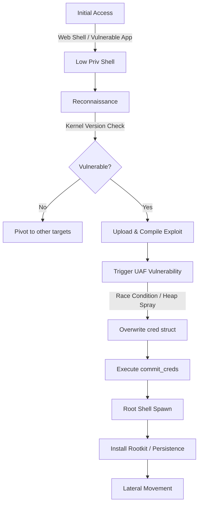

## 서론

새벽 2시, 침입 탐지 시스템(IDS) 관제 화면에 불길한 붉은색 경보가 울렸습니다. 웹 서버 로그에는 SQL 인젝션 시도가 기록되어 있었고, 몇 분 뒤 일반 유저 권한(`www-data`)으로 획득한 웹 셸이 연결되었습니다. 보안팀은 "일단 방화벽으로 막았으니 끝났다"고 안도했지만, 그 착각은 30분 만에 깨졌습니다. 내부 로그에 의심스러운 `systemd` 프로세스의 호출이 기록되었고, 시스템의 최고 권한인 Root 권한이 남몰래 탈취되었기 때문입니다.

이것은 단순한 가정이 아닙니다. 최근 CentOS 9 Stream 및 RHEL 9 계열 시스템에서 Root 권한 상승(LPE, Local Privilege Escalation)을 유발할 수 있는 치명적인 취약점이 발견되었습니다. 더욱 우려되는 점은 이 취약점을 악용할 수 있는 PoC(Proof of Concept) 코드가 이미 공개되었다는 사실입니다. 공격자는 더 이상 복잡한 0-day 익스플로잇을 개발할 필요가 없습니다. 공개된 코드를 다운로드하여 컴파일한 뒤, 약간의 수정만 가하면 바로 실전에서 사용할 수 있기 때문입니다.

클라우드 환경과 컨테이너 기술이 보편화된 지금, 단순한 웹 애플리케이션 취약점 하나가 전체 인프라의 붕괴로 이어질 수 있습니다. 왜 이번 이슈가 그토록 위험한지, 그리고 공격자가 어떻게 일반 유저에서 Root로 넘어가는지 그 기술적 배경과 메커니즘을 이해하는 것은 필수적입니다.

**[⚠️ 윤리적 경고]** 본 문서에 포함된 모든 기술적 정보, 시나리오 및 코드 예시는 보안 연구와 시스템 방어 목적으로 제공됩니다. 허가되지 않은 시스템에서 이 기술을 시도하거나 악용하는 것은 불법 행위이며, 엄중한 법적 책임을 질 수 있습니다.

---

## 본론: 취약점의 심층 분석과 공격 시나리오

### 1. 기술적 원리: 커널 공간의 붕괴

이번 CentOS 9 이슈의 핵심은 리눅스 커널의 특정 서브시스템(주로 Netfilter나 관련 커널 모듈)에서 발생하는 메모리 관리 허점에 있습니다. 공격자는 **Use-After-Free (UAF)** 취약점을 유발하여, 커널이 이미 해제(Free)한 메모리 영역을 다시 참조하도록 만듭니다.

리눅스 커널에서 프로세스의 권한은 `task_struct` 구조체 내부의 `cred` 구조체에 의해 결정됩니다. 이 구조체에는 UID(사용자 ID), GID(그룹 ID), 그리고 각종 Capability(권한 비트)가 저장되어 있습니다. 공격자의 목표는 이 `cred` 구조체를 자신이 통제할 수 있는 가짜(Fake) 구조체로 덮어써, 커널이 해당 프로세스를 Root 사용자로 착각하게 만드는 것입니다.

### 2. 공격 시나리오 다이어그램

다음은 공격자가 웹 셸 획득 후 Root 권한을 탈취하기까지의 전체 공격 흐름입니다.



### 3. 취약점 악용 메커니즘 상세 분석

공격자는 보통 다음과 같은 기법을 활용하여 메모리를 조작합니다.

1.  **객체 할당 및 해제**: 취약한 커널 오브젝트를 생성한 뒤 이를 해제합니다. 이때 커널 메모리 힙(Kmalloc)에 '구멍(Hole)'이 생깁니다.
2.  **힙 스프레이 (Heap Spray)**: 공격자는 이 구멍에 자신의 가짜 `cred` 구조체가 들어갈 수 있도록, 동일한 크기의 사용자 공간 데이터를 커널 공간으로 강제 주입합니다.
3.  **UAF 트리거**: 해제된 오브젝트를 다시 참조하는 코드 경로를 실행합니다. 커널은 이제 해제된 주소 대신 공격자가 심어둔 가짜 데이터를 읽게 됩니다.

| 공격 단계 | 커널 상태 | 공격자의 목표 |
| :--- | :--- | :--- |
| **Initialization** | 정상 상태 | 대상 커널 버전 및 KASLR 주소 유출 |
| **Preparation** | 할당/해제 반복 | 힙 구조를 조작하여 가짜 객체 배치 준비 |
| **Exploitation** | UAF 발생 | `current->cred` 포인터를 가짜 구조체로 변조 |
| **Privilege Swap** | 권한 변경 | `uid=0`, `gid=0`으로 설정된 메모리 읽기 |
| **Execution** | Root 권한 획득 | Root 셸 실행 또는 후행 악성 코드 실행 |

### 4. PoC (Proof of Concept) 코드 분석

아래 코드는 실제 공격 코드의 축약된 개념 버전입니다. 실제 악용 코드는 메모리 주소 계산과 스프레이 기법이 매우 복잡하지만, 핵심 로직은 다음과 같습니다.

```c
/*
 * [학습 목적] Linux Kernel Privilege Escalation Concept
 * 실제 시스템에서 실행하지 마십시오.
 * 컴파일: gcc -o exploit exploit.c
 */

#include <stdio.h>
#include <stdlib.h>
#include <string.h>
#include <unistd.h>
#include <sys/syscall.h>
#include <linux/types.h>

// 리눅스 커널 구조체 정의 (버전에 따라 다름)
struct cred {
    uid_t uid;
    gid_t gid;
    uid_t suid;
    gid_t sgid;
    uid_t euid;
    gid_t egid;
    // ... 기타 권한 필드
};

// 가상의 커널 심볼 주소 (실제 공격에서는 /proc/kallsyms 등에서 읽음)
size_t kernel_base = 0xffffffff81000000;
size_t commit_creds_addr = 0;
size_t prepare_kernel_cred_addr = 0;

// 권한 상승을 위한 제어 흐름 변경 (ROP 시뮬레이션)
void escalate_privileges() {
    printf("[*] Triggering payload to overwrite credentials...\n");

    // 공격자는 여기서 ROP(Return Oriented Programming) 체인을 사용하여
    // commit_creds(prepare_kernel_cred(0))를 호출합니다.

    struct cred *current_cred = NULL; // 실제로는 current_task->cred를 얻어야 함

    if (current_cred) {
        printf("[*] Overwriting struct cred at %p\n", (void*)current_cred);
        // 메모리 보호 우회 및 직접 쓰기 시도 (개념적 표현)
        // current_cred->uid = 0;
        // current_cred->gid = 0;
        // ...
    }
}

int main(int argc, char **argv) {
    printf("=== CentOS 9 LPE Exploit Concept ===\n");
    printf("Current UID: %d (Target: 0)\n", getuid());

    if (getuid() != 0) {
        printf("[*] Starting exploit...\n");

        // 1. 정보 수집 (Information Disclosure)
        // 2. 힙 조작 (Heap Feng Shui)
        // 3. 취약점 트리거 (Triggering the UAF)

        escalate_privileges();

        // 4. 권한 확인 및 셸 획득 시도
        if (getuid() == 0) {
            printf("[+] Success! Root privileges obtained.\n");
            system("/bin/sh");
        } else {
            printf("[-] Failed. Exploit did not work on this kernel version.\n");
        }
    } else {
        printf("[!] Already running as root.\n");
    }

    return 0;
}
```

이 코드는 단순히 논리를 보여주는 것이며, 실제 익스플로잇은 커널의 `kmalloc` 슬래버(Slab allocator)의 특성을 이용하여 매우 정교하게 메모리를 겹치게 만듭니다.

### 5. 실무 적용 가이드: 완화 조치 및 대응

이론적인 방어는 무의미합니다. 관리자는 구체적인 행동 계획(COOP)을 수립해야 합니다.

#### 단계 1: 패치 및 업데이트 (가장 우선순위) 취약점이 공개되었다면 벤더(Red Hat, CentOS)가 제공하는 보안 패치를 즉시 적용해야 합니다.

```bash
# CentOS 9 / RHEL 9 시스템 업데이트
sudo dnf clean all
sudo dnf update kernel -y

# 업데이트 후 재부팅 필수 (커널 업데이트이므로)
sudo reboot
```

#### 단계 2: 커널 하드닝 (Kernel Hardening) 패치를 적용하기 전, 혹은 패치 후 추가적인 보안 계층을 적용합니다.

**1. Kptr_restrict 활성화** 커널 포인터 주소 유출을 방지하여 KASLR 우회를 어렵게 만듭니다.

```bash
# /etc/sysctl.d/99-security.conf 파일 생성 또는 수정
echo "kernel.kptr_restrict = 1" | sudo tee -a /etc/sysctl.d/99-security.conf
sudo sysctl -p /etc/sysctl.d/99-security.conf
```

**2. dmesg 제한** 일반 유저가 커널 로그를 읽지 못하게 하여 정보 유출 차단.

```bash
echo "kernel.dmesg_restrict = 1" | sudo tee -a /etc/sysctl.d/99-security.conf
```

#### 단계 3: SELinux 강화 많은 관리자가 편의를 위해 SELinux를 끄지만, LPE 공격에 대해서는 SELinux가 마지막 방어선이 될 수 있습니다. 반드시 `Enforcing` 모드인지 확인하세요.

```bash
# 상태 확인
sestatus

# 만약 Disabled나 Permissive라면 Enforcing으로 변경
# 설정 파일 수정: /etc/selinux/config
# SELINUX=enforcing
```

### 6. 탐지 로직 (Detection Rule)

공격이 시도되는지 확인하기 위해 Auditd 규칙을 추가할 수 있습니다. 비정상적인 권한 상승 시도를 감지하는 규칙 예시입니다.

```bash
# /etc/audit/rules.d/priv-escalation.rules
-a always,exit -F arch=b64 -S execve -C uid!=euid -F key=priv_esc
-a always,exit -F arch=b64 -S execve -C gid!=egid -F key=priv_esc

# 규칙 적용
sudo augenrules --load
```

---

## 결론

CentOS 9에서 발견된 이번 권한 상승 취약점은 "클라우드 보안의 사각지대"를 명확히 보여줍니다. 공격자는 외부 방화벽을 뚫지 않고도, 웹 애플리케이션의 작은 허점 하나를 통해 서버의 최고 권한을 장악할 수 있습니다. 특히 PoC가 공개된 시점 이후, 기술적 장벽은 크게 낮아졌습니다.

방어의 핵심은 **"신뢰의 최소화"**입니다. 웹 서버 프로세스가 Root 권한을 필요로 하지 않도록 철저히 격리해야 하며, SELinux와 같은 강제 접근 제어(MAC) 시스템을 활성화하여 커널 레벨의 오동작이 시스템 전체로 확산되는 것을 막아야 합니다. 단순히 커널을 업데이트하는 것을 넘어, 시스템의 깊은 곳에서 일어나는 권한 변화를 실시간으로 모니터링할 수 있는 체계를 갖추는 것이 진정한 보안 대책입니다.

지금 당장 서버의 커널 버전을 확인하고, 미적용된 보안 패치는 없는지 점검하십시오. 보안은 "설치"가 아니라 "지속적인 관리"입니다.

### 참고자료

- [Red Hat Security Advisory](https://access.redhat.com/security/)
- [MITRE ATT&CK: Privilege Escalation (T1068)](https://attack.mitre.org/techniques/T1068/)
- [Linux Kernel Documentation](https://www.kernel.org/doc/html/latest/)
- [CentOS Stream 9 Release Notes](https://docs.centos.org/)
