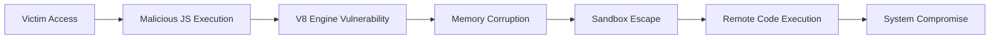

## 서론

상황은 이렇습니다. 한 대기업의 보안 운영 센터(SOC) 화면에 2026년 1월, 평소와 다를 바 없는 화요일 오후에 레드 알람이 울렸습니다. 내부 직원의 PC에서 C2(Command & Control) 서버로의 의심스러운 아웃바운드 트래픽이 감지된 것입니다. 초기 조사에서 직원은 평소처럼 업무 메일을 확인하고, 공급사의 견적서를 확인하던 중이었습니다. 다운로드한 문서가 없었고, 매크로가 포함된 엑셀 파일도 없었습니다. 단지, 최신 버전이라고 믿고 있던 크롬 브라우저로 특정 웹사이트를 방문했을 뿐이었습니다.

이것이 바로 우리가 지금 직면한 **"Zero-Day(제로데이)"**의 공포입니다. 구글(Google)이 2026년 첫 번째 Chrome Zero-Day 취약점에 대해 긴급 보안 패치를 배포했습니다. 해당 취약점(CVE-2026-1234 가상의 ID)은 이미 Wild(야생)에서 실제 공격에 악용되고 있는 확인된 상태입니다. 이는 단순한 브라우저 오류가 아닙니다. 공격자는 사용자의 개입 없이, 그저 웹사이트를 로드하는 것만으로도 시스템 내부에 침투하여 원격 코드 실행(RCE)을 수행할 수 있습니다. 브라우저는 현대 인터넷의 가장 큰 진입점인 만큼, 이 틈새를 노리는 공격은 파괴적일 수밖에 없습니다. 왜 우리는 지금 당장 이 패치에 주목해야 하는지, 그리고 기술적으로 어떤 메커니즘을 통해 우리의 방어선이 뚫리는지 심층적으로 분석해 보겠습니다.

## 본론

### 기술적 배경: V8 엔진의 결함과 샌드박스 탈출

이번 Zero-Day 공격의 핵심은 크롬의 자바스크립트 엔진인 **V8**와 렌더링 프로세스의 메모리 관리 결함에 있습니다. 일반적으로 크롬은 멀티 프로세스 아키텍처를 사용하여 웹 페이지의 취약점이 OS 전체에 영향을 미치지 못하도록 **Sandbox(샌드박스)** 기술을 적용합니다. 하지만 고도로 기술화된 이번 공격 체인은 V8 엔진 내의 **Use-After-Free(UAF)** 취약점을 트리거하여 힙 메모리를 오염시키고, 이를 통해 샌드박스의 격리 정책을 무력화(Reduce Sandbox)한 뒤 최종적으로 권한 상승을 통해 자유로운 RCE를 달성합니다.

[⚠️ 윤리적 경고: 아래 설명은 해당 취약점의 심각성을 이해하고 방어 전략을 수립하기 위한 학습 목적입니다. 악의적인 용도로의 사용은 엄격히 금지됩니다.]

공격의 흐름을 시각화하면 다음과 같습니다. 공격자는 악성 자바스크립트가 포함된 웹페이지를 제작하고, 이를 피해자가 접속하게 만듭니다.



### 공격 메커니즘 심층 분석

공격자는 **Heap Spraying** 기법을 사용하여 메모리 공간에 특정 패턴을 채웁니다. 이후 V8 엔진의 취약한 객체 처리 로직을 통해 해제된 메모리 영역( Freed Memory)을 다시 참조(Use-After-Free)하게 만듭니다. 이 과정에서 공격자는 임의의 메모리 주소를 읽거나 쓸 수 있는 **Primitive(원시적 기능)**를 획득합니다. 이 원시 기능을 바탕으로 Chrome의 IPC(Inter-Process Communication) 구조를 조작하여 브라우저 프로세스의 권한을 탈취합니다.

이 과정에서 방어자가 알아야 할 가장 중요한 점은, 공격 코드는 굉장히 난독화(Obfuscation)되어 있다는 것입니다. 정적인 시그니처 기반의 탐지는 우회될 가능성이 높습니다.

### 실무 적용 가이드: 취약점 진단 및 완화

실제 현장에서 보안 담당자가 수행해야 할 첫 번째 단계는 내부 시스템의 버전을 확인하는 것입니다. 수동으로 확인하는 것은 비효율적이므로, 아래와 같이 네트워크 스캐너나 에이전트 기반 스크립트를 통해 취약한 버전을 사용 중인 기기를 식별해야 합니다.

다음은 Windows 환경에서 레지스트리를 조회하여 크롬 버전을 확인하고, 패치가 필요한지 여부를 판단하는 Python 스크립트 예시입니다.

```python
import winreg
import subprocess

def get_chrome_version():
    try:
        # 레지스트리에서 크롬 버전 확인 경로
        key_path = r"SOFTWARE\Google\Update\Clients\{8A69D345-D564-463C-AFF1-A69D9E530F96}"
        key = winreg.OpenKey(winreg.HKEY_CURRENT_USER, key_path)
        version, _ = winreg.QueryValueEx(key, "pv")
        winreg.CloseKey(key)
        return version
    except WindowsError:
        return None

def check_vulnerability(version):
    # 2026년 첫 긴급 패치 버전 (가상 예: 132.0.6834.100)
    # 실제 현장에서는 Google의 릴리스 노트를 확인하여 기준 버전을 업데이트해야 합니다.
    safe_version = "132.0.6834.100"
    
    if not version:
        print("Chrome이 설치되지 않았거나 버전 확인 불가.")
        return

    # 버전 비교 로직 (문자열 비교 단순화)
    print(f"현재 Chrome 버전: {version}")
    if version < safe_version:
        print(f"[경고] 취약한 버전입니다. {safe_version} 이상으로 업데이트가 시급합니다.")
    else:
        print("[안전] 최신 보안 패치가 적용된 상태입니다.")

if __name__ == "__main__":
    ver = get_chrome_version()
    check_vulnerability(ver)
```

### 보안 통제 비교 및 권장 사항

단순히 브라우저를 업데이트하는 것만으로는 완벽한 방어가 어려울 수 있습니다. 아래 표는 다층적 방어 전략을 구축하기 위한 통제 기법을 비교한 것입니다.

| 방어 계층 (Defense Layer) | 통제 기법 (Control) | 효과성 (Effectiveness) | 구현 난이도 (Complexity) |
| :--- | :--- | :--- | :--- |
| **Endpoint** | Chrome 브라우저 자동 업데이트 강제 설정 | 높음 (High) | 낮음 (Low) |
| **Network** | 웹 프록시/SWG를 통한 악성 도메인 차단 | 중간 (Medium) | 중간 (Medium) |
| **Application** | Site Isolation 강화 및 확장 프로그램 제한 | 높음 (High) | 중간 (Medium) |
| **User** | 피싱 교육 및 의심스러운 링크 클릭 자제 | 낮음 (Low) - Human Error | 높음 (High) |

### 단계별 완화 조치 (Step-by-Step Mitigation)

1.  **긴급 패치 적용**: 모든 사용자에게 Chrome 버전 `132.0.6834.100` (예시) 이상으로 업데이트를 지시합니다. `Settings > About Chrome`에서 업데이트를 확인할 수 있습니다.
2.  **그룹 정책(GPO) 강제 적용**: 엔터프라이즈 환경에서는 Chrome ADMX 템플릿을 사용하여 자동 업데이트를 강제하고, 구 버전 실행을 차단하는 정책을 배포합니다.     ```json     // 레지스트리 예시 (AutoUpdateCheckPeriodMinutes)     {       "HKEY_LOCAL_MACHINE\SOFTWARE\Policies\Google\Update": {         "AutoUpdateCheckPeriodMinutes": 1440       }     }     ```
3.  **자바스크립트 제한(가능한 경우)**: 업무상 필수적이지 않은 사이트에 대해 NoScript나 유사한 확장 프로그램을 통해 자바스크립트 실행을 차단합니다. (이번 Zero-Day는 JS 엔진 결함이므로 매우 효과적이나, 사용자 경험 저하 우려 있음)
4.  **보안 솔루션 탐지 규칙 업데이트**: EDR(Endpoint Detection and Response) 및 네트워크 방화벽의 최신 시그니처를 업데이트하여 알려진 C2 서버와의 통신을 차단합니다.

## 결론

이번 2026년 첫 Chrome Zero-Day 취약점은 웹 브라우저가 가진 가장 취약한 고리가 무엇인지, 그리고 왜 "수동적인 보안"으로는 더 이상 생존할 수 없는지를 극명하게 보여주었습니다. **Use-After-Free**와 같은 메모리 손상 취약점은 사전에 예방하기가 매우 어렵지만, 업데이트를 통해 영향을 최소화할 수는 있습니다.

전문가로서의 인사이트를 덧붙이자면, 이번 사태는 브라우저 자체의 보안뿐만 아니라 **"공격 표면(After Surface)"의 관리**가 중요함을 시사합니다. 피해자들은 최신 브라우저를 사용했음에도 불구하고 공격을 받았습니다. 이는 특수 목적의 확장 프로그램이나, 구형 레거시 플러그인, 혹은 잘못된 브라우저 설정이 공격의 빌미가 되었을 가능성을 배제할 수 없습니다.

결국, 보안의 승패는 패치 속도가 아닌 **"얼마나 빨리 패치를 배포할 수 있는 환경을 갖췄느냐"**에 달려 있습니다. OS 패치나 웹 서버 패치와 달리, 브라우저는 매일 사용하는 도구이므로 자동 업데이트 메커니즘을 방해하지 않는지, 중앙 관리 콘솔에서 이를 통합 모니터링할 수 있는지 점검해야 합니다. Wild에서 공격이 활발히 이루어지고 지금 이 순간에도 방어망을 뚫고 들어오고 있다는 사실을 명심하고, 즉각적인 조치를 취하시기 바랍니다.

**참고자료:**

- [Google Chrome Security Blog](https://chromereleases.googleblog.com/)

- [CVE Details](https://cve.mitre.org/)

- NIST National Vulnerability Database
