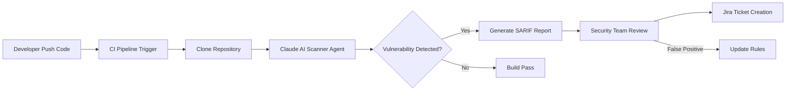

## 서론

금요일 오후 5시 30분, 보안 팀의 슬랙 채널에 "긴급(Critical)" 레벨의 알림이 울립니다. 공급망 공격으로 인해 새로운 1-day 취약점이 발견되었고, 현재 운영 중인 수백 개의 마이크로서비스 중 어느 것이 이 취약한 라이브러리를 사용하고 있는지, 그리고 실제로 악용 가능한 경로가 존재하는지를 즉시 확인해야 합니다.

기존의 정적 분석 도구(SAST)를 돌려보니 5,000개 이상의 "의심스러운" 결과가 쏟아져 나옵니다. 하지만 그중 99%는 실제 공격이 불가능한 'False Positive(위양성)'들이었습니다. 보안 엔지니어들은 수많은 쓰레기 결과물을 필터링하느라 진짜 위협을 놓치기 일쑤입니다. 이것이야말로 현대 보안 팀이 직면한 "리소스 부족과 알림 피로(Alert Fatigue)"의 현실입니다.

이때 Anthropic의 Claude AI 같은 거대 언어 모델(LLM) 기반 스캐너가 단순한 패턴 매칭을 넘어, 코드의 **맥락(Context)**과 **비즈니스 로직**을 이해해 분석에 들어간다면 어떨까요? 단순히 "이 함수가 위험합니다"라고 알려주는 대신, "해당 파라미터가 사용자 입력으로부터 필터링 없이 SQL 쿼리로 직접 전달되므로 Blind SQL Injection이 가능합니다"라고 구체적으로 설명해 준다면 보안 대응 속도는 획기적으로 빨라질 것입니다. 이 글에서는 Claude AI가 어떻게 복잡한 취약점 스캔을 수행하는지, 그 기술적 원리와 실제 현장에서의 적용 방안을 심층적으로 분석해 보겠습니다.

## 본론

### LLM을 활용한 정적 분석의 진화: 단순 패턴에서 논리적 추론으로

전통적인 SAST(Static Application Security Testing) 도구는 주로 정규표현식(Regex)이나 AST(Abstract Syntax Tree) 기반의 규칙을 사용합니다. 예를 들어, `String sql = "SELECT * FROM user WHERE id = " + input;` 같은 코드를 찾아내면 "SQL Injection 가능성"이라고 보고합니다. 하지만 이 방식은 코드의 흐름(Control Flow)이 완전히 파악되지 않으면 엄청난 오탐을 유발합니다.

Claude AI와 같은 최신 LLM은 코드를 단순한 텍스트가 아닌 '의미 있는 논리의 집합'으로 이해합니다. 특히 Anthropic의 모델은 긴 컨텍스트 창(Long Context Window)을 활용하여 여러 파일에 걸친 함수 호출 관계를 추적할 수 있습니다. 이를 통해 단일 파일 내의 버그뿐만 아니라, 복잡한 마이크로서비스 아키텍처에서 발생하는 인증 우회, 권한 상승 등의 논리적 취약점을 찾아내는 데 유리합니다.

> **⚠️ 윤리적 경고**: 본 섹션에서 설명하는 기술과 시나리오는 시스템의 취약점을 식별하고 방어하기 위한 목적으로만 제공됩니다. 허가 없는 시스템에서의 테스트는 불법이며 법적 책임을 질 수 있습니다.

### Claude 기반 자동 스캔 아키텍처

Claude를 보안 파이프라인에 통합하는 것은 단순히 챗봇에게 코드를 붙여넣는 것과는 다릅니다. 지속적 통합/지속적 배포(CI/CD) 파이프라인 내에서 코드가 커밋될 때마다 자동으로 분석되고, 결과를 보안 팀에게 리포트하는 자동화된 흐름이 필요합니다.

다음은 Claude API를 활용한 자동 취약점 스캔 프로세스의 간단한 흐름도입니다.



### 실전 시나리오: 복잡한 비즈니스 로직 취약점 분석

기존 도구가 놓치기 쉬운 **"비즈니스 로직 결함"**을 Claude가 어떻게 잡아내는지 살펴보겠습니다. 예를 들어, 전자상거래 웹사이트에서 "쿠폰 적용 로직"을 분석한다고 가정해 봅시다.

아래는 취약한 Python 코드의 예시입니다.

```python
# vuln_app.py (취약한 코드 예시)
from flask import Flask, request, jsonify
import discount_engine

app = Flask(__name__)

@app.route('/apply_coupon', methods=['POST'])
def apply_coupon():
    user_id = request.json.get('user_id')
    coupon_code = request.json.get('coupon_code')
    total_price = request.json.get('total_price')
    
    # 쿠폰 유효성 검사 (엔진 내부 로직)
    discount_info = discount_engine.validate(user_id, coupon_code)
    
    if discount_info['valid']:
        # 취약점: 사용자가 보낸 total_price를 신뢰하고 할인 적용
        # 할인율이 100%인 'ADMIN' 쿠폰을 발견했다고 가정
        final_price = total_price * (1 - discount_info['rate'])
        
        # 로그에 기록
        app.logger.info(f"Coupon {coupon_code} applied for user {user_id}")
        
        return jsonify({"final_price": final_price})
    
    return jsonify({"error": "Invalid coupon"}), 400
```

이 코드는 데이터베이스 검증이나 서버 측 계산 없이, 클라이언트(공격자)가 보낸 `total_price`를 그대로 사용하여 계산을 마칩니다. 만약 `discount_info['rate']`가 1.0(100%)인 쿠폰을 발급받을 수 있다면, 공격자는 `total_price`를 천만 원으로 설정하여 무제한의 적립금이나 상품을 획득할 수 있는 **Parameter Tampering** 및 **Logic Flaw** 취약점이 존재합니다.

전통 도구는 `request.json.get` 부분을 일반적인 입력 처리로 인식해 넘어갈 확률이 높습니다. 하지만 Claude에게 다음과 같은 프롬프트로 분석을 요청할 수 있습니다.

```python
# security_prompt_template.txt
system_prompt = """
당신는 10년 경력의 보안 전문가입니다. 제공된 코드를 심층 분석하여 OWASP Top 10 및 비즈니스 로직 취약점을 찾아내세요.
특히 다음 사항에 주의하세요:
1. 사용자 입력 값(user-controllable data)이 검증 없이 재계산(re-calculation)에 사용되는지.
2. 경쟁 조건(Race Condition)이나 권한 상승 가능성이 있는지.
분석 결과는 PoC(개념 증명) 시나리오와 함께 보고서 양식으로 작성해주세요.
"""

# Claude API 호출 시나리오
def analyze_code_with_claude(code_snippet):
    # 실제 구현 시는 anthropic 라이브러리 사용
    response = client.messages.create(
        model="claude-3-5-sonnet-20240620",
        max_tokens=1024,
        system=system_prompt,
        messages=[
            {"role": "user", "content": f"다음 코드를 분석해주세요:

{code_snippet}"}
        ]
    )
    return response.content[0].text
```

Claude는 다음과 같은 분석 결과를 도출할 수 있습니다.
1.  **식별**: 클라이언트 입력인 `total_price`가 서버 측 데이터베이스의 주문 금액과 대조되지 않음.
2.  **영향**: 할인율이 높은 쿠폰과 결합하여 가격 조작이 가능함 (Price Manipulation).
3.  **제언**: `total_price`를 클라이언트 입력으로 받지 말고, `cart_id`를 받아 서버 내부에서 가격을 다시 계산하거나 DB에서 조회해야 함.

### 기존 도구 vs Claude 기반 분석 비교

이러한 접근 방식이 기존 솔루션과 비교하여 어떤 이점을 가지는지 명확히 이해할 필요가 있습니다.

| 비교 항목 | 전통적 SAST 도구 (SonarQube, Checkmarx 등) | Claude AI 기반 분석 |
| :--- | :--- | :--- |
| **분석 방식** | 규칙 기반 (Rule-based), 패턴 매칭 | 의미 기반 (Semantic), 추론 및 맥락 이해 |
| **취약점 탐지 범위** | 주로 구문적 오류, 알려진 API 오용 | 비즈니스 로직 결함, 복잡한 인증 우회, 1-day 분석 |
| **False Positive (위양성)** | 높음 (맥락을 모르기 때문) | 상대적으로 낮음 (코드 의도 파악 가능) |
| **설정 및 튜닝 난이도** | 높음 (복잡한 규칙셋 관리) | 낮음 (자연어 프롬프트로 의도 전달) |
| **설명 가능성** | 낮음 (단순히 규칙 위반 코드 줄 번호 표시) | 높음 (공격 시나리오와 완화 조치를 문장으로 설명) |
| **비용** | 초기 라이선스 비용 높음 | 사용량 기반(Tokn based) 과금, 유연함 |

### 단계별 구현 가이드: Claude와 CI/CD 연동

보안 팀에서 Claude를 활용하여 효율성을 높이기 위한 실무적인 단계별 가이드입니다.

1.  **범위 설정 (Scoping)**:     *   처음부터 전체 코드베이스를 분석하지 마십시오. 비용과 노이즈가 과도하게 발생합니다.     *   인증/결제 모듈, Admin 대시보드 등 핵심 로직에 우선 집중하세요.

2.  **프롬프트 엔지니어링 (Prompt Engineering)**:     *   분석 기준을 명확히 정의한 "System Prompt"를 만드세요.     *   `{"role": "system", "content": "OWASP 기준에 따라 코드를 감사하세요. 낮은 심각도는 무시하고 높음/중간만 보고하세요."}` 와 같이 필터링 조건을 포함합니다.

3.  **결과 포맷 표준화 (Output Formatting)**:     *   Claude의 결과를 사람이 읽기 좋은 텍스트만 받지 마세요. JSON 형식으로 요청하여 다른 보안 도구(SARIF 포맷 등)와 연동 가능하게 만드세요.     *   예: "JSON 형식으로 {file_path, line_number, vulnerability_type, severity, description} 키를 포함해 출력하세요."

4.  **피드백 루프 (Feedback Loop)**:     *   Claude가 틀린 분석(False Positive)을 했다면, 그 이유를 알려주고 프롬프트를 수정하여 점진적으로 정확도를 높이세요.

## 결론

Claude AI가 도입한 복잡한 취약점 스캔 기능은 보안 업계에서 단순한 '자동화'를 넘어 '지능형 분석'의 시대를 여는 신호탄입니다. 1-day 취약점에 대한 빠른 대응과 인간이 놓치기 쉬운 비즈니스 로직 결함의 탐지는 LLM이 가진 고유한 강점입니다.

하지만 기술이 아무리 발전해도 보안의 근본은 변하지 않습니다. AI는 "코드를 읽고" 취약점을 찾아낼 수 있지만, "시스템을 운영"하고 "위험을 관리"하는 것은 여전히 보안 전문가의 역할입니다. Claude가 찾아낸 결과물을 검증하고, 우선순위를 매기며, 실제 패치를 계획하는 과정에서 전문가의 통찰력은 그 어느 때보다 중요해졌습니다.

결론적으로, Claude와 같은 도구는 보안 팀을 대체하는 것이 아니라, 보안 엔지니어가 "반복적인 코드 리뷰"에서 해방되어 더 깊이 있는 위협 모델링과 아키텍처 설계에 집중할 수 있도록 돕는 강력한 'Copilot'이 될 것입니다. 지금 바로 당신의 보안 파이프라인에 이 지능형 분석가를 투입해 보시길 권장합니다.

### 참고자료

- [Anthropic Official Documentation - Claude API](https://docs.anthropic.com/)

- [OWASP Top 10 Web Application Security Risks](https://owasp.org/www-project-top-ten/)

- [SARIF (Static Analysis Results Interchange Format)](https://sarifweb.azurewebsites.net/)
