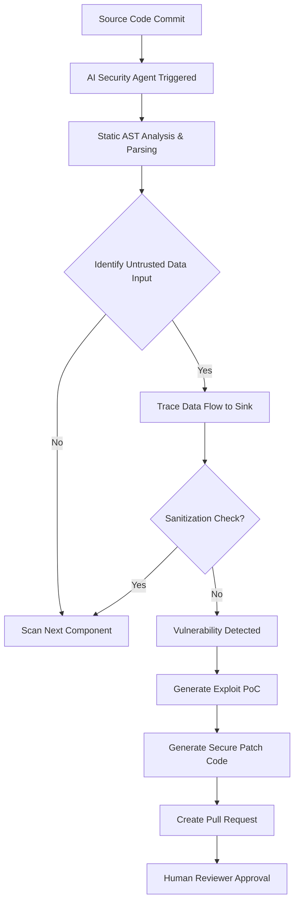
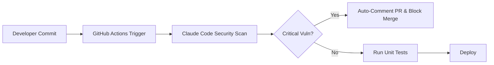

## 서론

새벽 2시, 보안 운영 센터(SOC)의 모니터 앞. 시스템 관리자는 졸린 눈을 비비며 경보 로그를 확인합니다. 익숙한 SQL Injection 패턴이지만, 이번 공격의 속도는 전례가 없습니다. 공격자는 수동으로 쿼리를 작성하는 것이 아니라, AI 에이전트를 이용해 실시간으로 코드 구조를 학습하고 변형된 페이로드를 쏘아 붙이고 있습니다. 반면, 방어편인 당신은 여전히 수백 줄의 로그을 육안으로 검색하거나 정적 분석 도구가 뱉어낸 수천 개의 '거짓 양성(False Positive)'을 하나씩 확인하고 있습니다.

이 시나리오는 더 이상 공상과학 소설이 아닙니다. Claude Code와 같은 AI 기반 자동화 에이전트가 등장하면서, 사이버 보안의 판도는 급격히 변하고 있습니다. 많은 보안 전문가가 "AI가 보안 엔지니어의 일자리를 뺏을 것"이라는 불안감을 안고 있지만, 본질적인 질문은 다릅니다. 우리는 이 엄청난 계산 능력을 적(Attacker)의 칼날이 되게 할 것인가, 아니면 방패(Defender)의 탄탄한 성벽으로 쌓을 것인가?

이 글에서는 단순한 기술적 동향을 넘어, Claude Code와 같은 AI 에이전트가 어떻게 취약점 분석과 익스플로잇(Exploit) 작업을 자동화하는지 그 기술적 원리를 파헤쳐 보겠습니다. 또한, 공격자의 시나리오를 미리 시뮬레이션하여 이를 선제적으로 차단하는 'AI 대 AI' 방어 전략을 수립하는 실무적인 가이드를 제공합니다. 보안의 종말이 아닌, 진화된 방어 체계로의 전환을 준비합시다.

*(⚠️ **윤리적 경고**: 본문에 포함된 모든 코드 예제와 기술적 설명은 보안 취약점을 이해하고 방어 목적으로만 사용되어야 합니다. 승인되지 않은 시스템에 대한 무단 접근이나 공격은 불법이며 엄격히 금지됩니다.)*

## 본론

### AI 에이전트에 의한 취약점 분석의 메커니즘

Claude Code와 같은 AI 에이전트가 기존의 SAST(Static Application Security Testing) 도구와 결정적으로 다른 점은 '맥락(Context)'을 이해한다는 것입니다. 기존 도구들은 정규 표현식(Regex)이나 고정된 규칙을 사용해 코드를 스캔하지만, AI는 비즈니스 로직의 흐름, 데이터의 변환 과정, 그리고 라이브러리 간의 의존성을 종합적으로 분석할 수 있습니다.

이 과정에서 AI는 일반적으로 **RAG(검색 증강 생성)** 기법과 **Chain-of-Thought(사슬형 사고)** 추론을 활용합니다. AI는 먼저 대상 코드베이스를 벡터화하여 저장하고, 취약점을 의심되는 지점부터 추론을 시작해 데이터의 흐름을 거슬러 올라가거나 따라갑니다(Source-to-Sink 분석).

아래는 AI 에이전트가 취약점을 탐지하고 이를 수정하는 일반적인 자동화 워크플로우입니다.



### 기존 방식 vs AI 에이전트 방식 비교

AI 에이전트의 도입이 보안 작성 공정(Workflow)에 미치는 영향을 구체적으로 이해하기 위해, 기존의 전통적인 방식과 Claude Code와 같은 최신 AI 에이전트 방식을 비교해 보겠습니다.

| 비교 항목 | 기존 정적 분석 도구 (SAST) | AI 기반 코드 에이전트 (Claude Code 등) |
| :--- | :--- | :--- |
| **분석 방식** | 패턴 매칭, 규칙 기반 (Rule-based) | 의미론적 분석, LLM 추론 (Context-aware) |
| **거짓 양성률 (False Positive)** | 높음 (맥락 무시로 인한 오류 다수) | 낮음 (코드 의도 이해 및 필터링) |
| **분석 대상** | 소스 코드 내의 구문적 오류 | 비즈니스 로직, 복잡한 라이브러리 의존성 |
| **수정 제안** | 단순 라인 수정 제안 | 전체 리팩토링 및 테스트 코드 자동 생성 |
| **익스플로잇 생성** | 불가능 (취약점만 식별) | 가능 (PoC 코드 생성을 통한 검증) |
| **주된 사용자** | 개발자, 보안 엔지니어 | 개발자 (DevSecOps 통합) |

### 실전 시나리오: 자동화된 SQL Injection 탐지 및 패치

AI가 실제로 취약점을 어떻게 찾아내고 수정하는지 살펴보기 위해, 전형적인 SQL Injection(SQLi) 취약점이 포함된 Python 코드를 예로 들어 보겠습니다.

**시나리오**: 개발자가 사용자 입력을 적절히 검증하지 않고 쿼리를 생성하는 취약한 함수를 작성했습니다.

#### 1. 취약한 코드 예시 (Vulnerable Code)

```python
# vulnerable_app.py
import sqlite3

def get_user_info(user_id):
    # 취약점: 사용자 입력이 직접 쿼리문에 삽입됨
    conn = sqlite3.connect('users.db')
    cursor = conn.cursor()
    
    query = f"SELECT * FROM users WHERE id = {user_id}"
    cursor.execute(query)
    
    result = cursor.fetchone()
    conn.close()
    return result

# 공격자의 입력 시나리오
# user_id = "1 OR 1=1 --"
```

#### 2. AI 에이전트에 의한 탐지 및 대응 시뮬레이션 (PoC)

이제 보안 전문가가 아닌 AI 에이전트가 위 코드를 스캔한다고 가정해 봅시다. AI는 단순히 `f"..."` 문자열 포맷팅을 사용했다는 점만 보는 것이 아니라, `user_id`라는 변수가 외부 입력(혹은 신뢰할 수 없는 소스)에서 비롯되었음을 추론합니다.

아래 코드는 AI 에이전트가 취약점을 분석하고 안전한 코드를 생성하는 과정을 시뮬레이션한 Python 스크립트입니다. (실제 Claude Code는 더 복잡한 내부 추론 과정을 거치지만, 여기서는 그 결과물을 시각화합니다.)

```python
import ast

class SecurityAuditorAgent:
    """
    방어 목적의 시뮬레이션된 보안 감정 에이전트
    """
    def __init__(self, source_code):
        self.source_code = source_code
        self.issues = []
    
    def analyze(self):
        tree = ast.parse(self.source_code)
        
        # AST를 순회하며 문자열 포맷팅(f-string)이 쿼리 실행에 사용되는지 탐지
        for node in ast.walk(tree):
            if isinstance(node, ast.Call):
                # cursor.execute() 호출 확인
                if isinstance(node.func, ast.Attribute) and node.func.attr == 'execute':
                    if node.args and isinstance(node.args[0], ast.JoinedStr):
                        self.issues.append({
                            "type": "SQL Injection",
                            "severity": "High",
                            "message": "Unsanitized input in f-string used for SQL query.",
                            "line": node.lineno
                        })
        return self.issues

    def generate_patch(self, original_code):
        # AI의 제너레이티브 능력을 시뮬레이션한 패치 로직
        # 실제 LLM은 context를 바탕으로 Parameterized Query로 변환
        
        print("🤖 AI Agent: Analyzing the context...")
        print("🤖 AI Agent: Detected unsafe f-string interpolation in SQL execution.")
        
        patched_code = """
import sqlite3

def get_user_info(user_id):
    # 수정됨: Parameterized Query 사용
    conn = sqlite3.connect('users.db')
    cursor = conn.cursor()
    
    # 사용자 입력이 아닌 플레이스홀더(?) 사용으로 SQLi 방어
    query = "SELECT * FROM users WHERE id = ?"
    cursor.execute(query, (user_id,))
    
    result = cursor.fetchone()
    conn.close()
    return result
"""
        return patched_code


```

```python
# 실행 예제
if __name__ == "__main__":
    vulnerable_snippet = """
def get_user_info(user_id):
    conn = sqlite3.connect('users.db')
    cursor = conn.cursor()
    query = f"SELECT * FROM users WHERE id = {user_id}"
    cursor.execute(query)
    return cursor.fetchone()
"""
    
    agent = SecurityAuditorAgent(vulnerable_snippet)
    findings = agent.analyze()
    
    if findings:
        print(f"⚠️  [CRITICAL] {findings[0]['type']} found at line {findings[0]['line']}")
        print(f"    Detail: {findings[0]['message']}")
        print("
" + "="*40 + "
")
        print("🛡️  AI Suggested Secure Code:
")
        print(agent.generate_patch(vulnerable_snippet))
```

이 코드는 단순한 시뮬레이션이지만, 실제 Claude Code나 같은 LLM 기반 도구들은 훨씬 더 정교한 방식으로 `sqlite3` 라이브러리의 문서를 참조하여 안전한 `cursor.execute(query, (param,))` 구문으로 변환하는 패치를 생성해 냅니다.

### Step-by-Step: Claude Code를 활용한 방어적 보안 감사 가이드

이제 공격자가 이러한 도구를 악용하기 전에, 방어자로서 우리는 어떻게 Claude Code를 우리의 보안 프로세스에 통합할 수 있을까요? 다음은 실무에서 바로 적용할 수 있는 단계별 가이드입니다.

#### 1. 단계: 보안 테스트용 가상 환경 격리 절대로 프로덕션(운영) 코드나 민감한 API 키가 포함된 환경에서 직접 AI 에이전트를 돌리지 마십시오. AI는 학습 과정에서 데이터를 누출할 가능성이 있습니다.

#### 2. 단계: 프롬프트 엔지니어링을 통한 '적대적 테스트' 설정 AI에게 "이 코드를 안전하게 만들어줘"라고 요청하는 것보다, "이 코드를 해킹하려는 공격자의 시각에서 취약점을 찾아보고 공격 코드를 작성한 뒤, 이를 방어하는 패치를 제시하라"라고 요청하는 것이 훨씬 강력한 방어가 됩니다.

**예시 프롬프트:**

> "당신은 적대적 보안 전문가(Auditor)입니다. 제공된 코드를 분석하여 원격 코드 실행(RCE)이 가능한지 확인하세요. 만약 취약점이 존재한다면, 공자자가 이를 악용할 수 있는 PoC 코드를 작성하고, 이를 근본적으로 차단하는 방어 코드를 작성하십시오."

#### 3. 단계: AI 생성물의 검증 (Human-in-the-loop) AI가 제안한 패치 코드를 맹목적으로 복사/붙여넣기 하지 마십시오. AI는 때로 '환각(Hallucination)'을 일으켜 존재하지 않는 라이브러리를 import하거나 논리적 오류를 만들어냅니다. 반드시 코드 리뷰 과정을 거쳐야 합니다.

#### 4. 단계: CI/CD 파이프라인 통합 이러한 검증 과정을 개발자의 로컬 머신에만 의존하지 말고, Git Push나 Pull Request 시점에 자동으로 트리거되도록 설정하세요.



## 결론

Claude Code와 같은 AI 에이전트의 등장은 사이버 보안 업계의 '검은 사막'과 같습니다. 기존의 방식으로는 생존할 수 없는, 극도로 가혹하고 빠른 환경이 도래했습니다. 이제 공격자는 스크립트 키드(Script Kiddie) 수준이라 할지라도 AI라는 강력한 무기를 통해 전문가 수준의 공격을 자동화할 수 있게 되었습니다.

하지만 이것이 보안의 종말을 의미하지 않습니다. 오히려 우리는 반복적이고 지루한 취약점 스캔 작업에서 벗어나, 아키텍처 수준의 보안 전략을 수립하고 AI가 놓칠 수 있는 창의적인 공격 시나리오를 상상하는 '보건 설계자'로 진화할 기회를 얻었습니다.

핵심은 **'AI를 통제하는 능력'**입니다. AI가 생성한 코드의 안전성을 검증하고, AI의 논리를 유도하는 프롬프트 능력, 그리고 이를 시스템에 통합하는 DevSecOps 역량이 향후 보안 전문가의 핵심 경쟁력이 될 것입니다. 공격자가 AI를 칼로 쓰든, 우리가 방패로 쓰든 결정하는 것은 바로 당신입니다.

### 참고자료

- [Claude Code Security didn’t kill cybersecurity. It exposed what’s coming next. - CTech](https://news.google.com/rss/articles/CBMia0FVX3lxTE5HWllNalVCVzJPVnlSSWM4RWphdWVBeDNnT3dzdm1zcUR1eE15OVE5aGlSeXdoaUpTWmxhS3JQMHRWeENMQ01ycEFiY3gweXdWbnNaZFRGcE9aMFhYZmNKWjBHdXp1VF9MUFN3?oc=5)

- OWASP Top 10: Security and Risks for Large Language Model Applications

- NIST AI Risk Management Framework
