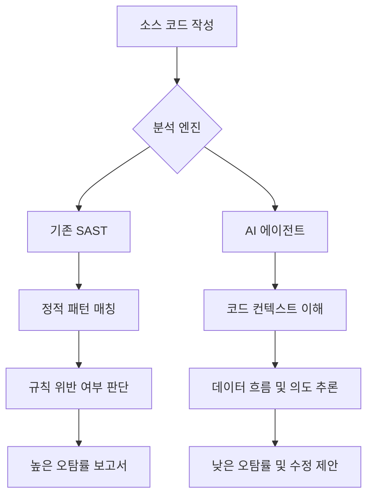

## 서론

지난주 모 핀테크 스타트업의 CISO(최고 보안 책임자)로부터 믿을 수 없는 이야기를 들었습니다. 그들은 연간 수천만 원을 투자하여 엔터프라이즈급 SAST(Static Application Security Testing) 솔루션을 도입했지만, 정작 신입 개발자는 Claude의 AI 코딩 에이전트를 사용하여 그 도구가 놓친 중요한 인젝션 취약점을 단 5분 만에 찾아냈다는 것입니다. 이것은 단순한 도구의 성능 차이가 아닙니다. 이것은 시장의 판도가 뒤집히는 순간, 즉 'SaaS-pocalypse(보안 SaaS의 종말)'의 서막입니다.

Forrester의 보고서에서 언급된 것처럼, Anthropic의 Claude와 같은 고도화된 AI 에이전트는 단순한 코드 작성 보조를 넘어선 보안 감사관으로 진화했습니다. 기존의 보안 벤더들이 자랑하던 정규식(Regex) 기반의 패턴 매칭과 규칙 엔진은, 막대한 파라미터를 이해하고 문맥(Context)을 파악하는 LLM(Large Language Model)의 추론 능력 앞에서 무력감을 드러내고 있습니다. 왜 우리는 지금 이 변화에 주목해야 하며, 기존 보안 SaaS 시장은 어떤 위기에 직면해 있는지 현장감 있는 관점에서 분석해 보겠습니다.

> **⚠️ 윤리적 경고**: 본문에 포함된 모든 기술적 분석 및 코드 예시는 보안 취약점을 이해하고 방어策略을 수립하기 위한 교육 목적임을 명시합니다. 악의적인 목적의 사용은 엄격히 금지됩니다.

## 본론

### 기존 SAST 도구의 한계와 AI의 등장

전통적인 SAST 도구는 소스 코드를 컴파일하지 않은 상태에서 분석하여 취약점을 찾아냅니다. 하지만 이들의 약점은 '오탐(False Positive)'과 '문맥 부재'입니다. 예를 들어, `eval()` 함수를 사용했다고 해서 무조건 보안 경고를 알리는 식이죠. 실제로는 데이터가 이미 sanitize 되었더라도 말입니다.

반면, Claude와 같은 최신 AI 에이전트는 코드의 의미(Semantic)를 이해합니다. 변수의 흐름을 추적하고, 비즈니스 로직을 파악하여 "이 코드는 의도가 안전한지, 아니면 논리적으로 털릴 가능성이 있는지"를 판단합니다. 이는 단순한 패턴 매칭이 아니라 '추론'에 가깝습니다.

### 비교 분석: 정적 분석 도구 vs AI 에이전트

이 변화가 얼마나 파괴적인지 현장에서 체감할 수 있도록, 기존 SAST 솔루션과 AI 에이전트 기반의 분석을 비교해 보았습니다.

| 비교 항목 | 기존 SAST 솔루션 | AI 에이전트 (Claude 등) |
| :--- | :--- | :--- |
| **분석 방식** | 키워드 매칭, 정규식, Control Flow Graph | 의미적 분석 (Semantic Analysis), 추론 |
| **오탐률 (False Positive)** | 높음 (개발자가 수동으로 필터링 필요) | 낮음 (문맥을 이해하고 필터링) |
| **설정 복잡도** | 매우 높음 (룰셋 커스터마이징 어려움) | 낮음 (자연어 프롬프트로 조정 가능) |
| **취약점 설명** | 코드 라인 번호와 CWE 코드만 제공 | 구체적인 공격 시나리오와 수정된 코드 제시 |
| **비용 구조** | 스캔 횟수 또는 라인수 기반 라이선스 | 토큰 기반 구독 또는 API 사용량 |
| **생태계 통합** | CI/CD 파이프라인 툴체인 | IDE 플러그인, 채팅 인터페이스, 툴체인 |

이 표에서 알 수 있듯이, AI 에이전트는 개발자의 경험(Developer Experience, DX) 측면에서 압도적인 우위를 점하고 있습니다. 보안 팀이 개발자들에게 "SAST 툴 결과를 확인하세요"라고 강요하는 대신, "AI 에이전트가 이미 고쳐준 PR을 검토하세요"라고 할 수 있는 세상이 오고 있습니다.

### 기술적 메커니즘: 시맨틱 분석의 승리

AI 에이전트가 어떻게 기존 도구보다 정교한 분석이 가능한지, 그 데이터 처리 흐름을 간단히 시각화해 보겠습니다. 기존 도구는 코드의 형태만 보지만, AI는 코드의 의도를 봅니다.



위 다이어그램처럼, 핵심은 **컨텍스트 이해(H)**와 **추론(I)** 단계의 유무입니다. 기존 SAST는 `E` 단계에서 멈추지만, AI는 `I`까지 나아갑니다.

### 실전 시나리오: AI 기반 취약점 진단 (PoC)

구체적인 예시를 통해 AI가 어떻게 취약점을 잡아내는지 살펴보겠습니다. 아래는 Python으로 작성된 간단한 사용자 조회 함수입니다.

```python
# vulnerable_app.py
import sqlite3

def get_user_info(user_input):
    conn = sqlite3.connect('users.db')
    cursor = conn.cursor()
    
    # 취약점: 사용자 입력이 그대로 쿼리에 삽입됨 (SQL Injection)
    query = f"SELECT * FROM users WHERE username = '{user_input}'"
    cursor.execute(query)
    
    result = cursor.fetchone()
    conn.close()
    return result

# 실행 예시
# get_user_info("admin' --")
```

기존 SAST 도구는 `f-string` 안에 변수가 들어간 것을 보고 SQLi可能性을 경고할 수 있습니다. 하지만 복잡한 로직 속에 숨어있는 경우 놓치기도 하며, 왜 위험한지 구체적으로 설명하지 못합니다.

이제 Claude와 같은 AI 에이전트에게 이 코드를 분석해 달라고 요청하는 프롬프트와 그 결과를 시뮬레이션해 보겠습니다.

**Prompt:**

> "Analyze the following Python function for security vulnerabilities. Explain the attack vector and provide a secure version of the code using parameterized queries."

**AI Agent Response (Simulation):**

> **Analysis:**

> The function `get_user_info` is vulnerable to **SQL Injection**. The `user_input` is directly interpolated into the query string using an f-string (`f"... '{user_input}'"`). An attacker could input `' OR '1'='1` to bypass authentication or dump the entire database.

>

> **Attack Scenario:**

> If an attacker provides `admin'--`, the query becomes:

> `SELECT * FROM users WHERE username = 'admin'--'`

> This comments out the rest of the query, effectively logging them in as 'admin' without a password.

>

> **Secure Fix:**

> Use parameterized queries (prepared statements) to ensure the database treats user input as data, not executable code.

```python
import sqlite3

def get_user_info_secure(user_input):
    conn = sqlite3.connect('users.db')
    cursor = conn.cursor()
    
    # 안전한 코드: 파라미터화된 쿼리 사용
    query = "SELECT * FROM users WHERE username = ?"
    cursor.execute(query, (user_input,))
    
    result = cursor.fetchone()
    conn.close()
    return result
```

이처럼 AI는 단순히 "이거 위험해요"라고 하는 것을 넘어, 공격 시나리오(Attack Scenario)를 설명하고 실행 가능한 안전한 코드(Secure Fix)를 즉시 생성합니다. 이는 보안 엔지니어의 역할을 상당 부분 대체하거나 보조하여 생산성을 극대화합니다.

### 보안 벤더를 위한 생존 전략: 방어가 아닌 통합으로

"SaaS-pocalypse"가 단순히 기존 벤더의 몰락을 의미하는 것은 아닙니다. 이는 진화의 기회이기도 합니다. 보안 SaaS 벤더들은 다음과 같은 전략을 취해야 합니다.

1.  **AI Native로의 재구성**: 기존 엔진 위에 AI 챗봇을 붙이는 것이 아니라, LLM을 핵심 분석 엔진으로 채택하여 아키텍처를 재설계해야 합니다.
2.  **특화된 데이터 확보**: 공개된 LLM만으로는 부족합니다. 자사가 수집한 방대한 취약점 데이터와 익명화된 고객 코드를 사용하여 Fine-tuning된 전문 모델을 개발해야 합니다.
3.  **워크플로우 통합**: 단순히 취약점을 찾는 것을 넘어, Jira, GitHub, Slack과 연동하여 AI가 발견한 취약점을 티켓팅하고 개발자에게 할당까지 자동화하는 'Autonomous Remediation' 기능을 제공해야 합니다.

## 결론

Claude와 같은 AI 코딩 에이전트의 등장은 보안 SaaS 시장에 있어 게임 체인저입니다. 이는 단순한 기술의 진보가 아니라, 우리가 보안을 바라보는 패러다임 자체를 '정적 분석'에서 '지능형 추론'으로 전환시키는 사건입니다.

"결국 AI가 개발자와 해커를 모두 대체할 것인가?"라는 질문이 나옵니다. 저의 전문가적 견해는 다음과 같습니다. AI는 '도구'를 대체할 것이지, '전략가'는 대체하지 못할 것입니다. 하지만 기존의 방식에 안주하여 스스로를 '단순한 스캐너'로 정의하는 보안 벤더들은 도태될 것입니다.

보안 리더와 개발자들은 지금 당장 AI 에이전트를 워크플로우에 통합하여 실험해 보아야 합니다. 포레스터가 경고한 'SaaS-pocalypse'는 비관적인 예언이 아니라, 더 똑똑하고 빠른 보안 체계로 나아가기 위한 알람입니다.

### 참고자료 및 추가 학습

- [Forrester Report: Claude Code Security Causes A SaaS-pocalypse](https://www.forrester.com)

- [OWASP Top 10 - AI Security](https://owasp.org/www-project-top-ten/)

- [Anthropic Claude Documentation](https://docs.anthropic.com/)
