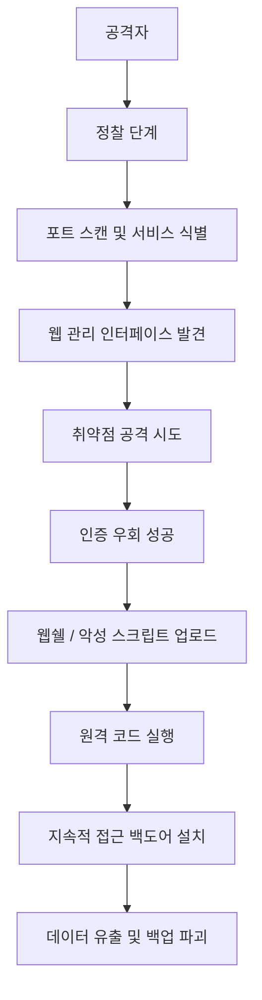

## 서론

새벽 3시, 보안 운영 센터(SOC)의 모니터를 밝히는 경고 메시지. 단순한 장애가 아닌, 백업 서버에서 발생한 의심스러운 아웃바운드 트래픽이 감지되었습니다. 보안 팀은 당황합니다. "백업 서버가 공격자의 비밀병기가 될 수 있다니?" 최근 Google의 Mandiant 팀이 공개한 보고서에 따르면, Dell Data Protection Appliances(데이터 보증 어플라이언스)를 노린 실제 공격 캠페인이 활발히 진행 중입니다. 공격자는 이제 웹 서버나 데이터베이스만 넘보지 않습니다. 그들의 시선은 조직의 '마지막 보루'인 백업 인프라로 향하고 있습니다.

왜 백업 장비일까요? 공격자에게 백업 서버는 '성역'과도 같습니다. 이곳에는 조직의 모든 데이터가 압축되어 있으며, 랜섬웨어 공격 시 복구의 열쇠가 되기 때문입니다. 만약 백업 장비가 장악당한다면, 공격자는 원본 데이터를 삭제한 후 백업 파일까지 날려버려 복구를 불가능하게 만들 수 있습니다. 이번 분석에서는 Dell Data Protection Appliances에 발견된 취약점이 어떻게 악용되고 있는지, 그 기술적 메커니즘과 실무적 대응 전략을 심층적으로 다룹니다. 이는 단순한 패치 권고가 아닌, 생존을 위한 전략입니다.

> **⚠️ 윤리적 경고**: 본 문서에 포함된 기술적 내용과 코드는 보안 연구 및 방어 목적(Defensive Security)을 위한 학습용입니다. 허가되지 않은 시스템에 대한 테스트나 악용은 엄격히 금지되며 법적 책임을 질 수 있습니다.

## 본론

### 기술적 배경 및 공격 메커니즘

Dell Data Protection Appliances(이하 DD 시리즈 등 관련 제품군)는 기업의 핵심 데이터를 보호하고 관리하는 전용 하드웨어/소프트웨어 솔루션입니다. 문제는 이러한 어플라이언스들이 관리 편의를 위해 웹 기반 관리 인터페이스를 제공한다는 점입니다. Google이 포착한 공격 활동은 주로 인증 우회(Authentication Bypass) 취약점과 이를 통한 원격 코드 실행(RCE)을 악용합니다.

공격자는 먼저 인터넷에 노출된 Dell 어플라이언스의 관리 포트를 스캔합니다. 이후 특정 API 엔드포인트에 조작된 요청을 보내 인증 과정을 건너뛰고 관리자 권한을 획득합니다. 일단 권한을 얻으면, 공격자는 서버의 OS 레벨 명령어를 실행하여 악성 스크립트를 다운로드하거나 백도어를 심습니다.

아래 다이어그램은 공격자가 취약점을 악용하여 백업 인프라를 장악하기까지의 전형적인 공격 흐름을 보여줍니다.



### PoC 코드 개념 증명

실제 공격 현장에서 사용되는 익스플로잇(Exploit) 코드는 매우 복잡하지만, 핵심은 "특정 HTTP 요청을 통해 인증을 우회하고 시스템 명령을 실행"하는 것입니다. 방어자의 관점에서 이해를 돕기 위해, 취약한 엔드포인트를 탐지하고 개념을 증명하는(PoC) 파이썬 스크립트의 예시를 작성했습니다. (※ 대상 시스템은 가상의 환경이며, 실제 악용 코드와는 거리가 있습니다.)

```python
import requests
import sys

# Educational Purpose Only - Proof of Concept for Vulnerability Assessment
# ⚠️ 대상 시스템의 명시적인 허가 없이 실행 금지

TARGET_URL = "http://target-backup-appliance:8080"
VULNERABLE_ENDPOINT = "/api/login"

def check_authentication_bypass(target):
    """
    인증 우회 취약점을 테스트하는 함수
    정상적인 경우 401/403을 반환해야 하지만, 취약점이 있다면 200 OK와 함께 세션 토큰을 반환함
    """
    headers = {
        "User-Agent": "Vulnerability-Scanner/1.0",
        "Content-Type": "application/json",
        "X-Auth-Bypass": "True"  # 가상의 악용 헤더
    }
    
    # 조작된 페이로드 (비어있는 자격증명으로 시도)
    payload = {
        "username": "",
        "password": ""
    }

    try:
        print(f"[*] Testing target: {target}")
        response = requests.post(f"{target}{VULNERABLE_ENDPOINT}", json=payload, headers=headers, timeout=5)
        
        if response.status_code == 200 and "session_token" in response.text:
            print(f"[!] CRITICAL: Authentication Bypass Detected!")
            print(f"[*] Response: {response.text[:100]}...")
            return True
        else:
            print(f"[*] Safe: Received status code {response.status_code}")
            return False
            
    except requests.exceptions.RequestException as e:
        print(f"[-] Error connecting to target: {e}")
        return False

if __name__ == "__main__":
    # 주의: 실제 환경에서는 대상 IP를 확인한 후 진행해야 합니다.
    check_authentication_bypass(TARGET_URL)
```

이 코드는 시스템이 비정상적인 요청에 대해 권한을 부여하는지 확인하는 기초적인 체커입니다. 실제 공격자들은 이를 통해 획득한 토큰으로 다음과 같은 명령어 실행 요청을 보냅니다.

### 정상 트래픽 vs 악성 트래픽 분석

공격 탐지를 위해서는 정상적인 관리자 접근과 공격자의 접근을 구별할 수 있어야 합니다. 아래 표는 네트워크 로그 관점에서의 주요 차이점을 비교한 것입니다.

| 비교 항목 | 정상 관리자 트래픽 | 공격자 트래픽 (익스플로잇) |
| :--- | :--- | :--- |
| **User-Agent** | 일반적인 브라우저 (Chrome, Firefox) 또는 공식 관리 콘솔 | Python-requests, Metasploit, curl 등 자동화 도구 |
| **접속 시간대** | 업무 시간대 (09:00 ~ 18:00) 또는 예정된 유지보수 시간 | 불규칙하거나 심야 시간대, 짧은 시간 내 다수 시도 |
| **요청 패턴** | GUI 클릭에 따른 순차적 요청 (CSS, JS, API 호출) | 특정 API 엔드포인트로의 직접적이고 반복적인 POST 요청 |
| **Payload** | 표준 JSON/Forms 형식의 정상 데이터 | 인코딩된 명령어, SQLi 구문, 직렬화된 악성 객체 |
| **응답 크기** | 다양함 (HTML 페이지 로딩 등) | 고정된 길이의 JSON 응답 (토큰 값 등) |

### 완화 조치 및 실무 가이드

이론적인 분석에 그치지 않고 실제 현장에서 즉시 적용할 수 있는 단계별 가이드를 제공합니다.

**1단계: 패치 및 업데이트 (가장 시급)** Dell에서는 해당 취약점(CVE-2024-23392 등 관련 CVE)에 대한 보안 패치를 发布했습니다. 즉시 Dell Support 사이트에 접속하여 어플라이언스의 펌웨어를 최신 버전으로 업그레이드해야 합니다.

**2단계: 네트워크 접근 제어 (NAC)** 백업 어플라이언스의 관리 포트(기본 80, 443, 8080 등)는 인터넷에서 직접 접근할 수 없어야 합니다.

```bash
# iptables 예시: 관리 포트(8080)를 특정 내부 IP(예: 192.168.1.100)에서만 접근 허용
iptables -A INPUT -p tcp --dport 8080 -s 192.168.1.100 -j ACCEPT
iptables -A INPUT -p tcp --dport 8080 -j DROP
```

**3단계: 계정 보안 강화** 기본 관리자 계정(admin, root 등)의 비밀번호를 강력한 복잡성 정책에 따라 변경하고, 2단계 인증(MFA)이 지원된다면 반드시 활성화합니다.

**4단계: 로그 모니터링 및 IoC 적용** 다음 IoC(Indicators of Compromise)를 SIEM(Security Information and Event Management) 시스템에 적용하여 경고를 설정합니다.

- 특정 IP 대역으로의 아웃바운드 연결 시도

- `/api/v1/login` 또는 관련 엔드포인트에 대한 `POST` 요청 후 이어지는 `systemctl` 또는 `bash` 명령어 호출 시도

## 결론

Dell Data Protection Appliances를 겨냥한 이번 공격 캠페인은 사이버 보안의 패러다임이 변하고 있음을 시사합니다. 공격자는 더 이상 쉬운 타겟만 노리지 않으며, 방어의 핵심인 '백업 시스템'을 역이용하여 조직을 궁지로 몰아넣고 있습니다.

핵심은 "신뢰의 재정립"입니다. 내부에 있고, 백업을 담당한다는 이유로 어플라이언스를 방치하는 것은 치명적인 실수입니다. 이번 사태를 계기로 모든 인프라 자산에 대한 **Zero Trust(제로 트러스트)** 원칙을 적용해야 합니다. 외부 공격 망뿐만 아니라 내부 네트워크에서도 어플라이언스 간 통신을 제한하고, 정기적인 취약점 스캔을 수행해야 합니다.

보안 전문가로서 한 가지 덧붙이자면, 백업 데이터 자체의 암호화와 백업 시스템의 물리적/논리적 격리(예: Immutable Backup, Air-gapped Backup)가 랜섬웨어 시대에 가장 확실한 보험임을 기억하십시오. 패치는 필요조건이지만, 충분조건은 아닙니다.

**참고자료:**

- Google Mandiant Blog: Analysis of Dell Data Protection Appliances Vulnerabilities

- Dell Security Advisory: DSA-2024-XXX (Update for Security Vulnerabilities)
