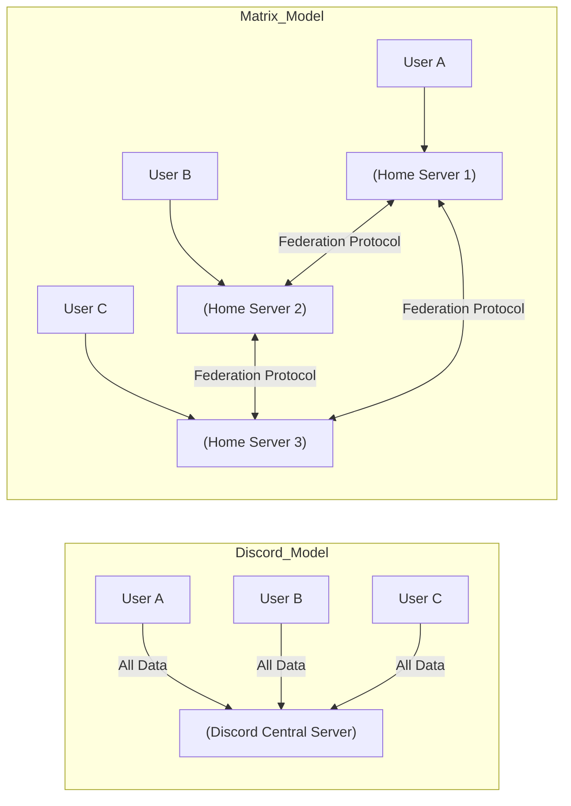

## 서론

오픈소스 프로젝트를 운영하거나 보안 연구를 수행하는 개발자에게 '플랫폼의 신뢰'는 선택이 아닌 생존의 문제입니다. 최근 수년간 수많은 개발자 커뮤니티가 모여들었던 Discord가, 최근 업데이트를 통해 사용자의 지문을 추적하고 익명성을 훼손하는 방향으로 정책을 선회했습니다. 단순히 서비스 약관이 바뀌는 수준을 넘어, 클라이언트 레벨에서 텔레메트리 데이터를 적극적으로 수집하고 사용자를 추적할 수 있는 기술적 장치가 도입되면서, '보안'과 '편의함' 사이의 균형이 무너졌습니다.

특히 DevOps 및 보안 엔지니어들에게 있어 Discord의 이러한 변화는 심각한 보안 리스크입니다. IP 주소 유출, 디바이스 핑거프린팅, 그리고 중앙화된 서버에 의한 데이터 통제는 프라이버시를 필수 조건으로 하는 커뮤니티에는 치명적입니다. 이제 우리는 중앙화된 블랙박스에 의존하는 기존 패러다임에서 벗어나, 탈중앙화되고 암호화에 기반한 프로토콜로의 이주를 고려해야 합니다. 이 글에서는 Discord의 데이터 수집 구조를 분석하고, 이를 대체할 수 있는 강력한 오픈소스 대안인 Matrix 프로토콜로 마이그레이션하는 방법을 기술적 관점에서 다룹니다.

## 본론

### 1. 중앙화 vs 탈중앙화: 아키텍처적 차이

Discord가 가진 근본적인 문제는 '중앙화(Centralization)'입니다. 모든 메시지, 사용자 메타데이터, 통신 기록이 Discord社의 서버에 집중되어 저장됩니다. 반면, Matrix는 페더레이션(Federation) 기반의 탈중앙화 프로토콜입니다. 이는 이메일 프로토콜(SMTP)과 유사하게 작동하며, 누구나 자신만의 홈 서버(Home Server)를 운영할 수 있고 서로 다른 서버 간의 통신이 가능합니다.

아래 다이어그램은 두 아키텍처의 트래픽 흐름과 신뢰 모델의 차이를 시각화한 것입니다.



Discord 모델에서는 사용자 간의 통신이 반드시 중앙 서버를 거쳐야 하며, 서버 운영자가 모든 데이터에 접근할 수 있습니다. 반면 Matrix 모델에서는 사용자가 자신의 데이터를 주권을 가진 서버에 저장하며, 서버 간에 메시지를 동기화합니다. 이는 단일 장애점(Single Point of Failure)을 제거하고, 검열이나 데이터 유출에 대한 저항력을 극대화합니다.

### 2. 기술적 심층 분석: E2EE와 페더레이션

Matrix의 핵심 강점은 **End-to-End Encryption (E2EE)**와 **Federation**입니다. Discord는 서버-클라이언트 간의 암호화만 제공할 뿐, 실제 메시지 내용은 서버에서 평문으로 복호화됩니다. 하지만 Matrix는 Olm/Megolm 암호화 라이브러리를 사용하여 메시지가 발신자의 장치에서 수신자의 장치까지 암호화된 상태로 전달됩니다. 서버 관리자조차 메시지 내용을 열어볼 수 없는 구조입니다.

또한 Matrix는 `Room ID`와 `Event ID`라는 고유 식별자를 사용하여 메시지의 무결성과 순서를 보장합니다. 이는 분산 시스템에서 발생할 수 있는 동시성 문제를 해결하는 핵심 메커니즘으로, 궁극적으로 일관성(Eventual Consistency) 모델을 따릅니다.

### 3. Discord와 Matrix 기능 비교

마이그레이션을 결정하기 위해, 두 플랫폼의 기술적 스펙을 비교해 보겠습니다.

| 비교 항목 | Discord | Matrix (Synapse/Dendrite) |
| :--- | :--- | :--- |
| **아키텍처** | 중앙화 (Closed Source) | 탈중앙화 페더레이션 (Open Source) |
| **암호화** | 전송 중 암호화 (TLS) | 전송 및 저장 암호화 (E2EE 지원) |
| **데이터 주권** | Discord 소유 | 자체 서버 운영 시 완전 소유 |
| **확장성** | 자동 확장 (Discord Cloud) | 수평 확장 가능 (Self-hosted) |
| **봇(Bot) API** | WebSocket Gateway (Rate Limit 엄격) | Application Service (AS) (유연한 제어) |
| **계정 연동** | OAuth2 제공 | OpenID Connect / Matrix SSO |
| **비용** | 무료 (Nitro 구독형 부가 기능) | 서버 인프라 비용 발생 |

### 4. Matrix 서버 구축 가이드 (Step-by-Step)

이제 실무적인 관점에서 Docker와 Docker Compose를 사용하여 자체 Matrix 서버(Synapse)를 구축하는 방법을 단계별로 설명합니다. 이는 MLOps 파이프라인을 구축하는 것과 유사한 인프라 관리 능력을 요구합니다.

#### 1단계: 도메인 및 DNS 설정 먼저 서버의 공개 IP와 도메인이 필요합니다. 예를 들어 `matrix.yourdomain.com`을 준비하고, 다음 DNS 레코드를 설정합니다.

- A 레코드: `matrix` -> `서버_IP`

- SRV 레코드: `_matrix._tcp` -> `10 0 8448 matrix.yourdomain.com`

#### 2단계: Docker Compose로 Synapse 배포 다음은 Synapse(가장 널리 쓰이는 Matrix Homeserver 구현체)를 배포하는 `docker-compose.yml` 예제입니다.

```yaml
version: "3.3"

services:
  synapse:
    image: docker.io/matrixdotorg/synapse:latest
    container_name: synapse
    restart: unless-stopped
    environment:
      - SYNAPSE_SERVER_NAME=matrix.yourdomain.com
      - SYNAPSE_REPORT_STATS=no
    volumes:
      - ./data:/data
    ports:
      - 8008:8008/tcp
    depends_on:
      - db

  db:
    image: docker.io/postgres:15-alpine
    container_name: synapse_db
    restart: unless-stopped
    environment:
      - POSTGRES_USER=synapse
      - POSTGRES_PASSWORD=your_strong_password
      - POSTGRES_DB=synapse
    volumes:
      - ./postgres:/var/lib/postgresql/data

  # 웹 프록시 및 SSL 종료 (Reverse Proxy)
  nginx:
    image: docker.io/nginx:latest
    container_name: nginx_proxy
    restart: unless-stopped
    ports:
      - 80:80
      - 443:443
    volumes:
      - ./nginx.conf:/etc/nginx/nginx.conf:ro
      - ./certs:/etc/nginx/certs:ro
    depends_on:
      - synapse
```

#### 3단계: 서버 초기화 및 설정 첫 실행 시 생성자를 실행하여 설정 파일을 생성해야 합니다.

```bash
# 볼륨 마운트 디렉토리 생성
mkdir -p ./data ./postgres

# Synapse 초기화 (임시 컨테이너 실행)
docker run -it --rm \
    -v $(pwd)/data:/data \
    -e SYNAPSE_SERVER_NAME=matrix.yourdomain.com \
    -e SYNAPSE_REPORT_STATS=no \
    matrixdotorg/synapse:latest generate

# docker-compose up -d 실행
```

#### 4단계: 클라이언트 연결 서버가 정상적으로 실행되면, Element(구 Riot.im) 같은 클라이언트 앱을 통해 `https://matrix.yourdomain.com`에 접속하여 계정을 생성합니다. 이제 귀하는 Discord의 중앙 서버에 의존하지 않는 독립적인 통신망을 보유하게 되었습니다.

## 결론

Discord의 익명성 종료는 단순한 개인정보 보호의 문제를 넘어, 개발자 커뮤니티와 오픈소스 생태계의 '주권'을 위협하는 사건입니다. 편리한 UX와 풍부한 통합 기능은 매력적이지만, 데이터 통제권을 타인에게 위임하는 순간 보안 리스크는 기하급수적으로 증가합니다. AI/ML 연구자로서 우리는 데이터의 수집, 활용, 보관 방식에 대해 근본적인 질문을 던져야 합니다.

Matrix로의 이주는 기술적으로 진입 장벽이 존재하지만, 이는 '자유'와 '통제'를 되찾는 과정입니다. 자체 서버를 운영함으로써 우리는 데이터 수명주기를 완전히 소유할 수 있으며, E2EE를 통해 통신의 기밀성을 수학적으로 보장받을 수 있습니다. 앞으로의 커뮤니티 형성은 '편리한 중앙화'가 아닌, '견고한 탈중앙화' 방향으로 재편될 것입니다. 지금이 바로 인프라를 주도적으로 설계할 최적의 시점입니다.

### 참고자료

- [Matrix.org Official Documentation](https://matrix.org/docs/)

- [Synapse Installation Guide](https://element-hq.github.io/synapse/latest/install/installation.html)

- [Olm/Megolm Cryptography Overview](https://matrix.org/docs/guides/end-to-end-encryption-implementation-guide)
