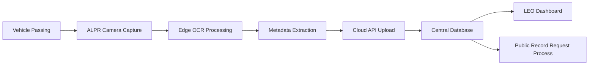

## 서론

보안 전문가로서 현장에서 가장 두려워하는 것은 외부의 해커가 아닌, 내부의 잘못된 정책 결정과 그로 인한 통제 불가능한 데이터 유출입니다. 최근 워싱턴주 에버렛 시(Everett)에서 발생한 사건은 이러한 우려가 현실이 되었음을 보여주는 결정적인 사례입니다. 시 당국이 법원의 판결에 따라 Flock Safety의 자동 차량 번호판 인식(ALPR) 카메라 네트워크 운영을 전면 중단하기로 결정한 것입니다.

단순히 '카메라를 철수했다'는 소식으로 들릴 수 있지만, 보안 엔지니어링 관점에서 이 사건의 핵심은 **"감시 데이터의 법적 성격"**입니다. 법원은 이 카메라들이 수집한 영상과 데이터가 단순한 수사 도구의 결과물이 아니라, 시민 누구나 요청할 수 있는 **'공공기록(Public Record)'**에 해당한다고 판결했습니다. 만약 이 데이터가 공개된다면, 범죄자들조차 경찰의 감시망 위치를 파악하고 회피할 수 있을 뿐만 아니라, 무고한 시민의 사생활까지 대량으로 노출될 위험이 있습니다. 기술의 발전이 가져온 대량 감시(Mass Surveillance) 시대에, 우리는 과연 데이터의 주권과 투명성 사이에서 어떻게 균형을 맞춰야 할까요? 이 글에서는 ALPR 기술의 작동 원리와 에버렛 사례가 시사하는 심각한 보안적 함의를 분석해 보겠습니다.

## 본론

### ALPR 기술의 작동 원리와 데이터 라이프사이클

ALPR(Automated License Plate Recognition) 기술은 단순히 이미지를 찍는 것을 넘어, 물리世界的인 움직임을 디지털 데이터로 변환하는 고도화된 프로세스입니다. Flock Safety와 같은 최신 솔루션은 엣지(Edge) 컴퓨팅을 활용하여 카메라 내부에서 이미지 처리를 수행하고, 분석된 메타데이터만을 클라우드로 전송합니다.

공격자나 OSINT(Open Source Intelligence) 수집가의 관점에서 볼 때, 가장 취약한 고리는 바로 이 데이터의 저장소와 접근 권한 제어입니다. 에버렛 시의 사례에서 법원이 데이터를 공공기록으로 규정한 것은, 즉 이 저장소에 대한 접근 제어 원칙이 '보안(Security)'에서 '투명성(Transparency)'으로 급격히 전환되었음을 의미합니다. 이는 공격 표면을 넓히는 결과를 초래합니다.

아래는 ALPR 시스템이 차량을 촬영하여 데이터베이스에 저장하는 일반적인 흐름을 간소화한 다이어그램입니다.



### 보안 리스크 분석: 공공기록 공개의 파급효과

보안 전문가로서 이 판결이 갖는 기술적 리스크는 **"Contextual Context Loss(맥락의 상실)"**에 있습니다. 수사 기관에 의해 검증된 데이터가 아닌, 원시(Raw) 혹은 가공된 상태 그대로 대중에게 공개될 경우, 이 데이터는 악의적인 행위자에 의해 '정보 수확(Info-harvesting)'의 도구로 전락할 수 있습니다.

예를 들어, 특정 인물의 이동 경로를 패턴 분석하여 생활 패턴을 역추적하거나, 경호가 필요한 인물의 사적인 이동 경로가 노출될 수 있습니다. 아래 표는 일반적인 폐쇄형 감시 체계와 공공기록으로 공개된 개방형 체계의 보안 특성을 비교한 것입니다.

| 비교 항목 | 폐쇄형 수사용 시스템 (Closed) | 공개형 공공기록 시스템 (Open) |
| :--- | :--- | :--- |
| **접근 통제** | 엄격한 인증 및 RBAC (Role-Based Access Control) | 일반 시민에게 무조건적 개방 (Public Records Act) |
| **데이터 무결성** | 체인 오브 커스터디(Chain of Custody) 유지 | 조작 및 재가공 용이, 출처 불분명 위험 |
| **주요 위협** | 내부자 위협 (Insider Threat) | 대규모 OSINT 수집, 스토킹, 프라이버시 침해 |
| **익명성** | 피의자 제외 데이터 삭제/마스킹 가능 | 전면 공개 시 차량 번호 및 위치정보 노출 |

### 시뮬레이션: ALPR 데이터 유출 및 OSINT 분석 (PoC)

*(※ 본 코드 예시는 방어 목적의 교육 및 취약점 분석을 위해 작성되었습니다. 무단 접근이나 악용은 엄격히 금지됩니다.)*

만약 이러한 ALPR 데이터가 공공기록 요청을 통해 공개되었고, 이것이 JSON 형태로 유출되었다고 가정해 봅시다. 공격자는 단 몇 줄의 파이썬 코드로 특정 번호판의 이동 패턴을 시각화하고 타겟의 거주지를 추정할 수 있습니다.

다음은 유출된 가상의 ALPR 데이터셋을 분석하여 타겟의 빈도 높은 출현 지역을 추출하는 코드 예시입니다.

```python
import json
from collections import Counter

# 가상의 유출된 ALPR 데이터 (공공기록으로 공개된 JSON 파일이라 가정)
leaked_alpr_data = """
[
    {"plate": "ABC-1234", "timestamp": "2023-10-27T08:15:00Z", "location": "Main St & 1st Ave", "direction": "North"},
    {"plate": "ABC-1234", "timestamp": "2023-10-27T18:30:00Z", "location": "Oak Park Blvd", "direction": "South"},
    {"plate": "ABC-1234", "timestamp": "2023-10-28T08:20:00Z", "location": "Main St & 1st Ave", "direction": "North"},
    {"plate": "ABC-1234", "timestamp": "2023-10-28T18:45:00Z", "location": "Oak Park Blvd", "direction": "South"}
]
"""

def analyze_target_movement(data, target_plate):
    """
    타겟 번호판의 이동 데이터를 분석하여 가장 자주 방문하는 장소를 추출합니다.
    방어적 관점: 관리자는 이러한 패턴 분석을 통해 비정상적인 데이터 접근 시도를 탐지할 수 있습니다.
    """
    records = json.loads(data)
    locations = []
    
    for record in records:
        if record['plate'] == target_plate:
            locations.append(record['location'])
    
    location_counts = Counter(locations)
    print(f"[Security Audit] Target {target_plate} Movement Log Analysis:")
    for loc, count in location_counts.most_common():
        print(f"- Location: {loc} | Hit Count: {count}")
    
    # 가장 빈번한 위치 추정 (거주지 추정 가능성)
    if locations:
        likely_home = location_counts.most_common(1)[0][0]
        return likely_home
    return None

# 실행 예시
target = "ABC-1234"
identified_risk = analyze_target_movement(leaked_alpr_data, target)

if identified_risk:
    print(f"
[ALERT] Potential Sensitive Location Identified for {target}: {identified_risk}")
```

위 코드에서 볼 수 있듯이, 번호판, 시간, 위치 데이터만으로도 개인을 식별하고 추적하는 것은 기술적으로 매우 간단합니다. 에버렛 시의 결정은 이러한 기술적 현실을 법적으로 인정한 것이라고 볼 수 있습니다.

### 완화 조치 및 거버넌스 가이드라인

대량 감시(Mass Surveillance) 시스템을 도입하려는 공공기관 및 보안 관리자는 다음과 같은 단계별 가이드를 통해 법적 리스크와 보안 리스크를 최소화해야 합니다.

1.  **데이터 수집 최소화 원칙 (Data Minimization)**     *   **원칙**: 수사 목적에 필수적인 데이터만 수집하고, 저장 기간을 엄격히 제한해야 합니다.     *   **실행**: 번호판 인식률이 일정 수준 이하인 이미지나, 수사 관련성이 없는 차량(경찰 차량 제외 등)의 데이터는 즉시 파기하는 필터링 로직을 Edge 단에 적용합니다.

2.  **접근 통제 및 감사 로그 (Access Control & Auditing)**     *   **원칙**: 공공기록으로의 공개 요청이 들어올 경우, 단순히 파일을 넘기는 것이 아니라 개인정보보호 영향 평가(PIA)를 수행해야 합니다.     *   **실행**: 데이터베이스 접근 시 모든 쿼리를 로깅하며, 대량 다운로드 시도는 DLP(데이터 유출 방지) 시스템에 의해 자동 차단되어야 합니다.

3.  **기술적 익명화 (Anonymization)**     *   **원칙**: 공개가 불가피한 경우, 반드시 기술적 익명화 조치를 취해야 합니다.     *   **실행**: 공개 전 번호판의 일부 문자 마스킹(예: `AB***34`), 촬영 시점의 랜덤화, 불특정 다수의 데이터를 섞는(Differential Privacy) 기법을 적용하여 개인 식별 가능성을 낮춰야 합니다.

## 결론

에버렛 시의 Flock Safety 카메라 중단 결정은 기술 만능주의에 대한 경종입니다. 보안 전문가로서 우리는 항상 "어떤 기술을 쓸 것인가"보다 "그 기술이 수집하는 데이터의 법적 운명은 무엇인가"를 먼저 고민해야 합니다.

이번 판결의 핵심은 **투명성(Transparency)이 프라이버시(Privacy)보다 상위의 가치로 부각될 수 있음**을 보여주었습니다. 감시 카메라가 찍은 영상이 수사 기관의 비밀 문서가 아니라 시민의 공유 재산으로 간주된 순간, 그 데이터의 보안 가치는 급격히 떨어지고 악용 가능성은 높아집니다. 결국 안전을 위한 감시가 오히려 시민을 위협하는 도구가 되지 않으려면, 도입 전 단계에서부터 법적 검토와 기술적 데이터 보호 계획이 철저히 수반되어야 합니다.

보안의 최종 목표는 단순히 시스템을 잠그는 것이 아니라, 시스템이 수집하는 정보가 사회적 합의와 법의 테두리 안에서 안전하게 관리되도록 하는 것입니다. 앞으로도 스마트 시티와 안전 기술의 도입 과정에서는 이러한 '프라이버시 바이 디자인(Privacy by Design)' 접근이 선택이 아닌 필수가 될 것입니다.

**참고자료**:

- [Everett shuts down Flock Safety camera network after public records ruling](https://news.hada.io/topic?id=27154)

- [ACLU Washington - ALPR Privacy Concerns](https://www.aclu-wa.org)

- [Flock Safety Transparency Hub](https://www.flocksafety.com/transparency)
