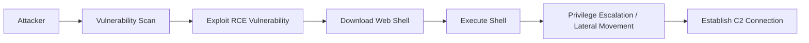

## 서론

새벽 3시, 보안 관제 센터(SOC)의 모니터를 붉게 점멸시키는 경보 메시지. "내부 네트워크에서 의심스러운 아웃바운드 연결이 탐지되었습니다." 통신사 VoIP 서버의 핵심인 FreePBX 관리자 페이지에서 수상한 POST 요청이 쏟아지고 있습니다. 단순한 서비스 장애가 아닙니다. 이것은 명백한 침해 사고입니다.

최근 Sangoma FreePBX를 타깃으로 한 대규모 공격 캠페인이 확인되었습니다. 약 900개가 넘는 FreePBX 인스턴스가 이미 탈취당한 상황입니다. 많은 관리자가 VoIP 서비스를 '전화만 걸리는 상자'로 여기며 보안 패치를 소홀히 하는 사이, 공격자들은 이 시스템을 자신들의 명령어를 실행하는 '병사'로 전락시켰습니다.

왜 이 공격이 위험한가요? 공격자는 단순히 통화 내역을 도청하는 수준에 머무르지 않습니다. 탈취된 FreePBX 서버는 내부 망으로 침투하는 교두보(Beachhead)가 되며, 랜섬웨어 배포의 발판이 되거나 불법 암호화폐 채굴의 하드웨어로 악용됩니다. 이 글에서는 FreePBX를 겨냥한 웹 쉘(Web Shell) 공격의 기술적 메커니즘을 파헤치고, 여러분의 인프라가 이 참사에 휘말리지 않도록 위기 대응 절차를 다루고자 합니다. 모든 기술적 분석은 방어 목적임을 밝힙니다.

## 본론

### 1. 공격 시나리오: 취약점에서 웹 쉘까지

공격자는 FreePBX 및 관련 모듈의 알려진 원격 코드 실행(RCE) 취약점(CVE 포함)을 악용합니다. 인증 우회(Bypass)나 특정 모듈의 파라미터 조작을 통해 공격자는 웹 서버의 권한(`www-data` 등)으로 시스템 명령어를 실행할 수 있는 지점을 찾아냅니다.

가장 치명적인 단계는 바로 '웹 쉘'의 설치입니다. 공격자는 `curl`이나 `wget` 등의 유틸리티를 이용해 악성 PHP 스크립트를 서버의 웹 루트 디렉터리(`/var/www/html`)로 다운로드합니다. 이 스크립트가 설치되는 순간, 공격자는 굳이 복잡한 익스플로잇을 다시 시도할 필요 없이, 브라우저나 간단한 HTTP 요청만으로 서버를 제어할 수 있습니다.

다음은 이 공격 흐름을 시각화한 것입니다.



### 2. 웹 쉘(Web Shell)의 실체: PoC 분석

웹 쉘은 웹 서버(예: Apache, Nginx)를 통해 시스템 명령어를 실행해주는 스크립트입니다. FreePBX는 PHP 기반이므로, 주로 PHP 파일로 작성됩니다.

> **⚠️ 윤리적 경고**: 아래 코드는 악성 스크립트의 작동 원리를 이해하고 탐지 로직을 작성하기 위한 **교육용(Proof of Concept)** 예시입니다. 절대로 타인의 시스템에 테스트하거나 악용하지 마십시오.

공격자가 서버에 심는典型的(전형적)인 단순형 PHP 웹 쉘의 구조는 다음과 같습니다. 이 코드는 `cmd` 파라미터를 통해 입력된 명령어를 서버 쉘(`system()`)에서 실행하고 그 결과를 화면에 출력합니다.

```php
<?php
// 악성 PHP 웹 쉘 예시 (분석 및 방어 학습 목적)
if (isset($_REQUEST['cmd'])) {
    // 입력된 명령어를 시스템 쉘에서 실행
    $cmd = ($_REQUEST['cmd']);
    system($cmd . " 2>&1"); 
} else {
    // 명령어가 없으면 안내 메시지 출력
    echo "Executed by /bin/sh";
}
?>
```

실제 현장에서 발견되는 웹 쉘은 위 코드보다 훨씬 정교합니다. Base64 인코딩, XOR 암호화, 혹은 이미지 파일 내에 숨겨진 스테가노그래피(Steganography) 기법이 사용되어 웹 방화벽(WAF)이나 백신 소프트웨어의 탐지를 피합니다.

### 3. 정상 트래픽 vs 공격 트래픽 분석

효과적인 탐지를 위해서는 정상적인 FreePBX 관리 트래픽과 웹 쉘 활동 트래픽의 차이를 이해해야 합니다. 아래 표는 로그 분석 시 주의 깊게 봐야 할 차이점을 정리한 것입니다.

| 비교 항목 | 정상적인 관리자 접속 | 웹 쉘 공격 트래픽 |
| :--- | :--- | :--- |
| **User-Agent** | Mozilla/5.0 (Chrome, Firefox 등 일반 브라우저) | python-requests/2.x, curl/7.x (자동화 도구) 또는 비어있음 |
| **URI 패턴** | `/admin/config.php`, `/recordings/` 등 관리 페이지 | `/admin/images/.cache.php`, `/tmp/up.php` 등 의심스러운 경로 |
| **요청 메서드** | 주로 GET, 일반적인 POST | POST (명령어 전달용) 또는 HEAD (C2 Heartbeat) |
| **파라미터** | `display`, `action`, `submit` 등 GUI 관련 변수 | `cmd`, `c`, `exec`, `0x...` 등 인자 전달 관련 변수 |
| **응답 크기** | HTML 페이지 크기 (수 KB ~ 수십 KB) | 텍스트 출력 (매우 작음) 또는 대용량 데이터 전송 |

### 4. 침해 탐지 및 대응 가이드 (Step-by-Step)

이미 공격이 발생했거나 의심스러운 징후가 보인다면, 다음 절차에 따라 즉시 대응해야 합니다.

#### Step 1: 의심스러운 파일 탐지 웹 쉘은 주로 최근 변경된 파일이나 권한이 잘못 설정된 파일로 존재합니다. 서버 쉘에서 다음 명령어를 실행하여 최근 7일간 변경된 PHP 파일을 찾으세요.

```bash
# /var/www/html (FreePBX 웹 루트) 내 최근 7일간 변경된 PHP 파일 검색
find /var/www/html -type f -name "*.php" -mtime -7 -ls

# 또는 "eval"이나 "base64_decode" 같은 위험 함수가 포함된 파일 검색 (주의 필요)
grep -rnE "eval\(|base64_decode\(|system\(" /var/www/html/ | grep -v "framework"
```

#### Step 2: 네트워크 연결 확인 웹 쉘이 C2(Command & Control) 서버와 통신 중인지 확인합니다.

```bash
# www-data 유저(혹은 웹 서버 유저)가 실행 중인 프로세스 및 연결 확인
netstat -antp | grep :80 | grep ESTABLISHED
lsof -i -a -p $(pgrep httpd)
```

#### Step 3: IOC(침해 지표) 확인 로그 파일(`/var/log/httpd/access_log` 또는 `/var/log/apache2/access.log`)을 분석하여 공격자의 흔적을 찾습니다.

```bash
# wget이나 curl을 통한 파일 다운로드 시도 로그 확인
grep "wget\|curl" /var/log/httpd/access_log | grep ".php"

# 특정 문자열("cmd", "eval")을 포함하는 POST 요청 확인
grep "POST" /var/log/httpd/access_log | grep "cmd="
```

#### Step 4: 격리 및 패치 탈취가 확인되면 즉시 시스템을 네트워크에서 분리(격리)해야 합니다.
1.  웹 쉘 파일 삭제 및 원본 소스 복구
2.  모든 관리자 및 DB 비밀번호 변경
3.  FreePBX 및 운영체제 패키지를 최신 버전으로 업데이트     ```bash     yum update freepbx     fwconsole ma upgradeall     fwconsole reload     ```
4.  불필요한 서비스 포트 차단 (외부에서 관리자 페이지 접속 제한 권장)

## 결론

이번 900여 개의 FreePBX 인스턴스 유출 사고는 우리에게 '구식' 취약점의 위험성을 다시 상기시킵니다. 공격자는 최신의 제로데이(0-day) 취약점이 아니라, 관리자가 패치를 게을리 한 '익스플로잇 가능한(Known)' 취약점을 노립니다.

핵심 요약은 다음과 같습니다.
1.  **웹 쉘은 RCE의 끝판왕입니다:** 한 번 설치되면 탐지와 제거가 매우 어렵습니다.
2.  **로그 모니터링이 필수입니다:** 단순한 방화벽만으로는 막을 수 없으며, User-Agent와 URI 패턴 기반의 이상 징후 탐지가 필요합니다.
3.  **즉각적인 패치만이 살길입니다:** FreePBX와 같은 오픈소스 솔루션은 커뮤니티의 보안 업데이트를 즉시 반영해야 합니다.

보안의 끝은 없습니다. 오늘 밤 여러분의 서버가 안전하길 바라며, 항상 의심하고 검증하는 자세가 최고의 보안 솔루션임을 기억하십시오.

**참고자료:**

- [The Hacker News - 900+ Sangoma FreePBX Instances Compromised](https://thehackernews.com/2024/05/900-sangoma-freepbx-instances-compromised.html)

- [FreePBX Security Documentation](https://wiki.freepbx.org/display/FOP/Security)
