## 서론

새벽 2시, 당신의 관제 시스템에 알림이 울립니다. 내부 네트워크의 중요한 워크스테이션 하나에서 의심스러운 아웃바운드 트래픽이 감지되었습니다. 사용자는 평소와 같이 업무용 포털과 뉴스 사이트만浏览했다고 주장합니다. 하지만 메모리 덤프를 분석해 보면, 브라우저 프로세스의 권한을 탈취해 악성 코드가 실행되었습니다. 바로 "제로데이(Zero-Day)" 취약점이었습니다.

보안 업계에서 가장 두려운 단어는 제로데이입니다. 패치가 배포되기도 전에, 혹은 사용자가 업데이트를 적용하기도 전에 공격자가 이미 이 취약점을 무기화하여 야생(Wild)에서 공격을 시작했다는 뜻이기 때문입니다. Google Chrome은 전 세계적으로 가장 널리 사용되는 브라우저인 만큼, Chrome의 제로데이 취약점은 곧 전 세계 모든 사용자, 모든 기업의 보안 위협으로 직결됩니다.

최근 Google은 "In-the-Wild" 공격이 확인된 Chrome의 새로운 제로데이 취약점(CVE-2024-XXXX)에 대한 긴급 보안 업데이트를 발표했습니다. 이 공격은 복잡한 사회공학 기술 없이도, 사용자가 악성 웹사이트를 방문하는 것만으로도 시스템 권한 탈취가 가능한 수준입니다. 우리는 왜 지금 당장 이 업데이트에 주목해야 하며, 기술적으로 이 취약점이 어떻게 작동하는지 이해해야 할까요? 본문에서는 이 제로데이의 기술적 배경과 실제 공격 시나리오, 그리고 즉시 적용 가능한 대응 전략을 다룹니다.

*(주의: 본문에 포함된 기술적 내용 및 코드는 보안 연구와 방어 목적으로만 제공됩니다.)*

## 본론

### 취약점의 기술적 심층 분석: Type Confusion in V8

이번 제로데이 취약점의 핵심은 Chrome의 자바스크립트 엔진인 **V8** 내부의 **Type Confusion(타입 혼동)** 결함에 있습니다. V8은 자바스크립트 코드를 실행하기 위해 JIT(Just-In-Time) 컴파일러를 사용하여 머신 코드로 변환하는데, 이 과정에서 최적화(Optimization) 단계가 발생합니다.

공격자는 특정한 자바스크립트 코드 조작을 통해, V8 컴파일러가 객체의 타입을 잘못 인식하게 만듭니다. 예를 들어, 숫자여야 할 메모리 영역을 객체 포인터로 인식하게 하거나, 그 반대의 경우를 유발합니다. 이러한 타입 혼동이 발생하면 공격자는 의도치 않은 메모리 영역을 읽거나(Read Primitive) 쓸(Write Primitive) 수 있는 권한을 얻게 됩니다.

이는 단순한 브라우저 크래시를 넘어, **Arbitrary Code Execution(임의 코드 실행)**으로 이어질 수 있는 결정적인 트리거가 됩니다. 공격자는 이 메모리 조작 권한을 이용해 **ROP(Return Oriented Programming)** 체인을 구성하고, 브라우저의 샌드박스(Sandbox) 보호 기능을 우회한 뒤 최종적으로受害者 시스템에서 악성 셸코드를 실행하게 됩니다.

다음은 이 공격이 실제로 진행되는 프로세스를 간략화한 흐름도입니다.

```mermaid
graph LR
    A[Victim Visits Site] --> B[Download JS Payload]
    B --> C[V8 JIT Compiler]
    C --> D[Optimization Trigger]
    D --> E[Type Confusion Bug]
    E --> F[Memory Corruption]
    F --> G[Read/Write Primitive]
    G --> H[Construct ROP Chain]
    H --> I[Sandbox Bypass]
    I --> J[Execute Shellcode]
    J --> K[System Compromised]
```



### 공격 시나리오 및 악용 단계 (Step-by-Step)

공격자가 이 취약점을 악용하여 시스템을 장악하는 과정은 매우 정교합니다.

1.  **정찰 및 준비 (Reconnaissance)**: 공격자는 대량으로 유포할 수 있는 악성 웹사이트를 구축하거나, 정상적인 웹사이트에 광고를 통해 악성 스크립트를 심습니다(Malvertising).
2.  **배달 (Delivery)**: 피해자가 해당 웹사이트에 접속하면, 브라우저는 즉시 악성 자바스크립트 파일을 다운로드하고 실행합니다.
3.  **익스플로잇 트리거 (Exploitation)**: 자바스크립트 코드가 V8 엔진 내부의 취약점을 트리거하여 힙(Heap) 메모리 손상을 유발합니다.
4.  **권한 상승 및 샌드박스 탈출 (Escalation)**: 손상된 메모리를 통해 브라우저의 샌드박스 제약을 풀고 시스템 레벨 권한을 획득합니다.
5.  **설치 및 실행 (Installation)**: 백도어(Backdoor)나 랜섬웨어와 같은 최종 페이로드를 다운로드하여 실행합니다.

### 취약점 대응 및 완화 조치 비교

단순히 "브라우저를 업데이트하라"는 말만으로는 부족합니다. 각 환경에서 어떠한 계층적 방어가 필요한지 비교해 보아야 합니다.

| 방어 계층 (Defense Layer) | 일반 사용자 환경 (Home) | 기업 환경 (Enterprise) | 비고 |
| :--- | :--- | :--- | :--- |
| **패치 관리** | Chrome 자동 업데이트 활성화 및 수동 확인 | EDR/UEM 솔루션을 통한 패치 배포 강제 | 가장 효과적인 근본적 해결책 |
| **네트워크 보안** | 공유기 최신 펌웨어 유지 | DNS 필터링, 프록시 차단规则 적용 | 악성 도메인 접속 차단 |
| **실행 방지** | 불필요한 플러그인 삭제 | 브라우저 샌드박스 정책 강화, AppLocker 사용 | 실행되더라도 확산 방지 |
| **탐지** | 백신 실시간 스캔 활성화 | 메모리 보호 기술(ASLR/DEP) 활성화 및 EDR 행위 탐지 | 공격 징후 조기 발견 |

### 실무 적용 가이드: 즉시 수행해야 할 조치

#### 1. Chrome 버전 확인 및 업데이트 이번 공격을 방어하기 위해서는 Chrome 버전이 최신 안정화 버전(Stable Channel) 이상이어야 합니다.

**Python을 활용한 버전 확인 스크립트 (PoC 개념)** 대규모 환경에서 수동으로 버전을 확인하기 어렵다면, 아래와 같은 간단한 스크립트를 사용하여 로컬 Chrome 버전을 체크할 수 있습니다.

```python
import subprocess
import re

def get_chrome_version():
    try:
        # Windows 환경 예시 (경로는 설치 환경에 따라 다를 수 있음)
        cmd = 'reg query "HKEY_CURRENT_USER\Software\Google\Chrome\BLBeacon" /v version'
        output = subprocess.check_output(cmd, shell=True, text=True)
        version = re.search(r'version\s+REG_SZ\s+([\d.]+)', output)
        
        if version:
            return version.group(1)
        else:
            return "Version not found"
    except Exception as e:
        return f"Error: {e}"

current_version = get_chrome_version()
print(f"Current Chrome Version: {current_version}")

# 실제 환경에서는 최신 패치 버전과 비교 로직을 추가하여
# current_version < safe_version 일 경우 경고를 출력하도록 구현합니다.
```

#### 2. 안전 브라우징 및 보안 설정 강화 업데이트 후에도 추가적인 방어 조치가 필요합니다.

- **Safe Browsing 기능 켜기**: `설정 > 개인 정보 보안 및 보안 > 보안`에서 '안전한 브라우징'이 항상 켜져 있는지 확인하세요.

- **확장 프로그램 관리**: 사용하지 않는 확장 프로그램은 삭제하세요. 공격자는 취약한 확장 프로그램을 통해 초기 발판을 마련할 수 있습니다.

- **사이트 격리(Site Isolation) 활성화**: 대부분의 최신 브라우저에서 기본적으로 활성화되어 있지만, `chrome://flags/#site-isolation-trial-opt-out` 등의 설정이 비활성화되어 있지 않은지 확인합니다. 이는 탭 간의 메모리 공유를 차단하여 공격이 다른 사이트로 번지는 것을 막습니다.

#### 3. 시스템 레벨 완화 (Mitigation) 만약 업데이트를 즉시 적용할 수 없는 레거시 시스템이 있다면, Chrome의 `--no-sandbox` 옵션을 사용하지 말아야 하며, 운영체제 차원에서 ASLR(주소 공간 레이아웃 무작위화)과 DEP(데이터 실행 방지)가 비활성화되어 있지는 않은지 확인해야 합니다.

## 결론

이번 Google Chrome 제로데이 취약점은 사이버 보안의 전장이 단순히 네트워크 경계가 아니라, 우리가 매일 사용하는 가장 일상적인 애플리케이션으로 확장되었음을 보여줍니다. V8 엔진과 같은 복잡한 소프트웨어의 내부를 겨냥한 이번 공격은 "방문만으로 감염된다(Drive-by Download)"는 공포를 현실화했습니다.

우리가 배운 것은 명확합니다. **"예방"과 "신속한 대응"만이 살길입니다.** 단순히 소프트웨어를 업데이트하는 행위는 기술적인 패치 이상의 의미를 가집니다. 이는 공격자가 열어둔 문을 닫는 행위이자, 조직의 중요 자산을 보호하는 가장 비용 효율적인 보안 활동입니다.

보안 전문가로서 한 가지 덧붙이자면, 이번 사태는 백신이나 방화벽만으로는 부족하다는 것을 시사합니다. 엔드포인트의 무결성을 지키기 위해서는 운영체제와 브라우저, 그리고 플러그인까지 모든 계층에 대한 최신화 패치 관리 정책(Patch Management Policy)이 수립되고 자동화되어야 합니다. 지금 당장 Chrome 버전을 확인하고 업데이트 버튼을 누르십시오. 그것이 오늘 당신이 할 수 있는 최고의 해킹 방지 작업입니다.

### 참고자료 (References)

- [Google Chrome Security Advisories](https://chromereleases.googleblog.com/)

- [CVE Details - Chrome Vulnerabilities](https://www.cvedetails.com/vulnerability-list/vendor_id-1224/product_id-19997/Google-Chrome.html)

- [V8 Engine Security](https://v8.dev/blog/security)
