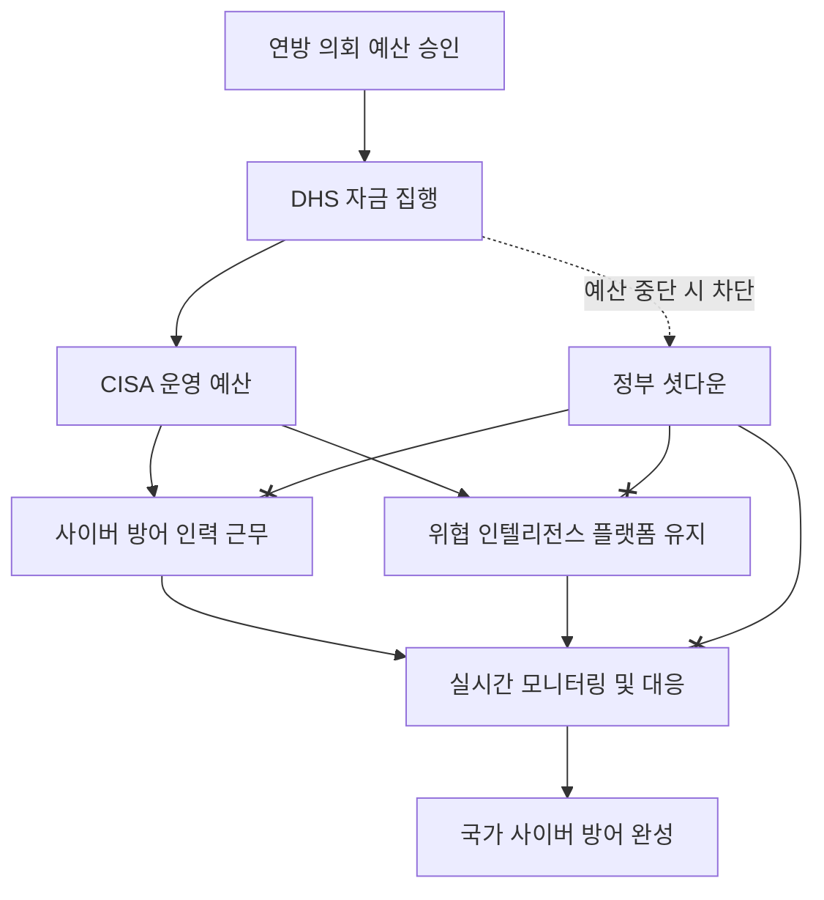

## 서론

2023년 X월 Y일, 일요일 새벽. 미국의 주요 방산 업체와 정부 기관 네트워크를 대상으로 한 대규모 DDoS 공격이 감지되었습니다. SOC(Security Operations Center) 상황실의 모니터에는 붉은색 경고灯이 깜빡이고, 분석가들은 침입자의 흔적을 뒤쫓으며 밤을 지새웁니다. 하지만 정작 가장 중요한 지원군이 빠져 있었습니다. 공격 지표(IOC)를 실시간으로 공유하고, 대응 전략을 조율해야 할 국토안보부(DHS) 산하 사이버 보안 및 인프라 보안국(CISA)의 핵심 인력들이 '휴가(Furlough)' 상태였기 때문입니다.

이것은 단순한 가상 시나리오가 아닙니다. 미 연방 정부의 예산 당국파업(Shutdown)이 임박할 때마다 반복되는 현실적인 악몽입니다. 우리가 흔히 보안 위협을 논할 때는 '제로데이 취약점'이나 '랜섬웨어' 같은 기술적 문제에 집중하지만, 가장 치명적인 취약점은 가장 기초적인 '예산'과 '운영'에서 발생합니다. 정치적 갈등으로 인한 DHS 자금 중단은 단순한 행정적 지연이 아니라, 국가 사이버 방어망에 구멍을 뚫는 행위입니다. 오늘은 정부 셧다운이 어떻게 기술적 보안 공백으로 이어지는지, 그리고 공격자들이 이 시기를 어떻게 노리는지 냉철하게 분석해 보겠습니다.

## 본론

### 예산 중단과 사이버 방어막의 붕괴 원리

국토안보부(DHS)는 물리적 국경을 넘어 디지털 국경을 방어하는 최일선에 있습니다. 특히 CISA는 민간 및 공공 부문을 연결하는 허브 역할을 수행합니다. 이들의 예산이 끊기면 일어나는 일은 단순한 '업무 중단'이 아닙니다. 이는 보안 체계의 '계층적(Layered)' 방어가 붕괴하는 과정과 같습니다. 외부 위협을 탐지하고, 분석하고, 대응하는 체인이 한꺼번에 끊기기 때문입니다.

아래 다이어그램은 정상적인 예산 흐름이 방어 체계를 어떻게 지탱하는지, 그리고 셧다운 시 어떤 경로로 차단되는지를 보여줍니다.



이 다이어그램에서 볼 수 있듯이, 자금 흐름이 차단되는 순간 인력과 시스템 운영이 동시에 멈춥니다. CISA는 약 80~90%의 직원이 휴면 상태에 들어갑니다. 남는 인력은 '법 집행'과 '국가 안보를 보호하는 예외적 업무'에만 집중하게 되는데, 문제는 '국가 안보'의 범위가 매우 좁게 해석된다는 점입니다. 일반적인 민간 기업에 대한 사이버 지원, 정기적인 취약점 분석, 그리고 예방적 패치 작업은 대부분 중단됩니다.

### 정상 운영 vs 셧다운 상태의 보안 지표 비교

정부 셧다운 기간 동안 사이버 보안 지표가 어떻게 변화하는지 실무 관점에서 비교해 보겠습니다. 단순히 사람이 없는 것을 넘어, 시스템의 신뢰성과 대응 속도에 심각한 퇴보가 발생합니다.

| 비교 항목 | 정상 운영 (Normal Operations) | 셧다운 상태 (Government Shutdown) | 보안 영향 |
| :--- | :--- | :--- | :--- |
| **MTTD (탐지 시간)** | 평균 수시간 ~ 1일 이내 | 의존 시스템에 따라 무기한 연장 | 위협이 장기간 방치됨 |
| **MTTR (대응 시간)** | 자동화 툴 및 인력 즉시 투입 | 예외 인력만 배치, 대기 시간 급증 | 피해 확산 방지 실패 |
| **Threat Intel 공유** | 실시간 IOC(Indicators of Compromise) 공유 | 수동 공유 혹은 전면 중단 | 민간 기업의 사전 방어 불가 |
| **취약점 패치 지원** | 정기적 보안 업데이트 가이드 제공 | 시스템 유지보수 중단 | Exploit 도구 남용 위험 증가 |
| **CERT 대응팀** | 24/7 교대 근무 및 분석 | 최소 인력으로 긴급 상황만 대응 | 소규모 공격 조차 누락 가능성 |

표에서 보듯이, 가장 큰 문제는 'Threat Intel 공유'의 단절입니다. CISA는 자동화된 위협 인텔리전스 공유 시스템(AIS)을 운영하는데, 셧다운 시에는 이 시스템의 관리자가 부재하여 시스템 장애 시 복구가 불가능하거나 업데이트가 중단됩니다. 이는 마치 레이더가 꺼진 전투기를 조종하는 것과 같습니다.

### 공격 시나리오: "쇼다운(Showdown)을 노린 사이버 공격"

**[⚠️ 윤리적 경고: 아 내용은 보안 방어 목적을 위한 시나리오 분석입니다.**

해커 그룹들은 정치적, 사회적 혼란을 가장 좋아합니다. 국정 운영이 마비된 시기는 그들에게 '골든타임'입니다. 특히 국가 지원 해킹 그룹(예: APT29, 라저(Lazarus) 그룹 등)은 다음과 같은 단계별 공격을 시도할 가능성이 큽니다.

1.  **정찰 (Reconnaissance)**: 셧다운 발표 직후, 정부 포털 및 기관 웹사이트의 패치 주기가 늦어지는지 스캔합니다.
2.  **취약점 공격 (Exploitation)**: 평소라면 CISA가 즉시 알렸을 최신 취약점(예: Log4j 유형)을 이용해 방화벽이나 VPN 장비에 침투를 시도합니다.
3.  **수평 이동 (Lateral Movement)**: 방어자가 없는 틈을 타 내부 네트워크에서 권한을 상승시킵니다. 경고를 받아도 처리할 사람이 없습니다.
4.  **데이터 유출 (Exfiltration)**: 장기간 잠복하며 데이터를 훔치거나, 시스템을 백도어로 감염시킵니다.

이 시나리오를 기반으로, 방어 시스템이 예산 부족으로 어떻게 반응하지 못하는지 시뮬레이션해 보겠습니다.

### PoC: 방어 체계 마비 시뮬레이션 (Python)

아래 코드는 민간 기업의 SOC 시스템이 정부(CISA)의 위협 정보 서버와 통신하여 IOC를 확인하는 과정을 시뮬레이션한 것입니다. 셧다운으로 인해 정부 서버가 응답하지 않을 때 발생하는 상황을 보여줍니다.

```python
import requests
import time
import random

# 가상의 CISA 위협 정보 피드 URL
CISA_THREAT_FEED_URL = "https://api.cisa.gov/threat-feed/v1/active"

def check_ioc_with_cisa(ioc_hash):
    """
    CISA 서버에 IOC 해시값을 조회하여 악성 여부를 확인하는 함수
    """
    try:
        # 셧다운 시뮬레이션 플래그
        shutdown_active = True 
        
        if shutdown_active:
            raise requests.exceptions.ConnectionError("503 Service Unavailable: Government Shutdown")
            
        # 실제 상황이라면 여기서 API 호출이 일어남
        response = requests.post(CISA_THREAT_FEED_URL, json={'hash': ioc_hash}, timeout=2)
        if response.status_code == 200:
            return response.json().get('is_malicious', False)
        else:
            return False
            
    except requests.exceptions.ConnectionError as e:
        print(f"[CRITICAL] CISA Feed Unreachable: {e}")
        print("[WARNING] Falling back to local database (Outdated!)")
        # 로컬 DB는 최신 정보가 없을 수 있음 (취약점 발생)
        return check_local_db(ioc_hash)
    except Exception as e:
        print(f"[ERROR] Unexpected error: {e}")
        return False

def check_local_db(ioc_hash):
    """
    로컬 데이터베이스 확인 (업데이트 안 된 상태)
    """
    # 로컬 DB에는 최신 APT 그룹의 해시가 없다고 가정
    local_db = ["known_bad_hash_1", "known_bad_hash_2"]
    return ioc_hash in local_db

# 공격 시뮬레이션
new_apt_hash = "f9a8b7c6d5e4f3a2b1c0d9e8f7a6b5c4" # 최신 APT 공격 해시

print(f"Analyzing incoming traffic with hash: {new_apt_hash}")
is_malicious = check_ioc_with_cisa(new_apt_hash)

if is_malicious:
    print("Action: Blocking malicious traffic!")
else:
    print("Action: Traffic allowed. (System may be compromised due to outdated intel)")
```

**코드 분석:** 이 코드는 `shutdown_active` 플래그가 켜지면 즉시 연결 에러를 발생시킵니다. 실제 현장에서는 CISA의 AIS(Automated Indicator Sharing) 서비스가 중단되거나, 담당 관제원이 부재하여 장애 발생 시 복구되지 않는 상황과 같습니다. 결국 시스템은 오래된 로컬 DB(`check_local_db`)에 의존하게 되고, 최신 해시를 탐지하지 못해 공격을 허용하게 됩니다. 이것이 바로 예산 문제가 코딩된 로직을 어떻게 무력화시키는지에 대한 증거입니다.

### 현장에서의 대응 가이드: "Help is not coming"

정부의 지원이 끊긴 상황에서 CISO(최고 정보 보안 책임자)와 보안 팀은 '자구책'을 마련해야 합니다. 의존성을 낮추고 자체 방어 능력을 극대화하는 단계별 가이드는 다음과 같습니다.

**Step 1: 인텔리전스 의존성 낮추기**

- CISA나 타 기관의 업데이트를 기다리는 수동적 방어 포기.

- 상용 위협 인텔리전스 플랫폼(예: Recorded Future, CrowdStrike Falcon) 등 민간 업체의 피드를 주요 소스로 전환.

**Step 2: 사냥(Hunting) 강화**

- 탐지 규칙(IPS/IDS)만 믿지 말고, 네트워크 내부에서 능동적으로 위협을 찾는 '위협 헌팅(Threat Hunting)' 팀 가동.

- EDR(Endpoint Detection and Response) 로그를 정기적으로 수동 리뷰하여 의심스러운 프로세스 탐지.

**Step 3: 패치 관리 사전 예방**

- 셧다운 기간 중에는 보안 업데이트 배포가 중단될 수 있음을 고려하여, 사전에 중요 패치를 완료.

- 패치가 불가능한 레거시 시스템은 네트워크에서 분리(Air-gapping)하거나 추가적인 접근 제어를 적용.

**Step 4: 커뮤니케이션 채널 확보**

- 정보 공유 분석 센터(ISAC) 등 업계별 비상 연락망을 통해 타 기관과 공격 정보를 직접 공유하는 협력 체제 구축.

## 결론

결국 DHS 자금 중단은 예산 문제를 넘어 '보안의 지속성(Continuity)'이라는 원칙을 훼손하는 행위입니다. 사이버 공격은 의회가 휴회하는 기간에 쉬지 않습니다. 오히려 방어자가 약해진 틈을 노려 더욱 공격적으로 변합니다.

우리가 이 메커니즘을 이해해야 하는 이유는, 막연한 불안감을 갖기 위해서가 아닙니다. "국가가 나를 지켜주지 않는다면 나 스스로 어떻게 지킬 것인가"에 대한 현실적인 계획을 세우기 위해서입니다. 보안의 책임이 정부에서 민간, 개개인으로 전가되는 시점, 방어 전략은 '협력'에서 '자율 방어'로 재편되어야 합니다.

최고의 보안은 최악의 상황을 가정하고 준비하는 것에서 나옵니다. 정부가 문을 닫는 날, 당신의 방화벽은 열려 있습니까?

### 참고자료

- [CISA Official Website - Emergency Directives](https://www.cisa.gov/)

- [USA Today - Homeland Security funding at risk as shutdown looms](https://www.usatoday.com/)

- [NIST - Guide to Cybersecurity Incident Handling](https://csrc.nist.gov/publications/detail/sp/800-61/rev-2/final)
