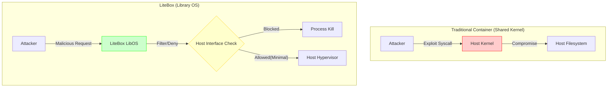

## 서론

지난 2024년 봄, 글로벌 클라우드 제공업체를 타격한 대규모 공급망 공격의 루트 원인은 예상과 다르게 복잡한 0-day 취약점이 아니었습니다. 바로 널리 사용되는 오픈소스 컨테이너 이미지 내의 오래된 커널 버전을 악용한 **컨테이너 탈출(Container Escape)**이었습니다. 공격자는 컨테이너 내부에서 `dirty pipe`나 관련 권한 상승 취약점을 이용해 호스트 커널에 직접적으로 접근했고, 결국 물리적 호스트 장악은 물론 전체 클러스터의 랜섬웨어 감염으로 이어졌습니다.

이 사건은 보안 엔지니어들에게 근본적인 질문을 던졌습니다. "우리는 애플리케이션을 격리하기 위해 컨테이너를 사용하지만, 사실상 모든 컨테이너는 하나의 공유된 커널 위에서 뛰고 있는 것이 아닌가?"

전통적인 리눅스 컨테이너(LXC, Docker 등)는 **사용자 공간(User Space)**만 격리할 뿐, **커널 공간(Kernel Space)**은 호스트와 공유합니다. 이는 공격 표면(Attack Surface)을 필연적으로 넓힙니다. Microsoft가 오픈소스로 공개한 **LiteBox**는 이러한 구조적 한계를 Rust의 안전성과 라이브러리 OS(Library OS) 아키텍처로 해결하려는 시도입니다. 단순한 샌드박스를 넘어, 호스트와의 인터페이스 자체를 최소화하여 공격자가 발을 디딜 수 있는 토양을 없애는 것이 핵심입니다.

## 본론

### 라이브러리 OS(Library OS)와 공격 표면 최소화의 원리

LiteBox는 단순한 런타임이 아닌, 애플리케이션 코드와 링크되어 실행되는 **라이브러리 OS**입니다. 기존의 OS는 애플리케이션이 시스템 콜(System Call)을 통해 커널에 서비스를 요청하지만, LiteBox는 이러한 요청을 라이브러리 레벨에서 처리합니다. 호스트 운영체제(Linux나 Windows)의 커널 기능이 필요한 경우에만, 아주 엄선되고 제한된 인터페이스(Hypercall 또는 제한된 Syscall)를 통해 통신합니다.

이 구조의 핵심 보안 메커니즘은 **'호스트 인터페이스의 최소화'**입니다.

#### ⚠️ 보안 경고 다음 내용은 기술적 원리를 설명하고 방어 전략을 수립하기 위한 것이며, 악의적인 목적의 사용은 엄격히 금지됩니다.

#### 공격 시나리오 비교: 기존 컨테이너 vs. LiteBox

공격자가 웹 서비스 내부에서 코드 실행 권한을 얻었다고 가정해 봅시다.



**기존 환경:** 공격자는 수백 개의 시스템 콜(`open`, `write`, `ioctl` 등)을 통해 직접 호스트 커널과 소통할 수 있습니다. 하나의 취약점만 터지면 호스트 권한을 탈취할 수 있습니다.

**LiteBox 환경:** 공격자는 LiteBox라는 '벽'에 부딪힙니다. LiteBox는 요청을 검사하고, 허용된 리소스 접근만 라이브러리 레벨에서 처리합니다. 호스트 커널로 가는 경로는 차단되거나 매우 좁은 틈(New, Map 등 최소한의 메모리 관리)만 열려 있습니다.

### 기술적 심층 분석: Rust와 구현 상세

LiteBox는 **Rust**로 작성되었습니다. 이는 단순한 언어 선택이 아니라 보안의 핵심 요소입니다. C/C++로 작성된 기존 커널이나 Hypervisor 코드는 메모리 안전성 취약점(Buffer Overflow, Use-after-free 등)에 취약합니다. LiteBox는 Rust의 소유권(Ownership) 및 차용(Borrowing) 시스템을 통해 이러한 메모리 관련 버그를 컴파일 타임에 원천 봉쇄합니다.

LiteBox는 두 가지 모드를 지원합니다. 1.  **Seccomp Mode (User Mode):** Linux의 `seccomp` 필터를 활용하여 시스템 콜을 제한합니다. 2.  **Hyper-V Mode (Kernel Mode):** Hypervisor 위에서 직접 실행되어 하드웨어 수준의 격리를 제공합니다.

#### 코드 예시: 제한된 환경에서의 실행

LiteBox 환경에서 실행되는 애플리케이션은 호스트의 파일 시스템에 직접 접근할 수 없습니다. 모든 접근은 LiteBox가 제공하는 추상화 계층을 거쳐야 합니다.

아래는 개념 증명(PoC)을 위해 작성한 Rust 코드 스니펫입니다. 이 코드는 일반적인 환경에서는 파일 시스템에 접근하겠지만, LiteBox의 정책(Policy)에 의해 차단될 수 있는 시나리오를 보여줍니다.

```rust
// LiteBox PoC: Attempting to access a sensitive file
// 이 코드는 LiteBox 내부의 샌드박스 메커니즘을 테스트하기 위한 예제입니다.

use std::fs;
use std::path::Path;

fn attempt_unauthorized_access() {
    let target_path = Path::new("/etc/shadow");

    match fs::read_to_string(target_path) {
        Ok(content) => {
            // 이 코드 경로는 LiteBox의 보안 정책이 올바르게 적용되었다면
            // 실행되지 않아야 합니다.
            eprintln!("[SECURITY ALERT] Read successful: {}", content);
        }
        Err(e) => {
            // LiteBox 또는 호스트 커널에 의해 액세스가 거부됨
            eprintln!("[EXPECTED] Access denied by LiteBox/Hypervisor: {}", e);
        }
    }
}

fn main() {
    // LiteBox 라이브러리 초기화 (가상의 API)
    // litebox::init_policy(SandboxPolicy::Strict);

    println!("LiteBox Sandbox Test Starting...");
    attempt_unauthorized_access();
}
```

위 코드를 일반 리눅스 컨테이너에서 실행하면 `Capability`가 충분할 경우 파일을 읽어옵니다. 하지만 LiteBox 내에서는 파일 시스템 접근을 위한 호스트 인터페이스가 차단되어 있거나, 가상의 파일 시스템만 제공되므로 `Access denied` 또는 `No such file or directory` 오류가 발생하며 공격이 차단됩니다.

### 비교 분석: 격리 수준과 오버헤드

LiteBox가 기존 솔루션과 비교하여 어느 지점에 위치하는지 명확히 이해해야 합니다.

| 특징 | 기존 Docker/Container | 전용 가상머신 (VM) | LiteBox (Library OS) |
| :--- | :---: | :---: | :---: |
| **커널 공유** | 공유 (Yes) | 독립 (No) | 선택 가능 (LibOS 또는 Guest) |
| **격리 레벨** | 프로세스 레벨 | 하드웨어/OS 레벨 | **Application/OS 경계** |
| **공격 표면** | 큼 (Large - 전체 Syscall) | 작음 (Small - Virtio 드라이버) | **매우 작음 (Minimal - 선택적 Hypercall)** |
| **성능 오버헤드** | 낮음 (Native에 근접) | 높음 (Hypervisor 비용) | **중간~낮음 (Rust 최적화)** |
| **주요 용도** | 일반 서비스 배포 | 완전한 격리 필요 시 | **보안이 중요한 멀티테넌트 서비스** |

LiteBox는 VM의 보안성과 컨테이너의 가볍다는 장점을 취하려는 하이브리드 접근 방식입니다.

### 실무 적용 가이드: 단계별 구성 전략

조직 내에서 LiteBox를 도입하여 샌드박싱 환경을 강화하기 위한 단계별 가이드입니다.

#### 1. 사전 요구사항 및 환경 설정 LiteBox는 현재 실험적 단계이며 Linux 및 Hyper-V 환경을 지원합니다. Rust 툴체인이 필수적입니다.

```bash
# Rust 툴체인 설치
curl --proto '=https' --tlsv1.2 -sSf https://sh.rustup.rs | sh

# LiteBox 소스 코드 클론 및 빌드 (예시)
git clone https://github.com/microsoft/LiteBox.git
cd LiteBox
cargo build --release
```

#### 2. 샌드박스 정책 수립 어떤 리소스를 애플리케이션에 노출할지 정의해야 합니다. "기본 거부(Deny by Default)" 원칙을 따르야 합니다.

- **네트워크:** Outbound만 허용, Inbound 차단
- **파일 시스템:** 읽기 전용 볼륨만 마운트
- **프로세스:** `fork()` 또는 `exec()` 계열 호출 제한

#### 3. 워크로드 패키징 애플리케이션을 LiteBox 라이브러리와 링크하여 실행 파일을 생성합니다.

```bash
# 예시: 웹 애플리케이션을 LiteBox 환경에서 빌드
cargo build --target x86_64-unknown-linux-gnu --release
```

#### 4. 실행 및 모니터링 LiteBox 위에서 애플리케이션을 실행합니다. 호스트 인터페이스를 통과하는 요청은 로깅되어야 합니다.

- **체크포인트:** 애플리케이션이 예상치 못한 `syscall`을 호출하여 크래시가 발생하는지 확인합니다.
- **로그 분석:** 호스트로 전달되는 Hypercall 로그를 분석하여 의심스러운 행위 탐지.

## 결론

LiteBox는 "보안은 기능이 아니라 구조적 특성이다"라는 명제를 증명하는 사례입니다. Microsoft가 Rust를 선택하여 메모리 안전성을 확보하고, 라이브러리 OS 아키텍처를 통해 호스트 인터페이스를 극단적으로 줄인 것은 클라우드 보안의 새로운 표준을 제시합니다.

기존의 방화벽이나 IDS/IPS가 '트래픽'을 모니터링했다면, LiteBox는 '실행 환경 자체'를 탈탈 털어 공격 표면을 제거합니다. 특히 멀티테넌트 환경에서 타 사용자의 데이터를 보호해야 하는 클라우드 서비스 제공자나, 랜섬웨어와 같은 고위협 공격으로부터 핵심 프로세스를 격리하고자 하는 기업에 매우 매력적인 솔루션이 될 것입니다.

물론, 아직 초기 단계인 오픈소스 프로젝트이므로 생태계 완성도와 벤더 호환성은 계속 지켜봐야 합니다. 하지만 "안전한 코드(Rust)"와 "최소한 인터페이스(LibOS)"라는 두 가지 트렌드가 결합된 LiteBox는 미래의 샌드박싱 기술이 나아갈 명확한 방향성을 보여줍니다.

### 참고자료

- [LiteBox GitHub Repository](https://github.com/microsoft/LiteBox) (공식 저장소)
- [The Rust Programming Language](https://www.rust-lang.org/)
- [Drawbridge: Portable Library OS](https://www.microsoft.com/research/project/drawbridge/) (MS의 선행 연구)
