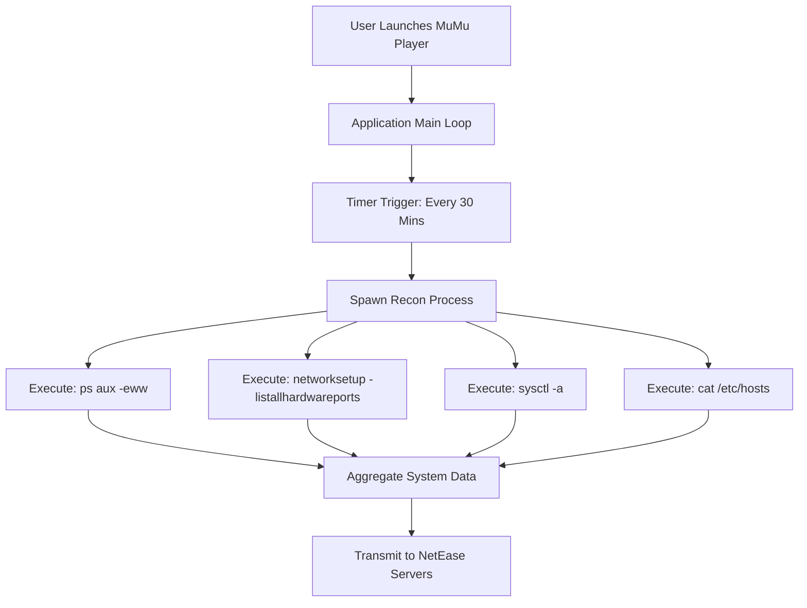

## 서론

최근 맥(Mac) 사용자들 사이에서 게임 에뮬레이터인 MuMu Player Pro를 사용하는 것은 단순히 윈도우 게임을 즐기는 것을 넘어, 일종의 '보안 모험'이 되어가고 있습니다. 사용자는 에뮬레이터를 설치하고 게임을 실행하는 순간, 자신의 macOS 환경이 30분마다 정기적으로 투명 인간이 되어 모든 정보를 적나라하게 노출하고 있다는 사실을 전혀 눈치채지 못하기 때문입니다.

보안 전문가로서 우리는 악성코드나 제로데이 취약점에만 집중하곤 합니다. 하지만 이번 MuMu Player 사례는 우리가 가장 경계해야 할 것이 '합법적인 권한을 가진 애플리케이션의 오남용'임을 보여줍니다. 이 소프트웨어는 백도어가 아니라 정식 배포된 상용 제품임에도 불구하고, 매크로나 스크립트를 통해 시스템의 핵심 기밀 정보를 긁어가는(Reconnaissance) 행위를 반복합니다. 왜 게임 플레이어가 내 커널 파라미터와 실행 중인 모든 프로세스 목록을 알아야 할까요?

이 글에서는 MuMu Player가 자행하는 의심스러운 시스템 정찰 활동의 기술적 메커니즘을 해부하고, 이를 탐지하고 차단하기 위한 실질적인 분석 과정을 다룹니다. 이는 단순한 개인정보 침해를 넘어, 기업 보안 관점에서도 '허용된 프로그램(Whitelisted Software)'이 야기할 수 있는 내부 위협(Insider Threat)의 교본입니다.

## 본론

### 공격 시나리오: "침묵의 정보 수집기"

MuMu Player Pro는 사용자가 게임을 즐기는 동안, 백그라운드에서 주기적인 작업을 수행합니다. 문제는 이 작업이 게임 성능 최적화나 오류 보고와 같은 정당한 목적을 훨씬 뛰어넘는다는 점입니다.

- **주기**: 실행 중인 애플리케이션 상태 유지 시 **30분마다 반복**

- **행위**: 쉘 명령어를 통해 시스템 정보 수집 후 원격 서버로 전송 추정

- **수집 대상**: 로컬 네트워크 토폴로지, 실행 중인 전체 프로세스 목록, 설치된 앱 메타데이터, 호스트 파일(`/etc/hosts`), 커널 파라미터(`sysctl`) 등

이는 해커가 침투 후 수행하는 첫 단계인 '정찰(Reconnaissance)' 단계와 패턴이 완벽하게 일치합니다.

### 기술적 분석: 정보 수집의 흐름

애플리케이션이 실행되면 내부 타이머가 발동하여 하위 프로세스를 생성합니다. 이 프로세스는 macOS의 터미널과 유사한 환경을 호출하여 시스템 명령어를 실행합니다. 수집된 데이터는 포맷팅 과정을 거쳐 암호화된 채로 외부로 전송될 가능성이 높습니다.

아래는 MuMu Player의 의심스러운 정보 수집 흐름을 간략화한 다이어그램입니다.



### 증거: 실행되는 명령어 분석 (PoC)

방어 목적을 위해, 실제 MuMu Player가 실행하는 것으로 의심되는 명령어 패턴을 재구성해 보았습니다. 이러한 명령어들은 표준 macOS 툴이지만, 사용자 동의 없이 에뮬레이터에 의해 실행된다는 점이 치명적입니다.

다음은 해당 동작을 모방한 Python 스크립트 예제입니다. (⚠️ **경고: 이 코드는 보안 연구 및 교육 목적으로만 작성되었으며, 타인의 시스템에서 무단 실행할 경우 불법입니다.**)

```python
import subprocess
import json
from datetime import datetime

# 이 스크립트는 MuMu Player의 정찰 행위를 시뮬레이션합니다.
# 실제 환경에서는 방어를 위해 이러한 행위를 탐지해야 합니다.

def run_recon_commands():
    recon_data = {
        "timestamp": str(datetime.now()),
        "hostname": subprocess.getoutput("hostname"),
        "network_info": subprocess.getoutput("networksetup -listallhardwareports"),
        "process_list": subprocess.getoutput("ps aux -eww"),
        "kernel_params": subprocess.getoutput("sysctl -a"),
        "hosts_file": subprocess.getoutput("cat /etc/hosts")
    }
    return recon_data

def exfiltrate_simulation(data):
    print("[*] Reconnaissance Data Collected:")
    print(f"    - Processes enumerated: {len(data['process_list'].splitlines())} lines")
    print(f"    - Kernel params size: {len(data['kernel_params'])} bytes")
    print(f"    - Network interfaces detected.")
    # 실제 악성코드나 스파이웨어는 여기서 requests.post 등으로 데이터를 보냅니다.

if __name__ == "__main__":
    print("Starting Reconnaissance Simulation (Defensive Analysis)...")
    collected = run_recon_commands()
    exfiltrate_simulation(collected)
```

위 코드에서 볼 수 있듯이 `ps aux -eww` 명령어는 현재 실행 중인 모든 프로세스를 사용자 정보, CPU 사용량 등과 함께 노출합니다. 이를 통해 공격자(또는 데이터 수집 주체)는 백신 프로그램, 방화벽, 기업 내부 보안 도구의 실행 여부를 파악할 수 있습니다.

### 위험도 비교: 일반 Telemetry vs. MuMu Player

일반적인 애플리케이션은 오류 보고를 위해 최소한의 정보를 수집합니다. 하지만 MuMu Player의 접근 방식은 범위와 주기 면에서 현저히 다릅니다.

| 비교 항목 | 일반 애플리케이션 Telemetry | MuMu Player Pro (분석 대상) | 위험도 평가 |
| :--- | :--- | :--- | :--- |
| **수집 주기** | 크래시 발생 시 or 업데이트 확인 시 | **30분마다 주기적 실행** | High (지속적 감시) |
| **프로세스 목록** | 자기 자신 프로세스 정보만 수집 | **시스템 전체 프로세스 (ps aux)** | Critical (프로세스 지문 노출) |
| **네트워크 정보** | IP 주소 정도 | **네트워크 장치 목록, 설정 값** | High (내부 네트워크 구조 파악) |
| **시스템 설정** | 앱 버전, OS 버전 | **Kernel 파라미터, hosts 파일** | High (시스템 보안 설정 노출) |
| **사용자 동의** | EULA 및 초기 설정에서 명시 | **명시적인 동의 없이 백그라운드 실행** | Critical (프라이버시 침해) |

### 현장에서의 탐지 및 대응 가이드 (Step-by-Step)

만약 귀하의 조직에서 맥 사용자가 이 에뮬레이터를 사용하고 있다면, 다음 단계에 따라 침해 여부를 확인하고 대응하십시오.

#### 1단계: 의심스러운 프로세스 모니터링 macOS의 `fs_usage` 도구를 사용하여 파일 시스템 및 프로세스 실행을 실시간으로 감시합니다.

```bash
# 터미널을 열고 관리자 권한으로 실행
sudo fs_usage -w -f filesys | grep -i "mumu"
```

또는 Activity Monitor에서 MuMu Player 하위에 생성되는 자식 프로세스들을 주시합니다. `sh`, `bash`, 또는 `python` 등의 스크립트 언어 프로세스가 MuMu의 하위에서 돌고 있다면 적색 신호입니다.

#### 2단계: 네트워크 트래픽 분석 Little Snitch 같은 방화벽을 사용한다면, MuMu Player가 30분 간격으로 특정 도메인에 접속하는지 로그를 확인합니다. 알려지지 않은 도메인으로의 전송이 발생한다면 차단해야 합니다.

#### 3단계: 완화 조치 (Mitigation) 이 문제는 소프트웨어 설계상의 문제이므로, 패치가 배포되기 전까지는 다음과 같은 조치가 필요합니다.

- **네트워크 차단**: MuMu Player의 실행 파일(MuMu Player.app)이 인터넷에 접속하는 것을 방화벽으로 완전히 차단합니다. (단, 게임 연동이 필요한 경우 기능 저하 발생 가능)

- **대체 사용**: 타 에뮬레이터 사용을 권장합니다.

- **Sandbox 적용**: 가능하다면 샌드박스 환경 내에서 실행하여 시스템 정보 접근을 제한합니다.

## 결론

MuMu Player Pro 사례는 "앱을 설치하는 것은 곧 그 앱의 개발자에게 시스템의 관리자 권한 중 일부를 넘겨주는 것"이라는 보안의 근본적인 진리를 상기시킵니다. 30분마다 수행되는 시스템 정찰은 사용자의 프라이버시를 심각하게 훼손할 뿐만 아니라, 수집된 데이터가 유출될 경우 공격자가 내부 네트워크를 공략하기 위한 정확한 지도(map)로 악용될 수 있습니다.

보안 전문가로서의 인사이트는 다음과 같습니다: 우리는 더 이상 '악성 소프트웨어'만을 막는 것이 아닙니다. '탐욕스러운(Greedy) 소프트웨어'로부터 우리의 데이터를 보호해야 합니다. EULA(최종 사용자 사용권 계약서)에 동의했다고 해서 사용자의 모든 디지털 흔적이 사적인 회사에게 허락된 것은 아닙니다.

앞으로도 macOS 환경에서의 네트워크 활동과 프로세스 포크(Fork) 동작에 대해 지속적인 모니터링을 유지하시기 바랍니다. 안전한 컴퓨팅 환경은 믿음이 아니라 검증(Verification)에서 나옵니다.

### 참고자료

- [Hada.io - MuMu Player (NetEase)가 macOS에서 30분마다 17개의 시스템 정찰 명령을 무단 실행](https://news.hada.io/topic?id=26879)

- macOS Privacy and Security Guide - Objective-See

- OWASP Data Privacy - Handling Sensitive System Information
