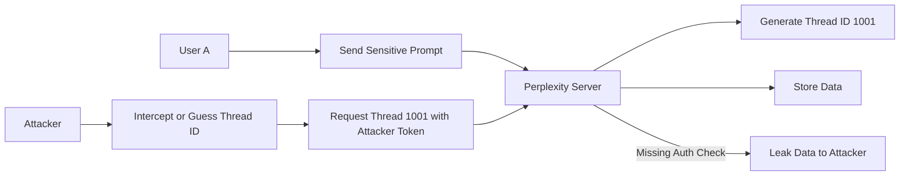

## 서론

당신이 회사의 기밀 프로젝트와 관련된 민감한 정보를 AI에게 물어보는 상황을 상상해 보십시오. "우리 회사의 2분기 비용 절감 계획에 맞춰 내부 재무 데이터를 기반으로 예산을 재배치해 줘"와 같은 프롬프트를 입력했고, AI는 그에 따른 정교한 답변을 생성했습니다. 그런데 며칠 뒤, 당신이 입력했던 그 민감한 프롬프트와 생성된 답변이 경쟁사의 데이터베이스나 공개 포럼에 고스란히 노출되었다면?

최근 Zenity가 발견하고 공개한 Perplexity AI 브라우저의 취약점은 이러한 악몽을 현실로 만들 수 있는 시나리오입니다. 이 사건은 단순한 웹사이트의 버그를 넘어, 생성형 AI 서비스가 우리의 업무 파트너로 깊숙이 들어오는 현시대에 보안의 패러다임이 어떻게 변해야 하는지를 보여주는 결정적인 계기입니다. 우리는 AI의 '지능'에만 집중하다가, AI를 둘러싼 '인프라', 즉 브라우저와 통신 계층에서 발생하는 전통적이지만 치명적인 보안 결함을 간과해서는 안 됩니다.

이 글에서는 Perplexity AI 브라우저에서 발견된 데이터 노출 취약점의 기술적 원인을 심층적으로 분석하고, 공격자가 이를 어떻게 악용할 수 있는지 살펴봅니다. 또한, 방어자 관점에서 이러한 취약점을 식별하고 완화하기 위한 실질적인 대응 전략을 제시합니다.

---

## 본론: 취약점의 기술적 원인과 공격 메커니즘

### 취약점의 핵심: 부적절한 접근 제어와 IDOR

Zenity가 보고한 이 취약점의 핵심은 웹 보안에서 매우 흔하지만, AI 브라우저 환경에서는 치명적인 결과를 초래하는 **IDOR(Insecure Direct Object Reference)** 취약점입니다. Perplexity AI 브라우저는 사용자의 질문(프롬프트)과 AI의 답변(결과)을 특정 ID를 통해 관리합니다.

문제는 이 ID를 통해 데이터를 요청할 때, 서버가 **"요청을 보낸 사용자가 해당 데이터의 실제 소유자인지"**를 엄격하게 검증하지 않았다는 점입니다. 즉, 사용자 A가 생성한 검색 결과의 URL(예: `https://www.perplexity.ai/search/thread-12345`)을 알고 있는 사용자 B가, 본인의 인증 토큰을 사용하여 해당 URL에 요청을 보냈을 때, 서버가 "이건 B의 데이터가 아니므로 접근 거부"라고 하지 않고, 데이터를 그대로 반환해버리는 것입니다.

이는 AI 브라우저가 사용자의 문맥(Context)과 세션을 관리하는 방식의 취약점을 시사합니다. 프론트엔드(브라우저)에서는 사용자에게 자신의 데이터만 보여주지만, 백엔드 API는 권한 검증 로직이 누락되어 있어 권한이 없는 사용자도 다른 사람의 사적인 대화 내역을 열람할 수 있게 된 것입니다.

### 공격 시나리오 흐름도

이 취약점이 어떻게 악용되는지 시나리오를 통해 시각화해 보겠습니다. 아래 다이어그램은 공격자가 권한 없는 사용자의 민감한 프롬프트를 탈취하는 과정을 보여줍니다.



### 기술적 심층 분석: 왜 이런 일이 발생하는가?

전통적인 웹 애플리케이션과 달리, AI 브라우저는 '대화형(Thread)' 세션을 길게 유지합니다. 이를 위해 URL 구조나 쿠키, 로컬 스토리지에 세션 식별자를 저장합니다. 문제는 개발 과정에서 편의성을 위해 세션 ID나 스레드 ID를 **추측 가능한 형태(Sequential Integer)**로 생성하거나, **OIDC(OpenID Connect)와 같은 표준 인증 프로토콜의 Scope 검증을 소홀히** 했을 가능성이 큽니다.

특히 AI 서비스는 프롬프트에 사용자의 고유한 생각, 코드, 비즈니스 전략이 포함되기 때문에 일반적인 SNS 게시물 유출보다 훨씬 큰 임팩트를 가집니다. 공격자는 무차별 대입(Brute Force) 공격을 통해 유효한 스레드 ID를 찾아내거나, 오픈 소스 코드 분석을 통해 ID 생성 로직을 파악하여 타겟팅된 공격을 수행할 수 있습니다.

### PoC (Proof of Concept) 개념 증명

*⚠️ 경고: 아래 코드는 보안 연구 및 방어 목적을 위한 교육용 예시입니다.未经 승인된 시스템에서 테스트하는 것은 불법입니다.*

이 공격을 기술적으로 어떻게 구현할 수 있는지 파이썬을 사용한 간단한 개념 증명 코드를 작성해 보았습니다. 이 코드는 공격자가 유효한 세션 토큰(자신의 것)을 사용하여 연속적인 스레드 ID를 요청하고, 서버가 권한 없는 데이터를 반환하는지 확인하는 과정을 시뮬레이션합니다.

```python
import requests

# 공격자의 자신 인증 토큰 (브라우저 개발자 도구나 쿠키에서 획득)
ATTACKER_TOKEN = "eyJhbGciOiJIUzI1NiIsInR5cCI6IkpXVCJ9.attacker_token_payload"
TARGET_BASE_URL = "https://api.perplexity.ai/browser/thread"

# 헤더 설정 (인증 토큰 포함)
headers = {
    "Authorization": f"Bearer {ATTACKER_TOKEN}",
    "User-Agent": "Pentest-Tool/1.0"
}

def check_thread_leak(thread_id):
    target_url = f"{TARGET_BASE_URL}/{thread_id}"
    
    try:
        response = requests.get(target_url, headers=headers)
        
        # HTTP 200 OK: 데이터 반환 성공 (취약점 존재)
        if response.status_code == 200:
            data = response.json()
            print(f"[+] LEAK FOUND! Thread ID: {thread_id}")
            print(f"    Prompt: {data.get('prompt', 'N/A')}")
            return True
            
        # HTTP 401/403: 접근 거부 (정상 동작)
        elif response.status_code in [401, 403]:
            print(f"[-] Access Denied (Secure): Thread ID {thread_id}")
            return False
            
        # HTTP 404: 존재하지 않는 스레드
        elif response.status_code == 404:
            return False
            
    except Exception as e:
        print(f"[!] Error: {e}")
        return False

# 공격자는 IDOR를 의심하고 연속된 ID를 스캔
print("Starting IDOR Scan Simulation...")
for i in range(1000, 1010):  # 예시: 1000번대 스레드 스캔
    check_thread_leak(i)
```

이 코드가 실행되었을 때 `Thread ID: 1005` 등에서 타인의 프롬프트 내용이 출력된다면, 이는 명백한 IDOR 취약점입니다. 공격자는 이 로직을 자동화하여 수만 개의 대화 내용을 대량으로 수집할 수 있습니다.

### 취약점 분석 및 보안 대응 비교

이러한 취약점을 방지하기 위해서는 어떠한 보안 통제가 필요한지, 현재 상태와 권장 상태를 비교해 보겠습니다.

| 비교 항목 | 취약한 구조 (Vulnerable) | 권장 구조 (Secure) |
| :--- | :--- | :--- |
| **식별자 (ID) 형태** | 순차적 정수 (Sequential Integer)<br>예: `/thread/1234` | 불가측한 UUID (Universally Unique Identifier)<br>예: `/thread/a1b2-c3d4...` |
| **접근 제어 (ACL)** | 프론트엔드 숨김 처리에 의존<br>API에서 소유권 검증 누락 | 백엔드 수준에서 Object Ownership 검증 필수<br>`if (thread.owner != user) return 403` |
| **인증/인가 메커니즘** | 단순한 세션 쿠키만 확인 | JWT, OAuth2 Scope 등 강력한 인증 및 세션 검증 |
| **데이터 노출 범위** | 전체 대화 내용(Prompt + Response) 노출 | 최소한의 데이터만 노출 또는 완전 격리 |
| **로그 및 감사** | 접근 기록 미비 | 비정상적인 접근 시도 시도 실시간 탐지 및 차단 |

### 단계별 완화 조치 가이드

Perplexity AI와 유사한 AI 브라우저 서비스를 개발하거나 운영하는 보안 엔지니어를 위해 다음과 같은 단계별 완화 조치를 제안합니다.

1.  **식별자 난수화 (Identifier Randomization)**     *   데이터베이스 레코드 식별자로 Auto Increment Integer 대신 UUID v4와 같은 충돌 확률이 거의 없는 난수를 사용하십시오. 이는 공격자가 URL을 추측하여 다른 사용자의 데이터에 접근하는 것을 원천적으로 차단합니다.

2.  **서버 사이드 접근 제어 강화 (Server-Side Authorization)**     *   모든 API 엔드포인트(`GET /thread/{id}`, `POST /thread/{id}/share` 등)에서 반드시 현재 인증된 사용자(`req.user`)가 요청된 리소스(`thread`)의 소유자인지 확인하는 로직을 구현해야 합니다. 프론트엔드의 UI 숨김은 보안 조치가 아닙니다.

3.  **리소스 접근 리스트 검사 (ACL Check)**     *   사용자별로 접근 가능한 리소스 ID 리스트를 미리 로드하거나, 캐싱 계층(Redis 등)을 활용하여 빠르게 소유권을 검증하는 아키텍처를 도입하십시오.

4.  **감사 로그 및 이상 징후 탐지**     *   단일 사용자가 짧은 시간 내에 수많은 다른 스레드 ID를 요청하거나, 404 응답이 과도하게 발생하는 경우 이상 행위로 간주하고 계정을 일시 정지하는 레이트 리미팅(Rate Limiting) 및 탐지 규칙을 적용하십시오.

---

## 결론

Perplexity AI 브라우저에서 발생한 데이터 노출 취약점은 AI 기술이 첨단일지라도, 그 기술을 전달하는 플랫폼의 기본기(웹 보안)가 탄탄하지 못하면 언제든지 무너질 수 있다는 사실을 일깨워주었습니다. 우리는 AI의 거대 언어 모델(LLM)이 가진 '마법'에 매료되어, API 설계나 접근 제어라는 '기초 체력'을 간과해서는 안 됩니다.

전문가 관점에서 볼 때, 생성형 AI 서비스 보안의 핵심은 **"Context(문맥) 보호"**입니다. 사용자가 AI와 나누는 대화는 단순한 텍스트가 아니라 사용자의 지적 재산이자 프라이버시의 핵심입니다. 기업은 AI 모델의 성능을 높이는 것뿐만 아니라, AI 브라우저나 래퍼(Wrapper) 애플리케이션의 보안 설계를 검증하는 'AI Supply Chain Security' 프로세스를 도입해야 합니다.

보안은 완성이 아니라 과정입니다. 이번 사건은 모든 AI 서비스 제공자와 사용자에게, AI 생태계 내에서의 데이터 보호를 위한 경각심을 다시 한번 일깨워주는 중요한 기록이 될 것입니다.

### 참고자료 (References)

- Zenity Original Report: Perplexity AI Browser Vulnerability Analysis

- OWASP Top 10: Insecure Direct Object References (IDOR)

- Best Practices for Securing AI Applications
